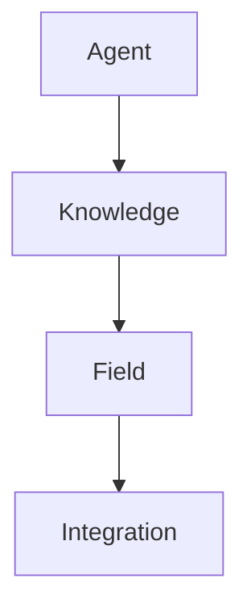
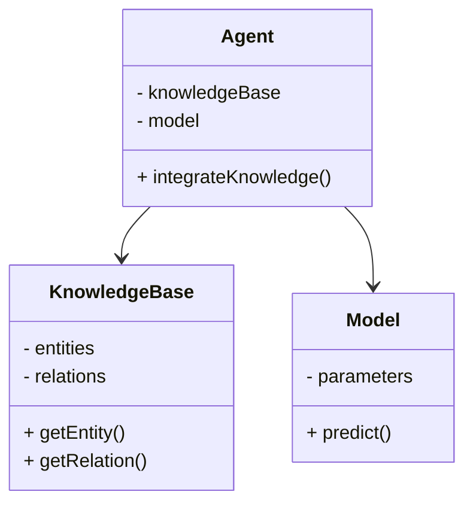
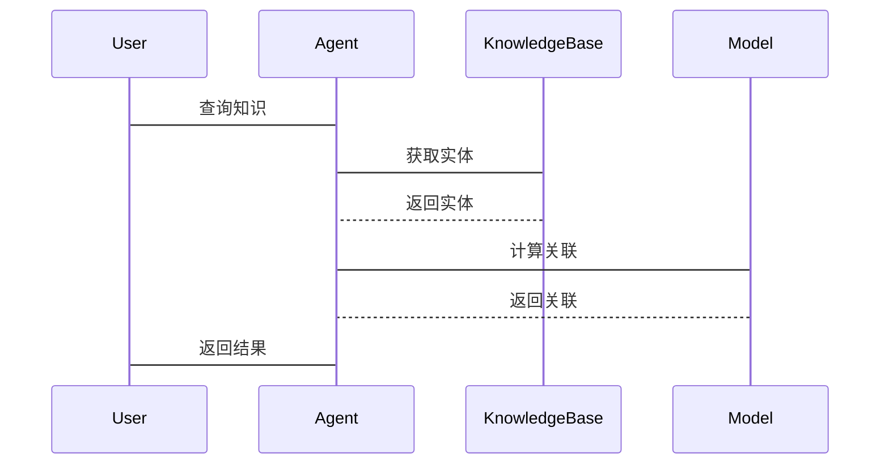

                 

# 开发具有跨领域知识整合能力的AI Agent

---

## 关键词：AI Agent、跨领域知识整合、知识图谱、大模型、对比学习、系统架构

---

## 摘要

开发具有跨领域知识整合能力的AI Agent是当前人工智能领域的重要研究方向。随着技术的进步，AI Agent需要能够整合来自多个领域的知识，以应对复杂多变的问题场景。本文从AI Agent的核心概念出发，逐步分析其跨领域知识整合的关键技术，涵盖算法原理、系统架构设计以及实际项目实现。通过详细的数学公式、算法流程图和系统架构图，帮助读者深入理解如何构建一个能够高效整合跨领域知识的AI Agent。

---

## 第1章 背景与问题背景

### 1.1 问题背景

#### 1.1.1 当前AI Agent的发展现状
AI Agent（人工智能代理）是一种能够感知环境、自主决策并执行任务的智能系统。随着大模型技术的发展，AI Agent的能力得到了显著提升，但在跨领域知识整合方面仍存在诸多挑战。

#### 1.1.2 跨领域知识整合的必要性
在现实场景中，AI Agent往往需要处理来自多个领域的信息，例如自然语言处理、计算机视觉和数据分析。跨领域知识整合能够帮助AI Agent更好地理解和解决复杂问题。

#### 1.1.3 当前技术的局限性与挑战
目前的AI Agent在处理跨领域知识时，往往存在信息孤岛和知识碎片化的问题。如何高效整合这些分散的知识，是当前技术面临的主要挑战。

### 1.2 问题描述

#### 1.2.1 AI Agent的核心目标
AI Agent的核心目标是通过整合多领域的知识和信息，提供智能化的解决方案。

#### 1.2.2 跨领域知识整合的定义
跨领域知识整合是指将来自不同领域的知识进行融合，形成一个统一的知识体系，以支持AI Agent的决策和执行。

#### 1.2.3 问题的复杂性与多样性
跨领域知识整合涉及多个领域的数据和知识，其复杂性主要体现在知识的异构性和语义的多样性。

### 1.3 问题解决

#### 1.3.1 跨领域知识整合的关键技术
跨领域知识整合的关键技术包括知识图谱构建、对比学习和大模型的应用。

#### 1.3.2 AI Agent的设计原则
AI Agent的设计原则包括模块化设计、可扩展性和鲁棒性。

#### 1.3.3 整合技术的实现路径
整合技术的实现路径包括数据预处理、知识表示和模型训练。

---

## 第2章 核心概念与联系

### 2.1 核心概念原理

#### 2.1.1 AI Agent的基本原理
AI Agent的基本原理包括感知、决策和执行三个步骤。

#### 2.1.2 跨领域知识整合的机制
跨领域知识整合的机制包括知识表示、关联计算和知识推理。

#### 2.1.3 知识图谱与语义理解
知识图谱是一种结构化的知识表示形式，语义理解是通过自然语言处理技术理解文本的含义。

### 2.2 概念属性特征对比表格

| 概念 | 特征 | 描述 |
|------|------|------|
| AI Agent | 智能性 | 能够自主决策和执行任务 |
| 跨领域知识整合 | 多样性 | 整合来自不同领域的知识 |
| 知识图谱 | 结构化 | 结构化的知识表示形式 |

### 2.3 ER实体关系图架构

---

## 第3章 算法原理讲解

### 3.1 大模型的理解与生成机制

#### 3.1.1 大模型的输入输出机制
大模型的输入输出机制包括编码器和解码器两个部分。

#### 3.1.2 注意力机制的数学模型
注意力机制的数学模型如下：

$$\text{Attention}(Q, K, V) = \text{softmax}\left(\frac{QK^T}{\sqrt{d_k}}\right)V$$

#### 3.1.3 解码器的生成过程
解码器的生成过程包括自注意力机制和前向网络。

### 3.2 知识整合的算法实现

#### 3.2.1 知识图谱的构建算法
知识图谱的构建算法包括实体识别、关系抽取和知识融合。

#### 3.2.2 对比学习的实现原理
对比学习的实现原理包括正样本和负样本的对比。

#### 3.2.3 跨领域关联的计算方法
跨领域关联的计算方法包括相似度计算和关联度计算。

---

## 第4章 数学模型与公式

### 4.1 大模型的数学基础

#### 4.1.1 变量与参数的定义
变量包括输入序列 \( x \)，参数包括权重矩阵 \( W \)。

#### 4.1.2 激活函数的选择与应用
常用的激活函数包括ReLU和sigmoid。

#### 4.1.3 损失函数的计算公式
交叉熵损失函数的计算公式如下：

$$\text{Loss} = -\sum_{i=1}^{n} y_i \log p_i + (1-y_i)\log(1-p_i)$$

### 4.2 知识整合的数学模型

#### 4.2.1 知识表示的向量空间模型
知识表示的向量空间模型如下：

$$\text{Vector}(e) = \sum_{i=1}^{n} w_i e_i$$

#### 4.2.2 对比学习的数学公式
对比学习的数学公式如下：

$$\text{Loss} = \log\left(\frac{1}{1 + \exp(-s)})\right)$$

#### 4.2.3 关联计算的矩阵运算
关联计算的矩阵运算如下：

$$\text{相似度矩阵} = X^T X$$

---

## 第5章 系统分析与架构设计

### 5.1 问题场景介绍

#### 5.1.1 业务场景的分析
业务场景包括多领域知识整合和智能化决策。

#### 5.1.2 系统目标的确定
系统目标包括构建知识图谱和实现跨领域关联。

#### 5.1.3 用户需求的提取
用户需求包括快速获取跨领域知识和提高决策效率。

### 5.2 系统功能设计

#### 5.2.1 领域模型的构建
领域模型的构建包括实体识别和关系抽取。

#### 5.2.2 功能模块的划分
功能模块包括知识表示、关联计算和知识推理。

#### 5.2.3 交互流程的设计
交互流程包括用户输入、知识整合和结果输出。

### 5.3 系统架构设计

#### 5.3.1 系统架构的类图

#### 5.3.2 系统接口设计
系统接口包括知识查询接口和关联计算接口。

#### 5.3.3 系统交互的序列图

---

## 第6章 项目实战与高级主题

### 6.1 项目实战

#### 6.1.1 环境安装
环境安装包括安装Python、TensorFlow和Keras。

#### 6.1.2 核心代码实现
核心代码实现包括知识表示和关联计算。

#### 6.1.3 案例分析
案例分析包括跨领域知识整合的实现。

### 6.2 高级主题

#### 6.2.1 伦理与安全
AI Agent的伦理和安全问题需要引起重视。

#### 6.2.2 未来趋势
跨领域知识整合的未来趋势包括多模态学习和自适应学习。

---

## 第7章 总结与展望

### 7.1 总结
总结跨领域知识整合的AI Agent的核心技术和发展现状。

### 7.2 展望
展望未来的发展方向和应用前景。

---

## 小结

开发具有跨领域知识整合能力的AI Agent是一项具有挑战性的任务，需要结合多领域的知识和技术。本文通过详细分析核心概念、算法原理和系统架构，为读者提供了一个全面的开发指南。希望读者能够通过本文的指导，成功开发出具有跨领域知识整合能力的AI Agent。

---

## 最佳实践 Tips

1. 在实际开发中，建议先构建知识图谱，再进行跨领域关联计算。
2. 注意数据的质量和多样性，以提高AI Agent的性能。
3. 定期更新知识图谱，以适应不断变化的知识领域。

---

## 注意事项

1. 开发过程中，需注意数据隐私和安全问题。
2. 系统架构设计时，需考虑可扩展性和可维护性。
3. 算法实现时，需选择适合的优化策略。

---

## 拓展阅读

1. 《大模型原理与应用》
2. 《知识图谱构建与应用》
3. 《对比学习算法与实践》

