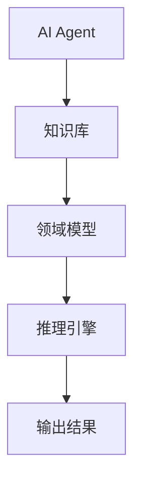
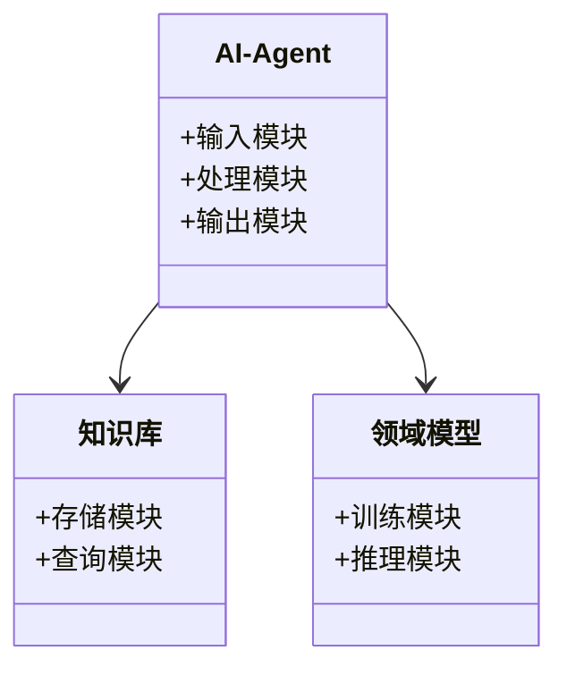
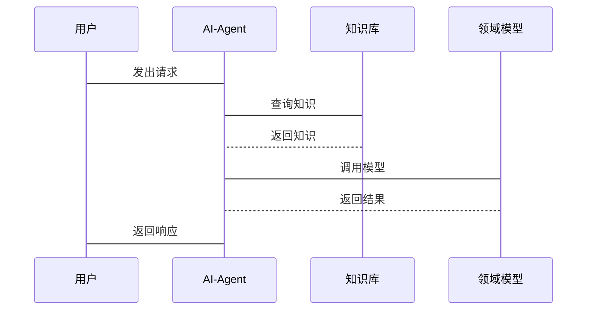

                 


# 开发具有跨领域知识融合能力的AI Agent

> 关键词：AI Agent, 跨领域知识融合, 多模态模型, 知识图谱, 系统架构, 项目实战

> 摘要：本文详细探讨了开发具有跨领域知识融合能力的AI Agent的各个方面。从核心概念到算法原理，从系统架构到项目实战，全面解析了如何构建能够处理多领域知识的智能代理。通过实际案例分析和详细代码实现，展示了跨领域知识融合在AI Agent中的应用。

---

## 第1章: AI Agent与跨领域知识融合概述

### 1.1 AI Agent的基本概念

AI Agent（人工智能代理）是指能够感知环境、做出决策并执行任务的智能实体。它具备以下核心特征：

- **自主性**：能够在没有外部干预的情况下运行。
- **反应性**：能够根据环境变化实时调整行为。
- **目标导向**：以实现特定目标为导向执行任务。
- **学习能力**：通过数据和经验不断优化自身性能。

### 1.2 跨领域知识融合的背景与挑战

随着人工智能技术的快速发展，AI Agent的应用场景日益广泛。然而，单一领域知识的局限性逐渐显现，跨领域知识融合成为提升AI Agent智能水平的关键。跨领域知识融合的挑战包括：

- **异构数据处理**：不同领域的数据格式、语义和结构差异较大，如何统一处理是一个难题。
- **知识关联性**：如何建立不同领域知识之间的关联，实现知识的有效融合。
- **实时性要求**：在实时应用场景中，如何快速完成知识融合并做出决策。

---

## 第2章: 跨领域知识融合的核心概念与联系

### 2.1 核心概念原理

跨领域知识融合涉及多个核心概念，包括知识表示、多模态数据处理和知识图谱构建。

- **知识表示**：将知识以结构化形式表示，便于计算机理解和推理。
- **多模态数据处理**：处理文本、图像、语音等多种数据类型，提取有用信息。
- **知识图谱构建**：通过抽取、融合和推理，构建跨领域的知识图谱。

### 2.2 概念属性特征对比表格

以下表格展示了AI Agent与跨领域知识融合的核心概念对比：

```markdown
| 概念       | 属性           | 特征                               |
|------------|----------------|------------------------------------|
| AI Agent   | 输入           | 多模态数据                         |
|            | 输出           | 多领域结果                         |
| 跨领域知识融合 | 方法       | 多模型协同                         |
```

### 2.3 ER实体关系图

以下是AI Agent与知识融合的实体关系图：



---

## 第3章: 跨领域知识融合的算法原理

### 3.1 多模态模型

多模态模型能够处理多种类型的数据，以下是其实现流程：

1. **数据预处理**：对文本、图像等数据进行归一化处理。
2. **特征提取**：使用CNN、BERT等模型提取多模态特征。
3. **融合策略**：将多模态特征融合，生成统一的表示。

### 3.2 知识图谱构建算法

知识图谱构建包括知识抽取、融合和推理：

- **知识抽取**：从文本中提取实体和关系。
- **知识融合**：将多个来源的知识整合到统一的知识图谱中。
- **知识推理**：通过推理引擎进行关联推理。

---

## 第4章: 跨领域知识融合的数学模型与公式

### 4.1 知识表示模型

向量空间模型用于表示知识，公式如下：

$$v_i = \sum_{j=1}^{n} w_{ij} \cdot v_j$$

### 4.2 多模态融合模型

多模态融合模型的损失函数为：

$$L = \sum_{i=1}^{N} (y_i - f(x_i))^2$$

其中，$x_i$表示输入数据，$y_i$表示真实标签。

---

## 第5章: 跨领域知识融合的系统架构设计

### 5.1 系统功能设计

以下是系统的功能模块：



### 5.2 系统交互设计

系统交互流程如下：



---

## 第6章: 跨领域知识融合的项目实战

### 6.1 环境安装

安装必要的库：

```bash
pip install numpy pandas tensorflow
```

### 6.2 系统实现

以下是核心代码：

```python
import numpy as np
from tensorflow.keras.models import Model
from tensorflow.keras.layers import Input, Dense

# 定义输入层
input_layer = Input(shape=(100,))
# 定义隐藏层
hidden_layer = Dense(50, activation='relu')(input_layer)
# 定义输出层
output_layer = Dense(10, activation='softmax')(hidden_layer)
# 编译模型
model = Model(inputs=input_layer, outputs=output_layer)
model.compile(optimizer='adam', loss='categorical_crossentropy', metrics=['accuracy'])
```

### 6.3 案例分析

以图像识别和文本分类为例，展示知识融合的应用：

1. 使用CNN提取图像特征。
2. 使用BERT提取文本特征。
3. 将特征融合后进行分类。

---

## 第7章: 跨领域知识融合的最佳实践

### 7.1 优化建议

- 定期更新知识库，保持知识的时效性。
- 使用分布式训练，提高模型的训练效率。

### 7.2 注意事项

- 数据预处理时，注意数据的均衡性。
- 模型部署时，确保系统的稳定性和安全性。

### 7.3 拓展阅读

推荐阅读相关领域的最新论文和书籍，持续关注技术发展。

---

## 总结

开发具有跨领域知识融合能力的AI Agent是一个复杂而重要的任务。通过本文的详细讲解，读者可以系统地了解相关概念、算法和实现方法。未来，随着技术的发展，跨领域知识融合将为AI Agent带来更广泛的应用场景和更高的智能水平。

---

希望这篇文章能够为读者提供有价值的参考，欢迎在评论区留言交流。

