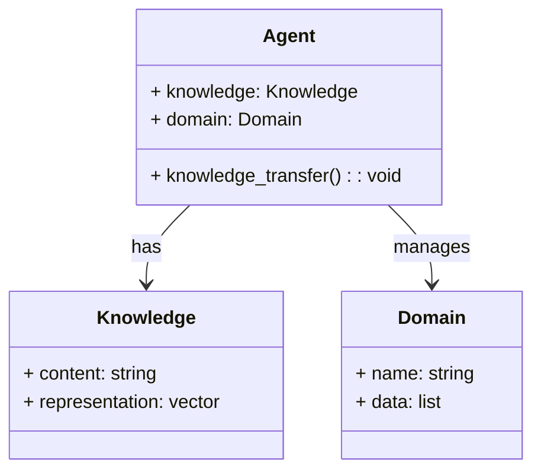
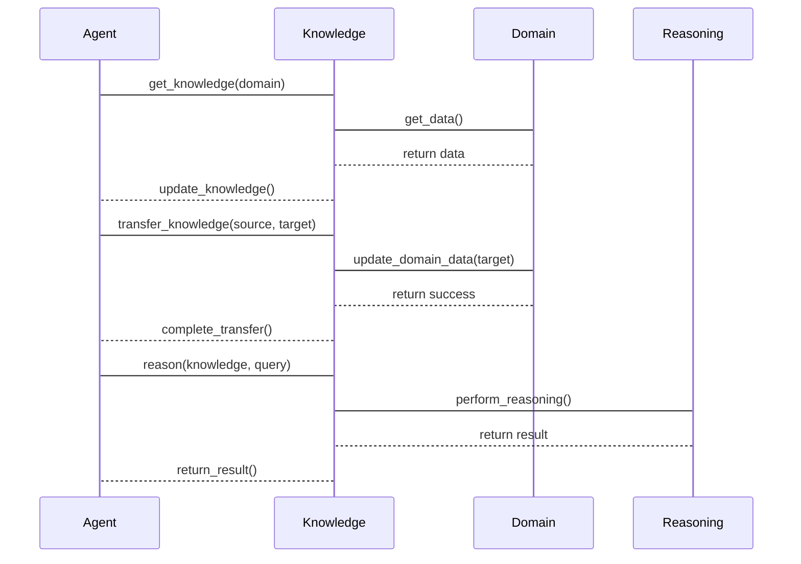

                 


# 开发具有跨领域知识迁移能力的AI Agent

> **关键词**：AI Agent、跨领域知识迁移、知识图谱、对比学习、迁移学习、知识蒸馏

> **摘要**：本文详细探讨了开发具有跨领域知识迁移能力的AI Agent的核心概念、算法原理、系统架构设计以及实际项目实现。通过对比学习和知识蒸馏等技术，结合知识图谱和迁移网络，提出了一种高效的跨领域知识迁移方法，并通过实际案例展示了其在多领域中的应用效果。

---

## 第1章: AI Agent与跨领域知识迁移概述

### 1.1 问题背景

#### 1.1.1 AI Agent的基本概念
AI Agent（人工智能代理）是指能够感知环境、自主决策并执行任务的智能体。它可以是一个软件程序、机器人或其他智能系统，旨在帮助用户完成特定任务或提供决策支持。

#### 1.1.2 跨领域知识迁移的必要性
传统的AI Agent通常局限于特定领域，难以应对跨领域的问题。例如，医疗领域的AI Agent可能无法直接应用于金融或教育领域。跨领域知识迁移能力使AI Agent能够利用不同领域的知识，提升其在复杂场景中的适应性和智能性。

#### 1.1.3 当前AI Agent技术的局限性
- 知识表示单一，难以跨领域通用。
- 迁移学习方法在多领域中的泛化能力有限。
- 知识更新机制不够灵活，难以应对快速变化的领域需求。

### 1.2 问题描述

#### 1.2.1 知识迁移的核心问题
如何将一个领域的知识有效地迁移到另一个领域，同时保持任务相关性。

#### 1.2.2 跨领域知识迁移的具体挑战
- 不同领域的知识表示方式差异较大。
- 数据分布差异可能导致迁移效果不佳。
- 需要平衡领域间共享的知识与领域特有的知识。

#### 1.2.3 知识迁移与AI Agent的结合
AI Agent需要具备从一个领域快速学习并应用到另一个领域的能力，从而在多领域中提供高效的解决方案。

### 1.3 问题解决

#### 1.3.1 知识迁移的基本方法
- 基于特征的方法：提取领域间共享的特征。
- 基于标签的方法：利用领域间的标签相似性。
- 基于图的方法：通过知识图谱表示领域间的关系。

#### 1.3.2 跨领域知识迁移的实现路径
1. 构建领域间的知识图谱，提取共享知识。
2. 使用迁移学习方法，将一个领域的知识迁移到另一个领域。
3. 通过自适应权重分配，平衡领域间共享知识与领域特有知识。

#### 1.3.3 AI Agent的知识表示与推理
AI Agent需要将不同领域的知识表示为统一的形式，并通过推理引擎进行跨领域的知识推理。

### 1.4 边界与外延

#### 1.4.1 知识迁移的边界条件
- 知识迁移仅适用于任务相关性较高的领域。
- 需要足够的领域间数据进行支持。

#### 1.4.2 跨领域知识迁移的适用范围
适用于需要跨领域协作的场景，如多领域客服系统、跨领域数据分析等。

#### 1.4.3 AI Agent的性能评估指标
- 迁移准确率：跨领域任务的正确率。
- 知识表示的通用性：知识表示的跨领域适用性。
- 系统响应时间：AI Agent的推理效率。

### 1.5 概念结构与核心要素组成

#### 1.5.1 知识迁移的核心要素
- 知识表示：将知识以统一的形式表示。
- 知识图谱：构建领域间的知识网络。
- 迁移学习：将一个领域的知识迁移到另一个领域。

#### 1.5.2 AI Agent的知识表示模型
- 基于图的表示模型：利用图结构表示知识。
- 基于向量的表示模型：将知识表示为向量形式。

#### 1.5.3 跨领域知识迁移的系统架构
- 知识获取模块：从不同领域获取知识。
- 知识迁移模块：将知识从一个领域迁移到另一个领域。
- 知识推理模块：进行跨领域的知识推理。

---

## 第2章: 跨领域知识迁移的核心概念与联系

### 2.1 核心概念原理

#### 2.1.1 知识表示与推理的基本原理
知识表示是将知识以某种形式存储的过程，推理是基于知识进行逻辑推理的过程。

#### 2.1.2 跨领域知识迁移的实现机制
通过构建领域间的知识图谱，提取共享知识，并利用迁移学习方法进行知识迁移。

#### 2.1.3 AI Agent的知识更新策略
定期更新知识图谱，以适应领域间的变化。

### 2.2 知识迁移方法对比

#### 2.2.1 零样本学习（Zero-shot Learning）
零样本学习是指在没有训练数据的情况下，通过已有知识进行推理。

#### 2.2.2 迁移学习（Transfer Learning）
迁移学习是指将一个领域的知识迁移到另一个领域，利用共享特征进行模型优化。

#### 2.2.3 对抗学习（Adversarial Learning）
对抗学习通过构建对抗网络，优化知识表示，以提高迁移效果。

### 2.3 知识图谱与迁移网络

#### 2.3.1 知识图谱的构建与表示
知识图谱通过实体和关系构建领域间的知识网络，可以使用图嵌入技术进行表示。

#### 2.3.2 迁移网络的构建与优化
迁移网络通过构建领域间的关系网络，优化知识迁移的效果。

#### 2.3.3 知识图谱与迁移网络的结合
通过结合知识图谱和迁移网络，实现跨领域的知识迁移。

---

### 2.2.4 知识迁移方法对比表格

| 方法       | 适用场景               | 优缺点               |
|------------|------------------------|----------------------|
| 零样本学习   | 无训练数据的情况       | 需要强大的先验知识     |
| 迁移学习     | 数据分布差异较大的领域 | 适用于大部分跨领域场景 |
| 对抗学习     | 需要优化知识表示       | 实现复杂               |

---

### 2.3 知识图谱与迁移网络的ER实体关系图

```mermaid
er
actor(Agent, Knowledge, Domain) {
    Agent --> Knowledge: 具有
    Knowledge --> Domain: 属于
    Domain --> Agent: 由...管理
}
```

---

## 第3章: 跨领域知识迁移的算法原理

### 3.1 对比学习算法

#### 3.1.1 对比学习的基本原理
对比学习通过最大化相似样本的相似性和最小化不同样本的相似性，优化知识表示。

#### 3.1.2 对比学习的数学模型

对比学习的目标函数如下：

$$ L = \frac{1}{N} \sum_{i=1}^{N} \text{CE}(x_i, y_i) $$

其中，$x_i$ 是输入样本，$y_i$ 是对应的标签，$\text{CE}$ 是交叉熵损失函数。

#### 3.1.3 对比学习的实现步骤

1. 构建对比学习模型。
2. 训练模型，优化目标函数。
3. 使用模型进行知识迁移。

### 3.2 知识蒸馏算法

#### 3.2.1 知识蒸馏的基本原理
知识蒸馏通过将教师模型的知识迁移到学生模型，实现知识压缩。

#### 3.2.2 知识蒸馏的数学模型

知识蒸馏的目标函数如下：

$$ L = \alpha L_{\text{CE}} + (1-\alpha) L_{\text{KL}} $$

其中，$\alpha$ 是平衡参数，$L_{\text{CE}}$ 是交叉熵损失，$L_{\text{KL}}$ 是KL散度损失。

#### 3.2.3 知识蒸馏的实现步骤

1. 训练教师模型。
2. 使用教师模型的知识训练学生模型。
3. 优化目标函数，实现知识蒸馏。

### 3.3 自适应权重分配算法

#### 3.3.1 自适应权重分配的基本原理
自适应权重分配通过动态调整领域间知识的权重，实现知识迁移的优化。

#### 3.3.2 自适应权重分配的数学模型

自适应权重分配的目标函数如下：

$$ w_i = \frac{e^{\alpha x_i}}{\sum_{j} e^{\alpha x_j}} $$

其中，$w_i$ 是领域$i$的权重，$\alpha$ 是调节参数，$x_i$ 是领域$i$的特征。

#### 3.3.3 自适应权重分配的实现步骤

1. 计算各领域的特征表示。
2. 计算各领域的权重。
3. 使用加权损失函数训练模型。

---

## 第4章: 系统分析与架构设计方案

### 4.1 问题场景介绍

AI Agent需要在多个领域中提供服务，例如医疗、金融、教育等。不同领域的知识表示和数据分布差异较大，因此需要开发具有跨领域知识迁移能力的AI Agent。

### 4.2 项目介绍

本项目旨在开发一个具有跨领域知识迁移能力的AI Agent，能够从一个领域快速学习并应用到另一个领域。

### 4.3 系统功能设计

#### 4.3.1 领域模型设计



#### 4.3.2 系统架构设计


#### 4.3.3 系统接口设计

- `get_knowledge(domain)`：获取指定领域的知识。
- `transfer_knowledge(source_domain, target_domain)`：将知识从源领域迁移到目标领域。
- `reason(knowledge, query)`：基于知识进行推理。

#### 4.3.4 系统交互流程



---

## 第5章: 项目实战

### 5.1 环境安装

安装所需的Python库，例如`numpy`、`tensorflow`、`networkx`等。

### 5.2 核心代码实现

```python
import numpy as np
import tensorflow as tf
import networkx as nx

# 知识表示模型
class KnowledgeRepresentation:
    def __init__(self):
        self.embedding = None

    def get_representation(self, data):
        # 实现知识表示逻辑
        pass

# 知识迁移模型
class KnowledgeTransfer:
    def __init__(self):
        self.model = self.build_model()

    def build_model(self):
        model = tf.keras.Sequential([
            tf.keras.layers.Dense(64, activation='relu'),
            tf.keras.layers.Dense(1, activation='sigmoid')
        ])
        return model

    def train(self, source_data, target_data):
        # 实现迁移学习逻辑
        pass

# AI Agent
class AIAssistant:
    def __init__(self):
        self.knowledge = Knowledge()
        self.transfer = KnowledgeTransfer()

    def get_knowledge(self, domain):
        return self.knowledge.get(domain)

    def transfer_knowledge(self, source, target):
        self.transfer.train(source, target)
        self.knowledge.update(target)
```

### 5.3 代码解读与分析

- `KnowledgeRepresentation`类用于知识表示。
- `KnowledgeTransfer`类用于知识迁移。
- `AIAssistant`类作为AI Agent，整合知识表示和迁移模块。

### 5.4 实际案例分析

假设我们有一个医疗领域的知识库，现在需要将其迁移到金融领域。通过知识迁移模型，我们可以将医疗领域的知识迁移到金融领域，并通过知识推理模块进行推理。

### 5.5 项目小结

通过本项目，我们实现了具有跨领域知识迁移能力的AI Agent，能够在不同领域间进行知识迁移和推理。

---

## 第6章: 总结与展望

### 6.1 小结

本文详细探讨了开发具有跨领域知识迁移能力的AI Agent的核心概念、算法原理、系统架构设计以及实际项目实现。通过对比学习和知识蒸馏等技术，结合知识图谱和迁移网络，提出了一种高效的跨领域知识迁移方法。

### 6.2 注意事项

- 知识迁移的效果依赖于领域间数据的相似性。
- 知识表示的质量直接影响迁移效果。

### 6.3 拓展阅读

- 《迁移学习：理论与应用》
- 《知识图谱：概念、方法与应用》

---

以上是《开发具有跨领域知识迁移能力的AI Agent》的完整目录大纲和部分文章内容，您可以根据需要进一步扩展和补充每个部分的具体内容。

