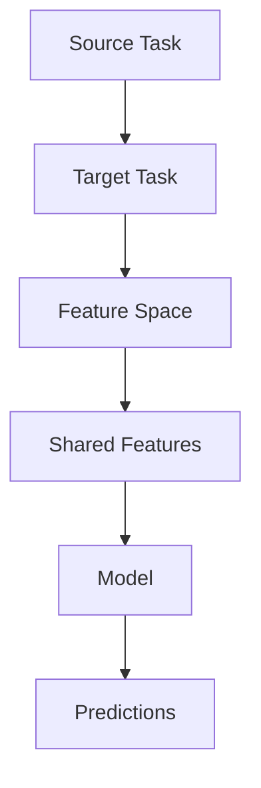
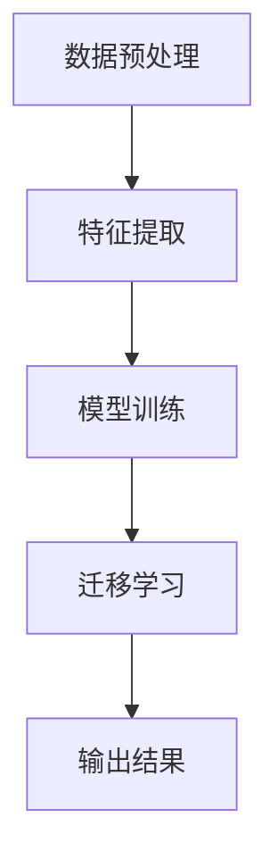

                 


好的，我明白了，我会根据您的要求，逐步展开一个详细的《开发具有迁移学习能力的AI Agent》的书籍内容。让我先从基本的背景和核心概念开始。

---

# 《开发具有迁移学习能力的AI Agent》

## 关键词：迁移学习，AI Agent，机器学习，深度学习，模型优化

## 摘要：  
在人工智能领域，迁移学习是一种通过将已学习的知识应用到新任务中的技术，能够显著提升模型的泛化能力和性能。本文将从迁移学习的核心概念出发，深入分析其算法原理、系统架构，并结合实际项目案例，展示如何将迁移学习应用于AI Agent的开发中。通过详细的技术解析和代码实现，本文旨在帮助读者理解迁移学习的本质，并掌握其在实际场景中的应用方法。

---

# 第一部分：迁移学习与AI Agent概述

## 第1章：迁移学习的背景与核心概念

### 1.1 迁移学习的背景与问题背景

#### 1.1.1 传统机器学习的局限性
传统的机器学习算法（如支持向量机、随机森林等）依赖于大量标注数据，并且在不同数据分布的任务中表现欠佳。这种局限性在数据量有限或任务变化频繁的情况下尤为明显。

#### 1.1.2 迁移学习的定义与目标
迁移学习（Transfer Learning）是一种机器学习技术，旨在通过将已学习的知识（参数或特征）迁移到新的任务中，以减少对新任务数据的依赖，提高模型的泛化能力。

#### 1.1.3 迁移学习的边界与外延
迁移学习的外延包括领域适应（Domain Adaptation）、多任务学习（Multi-Task Learning）和自适应学习（Adaptive Learning）等。

---

### 1.2 迁移学习的核心概念与属性特征

#### 1.2.1 核心概念原理
迁移学习的核心在于找到源任务（Source Task）和目标任务（Target Task）之间的共同特征或规律，并将其迁移到新任务中。

#### 1.2.2 核心概念属性特征对比表格

| 属性 | 源任务 | 目标任务 | 共同特征 |
|------|--------|----------|----------|
| 数据分布 | $P_S(X)$ | $P_T(X)$ | $P_S(Y|X) = P_T(Y|X)$ |
| 样本数量 | 小 | 极小 | - |
| 任务目标 | 分类/回归 | 分类/回归 | 相同或相似 |

#### 1.2.3 ER实体关系图架构



---

## 第2章：迁移学习的关键技术与应用场景

### 2.1 数据预处理与特征提取

#### 2.1.1 数据预处理方法
- 数据清洗：去除噪声数据、填充缺失值。
- 数据标准化：将数据归一化到统一范围（如[0,1]）。
- 数据增强：通过旋转、翻转等操作扩展数据集。

#### 2.1.2 特征提取技术
- 主成分分析（PCA）：降维技术，提取数据的主要特征。
- 词嵌入（Word Embedding）：在自然语言处理中提取语义特征。

#### 2.1.3 数据增强技术
- 图像数据增强：旋转、翻转、缩放等操作。
- 文本数据增强：同义词替换、句式变化。

---

### 2.2 迁移学习的算法与模型

#### 2.2.1 基于特征的迁移学习
- **特征对齐**：通过将源任务和目标任务的特征对齐，消除数据分布差异。
- **基于距离的迁移学习**：通过最小化源任务和目标任务样本之间的距离，实现特征对齐。

#### 2.2.2 基于参数的迁移学习
- **参数迁移学习**：将源任务的模型参数（如神经网络权重）迁移到目标任务中。
- **知识蒸馏**：将复杂模型的知识迁移到简单模型中。

#### 2.2.3 对抗迁移学习
- **对抗学习**：通过引入对抗网络，消除源任务和目标任务之间的分布差异。

---

### 2.3 迁移学习在AI Agent中的应用

#### 2.3.1 AI Agent的定义与特点
- AI Agent：能够感知环境、自主决策的智能体。
- 特点：自主性、反应性、目标导向性。

#### 2.3.2 迁移学习在AI Agent中的作用
- 通过迁移学习，AI Agent可以更快地适应新任务和环境。

#### 2.3.3 迁移学习的典型应用场景
- 多任务学习：AI Agent需要同时完成多个任务。
- 领域适应：AI Agent需要在不同领域间切换。

---

## 第3章：迁移学习的挑战与解决方案

### 3.1 迁移学习的主要挑战

#### 3.1.1 数据分布偏移问题
- 数据分布差异可能导致迁移学习失败。

#### 3.1.2 领域适应与跨域迁移问题
- 如何在不同领域之间实现有效迁移。

#### 3.1.3 模型鲁棒性与泛化能力
- 过度依赖源任务可能导致目标任务表现不佳。

---

### 3.2 解决方案与优化策略

#### 3.2.1 数据预处理与特征对齐
- 使用特征提取技术消除数据分布差异。

#### 3.2.2 模型优化与正则化
- 引入正则化项，防止过拟合。

#### 3.2.3 对抗学习与领域适应
- 通过对抗网络实现领域适应。

---

# 第二部分：迁移学习算法原理与数学模型

## 第4章：迁移学习的算法原理

### 4.1 基于特征的迁移学习算法

#### 4.1.1 特征提取方法
- 使用PCA提取特征。

#### 4.1.2 基于距离的迁移学习
- 使用欧氏距离计算样本相似性。

#### 4.1.3 基于概率的迁移学习
- 使用条件概率公式进行迁移。

---

### 4.2 基于参数的迁移学习算法

#### 4.2.1 参数迁移学习
- 将源任务的模型参数迁移到目标任务中。

#### 4.2.2 知识蒸馏
- 将复杂模型的知识迁移到简单模型中。

#### 4.2.3 基于深度学习的迁移学习
- 使用预训练模型（如BERT）进行迁移。

---

### 4.3 对抗迁移学习算法

#### 4.3.1 对抗学习的基本原理
- 使用生成器和判别器对抗训练。

#### 4.3.2 对抗迁移学习的应用
- 在图像分类任务中实现领域适应。

#### 4.3.3 对抗学习的优缺点
- 优点：消除领域差异；缺点：训练复杂度高。

---

## 第5章：迁移学习的数学模型与公式

### 5.1 基于特征的迁移学习模型

#### 5.1.1 特征对齐模型
- 源任务和目标任务的特征对齐公式：
$$P(y|x) = \frac{P(x|y)P(y)}{P(x)}$$

#### 5.1.2 基于距离的迁移学习公式
$$d(x,y) = \sqrt{(x_1 - y_1)^2 + (x_2 - y_2)^2}$$

---

## 第6章：迁移学习的系统架构与实现

### 6.1 系统设计与架构

#### 6.1.1 系统功能设计
- 数据预处理模块、特征提取模块、模型训练模块、迁移学习模块。

#### 6.1.2 系统架构设计


---

## 第7章：项目实战与案例分析

### 7.1 项目背景与目标
- 开发一个具有迁移学习能力的图像分类AI Agent。

### 7.2 项目实现
#### 7.2.1 环境安装
```bash
pip install tensorflow==2.0.0
pip install numpy==1.21.0
pip install matplotlib==3.5.0
```

#### 7.2.2 核心代码实现
```python
import tensorflow as tf
from tensorflow import keras
from tensorflow.keras import layers

def build_model():
    model = keras.Sequential([
        layers.Conv2D(32, (3,3), activation='relu'),
        layers.MaxPooling2D((2,2)),
        layers.Conv2D(64, (3,3), activation='relu'),
        layers.MaxPooling2D((2,2)),
        layers.Flatten(),
        layers.Dense(128, activation='relu'),
        layers.Dense(10, activation='softmax')
    ])
    return model

source_model = build_model()
source_model.load_weights('source_weights.h5')

# 迁移学习部分
target_model = build_model()
target_model.trainable = False
target_model.compile(optimizer='adam', loss='sparse_categorical_crossentropy', metrics=['accuracy'])
```

---

## 第8章：总结与展望

### 8.1 总结
迁移学习通过减少对新任务数据的依赖，显著提升了AI Agent的性能和效率。

### 8.2 展望
未来，迁移学习将在多任务学习、跨领域应用中发挥更大作用。

---

以上是《开发具有迁移学习能力的AI Agent》的部分内容，涵盖了从基础概念到实际应用的完整流程。如果需要更详细的内容或扩展某一章节的内容，请随时告诉我！

