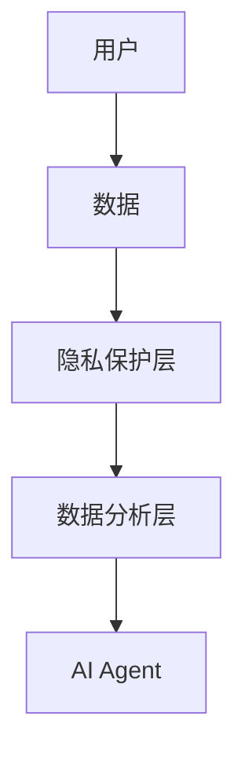
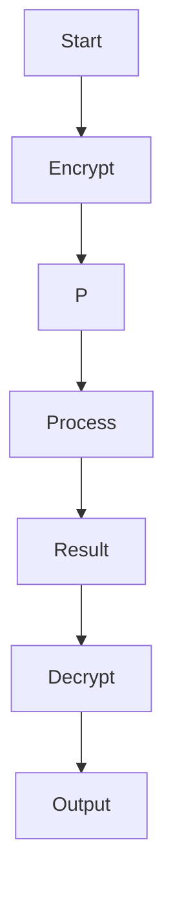
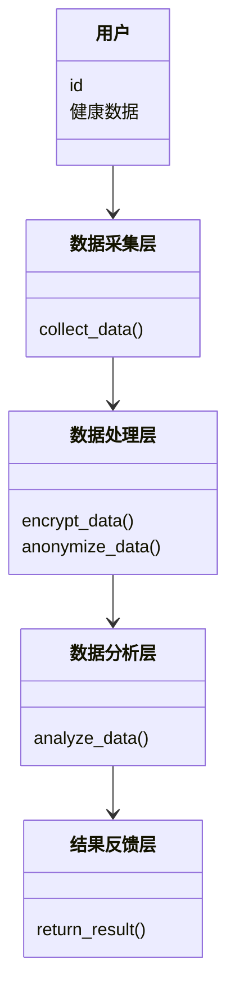
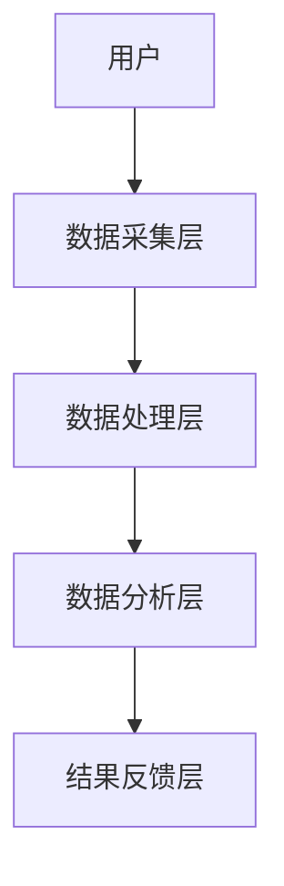
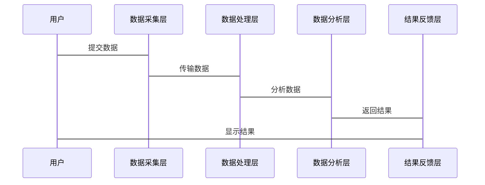

                 


# 开发具有隐私保护数据分析能力的AI Agent

> 关键词：隐私保护，数据分析，AI Agent，同态加密，差分隐私

> 摘要：本文详细探讨了如何开发具有隐私保护数据分析能力的AI Agent。通过背景介绍、核心概念分析、算法原理讲解、系统架构设计、项目实战和最佳实践等多个方面，系统地阐述了在AI Agent中实现隐私保护数据分析的方法和技巧，帮助读者理解并掌握相关技术。

---

# 第1章: 背景介绍

## 1.1 问题背景

### 1.1.1 数据隐私保护的重要性
随着人工智能和大数据技术的快速发展，数据隐私保护的重要性日益凸显。用户数据在分析过程中可能被滥用，导致隐私泄露。AI Agent作为数据处理的核心工具，必须具备保护用户隐私的能力。

### 1.1.2 AI Agent在数据处理中的角色
AI Agent是一种能够自主决策和执行任务的智能实体，通常用于数据收集、处理和分析。在隐私保护的背景下，AI Agent需要在不泄露用户隐私的前提下，完成数据分析任务。

### 1.1.3 隐私保护与数据分析的平衡
数据分析需要尽可能多的有效数据，但隐私保护又要求限制数据的使用。如何在两者之间找到平衡点，是开发隐私保护数据分析AI Agent的核心挑战。

## 1.2 问题描述

### 1.2.1 数据分析面临的隐私挑战
传统数据分析方法通常需要直接访问原始数据，这可能导致隐私泄露。如何在不访问原始数据的前提下完成数据分析，是当前面临的主要挑战。

### 1.2.2 AI Agent如何处理敏感数据
AI Agent需要在处理敏感数据时，确保数据的安全性和隐私性。这包括数据的加密存储、匿名化处理以及隐私计算等技术。

### 1.2.3 隐私保护的具体需求与目标
隐私保护的具体需求包括数据的机密性、完整性和可用性。目标是在保护隐私的前提下，最大化数据分析的有效性。

## 1.3 问题解决思路

### 1.3.1 隐私保护的技术手段
常用的隐私保护技术包括数据加密、数据匿名化、同态加密和差分隐私等。这些技术可以帮助在不泄露隐私的前提下，完成数据分析任务。

### 1.3.2 数据分析的方法与工具
数据分析的方法包括统计分析、机器学习和数据挖掘等。结合隐私保护技术，可以在保护隐私的前提下，完成数据的分析和挖掘。

### 1.3.3 AI Agent的架构设计
AI Agent的架构设计需要考虑数据的采集、存储、处理和反馈。在设计过程中，必须确保每个环节都符合隐私保护的要求。

## 1.4 边界与外延

### 1.4.1 隐私保护的适用范围
隐私保护适用于所有涉及个人数据的场景，包括医疗、金融、教育和社交媒体等领域。

### 1.4.2 数据分析的限制条件
数据分析的限制条件包括数据的可用性、分析的准确性以及计算的效率。隐私保护技术可能会对这些方面产生一定的影响。

### 1.4.3 AI Agent的功能边界
AI Agent的功能边界包括数据的采集、处理、分析和反馈。在设计过程中，必须明确每个功能的隐私保护要求。

## 1.5 概念结构与核心要素

### 1.5.1 核心概念的组成
隐私保护数据分析AI Agent的核心概念包括数据加密、隐私计算、数据匿名化和智能分析。

### 1.5.2 各要素之间的关系
数据加密和隐私计算是保护数据隐私的核心技术，数据匿名化是处理敏感数据的重要手段，智能分析是数据分析的关键环节。

### 1.5.3 案例分析与应用场景
以医疗数据分析为例，AI Agent可以在保护患者隐私的前提下，分析医疗数据，辅助医生进行诊断。

---

# 第2章: 核心概念与联系

## 2.1 隐私保护的核心原理

### 2.1.1 数据加密的基本概念
数据加密是通过加密算法将原始数据转换为密文，确保数据在传输和存储过程中不会被未经授权的第三方读取。

### 2.1.2 数据匿名化的实现方法
数据匿名化是通过去除或脱敏敏感信息，使得数据无法被用来识别个人身份。

### 2.1.3 隐私计算的数学模型
隐私计算是一种在保护数据隐私的前提下，进行数据分析和计算的技术。其数学模型通常涉及加密算法和隐私保护机制。

## 2.2 数据分析的关键技术

### 2.2.1 机器学习算法概述
机器学习算法是数据分析的核心工具，包括监督学习、无监督学习和半监督学习等。

### 2.2.2 数据挖掘的基本原理
数据挖掘是从大量数据中提取有价值的信息的过程，通常涉及数据清洗、特征提取和模式识别等步骤。

### 2.2.3 分布式计算的优势
分布式计算可以提高数据处理的效率，但需要在分布式环境中实现隐私保护。

## 2.3 AI Agent的系统架构

### 2.3.1 分层架构设计
AI Agent的系统架构通常分为数据采集层、数据处理层、数据分析层和结果反馈层。

### 2.3.2 组件间的交互机制
组件间的交互机制需要确保数据在传输过程中不会被未经授权的第三方读取。

### 2.3.3 模块化设计的优势
模块化设计可以使系统更加灵活和易于维护，同时有助于实现隐私保护。

## 2.4 核心概念的联系与对比

### 2.4.1 隐私保护与数据分析的关系
隐私保护是数据分析的前提条件，数据分析是隐私保护的目标。

### 2.4.2 不同隐私保护技术的对比
不同的隐私保护技术有不同的优缺点，需要根据具体场景选择合适的技术。

### 2.4.3 数据分析算法的优缺点
不同的数据分析算法有不同的计算效率和准确性，需要在隐私保护的前提下选择合适的方法。

## 2.5 ER实体关系图



---

# 第3章: 算法原理讲解

## 3.1 隐私保护算法

### 3.1.1 同态加密算法

#### 同态加密的加法运算
$$c_1 = a + b$$

#### 同态加密的乘法运算
$$c_2 = a \times b$$

#### 同态加密的流程图


#### 同态加密的Python实现
```python
class HomomorphicEncryption:
    def __init__(self, key):
        self.key = key

    def encrypt(self, plaintext):
        # 加密逻辑
        return encrypted_data

    def decrypt(self, ciphertext):
        # 解密逻辑
        return decrypted_data

    def add(self, a, b):
        # 加法运算
        return self.encrypt(a + b)

    def multiply(self, a, b):
        # 乘法运算
        return self.encrypt(a * b)
```

### 3.1.2 差分隐私算法

#### 差分隐私的定义
差分隐私是一种通过在数据中添加噪声，使得单个数据的贡献无法被识别的隐私保护技术。

#### 差分隐私的数学模型
$$P(\text{输出} = y \mid \text{数据} = x) \approx P(\text{输出} = y \mid \text{数据} = x \setminus \{x_i\})$$

#### 差分隐私的Python实现
```python
def add_noise(data, epsilon):
    # 添加噪声
    noise = np.random.laplace(0, 1/epsilon, len(data))
    return data + noise
```

## 3.2 数据分析算法

### 3.2.1 机器学习算法
机器学习算法是数据分析的核心工具，包括线性回归、支持向量机和神经网络等。

### 3.2.2 数据挖掘算法
数据挖掘算法用于从数据中提取模式和规律，包括聚类、分类和关联规则挖掘等。

### 3.2.3 分布式计算框架
分布式计算框架如MapReduce和Spark，可以提高数据处理的效率。

---

# 第4章: 系统分析与架构设计

## 4.1 系统分析

### 4.1.1 问题场景介绍
以医疗数据分析为例，AI Agent需要在保护患者隐私的前提下，分析医疗数据，辅助医生进行诊断。

### 4.1.2 项目介绍
本项目旨在开发一个具有隐私保护数据分析能力的AI Agent，用于医疗数据的分析和处理。

## 4.2 系统功能设计

### 4.2.1 领域模型


### 4.2.2 系统架构设计


### 4.2.3 接口设计
系统接口设计包括数据采集接口、数据处理接口、数据分析接口和结果反馈接口。

### 4.2.4 交互流程


---

# 第5章: 项目实战

## 5.1 环境配置

### 5.1.1 系统需求
需要安装Python、机器学习库（如Scikit-learn、TensorFlow）和隐私保护库（如PyDP）。

### 5.1.2 安装依赖
```bash
pip install python-dp numpy pandas scikit-learn
```

## 5.2 系统核心实现

### 5.2.1 数据采集层实现
```python
def collect_data():
    # 数据采集逻辑
    return data
```

### 5.2.2 数据处理层实现
```python
def encrypt_data(data):
    # 数据加密逻辑
    return encrypted_data

def anonymize_data(data):
    # 数据匿名化逻辑
    return anonymized_data
```

### 5.2.3 数据分析层实现
```python
def analyze_data(data):
    # 数据分析逻辑
    return result
```

### 5.2.4 结果反馈层实现
```python
def return_result(result):
    # 结果反馈逻辑
    print(result)
```

## 5.3 功能测试

### 5.3.1 测试数据采集
```python
data = collect_data()
assert len(data) > 0
```

### 5.3.2 测试数据加密
```python
encrypted_data = encrypt_data(data)
assert encrypted_data != data
```

### 5.3.3 测试数据分析
```python
result = analyze_data(data)
assert result is not None
```

## 5.4 案例分析与详细解读

### 5.4.1 案例分析
以医疗数据分析为例，AI Agent可以在保护患者隐私的前提下，分析医疗数据，辅助医生进行诊断。

### 5.4.2 详细解读
通过对医疗数据的分析，AI Agent可以帮助医生识别疾病模式，预测疾病风险，并制定个性化治疗方案。

---

# 第6章: 最佳实践

## 6.1 小结

### 6.1.1 核心知识点回顾
本文详细讲解了如何开发具有隐私保护数据分析能力的AI Agent，包括背景介绍、核心概念、算法原理、系统架构设计、项目实战和最佳实践。

### 6.1.2 重点内容总结
- 隐私保护是数据分析的前提条件。
- AI Agent的系统架构设计需要考虑隐私保护的要求。
- 同态加密和差分隐私是常用的隐私保护技术。

## 6.2 注意事项

### 6.2.1 开发过程中的注意事项
- 在开发过程中，需要确保数据的机密性、完整性和可用性。
- 需要注意数据加密和隐私计算的效率问题。

### 6.2.2 部署环境中的注意事项
- 在部署环境中，需要确保系统的安全性，防止数据泄露。
- 需要注意系统的可扩展性和可维护性。

## 6.3 拓展阅读

### 6.3.1 推荐的书籍和论文
- 《数据隐私保护与机器学习》
- 《隐私保护下的数据分析技术研究》

### 6.3.2 网站和资源
- [差分隐私研究](https://differentialprivacy.org/)
- [同态加密研究](https://homomorphicencryption.org/)

---

# 结语

开发具有隐私保护数据分析能力的AI Agent是一项具有挑战性的任务，需要结合隐私保护技术和数据分析方法。通过本文的讲解，读者可以掌握开发此类AI Agent的核心技术，并能够在实际项目中应用这些知识。未来，随着技术的发展，隐私保护数据分析AI Agent将在更多领域得到应用，为用户提供更智能的服务。

