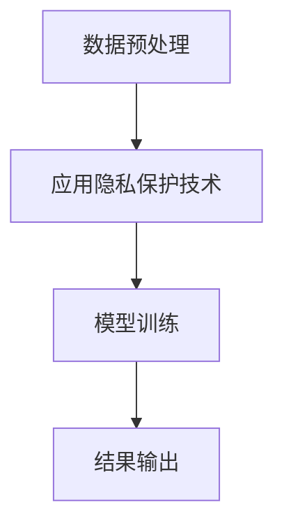
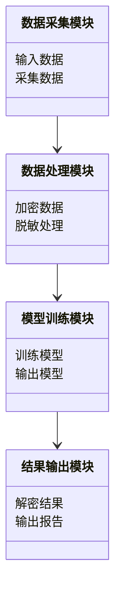
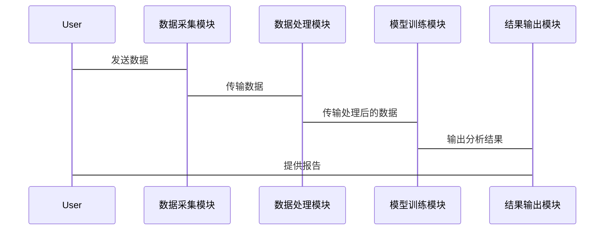

                 


# 开发具有隐私保护数据分析能力的AI Agent

## 关键词：AI Agent, 隐私保护, 数据分析, 差分隐私, 同态加密, 数据隐私

## 摘要：本文将详细探讨如何开发具有隐私保护数据分析能力的AI Agent。首先，我们将介绍隐私保护的重要性，分析AI Agent在数据处理中的独特需求。接着，深入探讨隐私保护的核心算法，如差分隐私和同态加密，通过数学模型和流程图展示其工作原理。然后，我们将设计系统的架构，确保隐私保护与数据分析的高效结合。最后，通过具体案例展示AI Agent的实际应用，总结开发过程中的关键点，为读者提供实用的开发指南。

---

# 第1章: 背景介绍

## 1.1 问题背景

### 1.1.1 数据隐私保护的重要性

在数字化时代，数据成为最重要的资产之一。个人数据的泄露可能导致身份盗窃、金融诈骗等问题，企业的数据泄露可能损害客户信任和商业信誉。随着AI技术的广泛应用，如何保护数据隐私成为一项关键挑战。

### 1.1.2 AI Agent在数据分析中的作用

AI Agent是一种智能代理，能够自主执行任务，包括数据采集、处理、分析和决策。在数据分析中，AI Agent能够实时处理大量数据，提供精准的洞察，但同时也面临数据泄露的风险。

### 1.1.3 当前隐私保护面临的挑战

尽管隐私保护技术不断进步，但仍面临数据加密与可用性之间的矛盾，以及如何在保证隐私的前提下进行高效数据分析的挑战。

## 1.2 问题描述

### 1.2.1 数据分析中的隐私泄露风险

传统数据分析方法可能无法有效保护数据隐私，尤其是在处理敏感信息时，存在被攻击的风险。

### 1.2.2 AI Agent对数据隐私的要求

AI Agent需要在处理数据时确保隐私，同时不影响数据分析的准确性。

### 1.2.3 需求与现状的差距

现有技术在隐私保护与数据分析效率之间存在平衡难题，需要开发新的解决方案。

## 1.3 问题解决

### 1.3.1 隐私保护数据分析的必要性

为了保护用户隐私，必须在数据分析过程中引入隐私保护机制。

### 1.3.2 AI Agent如何实现隐私保护

通过数据加密、匿名化处理和隐私保护算法，确保AI Agent在分析数据时不会泄露敏感信息。

### 1.3.3 技术与法律的结合

技术手段保护隐私，同时遵守相关法律法规，确保数据处理合法合规。

## 1.4 边界与外延

### 1.4.1 隐私保护的边界

明确数据的使用范围和权限，避免过度收集和使用数据。

### 1.4.2 数据分析的范围

确定数据分析的目标和数据的使用方式，确保隐私保护与分析需求相匹配。

### 1.4.3 AI Agent的功能限制

在保证隐私的前提下，AI Agent的功能设计需要有所限制，以防止隐私泄露。

## 1.5 概念结构与核心要素

### 1.5.1 核心概念的组成

包括数据隐私、数据分析、AI Agent、隐私保护技术等。

### 1.5.2 各要素之间的关系

数据隐私是目标，数据分析是手段，AI Agent是载体，隐私保护技术是工具。

### 1.5.3 案例分析

通过一个具体案例，展示AI Agent在隐私保护下的数据分析过程。

---

# 第2章: 核心概念与联系

## 2.1 隐私保护数据分析的原理

### 2.1.1 数据加密与匿名化

通过加密技术对数据进行处理，使其在分析过程中无法被解密还原。

### 2.1.2 差分隐私与同态加密

差分隐私通过添加噪声保护数据，同态加密允许在加密状态下进行数据分析。

### 2.1.3 数据脱敏技术

对敏感数据进行变形处理，使其无法还原真实数据。

## 2.2 AI Agent的结构与功能

### 2.2.1 数据采集模块

负责从数据源获取数据，并进行初步处理。

### 2.2.2 数据处理模块

对数据进行清洗、转换和匿名化处理，确保隐私保护。

### 2.2.3 模型训练模块

利用隐私保护技术训练数据分析模型，确保模型不泄露数据。

### 2.2.4 结果输出模块

将分析结果以匿名化形式输出，确保隐私安全。

## 2.3 核心概念的联系

### 2.3.1 数据隐私与AI Agent功能的结合

通过数据加密和匿名化，确保AI Agent在分析数据时不会泄露隐私。

### 2.3.2 数据分析流程中的隐私保护

从数据采集到结果输出的每一步，都需要考虑隐私保护。

### 2.3.3 技术与业务目标的统一

在保证隐私的前提下，实现高效的数据分析和准确的决策支持。

---

## 2.4 核心概念对比表格

| **概念**       | **描述**                                                                 |
|-----------------|--------------------------------------------------------------------------|
| 数据隐私        | 数据的机密性和完整性，防止未经授权的访问和泄露。                       |
| 数据分析        | 从数据中提取有用信息，支持决策的过程。                                   |
| AI Agent        | 智能代理，能够自主执行任务，包括数据处理和分析。                        |
| 隐私保护技术    | 通过技术手段保护数据隐私，如加密、匿名化和差分隐私。                    |

---

## 2.5 ER实体关系图

```mermaid
erd
    title 数据隐私保护系统
    User: 用户
    Data: 数据
    Agent: AI Agent
    encrypt(data)
    anonymize(data)
```

---

# 第3章: 算法原理讲解

## 3.1 差分隐私算法

### 3.1.1 差分隐私的基本概念

差分隐私通过在数据中添加噪声，使得单个数据点的变化不会影响整体的统计结果。

### 3.1.2 Laplace机制的数学模型

Laplace机制是一种常用的差分隐私算法，适用于连续数据的保护。

$$P(x) = \frac{1}{2b} \text{exp}\left(-\frac{|x - \mu|}{b}\right)$$

其中，$\mu$ 是均值，$b$ 是平滑参数。

### 3.1.3 随机响应机制的实现

通过向数据中添加随机噪声，确保单个数据点对统计结果的影响被掩盖。

### 3.1.4 差分隐私的优缺点分析

优点：提供强大的隐私保护；缺点：可能增加数据分析的误差。

## 3.2 同态加密算法

### 3.2.1 同态加密的基本原理

允许在加密数据上进行计算，结果解密后与直接计算结果相同。

### 3.2.2 常见的同态加密算法

包括RSA、ElGamal等，其中RSA适用于加密后数据的加法和乘法运算。

### 3.2.3 同态加密的实现步骤

1. 数据加密：对原始数据进行加密。
2. 数据处理：在加密状态下进行数据计算。
3. 结果解密：将加密结果解密，得到最终结果。

### 3.2.4 同态加密的性能考量

计算复杂度较高，可能影响数据分析效率。

## 3.3 深度学习中的隐私保护

### 3.3.1 模型压缩与剪枝技术

通过减少模型参数数量，降低数据泄露风险。

### 3.3.2 联邦学习的实现原理

多个数据源在不共享原始数据的情况下，协同训练模型。

### 3.3.3 模型隐私保护的数学模型

$$\text{模型参数} \theta \text{的隐私保护}$$

---

## 3.4 算法流程图



---

# 第4章: 系统分析与架构设计

## 4.1 问题场景介绍

在医疗领域，AI Agent需要分析患者的病历数据，同时保护患者的隐私。

## 4.2 项目介绍

开发一个医疗AI Agent，用于辅助诊断，同时保护患者数据隐私。

## 4.3 系统功能设计

### 4.3.1 领域模型



---

## 4.4 系统架构设计

### 4.4.1 系统架构图


---

## 4.5 系统接口设计

### 4.5.1 数据采集接口

- 输入：原始数据
- 输出：处理后的数据

### 4.5.2 数据处理接口

- 输入：处理数据
- 输出：加密数据

### 4.5.3 模型训练接口

- 输入：加密数据
- 输出：训练模型

### 4.5.4 结果输出接口

- 输入：模型
- 输出：分析结果

---

## 4.6 系统交互流程图



---

# 第5章: 项目实战

## 5.1 环境安装

### 5.1.1 安装Python和必要的库

安装Python 3.x，以及numpy、pandas、scikit-learn等库。

## 5.2 核心代码实现

### 5.2.1 数据加密与匿名化

```python
import numpy as np

def laplace_noise(mu, b):
    noise = np.random.laplace(mu, b)
    return noise

# 示例
mu = 0
b = 1
noise = laplace_noise(mu, b)
print(f"噪声值为: {noise}")
```

### 5.2.2 模型训练

```python
from sklearn.ensemble import RandomForestClassifier

# 加密数据
encrypted_data = data + np.random.laplace(0, 1, size=data.shape)

# 训练模型
model = RandomForestClassifier()
model.fit(encrypted_data, labels)
```

### 5.2.3 结果输出

```python
# 解密结果
result = model.predict(test_data)
print(f"预测结果: {result}")
```

## 5.3 案例分析

通过一个医疗数据分析案例，展示AI Agent如何在保护患者隐私的前提下，提供准确的诊断建议。

---

# 第6章: 最佳实践与总结

## 6.1 小结

开发具有隐私保护数据分析能力的AI Agent需要综合运用多种技术手段，确保数据隐私与分析效率的平衡。

## 6.2 注意事项

- 选择合适的隐私保护技术，根据具体场景调整参数。
- 定期进行安全审计，确保系统无漏洞。
- 培训相关人员，确保合规使用。

## 6.3 拓展阅读

推荐阅读相关技术文献，参加技术交流会，深入了解隐私保护技术的最新发展。

---

# 结语

开发具有隐私保护数据分析能力的AI Agent是一项具有挑战性的任务，但也是一项非常重要的任务。通过本文的探讨，我们希望能够为读者提供一套完整的开发思路和实现方案，帮助他们在实际项目中更好地保护数据隐私，同时高效地进行数据分析。

---

**感谢您的阅读！**

