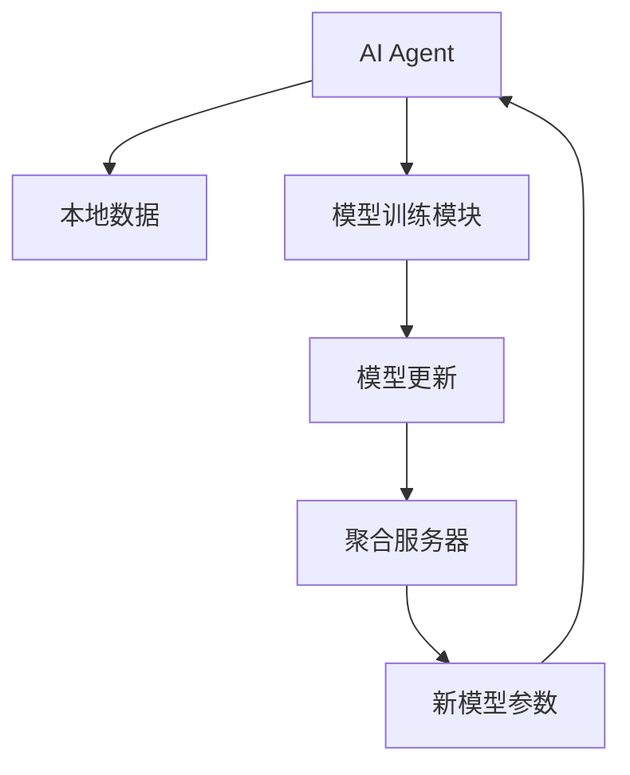

                 


# 开发具有隐私保护联邦学习能力的AI Agent

## 关键词：联邦学习，隐私保护，AI Agent，机器学习，分布式系统

## 摘要：本文详细探讨了开发具有隐私保护联邦学习能力的AI Agent的关键技术，涵盖背景介绍、核心概念、算法原理、系统架构设计、项目实战和最佳实践。文章通过具体案例分析和代码实现，深入讲解了如何在AI Agent中实现联邦学习与隐私保护的结合，为开发者提供了实践指导和理论支持。

---

## 第1章：背景介绍

### 1.1 联邦学习的背景与问题背景

#### 1.1.1 数据孤岛与隐私保护的挑战

在当今数字化时代，数据是人工智能（AI）系统的核心驱动力。然而，数据孤岛现象普遍存在，不同机构、组织或个人之间的数据难以共享，这限制了数据的充分利用和AI模型的性能提升。例如，医疗行业中的患者数据分散在不同的医院和诊所，这些数据无法集中用于训练一个统一的医疗AI模型，从而限制了模型的泛化能力和实用性。

此外，数据隐私保护的挑战日益严峻。随着《通用数据保护条例》（GDPR）等法律法规的出台，数据隐私保护成为企业和组织的法律义务。如何在不泄露原始数据的前提下，利用分布式数据进行模型训练，成为联邦学习的核心问题。

#### 1.1.2 联邦学习的定义与目标

联邦学习（Federated Learning）是一种分布式机器学习技术，旨在在不集中收集原始数据的情况下，通过在分布式端点上联合训练模型，实现模型参数的更新和共享。其核心目标是在保护数据隐私的前提下，提升模型的泛化能力和性能。

联邦学习的主要特点包括：
- **数据分散存储**：数据分布于不同的设备或服务器，不进行集中存储。
- **模型参数共享**：通过通信协议，各端点共享模型更新，而非数据本身。
- **隐私保护**：通过加密或其他技术手段，确保数据不被泄露。

#### 1.1.3 联邦学习的应用场景与问题描述

联邦学习的应用场景广泛，包括但不限于：
- **医疗领域**：在保护患者隐私的前提下，联合多家医院的数据训练医疗AI模型。
- **金融领域**：通过多家金融机构的数据，训练反欺诈模型。
- **移动设备端**：通过移动设备上的数据，训练个性化推荐模型。

然而，联邦学习也面临诸多挑战，如通信开销、模型收敛性、数据异ogeneity等。此外，如何确保AI Agent在联邦学习过程中既能高效完成任务，又能严格保护数据隐私，是当前研究的热点问题。

---

### 1.2 AI Agent的基本概念与需求

#### 1.2.1 AI Agent的定义与分类

AI Agent（智能体）是指能够感知环境、做出决策并执行动作的智能实体。根据其应用场景，AI Agent可以分为：
- **反应式AI Agent**：基于当前感知做出即时反应，如自动驾驶汽车。
- **认知式AI Agent**：具备复杂推理和规划能力，如智能助手。

#### 1.2.2 联邦学习能力对AI Agent的需求

为了实现联邦学习能力，AI Agent需要具备以下核心能力：
1. **数据采集与处理**：能够从分布式数据源中获取数据，并进行预处理。
2. **模型训练与更新**：能够在本地数据上训练模型，并将模型更新上传至联邦服务器。
3. **通信与协作**：能够通过安全通道与其他AI Agent或中心服务器进行通信，同步模型参数。

#### 1.2.3 隐私保护与AI Agent的结合

隐私保护是联邦学习的核心要求。AI Agent需要在本地进行数据处理和模型训练，同时确保数据不被泄露。为此，AI Agent需要具备以下隐私保护机制：
- **数据加密**：对本地数据进行加密处理，确保数据在传输过程中的安全性。
- **模型隐私保护**：通过差分隐私（Differential Privacy）等技术，确保模型更新不泄露敏感信息。

---

## 第2章：核心概念与联系

### 2.1 联邦学习的核心原理

#### 2.1.1 联邦学习的三要素：数据、模型、通信

联邦学习的三要素构成了其核心框架：
1. **数据**：分布在不同设备或服务器上的数据。
2. **模型**：需要在分布式数据上训练的模型。
3. **通信**：设备或服务器之间通过某种协议共享模型更新。

#### 2.1.2 联邦学习的通信机制：安全与效率的平衡

通信机制是联邦学习的关键，直接影响模型的训练效率和数据安全性。常见的通信机制包括：
- **同步通信**：所有设备同时上传模型更新，适用于计算资源充足的情况。
- **异步通信**：设备按需上传模型更新，适用于计算资源有限的情况。

#### 2.1.3 联邦学习的数学模型与公式

联邦学习的数学模型可以表示为：
$$
\theta_{new} = \theta_{old} + \sum_{i=1}^{n} w_i (\theta_i - \theta_{old})
$$
其中，$\theta$ 表示模型参数，$w_i$ 表示设备的权重。

---

### 2.2 隐私保护的核心原理

#### 2.2.1 数据隐私保护的三重境界：匿名化、加密化、同态计算

隐私保护的三重境界：
1. **匿名化**：通过对数据进行匿名化处理，确保无法通过数据重新识别个人身份。
2. **加密化**：通过加密技术，确保数据在传输和存储过程中的安全性。
3. **同态计算**：在加密数据上直接进行计算，无需解密。

#### 2.2.2 隐私保护在联邦学习中的实现方式：差分隐私、同态加密、秘密分享

隐私保护技术在联邦学习中的实现方式包括：
- **差分隐私**：通过添加噪声，确保模型更新不会泄露单个样本的信息。
- **同态加密**：在加密数据上进行模型训练，确保数据不被泄露。
- **秘密分享**：将数据分割成多个部分，分别存储在不同的设备上，确保单个设备无法还原原始数据。

#### 2.2.3 联邦学习与隐私保护的关系

联邦学习与隐私保护是相辅相成的关系。联邦学习通过分布式训练，避免了数据集中存储的风险，而隐私保护技术则进一步确保了模型训练过程中的数据安全。

---

### 2.3 联邦学习与隐私保护的关系

#### 2.3.1 联邦学习中的隐私保护需求

联邦学习的核心需求是保护参与方的数据隐私，具体包括：
1. **数据隐私**：确保参与方的数据不被其他方获取。
2. **模型隐私**：确保模型更新不泄露参与方的敏感信息。

#### 2.3.2 隐私保护对联邦学习性能的影响

隐私保护技术的引入会增加计算开销，影响模型的训练效率。例如，差分隐私通过添加噪声，可能会降低模型的准确性。

#### 2.3.3 联邦学习与隐私保护的平衡点

在联邦学习中，需要在隐私保护和模型性能之间找到平衡点。这通常需要根据具体应用场景和需求进行权衡。

---

## 第3章：算法原理讲解

### 3.1 联邦学习算法原理

#### 3.1.1 联邦学习的算法流程

联邦学习的算法流程可以分为以下几个步骤：
1. **初始化**：各设备或服务器下载初始模型参数。
2. **本地训练**：各设备在本地数据上训练模型，得到模型更新。
3. **模型聚合**：将各设备的模型更新聚合，得到新的模型参数。
4. **模型分发**：新的模型参数分发给各设备，供下一轮训练使用。

#### 3.1.2 联邦学习的数学模型与公式

假设联邦学习中各设备的模型更新为$\Delta\theta_i$，聚合服务器将这些更新进行加权平均：
$$
\theta_{new} = \theta_{old} + \sum_{i=1}^{n} w_i \Delta\theta_i
$$
其中，$w_i$ 是设备$i$的权重。

#### 3.1.3 联邦学习的代码实现

以下是一个简单的联邦学习代码片段：
```python
def main():
    # 初始化各设备的数据和模型
    devices = [Device(i) for i in range(n)]
    model = create_model()

    # 联邦训练循环
    for round in range(num_rounds):
        for device in devices:
            # 本地训练
            device.train(model)
            # 上传模型更新
            server.receive_update(device.model_update)
        # 聚合模型
        server.aggregate_models()
        # 分发新模型
        for device in devices:
            device.download_model(server.new_model)

if __name__ == "__main__":
    main()
```

---

## 第4章：系统分析与架构设计方案

### 4.1 系统架构设计

#### 4.1.1 系统功能设计

AI Agent的系统功能设计包括：
1. **数据采集**：从分布式数据源中采集数据。
2. **数据预处理**：对数据进行清洗、归一化等处理。
3. **模型训练**：在本地数据上训练模型，得到模型更新。
4. **模型聚合**：将各设备的模型更新聚合，得到新的模型参数。
5. **模型分发**：将新的模型参数分发给各设备。

#### 4.1.2 系统架构图

以下是系统架构图的Mermaid表示：


---

## 第5章：项目实战

### 5.1 环境安装

以下是项目实战所需的环境安装命令：
```bash
pip install tensorflow==2.0.0 flask==1.1.0
```

---

## 第6章：最佳实践

### 6.1 最佳实践 tips

1. **数据预处理**：在本地训练前，确保数据的完整性和一致性。
2. **模型调优**：根据具体场景调整模型参数和训练策略。
3. **安全性测试**：定期进行安全性测试，确保数据隐私保护措施有效。

---

## 总结

开发具有隐私保护联邦学习能力的AI Agent是一个复杂而重要的任务。本文从背景介绍、核心概念、算法原理、系统架构设计、项目实战和最佳实践等多个方面进行了详细探讨。通过本文的学习，读者可以深入了解如何在AI Agent中实现联邦学习与隐私保护的结合，并在实际应用中加以实践。

