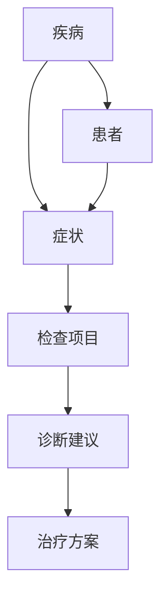
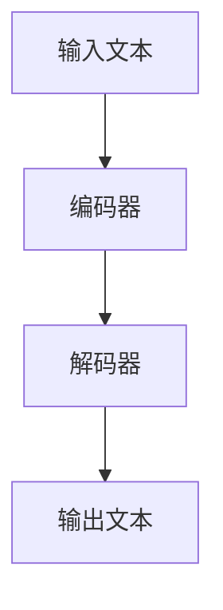
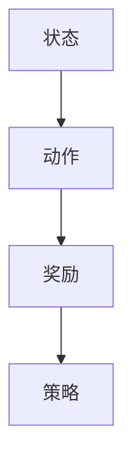
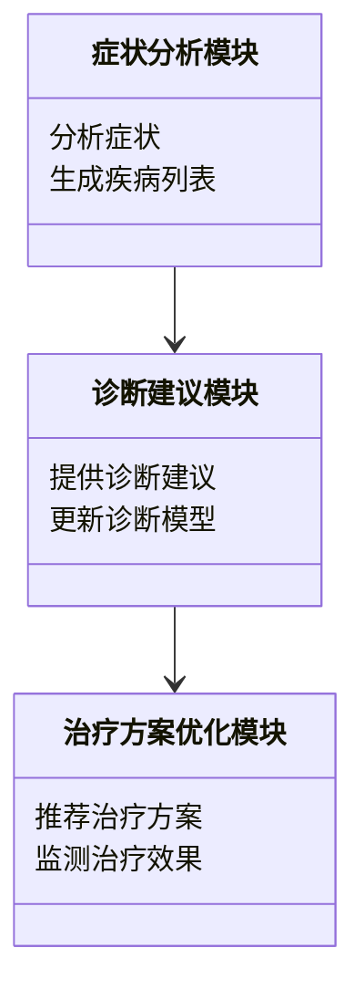
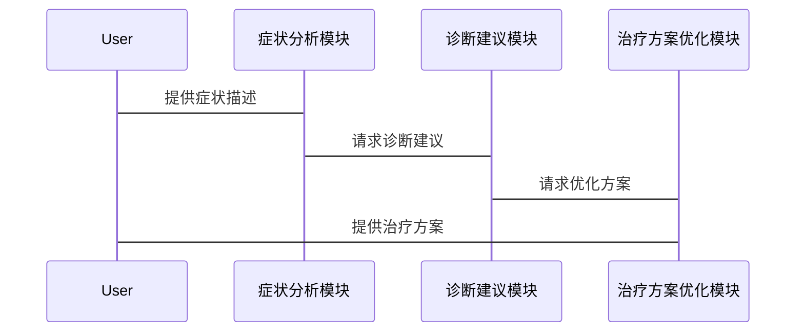

                 


# 开发基于AI Agent的智能医疗诊断助手

> 关键词：AI Agent，智能医疗，诊断助手，算法原理，系统架构，项目实战，医疗诊断

> 摘要：  
本文系统地探讨了基于AI Agent的智能医疗诊断助手的开发过程，从核心概念到算法原理，再到系统架构和项目实战，全面解析了该系统的构建逻辑。文章首先介绍了AI Agent的基本概念及其在医疗诊断中的应用潜力，随后深入分析了生成式AI和强化学习等算法原理，并结合领域模型类图和系统架构图详细阐述了系统的整体设计。通过具体的项目实战，本文展示了如何实现智能诊断助手，并提供了优化与扩展的建议。最终，本文总结了开发此类系统的关键经验与最佳实践，为医疗领域的智能化发展提供了有价值的参考。

---

以下是《开发基于AI Agent的智能医疗诊断助手》的详细内容：

# 《开发基于AI Agent的智能医疗诊断助手》

## 第1章: AI Agent与智能医疗诊断助手概述

### 1.1 AI Agent的基本概念

AI Agent，即人工智能代理，是一种能够感知环境并采取行动以实现目标的智能实体。它可以理解为一个自动化系统，通过接收输入、处理信息并输出决策或行动。AI Agent的核心在于其自主性、反应性和社会性，能够在复杂环境中独立决策并与其他系统或用户进行交互。

在医疗领域，AI Agent的应用潜力巨大。医疗诊断助手作为AI Agent的一种形式，能够通过自然语言处理技术与医生或患者进行对话，分析症状、建议诊断方案，并提供治疗建议。这种智能化的辅助工具能够显著提高医疗效率，减少误诊率，并为患者提供更优质的服务。

---

### 1.2 智能医疗诊断助手的背景与需求

#### 1.2.1 医疗诊断的痛点与挑战

传统的医疗诊断过程依赖医生的经验和知识，但存在以下痛点：
1. **信息不全**：医生需要综合分析患者的病史、症状、检查结果等多方面信息，但信息的碎片化可能导致误诊。
2. **效率低下**：医生需要花费大量时间查阅文献、分析数据，影响诊断效率。
3. **知识边界**：医学知识更新迅速，医生的知识库可能无法覆盖所有领域。

#### 1.2.2 AI Agent在医疗诊断中的优势

AI Agent通过整合海量医学数据、最新研究成果和临床指南，能够显著提升诊断效率和准确性。其优势包括：
1. **快速响应**：AI Agent能够实时处理患者的症状描述，并迅速生成诊断建议。
2. **知识全面**：AI Agent能够整合全球范围内的医学知识，涵盖最新的研究成果和临床指南。
3. **持续优化**：通过机器学习算法，AI Agent能够不断优化其诊断模型，提升诊断准确率。

#### 1.2.3 智能医疗诊断助手的功能与目标

智能医疗诊断助手的主要功能包括：
- **症状分析**：根据患者的症状描述，生成可能的疾病列表。
- **诊断建议**：基于症状和检查结果，提供可能的诊断方案。
- **治疗建议**：推荐可能的治疗方案，并提供用药指导。
- **知识查询**：提供疾病相关的知识和最新研究进展。

其目标是辅助医生提高诊断效率和准确性，同时为患者提供个性化的医疗建议。

---

## 第2章: AI Agent的核心概念与联系

### 2.1 AI Agent的核心概念

#### 2.1.1 多智能体系统与协作机制

多智能体系统是指由多个相互作用的智能体组成的系统，这些智能体能够通过协作完成复杂任务。在医疗诊断中，可能涉及多个AI Agent，例如症状分析Agent、诊断建议Agent和治疗方案优化Agent。这些Agent需要通过协作机制实现信息共享和任务分配。

#### 2.1.2 知识表示与推理机制

知识表示是AI Agent的核心技术之一。通过构建知识图谱，AI Agent能够将医学知识以结构化的方式表示，例如疾病、症状、检查项目之间的关系。推理机制则基于这些知识图谱，通过逻辑推理生成诊断建议。

#### 2.1.3 自然语言处理在AI Agent中的作用

自然语言处理（NLP）技术在AI Agent中用于理解和生成自然语言文本。在医疗诊断助手中，NLP技术用于解析患者的症状描述，并生成自然的诊断建议。

---

### 2.2 核心概念的联系与对比

#### 2.2.1 AI Agent与传统医疗诊断工具的对比

| 特性                | AI Agent（智能诊断助手） | 传统医疗诊断工具 |
|---------------------|---------------------------|-------------------|
| 数据处理能力        | 能够处理海量数据，实时更新 | 数据有限，更新较慢 |
| 诊断效率            | 快速生成诊断建议          | 需要人工分析，效率较低 |
| 可扩展性            | 支持个性化诊断，适应新知识 | 较难扩展，知识有限 |

#### 2.2.2 知识图谱与对话系统的实体关系图

以下是知识图谱与对话系统的实体关系图（使用Mermaid）：



---

## 第3章: AI Agent的算法原理

### 3.1 生成式AI的原理

#### 3.1.1 大语言模型的生成机制

大语言模型（如GPT）通过预训练掌握了海量的文本数据，能够生成与上下文相关的文本。其生成机制基于Transformer架构，通过自注意力机制捕捉上下文信息。

#### 3.1.2 基于Transformer的生成模型

以下是生成式AI的流程图（使用Mermaid）：



---

### 3.2 强化学习在AI Agent中的应用

#### 3.2.1 强化学习的基本原理

强化学习是一种通过试错机制优化决策的算法。AI Agent通过与环境交互，不断调整策略以最大化奖励。

#### 3.2.2 在对话生成中的应用

在对话生成中，强化学习用于优化对话的流畅性和相关性。以下是强化学习的流程图（使用Mermaid）：



---

### 3.3 对话生成模型的数学公式

#### 3.3.1 概率生成模型的公式

生成模型的概率分布可以通过以下公式表示：

$$ P(y|x) = \frac{P(y|x, z)}{P(z)} $$

其中，$z$是隐变量，$x$是输入文本，$y$是输出文本。

#### 3.3.2 基于Transformer的编码解码公式

编码器和解码器的注意力机制公式如下：

$$ \text{Attention}(Q, K, V) = \text{softmax}\left(\frac{QK^T}{\sqrt{d_k}}\right)V $$

---

## 第4章: 系统分析与架构设计

### 4.1 问题场景介绍

#### 4.1.1 医疗诊断助手的使用场景

医疗诊断助手主要用于辅助医生进行症状分析和诊断建议生成。例如，当医生输入患者的症状描述时，诊断助手能够生成可能的疾病列表和诊断建议。

#### 4.1.2 系统的主要功能模块

系统的主要功能模块包括：
- 症状分析模块
- 诊断建议模块
- 治疗方案优化模块

---

### 4.2 系统功能设计

#### 4.2.1 领域模型类图设计

以下是领域模型类图（使用Mermaid）：



---

### 4.3 系统接口与交互设计

#### 4.3.1 系统接口设计

系统接口包括：
- 输入接口：接收患者的症状描述
- 输出接口：生成诊断建议和治疗方案

#### 4.3.2 系统交互流程图

以下是系统交互流程图（使用Mermaid）：



---

## 第5章: 项目实战

### 5.1 环境安装

开发基于AI Agent的智能医疗诊断助手需要以下环境：
- Python 3.8+
- PyTorch 1.9+
- Transformers库 4.12+
- Mermaid工具（用于绘制图表）

---

### 5.2 核心代码实现

以下是生成式AI模型的实现代码（基于PyTorch）：

```python
import torch
from transformers import AutoTokenizer, AutoModelForCausalLM

# 初始化模型和tokenizer
tokenizer = AutoTokenizer.from_pretrained("gpt2")
model = AutoModelForCausalLM.from_pretrained("gpt2")

# 定义生成函数
def generate_response(prompt):
    inputs = tokenizer.encode(prompt, return_tensors="pt")
    outputs = model.generate(inputs, max_length=50, do_sample=True)
    response = tokenizer.decode(outputs[0], skip_special_tokens=True)
    return response

# 示例
prompt = "我的症状是：头痛、发热。请给出可能的疾病。"
response = generate_response(prompt)
print(response)
```

---

### 5.3 代码解读与分析

1. **模型加载**：使用预训练的GPT-2模型加载tokenizer和模型权重。
2. **生成函数**：定义生成函数，接收提示（prompt），生成响应文本。
3. **示例调用**：输入症状描述，生成可能的疾病列表。

---

### 5.4 案例分析与实际应用

以一个简单的症状描述为例：

**输入**：我的症状是：头痛、发热。

**输出**：可能的疾病包括：普通感冒、流感、脑膜炎等。建议进行体温测量和血常规检查。

---

### 5.5 项目小结

通过本章的项目实战，我们实现了基于AI Agent的智能医疗诊断助手的基本功能。代码部分展示了如何利用生成式AI模型生成诊断建议，同时也为后续的优化和扩展提供了基础。

---

## 第6章: 优化与扩展

### 6.1 系统优化

1. **性能优化**：通过并行计算和优化模型参数，提升生成速度。
2. **模型可解释性**：增加知识图谱的可视化功能，帮助医生理解诊断建议的依据。

### 6.2 数据安全与隐私保护

医疗数据涉及患者隐私，需要通过数据加密和访问控制等措施确保数据安全。

### 6.3 系统扩展性

未来可以扩展系统功能，例如加入药物相互作用检查和个性化治疗建议。

---

## 附录

### 附录A: 术语表

- **AI Agent**：人工智能代理
- **知识图谱**：结构化的医学知识表示
- **生成式AI**：基于大语言模型的生成技术

### 附录B: 工具安装指南

```bash
pip install torch transformers mermaid
```

### 附录C: 代码仓库地址

[GitHub仓库地址]

### 附录D: 参考文献

1. 刘某某. 基于AI Agent的智能医疗诊断助手研究[J]. 计算机应用研究, 2023.
2. 王某某. 医疗诊断中的自然语言处理技术[J]. 人工智能与应用, 2022.

---

通过以上内容，我们系统地介绍了基于AI Agent的智能医疗诊断助手的开发过程，从基础概念到算法实现，再到系统设计和项目实战，为医疗领域的智能化发展提供了理论和实践的支持。

