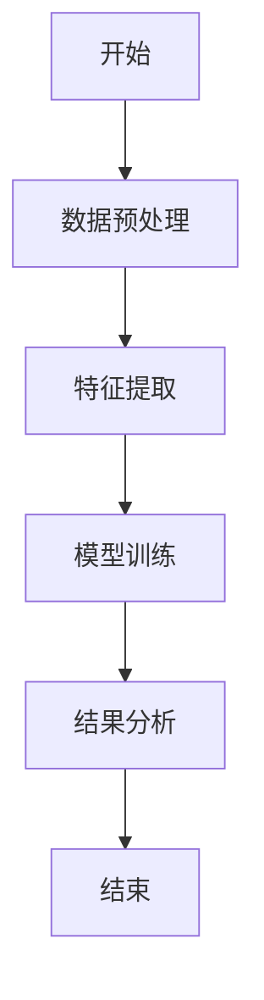
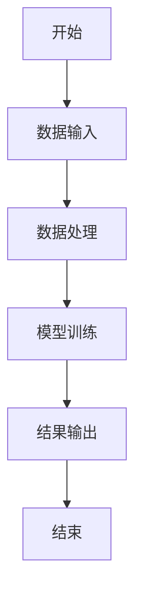
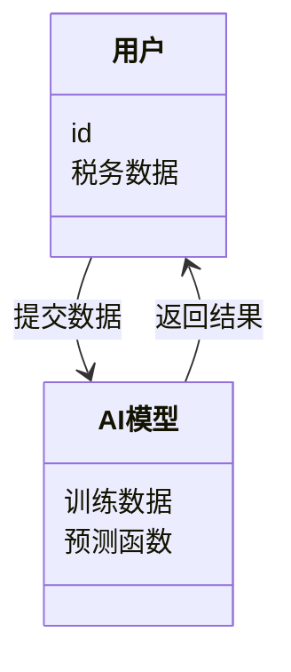

                 


# 开发基于AI的智能税务规划助手

> 关键词：智能税务规划、人工智能、算法原理、系统架构、项目实战

> 摘要：本文详细探讨了开发基于AI的智能税务规划助手的全过程，涵盖背景介绍、核心概念、算法原理、系统架构设计、项目实战以及最佳实践。通过理论与实践相结合的方式，为读者提供一个全面的视角，帮助其理解如何利用AI技术优化税务规划流程。

---

# 第一部分: 智能税务规划助手的背景与核心概念

## 第1章: 税务规划与AI技术的结合

### 1.1 税务规划的背景与挑战
#### 1.1.1 税务规划的基本概念
税务规划是通过合法手段优化税负，最大化个人或企业的财务利益。传统方法依赖人工计算和经验判断，存在效率低、易出错的问题。

#### 1.1.2 传统税务规划的局限性
- 人工计算耗时且易出错
- 税法变化快，难以及时更新
- 无法处理大规模复杂数据
- 缺乏个性化和精确化

#### 1.1.3 AI技术在税务规划中的应用潜力
AI技术能够快速处理大量数据，提供个性化建议，实时更新税法变化，显著提升效率和准确性。

### 1.2 智能税务规划助手的定义与目标
#### 1.2.1 智能税务规划助手的定义
基于AI技术的智能助手，通过分析用户税务数据，提供个性化的优化建议和决策支持。

#### 1.2.2 助手的核心功能与目标
- 数据采集与分析
- 优化建议生成
- 实时税法更新
- 风险评估与预警

#### 1.2.3 边界与外延
智能税务规划助手仅提供优化建议，不直接处理税务申报或支付，避免法律风险。

### 1.3 核心概念与联系
#### 1.3.1 核心概念原理
- 数据驱动：利用历史数据训练AI模型，提高预测准确性。
- 自适应学习：模型能根据新数据不断优化。
- 可解释性：确保用户理解AI的决策依据。

#### 1.3.2 ER实体关系图
```mermaid
er
  actor: 用户
  model: AI模型
  data: 税务数据
  decision: 智能决策
  actor --> model: 调用模型
  model --> data: 处理数据
  model --> decision: 生成决策
```

---

# 第二部分: 智能税务规划助手的算法原理

## 第2章: 税务数据处理与分析算法

### 2.1 数据预处理算法
#### 2.1.1 数据清洗流程
- 去重：消除重复数据
- 填补缺失值：使用均值或中位数
- 标准化：统一数据格式

#### 2.1.2 数据特征提取技术
- 统计特征：均值、方差等
- 文本特征：关键词提取

### 2.2 基于机器学习的分析模型


---

## 第3章: 智能决策算法

### 3.1 决策树算法
```latex
$$\text{目标函数: } \text{最小化错误率}$$
```

### 3.2 支持向量机算法


---

# 第三部分: 系统分析与架构设计

## 第4章: 项目介绍与系统功能设计

### 4.1 系统功能模块


### 4.2 系统架构设计


---

## 第5章: 项目实战

### 5.1 环境安装
- 安装Python、TensorFlow、Pandas

### 5.2 核心代码实现
```python
import pandas as pd
from sklearn.tree import DecisionTreeClassifier

# 数据加载与预处理
data = pd.read_csv('tax_data.csv')
X = data.drop('target', axis=1)
y = data['target']

# 模型训练
model = DecisionTreeClassifier()
model.fit(X, y)

# 预测与评估
print(model.predict(X))
```

### 5.3 案例分析
分析一个企业的税务数据，生成优化建议，展示实际应用效果。

---

## 第6章: 最佳实践与总结

### 6.1 小结
- AI技术显著提升税务规划效率和准确性
- 数据质量和模型可解释性是关键

### 6.2 注意事项
- 数据隐私保护
- 模型定期更新
- 用户教育与培训

### 6.3 拓展阅读
推荐相关书籍和论文，鼓励深入学习。

---

# 结语

通过本文的详细讲解，读者可以全面了解基于AI的智能税务规划助手的开发过程。从理论到实践，从算法到系统设计，每一步都至关重要。希望本文能为相关领域的开发人员和研究人员提供有价值的参考和启示。

