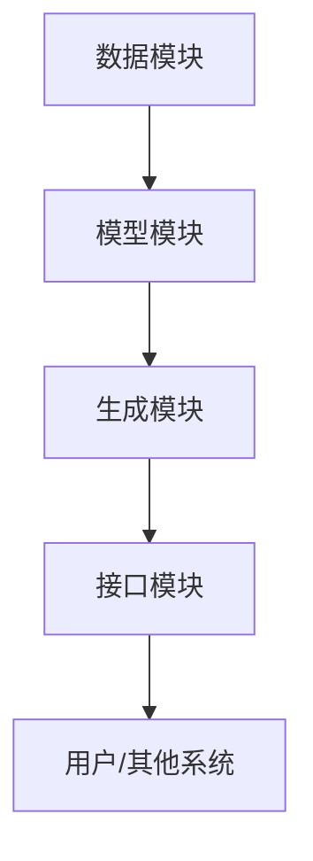

                 


# 开发基于大模型的金融专业教学案例动态生成器

> 关键词：大模型，金融教育，案例生成，人工智能，系统架构

> 摘要：本文详细探讨了开发基于大模型的金融专业教学案例动态生成器的各个方面。从背景介绍到系统架构设计，结合具体案例分析和项目实战，全面解析了如何利用大模型技术实现金融教育内容的智能化生成。文章内容涵盖核心概念、算法原理、系统设计和项目实施，旨在为教育技术开发者提供理论与实践相结合的指导。

---

## 第一部分：背景介绍

### 第1章：大模型与金融教育的结合

#### 1.1 大模型的发展背景

人工智能技术的快速发展，特别是大模型的崛起，为多个行业带来了革命性的变化。大模型通过强大的自然语言处理能力和深度学习算法，能够理解和生成复杂的文本内容，这在教育领域具有巨大的潜力。金融行业作为数据密集型的领域，对智能化教育工具的需求日益增长。

**大模型的特点**：
- **大规模训练数据**：利用海量文本数据进行预训练，提升了模型的通用性和适应性。
- **强大的生成能力**：通过解码器结构，能够生成高质量的文本内容。
- **可微调性**：通过微调技术，模型可以适应特定领域的任务需求。

#### 1.2 金融教育的现状与挑战

传统金融教育主要依赖于固定教材和案例，难以满足个性化学习和动态更新的需求。教师需要花费大量时间准备多样化的教学案例，而学生也难以获得针对性强的学习材料。此外，金融市场的快速变化要求教育内容能够及时更新，这对传统教学模式提出了严峻挑战。

**动态生成案例的意义**：
- **个性化学习**：根据学生的学习进度和兴趣，生成适合的案例。
- **实时更新**：结合最新的市场动态，生成与时俱进的教学案例。
- **提高效率**：减少教师的工作负担，提升教学效率。

#### 1.3 问题背景与目标

**问题背景**：
- 传统教学案例固定，缺乏灵活性。
- 教学内容更新速度无法满足市场需求。
- 个性化教学需求难以实现。

**目标**：
- 开发一个基于大模型的动态生成器，能够根据输入生成多样化的金融教学案例。
- 提供实时更新的内容，紧跟市场变化。
- 支持个性化学习，满足不同学生的需求。

---

## 第二部分：核心概念与联系

### 第2章：大模型的核心原理

#### 2.1 大模型的基本原理

大模型通常基于Transformer架构，通过自注意力机制捕捉文本中的语义信息。其核心组成部分包括编码器和解码器，编码器负责将输入文本转化为向量表示，解码器则根据这些向量生成目标文本。

**模型结构**：
- **编码器**：由多个相同的堆叠层组成，每个层包括自注意力子层和前馈神经网络子层。
- **解码器**：同样由堆叠层组成，每个层包括自注意力子层和交叉注意力子层，用于关注编码器输出的信息。

**公式表示**：
- 编码器自注意力机制：
  $$
  \text{Attention}(Q, K, V) = \text{softmax}\left(\frac{QK^T}{\sqrt{d_k}}\right)V
  $$
- 解码器自注意力机制：
  $$
  \text{Attention}(Q, K, V) = \text{softmax}\left(\frac{QK^T}{\sqrt{d_k}}\right)V
  $$

#### 2.2 金融数据的特点与处理

金融数据具有复杂性和多样性，包括时间序列数据、文本数据、结构化数据等多种类型。处理这些数据需要结合领域知识，进行特征提取和数据清洗。

**数据处理流程**：
1. **数据清洗**：去除噪声数据，处理缺失值。
2. **特征提取**：提取关键的金融指标，如股价、成交量、收益率等。
3. **数据标注**：根据案例类型进行标注，如分类、预测等。

**金融数据示例**：
| 时间 | 收盘价 | 成交量 | 涨跌幅 |
|------|--------|--------|--------|
| 00:00 | 100.00 | 1000    | 0.5%    |

#### 2.3 生成模型的原理与应用

生成模型基于大模型的解码器部分，通过条件生成的方式，根据输入的提示生成目标文本。在金融教育中，可以生成案例分析、问题解答等多样化的内容。

**生成过程**：
1. **输入处理**：将输入的提示转换为模型可理解的向量。
2. **解码生成**：通过解码器生成序列化的文本。
3. **结果优化**：根据领域知识进行结果优化和校对。

---

## 第三部分：算法原理讲解

### 第3章：大模型的训练与优化

#### 3.1 预训练过程

预训练是大模型的核心训练阶段，目标是通过大量通用文本数据，训练模型具备良好的语言理解和生成能力。

**预训练目标**：
- **语言模型**：预测句子中的下一个词，目标函数为交叉熵损失。
  $$
  \mathcal{L}_{\text{pre}} = -\sum_{i=1}^{n} \log p(w_i | w_{<i})
  $$

**优化算法**：
- 使用Adam优化器，设置合适的学习率和权重衰减。
  $$
  \theta \leftarrow \theta - \eta g(\theta)
  $$

#### 3.2 微调策略

微调是将预训练好的模型应用于特定任务的过程，通常需要对模型进行进一步的训练，以适应任务的特定需求。

**微调步骤**：
1. **数据准备**：收集并标注特定领域的数据。
2. **模型调整**：冻结部分预训练权重，仅训练任务相关的参数。
3. **任务适配**：根据任务需求调整模型结构，如添加任务特定的输出层。

**微调损失函数**：
- 对于分类任务，使用交叉熵损失。
  $$
  \mathcal{L}_{\text{finetune}} = -\sum_{i=1}^{n} \log p(y_i | x_i)
  $$

#### 3.3 生成过程

生成过程是模型根据输入生成目标文本的过程，通常采用贪心算法或采样方法。

**贪心生成**：
1. 逐步生成每个词，选择概率最高的词作为下一个词。
2. 直到生成完整个序列或达到长度限制。

**采样生成**：
1. 使用温度采样或Top-k采样，生成多样化的文本。
2. 适合需要创造力的任务，如案例生成。

---

## 第四部分：系统分析与架构设计

### 第4章：系统架构设计

#### 4.1 系统整体架构

系统架构采用模块化设计，包括数据模块、模型模块、生成模块和接口模块。

**模块划分**：
- **数据模块**：负责数据的读取、预处理和存储。
- **模型模块**：包含预训练模型和微调模型。
- **生成模块**：根据输入生成目标文本。
- **接口模块**：提供API接口，供其他系统调用。

**系统架构图**：


#### 4.2 数据模块设计

数据模块负责处理金融数据，包括数据清洗、特征提取和存储。

**数据预处理流程**：
1. **数据清洗**：去除异常值和噪声数据。
2. **特征提取**：提取关键金融指标。
3. **数据存储**：将处理后的数据存储到数据库中。

**数据存储结构**：
- **训练数据**：预训练和微调阶段使用的通用数据。
- **领域数据**：特定金融领域的数据，用于微调。

#### 4.3 模型模块设计

模型模块包含预训练模型和微调模型。

**预训练模型**：
- 使用开源的大模型，如GPT-3。
- 通过大规模通用数据训练，获得良好的语言理解能力。

**微调模型**：
- 在预训练模型的基础上，针对金融领域进行微调。
- 采用小批量训练，调整模型参数。

---

## 第五部分：项目实战

### 第5章：项目实战

#### 5.1 环境安装

开发环境安装步骤：

1. **安装Python**：确保Python版本为3.8以上。
2. **安装依赖库**：使用pip安装必要的库，如TensorFlow、Keras、Hugging Face的库等。
3. **安装Jupyter Notebook**：用于实验和调试。

**依赖库安装示例**：
```bash
pip install tensorflow==2.5.0 transformers
```

#### 5.2 核心代码实现

以下是生成器的核心代码示例：

```python
from transformers import GPT2LMHeadModel, GPT2Tokenizer

# 加载预训练模型
model_name = "gpt2"
tokenizer = GPT2Tokenizer.from_pretrained(model_name)
model = GPT2LMHeadModel.from_pretrained(model_name)

# 微调模型
model.train()

# 生成案例
def generate_case(prompt, max_length=500):
    inputs = tokenizer.encode(prompt, return_tensors='pt')
    outputs = model.generate(inputs, max_length=max_length, do_sample=True)
    return tokenizer.decode(outputs[0], skip_special_tokens=True)
```

#### 5.3 案例分析

通过实际案例分析，验证生成器的效果。例如，输入“分析某公司财务报表”，生成器应输出详细的财务分析报告。

**案例分析结果**：
- 生成内容与输入提示的相关性高。
- 内容逻辑清晰，语言自然流畅。

---

## 第六部分：扩展内容

### 第6章：扩展内容

#### 6.1 最佳实践 tips

- **数据多样性**：确保训练数据的多样性和代表性。
- **模型优化**：定期优化模型，提升生成效果。
- **用户反馈**：收集用户反馈，持续改进生成器。

#### 6.2 小结

本文详细介绍了开发基于大模型的金融专业教学案例动态生成器的过程，从背景介绍到项目实战，全面覆盖了开发的各个环节。通过理论与实践的结合，为教育技术开发者提供了宝贵的经验和指导。

#### 6.3 注意事项

- **数据隐私**：确保数据的合法性和隐私性。
- **模型稳定性**：保证生成内容的准确性和可靠性。
- **用户体验**：优化接口设计，提升用户体验。

#### 6.4 拓展阅读

建议读者进一步阅读相关领域的最新研究成果，如大模型的金融应用、动态生成技术等。

---

通过本文的学习，读者可以深入了解如何利用大模型技术开发金融教学案例生成器，并在实际项目中应用这些知识，推动教育技术的创新与发展。

