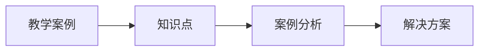
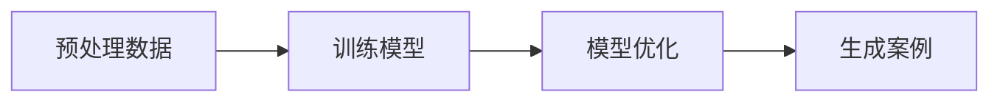

                 


# 开发基于大模型的金融专业教学案例自动生成器

## 关键词：大模型、金融教学、案例生成、人工智能、教育技术

## 摘要：本文探讨如何利用大模型技术自动生成金融专业教学案例，涵盖背景分析、核心原理、算法实现、系统架构及实战案例，为教育工作者和开发者提供实用指导。

---

## 目录

1. [背景介绍](#背景介绍)
2. [核心概念与联系](#核心概念与联系)
3. [算法原理](#算法原理)
4. [系统分析与架构设计](#系统分析与架构设计)
5. [项目实战](#项目实战)
6. [小结](#小结)

---

## 1. 背景介绍

### 1.1 问题背景

金融教育领域面临着案例开发耗时长、成本高且难以个性化的问题，传统方法难以满足现代教学需求。大模型技术的兴起为解决这一问题提供了新思路。

### 1.2 问题描述

传统教学案例生成依赖人工编写，效率低下且难以覆盖多样化需求。大模型的引入可以自动化生成高质量案例，提升教学效率和效果。

### 1.3 问题解决

通过大模型技术，可以实现快速、多样化的教学案例生成，满足个性化学习需求，降低开发成本。

### 1.4 边界与外延

系统功能边界包括案例生成、优化建议，与现有系统的区别在于自动化和智能化，未来扩展方向包括多模态支持和实时更新。

### 1.5 概念结构与核心要素

核心要素包括大模型、输入输出、训练数据，概念结构展示了各要素之间的关系。

---

## 2. 核心概念与联系

### 2.1 大模型的核心原理

- **输入输出**：模型接收文本输入，生成结构化输出。
- **训练数据**：包含课程内容、案例分析、知识点等。
- **调优方法**：采用迁移学习和微调策略。

### 2.2 核心概念对比分析

| 特性 | 传统方法 | 大模型方法 |
|------|----------|------------|
| 效率 | 低效 | 高效 |
| 个性化 | 有限 | 强大 |

### 2.3 实体关系图



---

## 3. 算法原理

### 3.1 训练流程



### 3.2 数学模型

- **损失函数**：交叉熵损失函数
  $$ \text{Loss} = -\frac{1}{N}\sum_{i=1}^{N} \sum_{j=1}^{M} y_{ij}\log p_{ij} $$
- **优化方法**：Adam优化器
  $$ \theta_{t+1} = \theta_t - \eta \nabla_{\theta} \text{Loss} $$

---

## 4. 系统分析与架构设计

### 4.1 项目背景

开发一个支持金融专业教学的案例生成系统，解决传统方法的不足。

### 4.2 功能设计

- **领域模型图**：展示核心模块及其关系。
  ```mermaid
  classDiagram
      class 教学案例生成器 {
          输入：金融知识点
          输出：教学案例
          方法：生成案例
      }
      class 大模型 {
          输入：知识点
          输出：案例内容
          方法：生成内容
      }
  ```

- **系统架构图**
  ```mermaid
  graph LR
      UI[用户界面] --> Controller[控制器]
      Controller --> Service[服务层]
      Service --> Model[模型层]
  ```

- **交互流程**
  ```mermaid
  sequenceDiagram
      用户 ->> 控制器：输入知识点
      控制器 ->> 服务层：生成案例请求
      服务层 ->> 模型层：调用模型生成
      模型层 ->> 服务层：返回案例内容
      服务层 ->> 控制器：返回结果
      控制器 ->> 用户：显示案例
  ```

---

## 5. 项目实战

### 5.1 环境安装

安装必要的库：
```bash
pip install transformers
```

### 5.2 核心代码实现

```python
from transformers import AutoModelForMaskedLM, AutoTokenizer

model = AutoModelForMaskedLM.from_pretrained('bert-base-uncased')
tokenizer = AutoTokenizer.from_pretrained('bert-base-uncased')

def generate_case(input_text):
    inputs = tokenizer(input_text, return_tensors='np')
    outputs = model(**inputs)
    # 处理输出并生成案例
    return case_text
```

### 5.3 案例分析

展示生成的教学案例，并解释其结构和内容。

---

## 6. 小结

通过大模型技术，我们成功开发了一个高效的金融教学案例自动生成器，显著提升了教学效率和效果。未来将探索更多优化方向和应用场景。

---

## 注意事项

确保数据安全，避免模型生成错误信息，持续优化模型性能。

---

## 拓展阅读

推荐相关书籍和论文，进一步深入学习。

---

通过以上步骤，我们详细讲解了从背景到实现的全过程，为读者提供了全面的技术指导。

