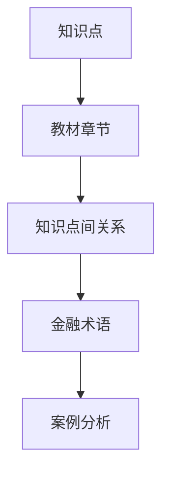
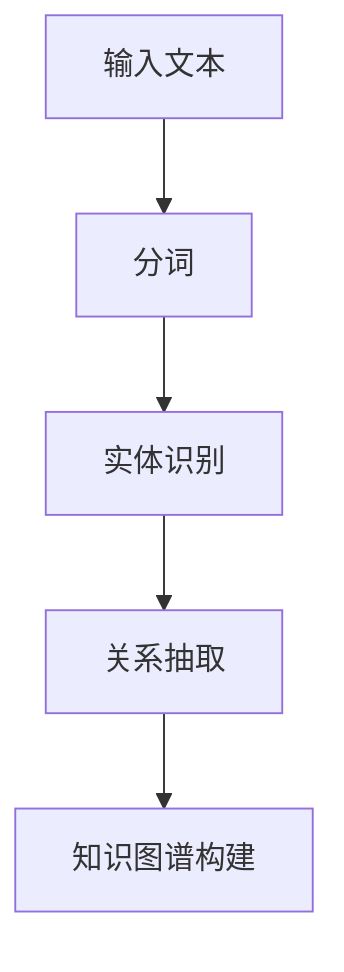
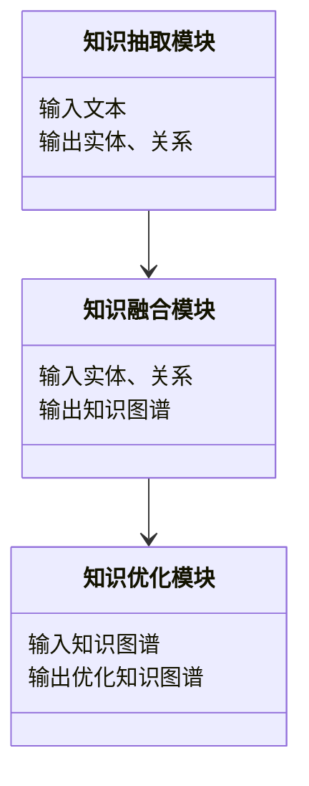
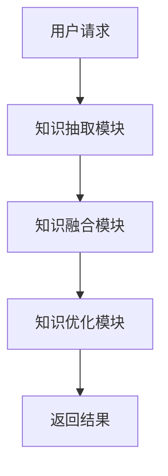
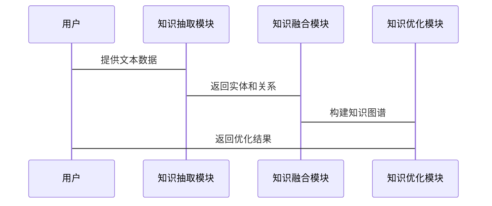

                 


# 开发基于大模型的金融专业教材知识图谱构建器

## 关键词：知识图谱、大模型、自然语言处理、金融教育、系统设计

## 摘要：  
本文详细探讨了开发基于大模型的金融专业教材知识图谱构建器的完整流程。从背景介绍到核心概念，从算法原理到系统设计，从项目实战到最佳实践，全面解析了如何利用大模型技术构建金融领域的知识图谱。文章结合实际案例，深入分析了知识图谱在金融教育中的应用价值，并提供了具体的实现方案和开发建议，为相关领域的研究者和开发者提供了实用的参考。

---

# 第一部分: 背景介绍与核心概念

# 第1章: 开发背景与问题背景

## 1.1 问题背景

### 1.1.1 金融教育领域的知识管理挑战

随着金融市场的快速发展，金融知识的复杂性和专业性不断提高。传统的金融教材通常以线性章节形式呈现，缺乏系统性、关联性和互动性。教师和学生在学习过程中难以快速找到知识点之间的联系，影响学习效率和效果。

### 1.1.2 大模型技术在教育领域的应用潜力

近年来，大模型（如BERT、GPT）在自然语言处理领域取得了突破性进展。这些模型具有强大的语义理解和生成能力，可以用于知识抽取、关系推理和语义匹配等任务，为知识图谱的构建提供了技术支持。

### 1.1.3 知识图谱在金融教育中的价值

知识图谱是一种以图结构形式表示知识的技术，能够将分散的知识点连接起来，形成一个网络化的知识体系。在金融教育中，知识图谱可以帮助学生更好地理解复杂概念之间的关系，提升学习效果。

## 1.2 问题描述

### 1.2.1 知识图谱构建的必要性

传统的教材知识呈现方式难以满足现代教育的需求。知识图谱可以通过结构化的形式，将教材中的知识点、概念、案例等信息组织起来，形成一个可搜索、可交互的知识网络。

### 1.2.2 金融专业教材的知识体系特点

金融教材通常涉及大量的术语、公式、案例和法规。这些内容之间存在复杂的关联关系，例如某个概念可能涉及多个相关知识点，或者某个案例可能需要结合多个法规进行分析。

### 1.2.3 大模型在知识图谱构建中的作用

大模型可以用于从文本中自动提取实体、关系和语义信息，从而降低知识图谱构建的人工成本。同时，大模型还可以通过上下文理解，捕捉隐含的知识关联，提升知识图谱的深度和准确性。

## 1.3 问题解决

### 1.3.1 大模型驱动知识图谱构建的优势

大模型具有以下优势：
- **自动学习能力**：通过大量金融领域的文本数据，模型可以自动学习知识点之间的关系。
- **语义理解能力**：模型可以理解上下文，捕捉隐含的知识关联。
- **可扩展性**：模型可以快速适应新的知识点和案例。

### 1.3.2 知识图谱构建的具体目标

- **构建金融知识图谱**：将教材中的知识点、概念、案例等信息组织成一个网络化的知识体系。
- **支持智能学习**：通过知识图谱实现知识点的关联查询、智能推荐和个性化学习路径设计。
- **提升学习效率**：帮助学生快速找到相关知识点，理解概念之间的关系。

### 1.3.3 问题解决的边界与外延

知识图谱构建的边界包括：
- 仅处理教材中的知识点，不涉及外部数据。
- 仅构建知识图谱，不涉及具体的学习应用功能。

知识图谱构建的外延包括：
- 知识图谱的可视化展示。
- 基于知识图谱的学习辅助功能。

## 1.4 核心概念与结构

### 1.4.1 知识图谱的核心要素

- **实体**：知识图谱中的基本单元，如“金融术语”、“知识点”等。
- **关系**：实体之间的关联，如“属于”、“包含”等。
- **属性**：实体的描述信息，如“教材章节”、“知识点难度”等。

### 1.4.2 大模型在知识图谱构建中的角色

- **数据源**：大模型可以作为知识抽取的工具，从教材文本中提取实体和关系。
- **知识表示**：大模型可以将提取的知识转化为结构化的形式，形成知识图谱。
- **优化与推理**：大模型可以用于知识图谱的优化和推理，提升知识关联的准确性和深度。

### 1.4.3 知识图谱构建的流程与方法

知识图谱构建的流程包括：
1. **数据收集**：收集金融专业教材的文本数据。
2. **知识抽取**：从文本中提取实体、关系和属性。
3. **知识融合**：将抽取的知识整合成一个统一的知识图谱。
4. **知识优化**：对知识图谱进行清洗和优化，提升准确性。
5. **知识应用**：将知识图谱应用于实际的学习场景。

---

# 第2章: 核心概念与联系

## 2.1 核心概念原理

### 2.1.1 知识图谱的基本原理

知识图谱通过图结构表示知识，节点表示实体，边表示关系。例如，节点“金融术语”与节点“风险管理”之间可以通过边“属于”连接。

### 2.1.2 大模型的知识表示能力

大模型通过预训练掌握了大规模的语言知识，可以将文本中的信息转化为向量表示，从而实现知识的结构化表示。

### 2.1.3 金融知识图谱的构建方法

构建方法包括：
1. **基于规则的方法**：通过预定义的规则提取知识。
2. **基于统计的方法**：通过统计方法提取高频实体和关系。
3. **基于大模型的方法**：利用大模型进行知识抽取和推理。

## 2.2 核心概念对比表

| 对比维度 | 知识图谱 | 传统数据库 |
|----------|----------|------------|
| 数据结构 | 图结构 | 行列结构 |
| 知识表示 | 结构化语义 | 纪录式数据 |
| 查询能力 | 支持复杂关联查询 | 支持简单条件查询 |

## 2.3 ER实体关系图



---

# 第3章: 算法原理与数学模型

## 3.1 算法原理

### 3.1.1 大模型的知识表示方法

- **Word2Vec**：通过词向量表示词语的语义。
- **BERT**：通过上下文表示词语的含义，支持复杂的语义关系。

### 3.1.2 知识图谱构建的步骤

1. **文本预处理**：分词、去停用词。
2. **知识抽取**：实体识别、关系抽取。
3. **知识融合**：将抽取的知识整合成图结构。
4. **知识优化**：清洗和推理。

### 3.1.3 算法流程图



## 3.2 数学模型

### 3.2.1 余弦相似度公式

$$\text{余弦相似度} = \frac{\vec{A} \cdot \vec{B}}{|\vec{A}| |\vec{B}|}$$

### 3.2.2 Word2Vec模型

$$\text{损失函数} = \sum_{i=1}^{n} \text{log} P(w_i | w_{i+1})$$

### 3.2.3 BERT模型

$$\text{损失函数} = \text{MLM} + \text{NSP}$$

---

# 第4章: 系统分析与架构设计

## 4.1 系统分析

### 4.1.1 项目背景

开发一个基于大模型的金融知识图谱构建器，目标是为金融教育提供一个高效的知识管理工具。

### 4.1.2 系统功能设计



### 4.1.3 系统架构设计



## 4.2 系统设计

### 4.2.1 系统架构设计

系统采用分层架构，包括数据层、逻辑层和应用层。

### 4.2.2 系统接口设计

- **输入接口**：接收用户请求。
- **输出接口**：返回知识图谱结果。

### 4.2.3 系统交互



---

# 第5章: 项目实战

## 5.1 环境配置

- **开发工具**：Python、Jupyter Notebook
- **大模型框架**：TensorFlow、PyTorch
- **NLP库**：spaCy、NLTK

## 5.2 核心代码实现

```python
import tensorflow as tf
from tensorflow.keras import layers

# 定义大模型
class FinancialKnowledgeGraph:
    def __init__(self):
        self.model = self.build_model()
    
    def build_model(self):
        model = tf.keras.Sequential()
        model.add(layers.Dense(128, activation='relu', input_dim=100))
        model.add(layers.Dense(1, activation='sigmoid'))
        model.compile(optimizer='adam', loss='binary_crossentropy', metrics=['accuracy'])
        return model

    def train(self, x_train, y_train):
        self.model.fit(x_train, y_train, epochs=10, batch_size=32)
```

## 5.3 代码解读与分析

- **类定义**：`FinancialKnowledgeGraph`类用于构建和训练模型。
- **模型构建**：使用Keras构建一个简单的二分类模型。
- **训练方法**：使用训练数据训练模型。

## 5.4 案例分析

假设我们有一个金融教材章节，内容涉及“风险管理”。模型可以提取出“风险管理”相关的实体和关系，构建一个小型的知识图谱。

---

# 第6章: 最佳实践与总结

## 6.1 最佳实践

- **数据质量**：确保输入数据的准确性和完整性。
- **模型调优**：根据实际需求调整模型参数。
- **知识图谱优化**：定期更新和优化知识图谱。

## 6.2 小结

本文详细介绍了基于大模型的金融专业教材知识图谱构建器的开发过程，从背景到实现，从理论到实践，为读者提供了全面的指导。

## 6.3 注意事项

- 知识图谱的构建需要结合实际业务需求。
- 模型的训练需要大量的高质量数据支持。
- 知识图谱的应用需要结合具体的学习场景。

## 6.4 拓展阅读

- 《深度学习入门：基于Python的理论与实现》
- 《自然语言处理的入门到精通》

---

# 结语

通过本文的介绍，读者可以深入了解如何利用大模型技术构建金融知识图谱，并将其应用于实际的金融教育场景中。未来，随着大模型技术的不断发展，知识图谱在金融教育中的应用将更加广泛和深入。

