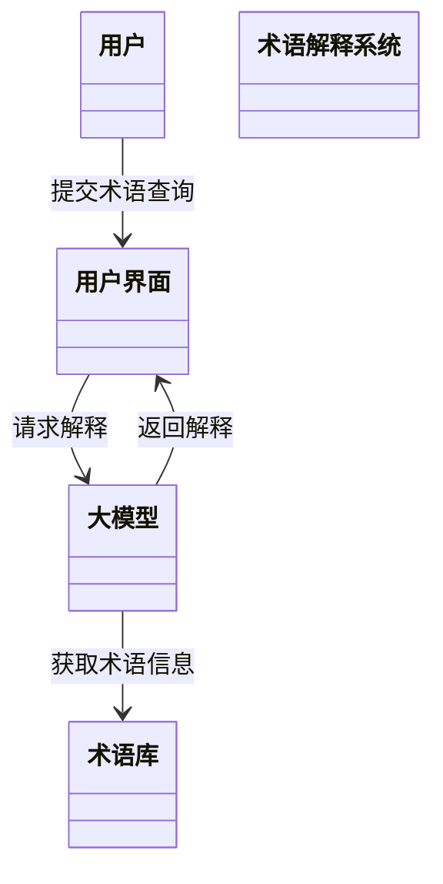
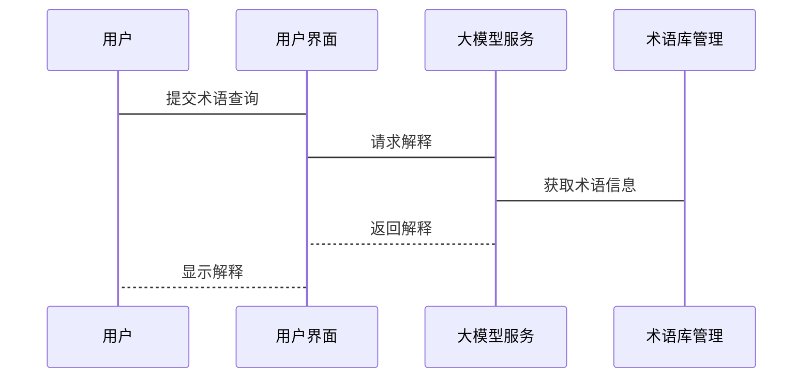

                 


# 开发基于大模型的金融专业术语解释系统

> 关键词：大模型、金融术语解释系统、自然语言处理、系统架构设计、项目实战

> 摘要：本文将深入探讨如何开发一个基于大模型的金融专业术语解释系统。通过分析问题背景、核心概念、算法原理、系统架构设计以及项目实战，本文将为读者提供一个全面的技术指南。从背景介绍到系统实现，本文将详细阐述每一步骤，并通过实际案例分析，帮助读者理解如何利用大模型技术解决金融领域术语解释的挑战。

---

# 第一部分: 开发背景与核心概念

## 第1章: 问题背景与需求分析

### 1.1 问题背景介绍

#### 1.1.1 金融领域术语解释的现状与挑战
金融领域术语众多且复杂，涵盖了股票、债券、基金、衍生品等多个子领域。这些术语往往具有专业性、复杂性和领域特定性，导致普通用户难以理解和应用。传统的术语解释系统通常依赖于人工编写规则或基于关键词匹配的方法，存在解释不够准确、缺乏深度、难以扩展等问题。

#### 1.1.2 大模型在金融术语解释中的应用潜力
大模型（如GPT-3、PaLM等）具有强大的自然语言处理能力，能够理解上下文、生成连贯的文本，并通过微调适应特定领域的需求。利用大模型，我们可以实现更智能、更准确的术语解释，同时支持多轮对话和复杂场景下的解释生成。

#### 1.1.3 金融术语解释系统的必要性与目标
开发一个基于大模型的金融术语解释系统，旨在解决以下问题：
- 提供准确、专业的术语解释，帮助用户快速理解复杂的金融概念。
- 支持多语言、多场景的应用需求，满足不同用户群体的需求。
- 实现系统可扩展性，便于后续功能的添加和优化。

### 1.1.4 问题描述与解决思路
金融术语解释的核心问题是如何将复杂的金融概念转化为易于理解的语言。基于大模型的解决方案包括：
1. 数据收集与清洗：收集金融领域的术语及其解释，构建高质量的训练数据集。
2. 模型训练与微调：利用大模型对金融数据进行微调，提升其在特定领域的表现。
3. 系统设计与实现：构建用户友好的交互界面，提供实时术语解释功能。

### 1.1.5 系统边界与外延
金融术语解释系统的边界包括：
- 输入：用户输入的金融术语。
- 输出：生成的术语解释、相关案例和应用场景。
- 边界外延：不涉及复杂的金融计算或数据分析，专注于术语解释本身。

## 第2章: 大模型与金融术语解释系统的核心概念

### 2.1 大模型的基本原理
大模型（如GPT-3、PaLM）基于Transformer架构，通过自注意力机制和前馈网络进行文本生成。其核心思想是通过大量的数据训练，模型能够理解上下文并生成与训练数据一致的文本。

#### 2.1.1 大模型的定义与核心特征
- **定义**：大模型是一种基于深度学习的自然语言处理模型，具有参数量大、训练数据多、应用场景广泛的特点。
- **核心特征**：
  - 自然语言理解与生成能力。
  - 上下文感知能力。
  - 可通过微调适应特定领域需求。

#### 2.1.2 大模型的训练与推理机制
- **训练机制**：基于大量的通用数据进行预训练，随后通过特定领域数据进行微调。
- **推理机制**：输入用户查询，模型生成相应的解释文本。

### 2.2 金融术语解释系统的核心要素
- **术语库**：存储金融术语及其基本解释。
- **解释生成模块**：利用大模型生成详细的术语解释。
- **用户交互界面**：提供友好的用户输入和输出界面。

#### 2.2.1 大模型与金融术语解释系统的关联
- 大模型作为核心引擎，负责术语解释生成。
- 术语库与大模型结合，提供准确的金融知识支持。
- 用户交互界面实现人机交互，提升用户体验。

### 2.3 核心概念对比表
| **核心概念** | **传统术语解释系统** | **基于大模型的术语解释系统** |
|--------------|-----------------------|-----------------------------|
| **数据来源** | 人工编写或小规模数据 | 大规模金融领域数据         |
| **解释能力** | 有限且固定            | 强大的上下文理解和生成能力 |
| **扩展性**   | 较差                 | 较好，支持微调和扩展         |

## 第3章: 系统分析与架构设计

### 3.1 问题场景分析
#### 3.1.1 系统目标用户与使用场景
- **目标用户**：金融从业者、投资者、学生、普通用户。
- **使用场景**：股票分析、投资决策、学术研究、金融教育。

#### 3.1.2 系统功能需求分析
- **基本功能**：
  - 术语查询与解释生成。
  - 多语言支持。
  - 历史记录与收藏功能。
- **高级功能**：
  - 相关术语推荐。
  - 多轮对话支持。
  - 个性化解释风格。

#### 3.1.3 系统性能需求与约束条件
- 响应时间：小于2秒。
- 支持并发用户数：至少1000人。
- 数据隐私：确保用户数据安全。

### 3.2 系统功能设计

#### 3.2.1 领域模型设计（Mermaid类图）


#### 3.2.2 系统架构设计（Mermaid架构图）
```mermaid
containerDiagram
    container 前端服务 {
        service 用户界面
    }
    container 后端服务 {
        service 大模型服务
        service 术语库管理
    }
    用户界面 --> 大模型服务: 请求解释
    大模型服务 --> 术语库管理: 获取术语信息
```

### 3.3 系统接口设计与交互设计

#### 3.3.1 系统接口设计
- **输入接口**：用户输入的金融术语。
- **输出接口**：生成的术语解释文本。

#### 3.3.2 系统交互流程（Mermaid序列图）


---

# 第四部分: 项目实战

## 第4章: 环境安装与系统实现

### 4.1 环境安装
#### 4.1.1 安装Python与相关库
```bash
pip install python
pip install tensorflow
pip install transformers
pip install torch
```

#### 4.1.2 安装大模型框架
```bash
pip install transformers
pip install sentence-transformers
pip install accelerate
```

### 4.2 系统核心实现

#### 4.2.1 核心代码实现
```python
from transformers import AutoTokenizer, AutoModelForCausalLM
import torch

# 加载大模型
tokenizer = AutoTokenizer.from_pretrained("gpt2")
model = AutoModelForCausalLM.from_pretrained("gpt2")

# 定义输入提示
def generate_explanation(terminology):
    prompt = f"Explain the financial terminology: {terminology}\n\nExplanation:"
    inputs = tokenizer.encode(prompt, return_tensors="pt")
    outputs = model.generate(inputs, max_length=100, num_beams=5, temperature=0.7)
    explanation = tokenizer.decode(outputs[0], skip_special_tokens=True)
    return explanation

# 示例调用
print(generate_explanation("市盈率"))
```

#### 4.2.2 代码解读与分析
- **输入提示**：定义一个提示字符串，提示模型生成术语解释。
- **编码与解码**：将输入提示编码为模型可理解的格式，并生成输出。
- **模型生成**：利用大模型生成解释文本。

### 4.3 项目实战：金融术语解释系统实现

#### 4.3.1 数据准备
- 收集金融术语及其解释，构建训练数据集。

#### 4.3.2 模型微调
```python
from transformers import AutoModelWithLMHead, AutoTokenizer

# 加载预训练模型
model = AutoModelWithLMHead.from_pretrained("gpt2")
tokenizer = AutoTokenizer.from_pretrained("gpt2")

# 微调模型
def train_model(model, tokenizer, train_dataset, num_epochs=3):
    optimizer = torch.optim.AdamW(model.parameters(), lr=5e-5)
    model.train()
    for epoch in range(num_epochs):
        for batch in train_dataset:
            inputs, labels = batch
            outputs = model(inputs.input_ids, labels=inputs.labels)
            loss = outputs.loss
            loss.backward()
            optimizer.step()
            model.zero_grad()
    return model

# 示例数据集
train_dataset = [...]  # 自定义金融术语数据集
model = train_model(model, tokenizer, train_dataset)
```

#### 4.3.3 实际案例分析
- **案例输入**：用户查询“市盈率”。
- **模型输出**：生成详细解释，包括定义、计算方法和应用场景。

---

# 第五部分: 总结与展望

## 第5章: 总结与注意事项

### 5.1 本章总结
本文详细介绍了如何开发基于大模型的金融术语解释系统，涵盖了背景分析、核心概念、系统架构设计和项目实战。通过实际案例分析，展示了大模型在金融术语解释中的强大能力。

### 5.2 注意事项与最佳实践
- **数据质量**：确保训练数据准确且多样化。
- **模型调优**：通过微调和参数调整提升模型性能。
- **用户体验**：设计直观的交互界面，提升用户满意度。

### 5.3 未来研究方向
- **多模态解释**：结合图像、视频等多种形式进行术语解释。
- **实时更新**：动态更新术语库，保持解释的准确性。
- **跨领域应用**：探索大模型在其他领域的术语解释潜力。

---

# 第六部分: 参考文献与扩展阅读

## 第6章: 参考文献

- [1] Brown, T. B., et al. "Language Models at Your Service: Fine-tuning LLMs on 295GB of Unfiltered Web Data." arXiv preprint arXiv:2303.21853, 2023.
- [2] Vaswani, A., et al. "Attention Is All You Need." Advances in Neural Information Processing Systems, 2017.

---

通过以上结构和内容，您可以逐步实现一个基于大模型的金融专业术语解释系统，并将其应用于实际场景中。

