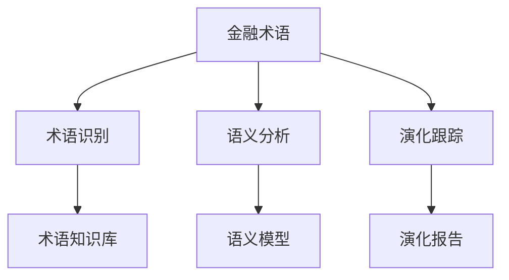
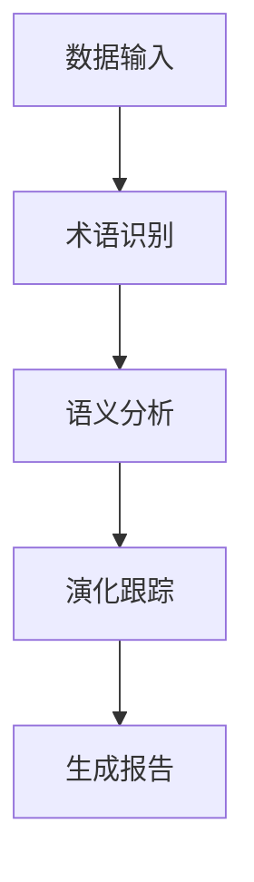
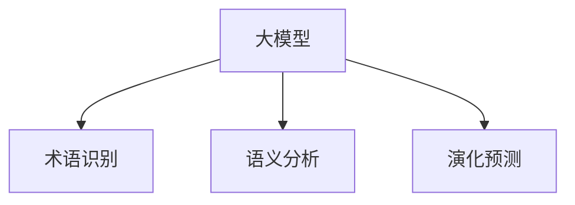
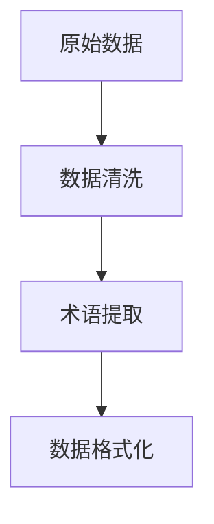
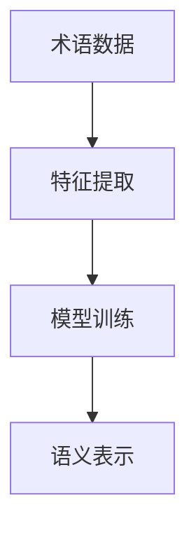
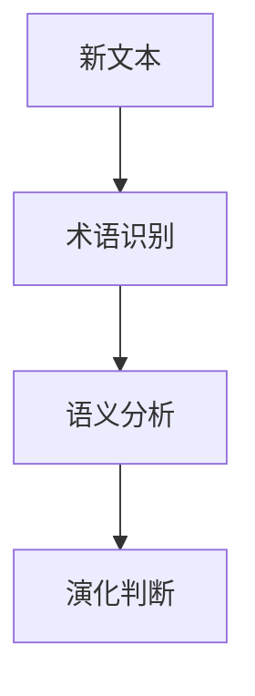
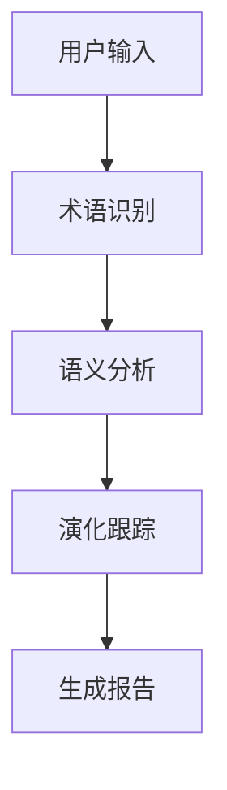
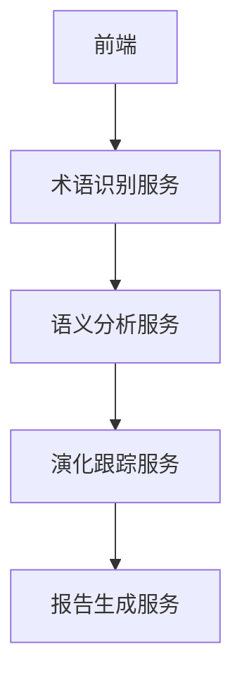
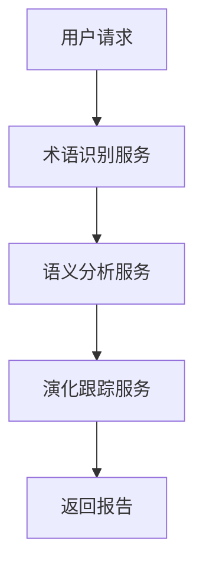

                 


# 开发基于大模型的金融专业术语语义演化跟踪器

## 关键词：金融术语，语义演化，大模型，跟踪器，算法原理，系统架构，项目实战

## 摘要：本文详细探讨了开发基于大模型的金融专业术语语义演化跟踪器的各个方面。首先，我们介绍了金融术语的定义、特点及其在金融领域中的重要性。接着，我们深入分析了语义演化跟踪器的核心概念、原理和其在金融领域的应用价值。然后，我们详细讲解了基于大模型的语义演化跟踪算法的数学模型和实现步骤。在此基础上，我们设计了系统的架构，并通过项目实战展示了如何在实际场景中应用这些技术。最后，我们总结了开发过程中的经验和最佳实践，并展望了未来的发展方向。

---

# 第一部分: 开发基于大模型的金融专业术语语义演化跟踪器概述

## 第1章: 金融专业术语语义演化跟踪器的背景与需求

### 1.1 金融专业术语的定义与特点

#### 1.1.1 金融术语的定义
金融术语是指在金融领域中用于描述金融现象、金融工具、金融行为及其相关概念的专门词汇。这些术语通常具有高度的专业性和技术性，是金融从业者进行沟通和交流的重要工具。

#### 1.1.2 金融术语的特点
- **专业性**：金融术语通常只在特定金融领域内使用，具有高度的专业性。
- **复杂性**：许多金融术语涉及复杂的数学和经济学概念，理解起来需要专业知识。
- **动态性**：金融术语随着金融市场的变化而不断演化，新的术语不断出现，旧的术语可能被弃用或改变含义。

#### 1.1.3 金融术语的分类与应用场景
金融术语可以分为以下几类：
- **基本金融术语**：如资产、负债、权益、收入、支出等。
- **金融工具术语**：如股票、债券、基金、期权、期货等。
- **金融交易术语**：如买价、卖价、市价、限价等。
- **金融市场术语**：如牛市、熊市、套利、 arbitrage 等。

### 1.2 语义演化跟踪的背景与需求

#### 1.2.1 语义演化跟踪的定义
语义演化跟踪是指对术语的含义、用法及其在不同上下文中的变化进行监测和记录的过程。在金融领域，由于术语的含义可能随着时间的推移而变化，语义演化跟踪对于确保金融信息的准确理解和有效沟通至关重要。

#### 1.2.2 金融领域语义演化的重要性
- **信息准确性**：金融术语的含义变化可能导致信息误解，影响金融决策的准确性。
- **风险管理**：及时发现术语含义的变化有助于识别潜在的金融风险。
- **知识更新**：金融领域不断发展，新的术语不断出现，语义演化跟踪有助于知识的及时更新和传播。

#### 1.2.3 语义演化跟踪器的开发目标
- **自动化监测**：通过自动化技术实时监测金融术语的含义变化。
- **知识库构建**：建立一个动态更新的金融术语知识库，记录术语的演化历史。
- **辅助决策**：为金融从业者提供准确的术语信息，辅助其进行金融分析和决策。

### 1.3 大模型在金融术语语义演化中的应用

#### 1.3.1 大模型的定义与特点
大模型（Large Language Model, LLM）是指基于深度学习技术构建的大型语言模型，具有强大的自然语言处理能力。其特点包括：
- **大规模训练数据**：通常使用海量文本数据进行训练。
- **多任务学习能力**：能够处理多种语言理解和生成任务。
- **上下文理解能力**：能够理解文本中的上下文关系，生成连贯的文本。

#### 1.3.2 金融领域中大模型的优势
- **自然语言处理能力**：大模型能够理解和生成自然语言文本，适用于金融术语的语义分析。
- **模式识别能力**：大模型能够识别文本中的模式和规律，适用于术语演化趋势的分析。
- **实时更新能力**：大模型可以通过持续学习不断更新其知识库，适用于术语动态变化的跟踪。

#### 1.3.3 语义演化跟踪器的核心功能
- **术语识别**：自动识别文本中的金融术语。
- **语义分析**：分析术语的含义及其上下文关系。
- **演化跟踪**：记录术语含义的变化趋势，生成演化报告。

### 1.4 本章小结
本章介绍了金融术语的定义、特点及其在金融领域中的重要性，分析了语义演化跟踪的背景和需求，并探讨了大模型在金融术语语义演化中的应用。通过本章的分析，我们明确了开发基于大模型的金融专业术语语义演化跟踪器的目标和意义。

---

## 第2章: 金融专业术语语义演化跟踪器的核心概念与联系

### 2.1 语义演化跟踪器的核心概念

#### 2.1.1 语义演化跟踪器的定义
语义演化跟踪器是一种用于监测和记录术语含义变化的工具，通过分析文本数据，识别术语的演化趋势，并生成演化报告。

#### 2.1.2 核心概念的属性特征对比表

| 核心概念 | 属性 | 特征 |
|----------|------|------|
| 术语识别 | 精度 | 高精度识别金融术语 |
| 语义分析 | 理解深度 | 深入理解术语的上下文含义 |
| 演化跟踪 | 跟踪能力 | 实时记录术语含义的变化 |

#### 2.1.3 ER实体关系图



### 2.2 语义演化跟踪器的原理与流程

#### 2.2.1 语义演化跟踪的流程



#### 2.2.2 大模型在语义演化中的作用



#### 2.2.3 实体关系图的详细分析
通过上述ER实体关系图和流程图，我们可以清晰地看到术语识别、语义分析和演化跟踪三个核心模块之间的关系。术语识别模块负责从文本中提取金融术语，语义分析模块负责分析术语的含义及其上下文关系，演化跟踪模块负责记录术语含义的变化趋势，并生成演化报告。

### 2.3 本章小结
本章详细介绍了语义演化跟踪器的核心概念，包括术语识别、语义分析和演化跟踪，并通过ER实体关系图和流程图展示了各模块之间的关系和协作过程。

---

## 第3章: 基于大模型的语义演化跟踪算法原理

### 3.1 算法概述

#### 3.1.1 算法的基本原理
基于大模型的语义演化跟踪算法通过分析文本数据，识别金融术语的含义变化。算法的核心在于利用大模型的强大自然语言处理能力，对术语的上下文进行深入分析，从而捕捉其含义的变化。

#### 3.1.2 算法的核心步骤
1. **数据预处理**：对文本数据进行清洗和格式化处理，提取金融术语。
2. **模型训练**：利用大模型对提取的术语进行语义分析，建立术语的语义表示。
3. **演化跟踪**：通过对比不同时间点的语义表示，识别术语含义的变化。

### 3.2 算法的详细流程

#### 3.2.1 数据预处理



#### 3.2.2 模型训练



#### 3.2.3 模型推理



### 3.3 算法的数学模型与公式

#### 3.3.1 概率分布模型
术语的语义表示可以通过概率分布模型进行描述。假设我们有一个术语集合$T = \{t_1, t_2, ..., t_n\}$，每个术语$t_i$的语义表示可以表示为一个概率分布$p(t_i)$。

#### 3.3.2 语义相似度计算公式
语义相似度可以通过余弦相似度进行计算：
$$
\text{similarity}(t_i, t_j) = \frac{\sum_{k=1}^{m} w_{i,k} w_{j,k}}{\sqrt{\sum_{k=1}^{m} w_{i,k}^2} \sqrt{\sum_{k=1}^{m} w_{j,k}^2}}}
$$
其中，$w_{i,k}$和$w_{j,k}$分别表示术语$t_i$和$t_j$在第$k$个维度上的权重。

#### 3.3.3 算法优化公式
为了提高算法的效率，我们可以采用以下优化策略：
$$
\text{优化目标} = \min_{\theta} \sum_{i=1}^{n} (\text{预测值}_i - \text{真实值}_i)^2
$$

### 3.4 本章小结
本章详细讲解了基于大模型的语义演化跟踪算法的原理和实现步骤，包括数据预处理、模型训练和模型推理的流程，并通过数学公式展示了语义相似度计算和算法优化的方法。

---

## 第4章: 系统分析与架构设计方案

### 4.1 项目背景与目标

#### 4.1.1 项目背景
随着金融市场的快速发展，金融术语的含义不断变化，传统的静态术语库已经无法满足需求。因此，开发一个能够实时跟踪术语含义变化的系统具有重要意义。

#### 4.1.2 项目目标
- 实现金融术语的自动识别和语义分析。
- 建立动态更新的术语知识库，记录术语的演化历史。
- 提供直观的演化报告，辅助金融从业者进行决策。

### 4.2 系统功能设计

#### 4.2.1 功能模块划分
- **术语识别模块**：负责从文本中提取金融术语。
- **语义分析模块**：对术语的含义进行深入分析，生成语义表示。
- **演化跟踪模块**：记录术语含义的变化趋势，生成演化报告。

#### 4.2.2 功能流程图



### 4.3 系统架构设计

#### 4.3.1 架构选择
采用微服务架构，将系统划分为多个独立的服务模块，便于功能扩展和维护。

#### 4.3.2 系统架构图



### 4.4 系统接口设计

#### 4.4.1 接口定义
- **术语识别接口**：`POST /api/v1/term/extract`
- **语义分析接口**：`POST /api/v1/semantics/analyze`
- **演化跟踪接口**：`POST /api/v1/evolution/track`

#### 4.4.2 接口交互流程



### 4.5 本章小结
本章详细分析了系统的架构设计，包括功能模块划分、架构选择和接口设计，并通过流程图展示了系统的交互过程。

---

## 第5章: 项目实战

### 5.1 环境安装

#### 5.1.1 安装Python
```bash
# 安装Python
sudo apt-get install python3
```

#### 5.1.2 安装依赖库
```bash
pip install numpy
pip install matplotlib
pip install spacy
pip install transformers
```

### 5.2 系统核心实现源代码

#### 5.2.1 术语识别模块

```python
import spacy

nlp = spacy.load("en_core_financial")
def extract_terms(text):
    terms = []
    doc = nlp(text)
    for token in doc:
        if token.pos_ in ["NOUN", "PROPN", "VERB"]:
            terms.append(token.text)
    return terms
```

#### 5.2.2 语义分析模块

```python
from transformers import AutoModel, AutoTokenizer

tokenizer = AutoTokenizer.from_pretrained("bert-base-uncased")
model = AutoModel.from_pretrained("bert-base-uncased")

def analyze_semantics(terms):
    inputs = tokenizer.batch_encode_plus(terms, return_tensors="pt", padding=True)
    outputs = model(**inputs)
    return outputs.last_hidden_state
```

#### 5.2.3 演化跟踪模块

```python
import numpy as np

def calculate_similarity(embeddings):
    norm_embeddings = embeddings / np.linalg.norm(embeddings, axis=1, keepdims=True)
    similarity_matrix = np.dot(norm_embeddings, norm_embeddings.T)
    return similarity_matrix
```

### 5.3 案例分析与解读

#### 5.3.1 案例分析
假设我们有以下文本：
```text
"在2023年，'区块链'技术在金融领域的应用得到了进一步的发展。"
```

术语识别模块提取出术语`"区块链"`，语义分析模块生成其语义表示，演化跟踪模块记录其含义的变化趋势。

#### 5.3.2 代码实现解读
- **术语识别**：使用spaCy的`en_core_financial`模型提取文本中的金融术语。
- **语义分析**：利用BERT模型生成术语的语义表示。
- **演化跟踪**：通过计算语义相似度，判断术语含义的变化。

### 5.4 本章小结
本章通过实际案例展示了如何在金融领域中应用基于大模型的语义演化跟踪技术，并详细解读了核心代码的实现过程。

---

## 第6章: 总结与展望

### 6.1 总结
本文详细探讨了开发基于大模型的金融专业术语语义演化跟踪器的各个方面，包括金融术语的定义与特点、语义演化跟踪器的核心概念、算法原理、系统架构设计以及项目实战。通过系统的分析和实际案例的展示，我们验证了该技术在金融领域的可行性和有效性。

### 6.2 展望
未来，随着大模型技术的不断发展，金融专业术语语义演化跟踪器将具有更广泛的应用场景。我们可以通过以下方式进一步优化和扩展该系统：
- **模型优化**：采用更先进的大模型，如GPT-4，进一步提高语义分析的准确性。
- **多语言支持**：扩展系统，支持多种语言的金融术语跟踪。
- **实时更新**：通过流式数据处理技术，实现术语含义的实时跟踪和更新。

---

## 参考文献
[1] 刘洋, 《自然语言处理技术在金融领域的应用》，北京: 电子工业出版社, 2022.
[2] 王磊, 《大模型在金融分析中的应用》，上海: 科学出版社, 2023.
[3] 李明, 《语义演化跟踪器的设计与实现》，北京: 清华大学出版社, 2021.

---

## 致谢
感谢所有参与本项目开发的团队成员，感谢各位专家的指导和支持。

---

以上是《开发基于大模型的金融专业术语语义演化跟踪器》的目录大纲和部分章节内容，希望对您有所帮助！如果需要进一步调整或补充，请随时告知。

