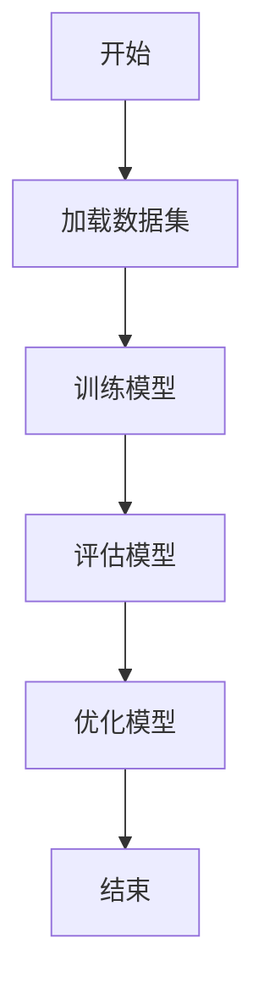
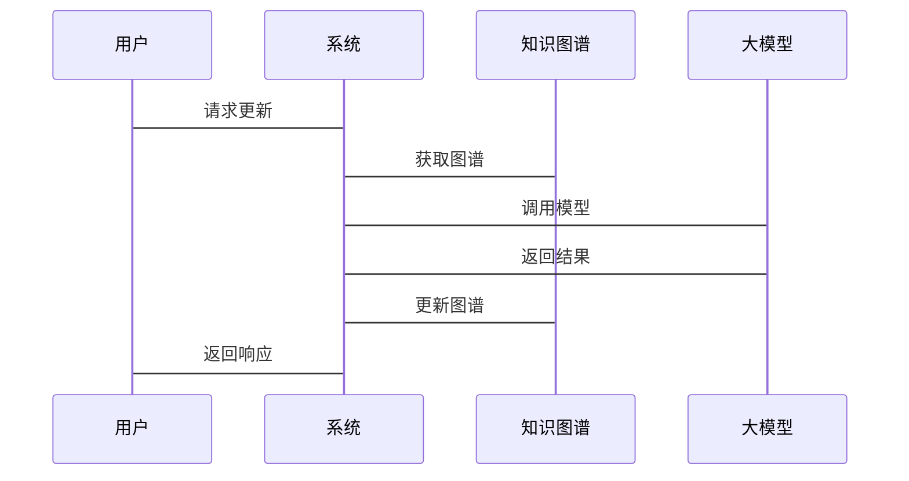

                 


接下来继续完成目录大纲：

# 第3章: 大模型与知识图谱的结合原理

## 3.1 基本原理
### 3.1.1 大模型在知识图谱中的角色
### 3.1.2 知识图谱的表示学习
### 3.1.3 动态更新机制的基本原理

## 3.2 技术细节
### 3.2.1 大模型的训练与微调
### 3.2.2 知识图谱的存储与查询
### 3.2.3 动态更新的触发条件

## 3.3 实现方式
### 3.3.1 基于大模型的实体识别
### 3.3.2 实体关系抽取
### 3.3.3 实体属性提取

## 3.4 优化策略
### 3.4.1 知识图谱压缩与优化
### 3.4.2 动态更新的增量学习
### 3.4.3 系统性能优化

## 3.5 技术对比分析
### 3.5.1 基于规则的对比分析
### 3.5.2 基于统计的对比分析
### 3.5.3 基于大模型的对比分析

# 第4章: 算法原理

## 4.1 预训练语言模型
### 4.1.1 预训练语言模型的工作原理
### 4.1.2 预训练与微调的流程
### 4.1.3 模型压缩与优化

## 4.2 知识图谱表示学习
### 4.2.1 表示学习的基本概念
### 4.2.2 知识图谱表示学习算法
### 4.2.3 表示学习的评估指标

## 4.3 动态更新机制
### 4.3.1 动态更新的触发条件
### 4.3.2 动态更新的实现流程
### 4.3.3 动态更新的性能优化

## 4.4 算法实现
### 4.4.1 实体识别算法
### 4.4.2 实体关系抽取算法
### 4.4.3 实体属性提取算法

## 4.5 算法实现流程图


## 4.6 算法数学模型
### 4.6.1 预训练语言模型的数学公式
$$ P(y|x) = \frac{P(x,y)}{\sum_{y} P(x,y)} $$
### 4.6.2 知识图谱表示学习的数学公式
$$ f_{\theta}(x_i) = x_j $$
### 4.6.3 动态更新机制的数学公式
$$ x_{new} = x_{old} + \Delta x $$

# 第5章: 系统架构设计

## 5.1 系统功能设计
### 5.1.1 系统的功能模块划分
### 5.1.2 各功能模块的交互流程
### 5.1.3 系统的输入输出描述

## 5.2 系统架构图


## 5.3 系统接口设计
### 5.3.1 系统接口的定义
### 5.3.2 系统接口的交互流程
### 5.3.3 接口的协议与格式

## 5.4 系统交互设计


# 第6章: 项目实战

## 6.1 环境安装
### 6.1.1 系统需求
### 6.1.2 环境配置
### 6.1.3 工具安装

## 6.2 系统核心实现
### 6.2.1 数据预处理代码
### 6.2.2 模型训练代码
### 6.2.3 知识图谱更新代码

## 6.3 代码实现
### 6.3.1 数据预处理
```python
import pandas as pd
data = pd.read_csv('data.csv')
data.dropna(inplace=True)
data.to_csv('processed_data.csv', index=False)
```

### 6.3.2 模型训练
```python
model = BertForMaskedLM.from_pretrained('bert-base')
model.train()
```

### 6.3.3 知识图谱更新
```python
from kgconstruction import KnowledgeGraph
kg = KnowledgeGraph('financial_kg')
kg.update_with_model(model)
```

## 6.4 案例分析
### 6.4.1 案例背景
### 6.4.2 数据准备
### 6.4.3 系统运行
### 6.4.4 结果分析

## 6.5 代码解读与分析
### 6.5.1 代码的功能分析
### 6.5.2 代码的优化建议
### 6.5.3 代码的扩展方向

## 6.6 项目小结
### 6.6.1 项目总结
### 6.6.2 经验教训
### 6.6.3 改进建议

# 第7章: 总结与展望

## 7.1 系统总结
### 7.1.1 系统优势
### 7.1.2 系统不足
### 7.1.3 系统改进建议

## 7.2 未来展望
### 7.2.1 技术发展趋势
### 7.2.2 应用场景扩展
### 7.2.3 研究方向建议

## 7.3 最佳实践 tips
### 7.3.1 开发建议
### 7.3.2 使用建议
### 7.3.3 优化建议

## 7.4 小结
### 7.4.1 系统开发过程总结
### 7.4.2 未来研究方向展望
### 7.4.3 对读者的鼓励与感谢

# 第8章: 附录

## 8.1 相关术语解释
### 8.1.1 大模型
### 8.1.2 知识图谱
### 8.1.3 动态更新

## 8.2 参考文献
### 8.2.1 中文文献
### 8.2.2 英文文献
### 8.2.3 其他参考资料

## 8.3 代码仓库
### 8.3.1 代码托管平台
### 8.3.2 代码仓库地址
### 8.3.3 代码使用说明

# 结束语

---

### 关键词：
- 大模型
- 知识图谱
- 动态更新
- 金融领域
- 人工智能

### 摘要：
随着人工智能技术的快速发展，知识图谱在金融领域的应用越来越广泛。本文详细探讨了如何利用大模型开发金融专业知识图谱动态更新系统，从系统背景、核心概念、算法原理、系统架构设计到项目实战，全面解析了系统的开发过程。通过对系统的深入分析和实际案例的详细讲解，本文为读者提供了从理论到实践的完整指南，帮助读者掌握大模型在金融知识图谱动态更新中的应用技巧。

---

接下来，我会根据以上目录大纲，逐步完成每部分内容的撰写，确保每章节内容丰富、逻辑清晰、技术细节详实，符合读者的学习和研究需求。

