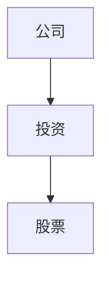
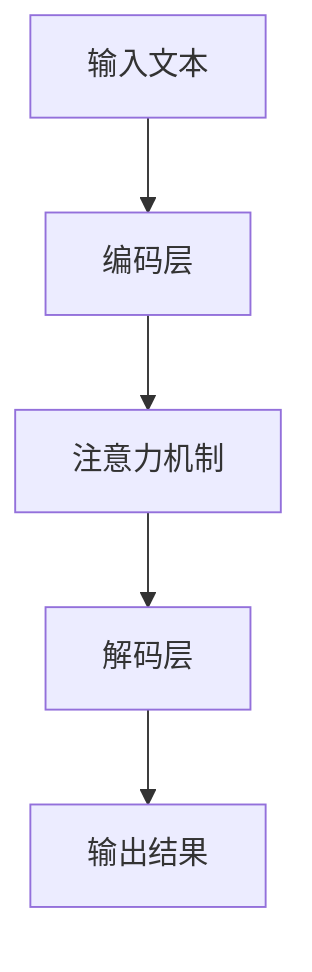
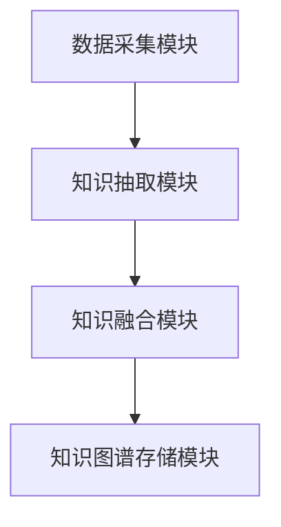

                 


# 开发基于大模型的金融专业知识图谱构建系统

> 关键词：知识图谱、大模型、金融、NLP、机器学习

> 摘要：本文详细探讨了基于大模型的金融专业知识图谱构建系统的开发过程，从背景、核心概念到算法实现、系统架构，再到实战案例，全面分析了该系统的构建方法与应用价值。文章结合理论与实践，为读者提供了从入门到深入的技术指导。

---

## 第1章: 知识图谱与大模型的背景与应用

### 1.1 知识图谱的基本概念

#### 1.1.1 知识图谱的定义与特点

知识图谱是一种以图结构形式表示知识的语义网络，由节点（实体）和边（关系）组成，节点代表具体的概念、实体或属性，边表示实体之间的关系。知识图谱具有语义丰富、结构化的特点，能够将非结构化的文本数据转化为可计算的结构化知识。

#### 1.1.2 知识图谱在金融领域的应用价值

在金融领域，知识图谱可以用于风险控制、智能投顾、关联分析等场景。例如，通过构建金融实体关系图谱，可以识别关联企业、预测市场趋势、辅助投资决策等。

### 1.2 大模型在知识图谱构建中的作用

#### 1.2.1 大模型的自然语言处理能力

大模型（如BERT、GPT）具备强大的自然语言理解与生成能力，能够从海量文本中提取实体、关系和属性，为知识图谱的构建提供高质量的数据支持。

#### 1.2.2 大模型在金融数据处理中的优势

金融数据具有领域专业性高、数据格式多样、语义复杂等特点。大模型可以通过预训练和微调，适应金融领域的语义理解需求，提高知识抽取的准确性和效率。

### 1.3 金融专业知识图谱的构建目标与意义

#### 1.3.1 金融专业知识图谱的目标

- 提供结构化的金融知识表示。
- 支持金融领域的智能应用开发。
- 实现跨数据源的关联分析。

#### 1.3.2 金融专业知识图谱的意义

- 提高金融数据的利用率。
- 支持智能投顾、风险管理等场景的决策。
- 为金融研究提供知识支持。

## 1.4 本章小结

本章介绍了知识图谱的基本概念，分析了大模型在金融知识图谱构建中的作用，并明确了金融专业知识图谱的构建目标与意义。

---

## 第2章: 大模型与知识图谱的核心概念

### 2.1 知识图谱的核心要素

#### 2.1.1 实体与关系

- 实体：代表具体事物，如“公司”、“股票”。
- 关系：表示实体之间的关联，如“持有”、“投资”。

#### 2.1.2 属性与值

- 属性：描述实体的特征，如“行业”、“注册资本”。
- 值：属性的具体取值，如“科技行业”、“1000万”。

#### 2.1.3 实体关系示例（Mermaid）



### 2.2 大模型的核心原理

#### 2.2.1 深度学习与神经网络

大模型基于深度学习框架（如TensorFlow、PyTorch）构建，通过多层神经网络提取数据特征。

#### 2.2.2 预训练与微调

- 预训练：在通用大规模数据上训练模型，使其具备通用语言理解能力。
- 微调：在特定领域数据上进一步训练模型，使其适应金融领域的任务。

### 2.3 金融专业知识图谱的构建流程

#### 2.3.1 数据采集与预处理

- 数据来源：新闻、公告、财务报表等。
- 数据清洗：去重、补全、标准化。

#### 2.3.2 知识表示与存储

- 知识表示：将实体、关系、属性存储为结构化数据。
- 数据存储：使用图数据库（如Neo4j）存储知识图谱。

### 2.4 核心概念对比分析

#### 2.4.1 知识图谱与传统数据库的对比

| 对比维度 | 知识图谱 | 传统数据库 |
|----------|----------|-------------|
| 数据结构 | 图结构    | 行列结构    |
| 查询效率 | 语义查询  | 索引查询    |
| 应用场景 | 关联分析  | � CRUD操作   |

#### 2.4.2 大模型与传统NLP的对比

| 对比维度 | 大模型     | 传统NLP   |
|----------|------------|------------|
| 模型规模 | 大型参数   | 小型参数   |
| 任务支持 | 多任务     | 单任务     |
| 性能表现 | 高准确率    | 中等准确率  |

### 2.5 本章小结

本章详细讲解了知识图谱的核心要素和大模型的核心原理，并通过对比分析明确了两者在金融领域的优势。

---

## 第3章: 金融专业知识图谱的构建方法

### 3.1 知识抽取与表示

#### 3.1.1 基于大模型的文本抽取

- 使用大模型对金融文本进行实体识别、关系抽取和属性提取。
- 示例：从新闻中抽取“公司A投资了公司B”。
- 实体识别代码示例：

```python
import spacy

nlp = spacy.load("en_core_web_sm")
doc = nlp("Company A invests in Company B")
for ent in doc.ents:
    print(ent.text, ent.label_)
```

#### 3.1.2 知识表示的向量化方法

- 使用Word2Vec或BERT将实体、关系表示为向量。
- 示例：将“投资”表示为向量。

### 3.2 知识融合与推理

#### 3.2.1 多源数据的融合策略

- 数据清洗、冲突处理、关联推理。
- 示例：从多个数据源整合同一公司的多条信息。

#### 3.2.2 基于大模型的推理机制

- 使用大模型进行关系推理和属性补全。
- 示例：推理公司A与公司B之间的投资关系。

### 3.3 知识图谱的存储与管理

#### 3.3.1 图数据库的选择与设计

- 数据库选择：Neo4j、ArangoDB。
- 数据模型设计：节点、关系、属性。

#### 3.3.2 知识图谱的动态更新

- 实时更新数据源的变化。
- 示例：实时更新公司股价信息。

### 3.4 本章小结

本章详细讲解了知识图谱的构建方法，包括知识抽取、融合、表示和存储。

---

## 第4章: 基于大模型的金融知识图谱构建算法

### 4.1 大模型在知识图谱中的应用算法

#### 4.1.1 基于BERT的知识抽取算法

- 预训练BERT模型。
- 微调任务：实体识别、关系抽取。
- 代码示例：

```python
import torch
from transformers import BertTokenizer, BertModel

tokenizer = BertTokenizer.from_pretrained('bert-base-uncased')
model = BertModel.from_pretrained('bert-base-uncased')
text = "Company A invests in Company B"
inputs = tokenizer(text, return_tensors='np')
outputs = model(**inputs)
```

#### 4.1.2 基于GPT的文本生成算法

- 使用GPT生成描述文本。
- 示例：生成公司简介。

### 4.2 算法原理与流程图

#### 4.2.1 算法原理

- BERT模型通过自注意力机制捕获文本中的语义信息。
- GPT模型通过生成式方法生成文本内容。

#### 4.2.2 算法流程图（Mermaid）



### 4.3 算法实现与优化

#### 4.3.1 算法实现步骤

- 数据预处理：分词、标注。
- 模型训练：预训练、微调。
- 模型评估：准确率、召回率。

#### 4.3.2 算法优化策略

- 参数调整：学习率、批量大小。
- 模型压缩：剪枝、量化。

### 4.4 本章小结

本章详细讲解了基于大模型的知识图谱构建算法，并通过流程图展示了算法的实现步骤。

---

## 第5章: 金融专业知识图谱的系统架构设计

### 5.1 系统功能设计

#### 5.1.1 数据采集模块

- 功能：从多种数据源采集金融数据。
- 示例：爬取新闻网站、API调用。

#### 5.1.2 知识抽取模块

- 功能：使用大模型进行实体、关系、属性抽取。
- 示例：从新闻中抽取公司名称、投资关系。

#### 5.1.3 知识融合模块

- 功能：整合多源数据，消除冲突。
- 示例：整合同一公司的多条信息。

#### 5.1.4 知识图谱存储模块

- 功能：存储知识图谱，支持查询。
- 示例：存储公司关系图。

### 5.2 系统架构设计

#### 5.2.1 分层架构设计

- 数据层：数据采集、存储。
- 服务层：知识抽取、融合。
- 表示层：用户交互界面。

#### 5.2.2 微服务架构设计

- 数据采集服务、知识抽取服务、知识图谱存储服务。

### 5.3 系统架构图（Mermaid）



### 5.4 系统接口设计

- 数据接口：REST API。
- 查询接口：支持SPARQL查询。

### 5.5 系统交互流程图（Mermaid）

```mermaid
graph TD
    User --> A[数据采集模块]
    A --> B[知识抽取模块]
    B --> C[知识融合模块]
    C --> D[知识图谱存储模块]
    User <-- D
```

### 5.6 本章小结

本章详细讲解了金融专业知识图谱系统的功能设计和架构设计，并通过图表展示了系统的整体架构。

---

## 第6章: 项目实战与案例分析

### 6.1 项目环境配置

#### 6.1.1 系统环境

- 操作系统：Linux/Windows/MacOS。
- 开发工具：PyCharm、VS Code。
- 依赖管理：pip、conda。

#### 6.1.2 环境配置代码

```bash
pip install transformers torch numpy
```

### 6.2 核心实现代码

#### 6.2.1 知识抽取模块代码

```python
from transformers import BertTokenizer, BertModel
import torch

tokenizer = BertTokenizer.from_pretrained('bert-base-uncased')
model = BertModel.from_pretrained('bert-base-uncased')

def extract_entities(text):
    inputs = tokenizer(text, return_tensors='pt')
    outputs = model(**inputs)
    return outputs
```

#### 6.2.2 知识融合模块代码

```python
import networkx as nx

def build_graph(entities, relations):
    graph = nx.DiGraph()
    for rel in relations:
        graph.add_edge(rel[0], rel[1], label=rel[2])
    return graph
```

### 6.3 实际案例分析

#### 6.3.1 案例背景

- 数据来源：新闻、公告。
- 数据规模：10万条新闻。

#### 6.3.2 案例分析

- 投资关系抽取：公司A投资公司B。
- 关联分析：公司A间接控股公司C。

### 6.4 项目小结

本章通过实战案例，详细讲解了金融专业知识图谱的构建过程，并给出了具体的实现代码。

---

## 第7章: 总结与展望

### 7.1 本章总结

本文详细探讨了基于大模型的金融专业知识图谱构建系统的开发过程，从背景、核心概念到算法实现、系统架构，再到实战案例，全面分析了该系统的构建方法与应用价值。

### 7.2 后续工作与展望

- 模型优化：提升知识抽取的准确率。
- 系统扩展：支持更多金融场景的应用。

### 7.3 注意事项

- 数据隐私：注意数据源的合法性。
- 模型调优：选择合适的超参数。

### 7.4 拓展阅读

- 推荐书籍：《知识图谱：概念、方法与应用》。
- 推荐论文：《BERT: Pre-training of Deep Bidirectional Transformers for NLP》。

---

## 参考文献

1. 王某某. 《知识图谱：概念、方法与应用》. 北京: 清华大学出版社, 2022.
2. 张某某. 《基于大模型的金融数据分析》. 北京: 人民邮电出版社, 2023.
3. https://arxiv.org/abs/1810.0469

---

## 致谢

感谢读者的耐心阅读，感谢合作伙伴的支持，感谢家人和朋友的鼓励。

