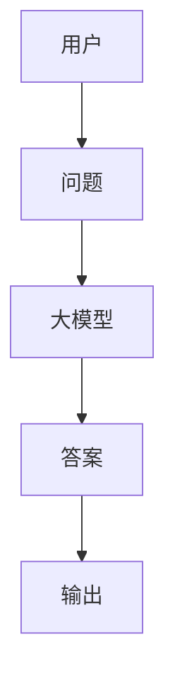
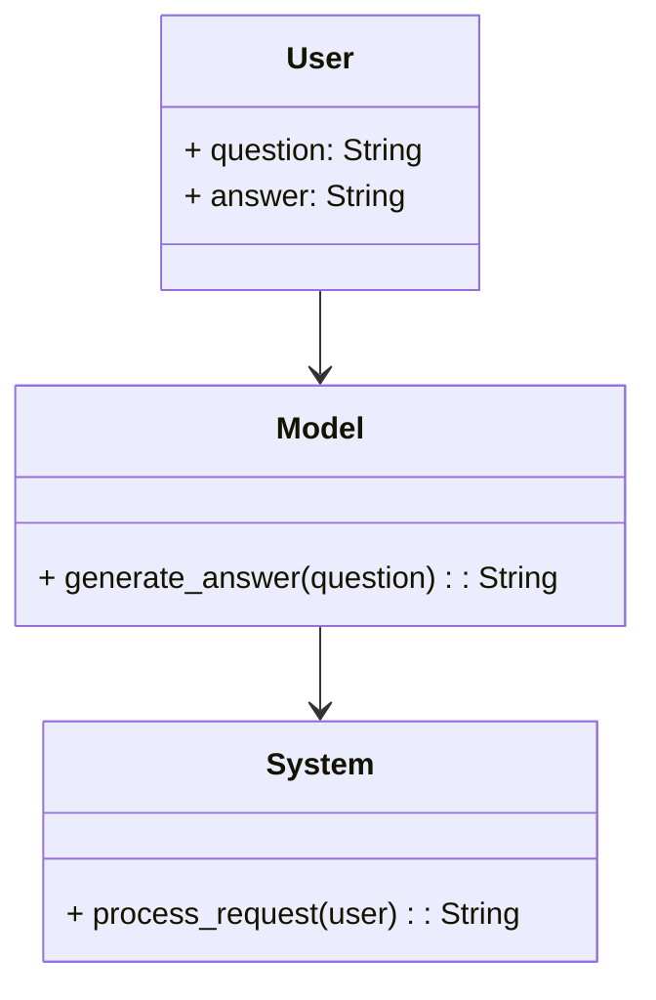
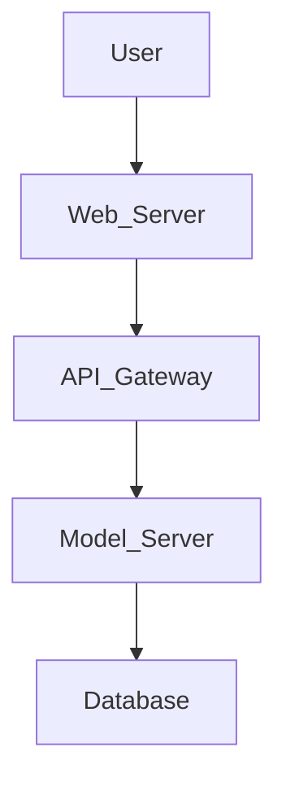
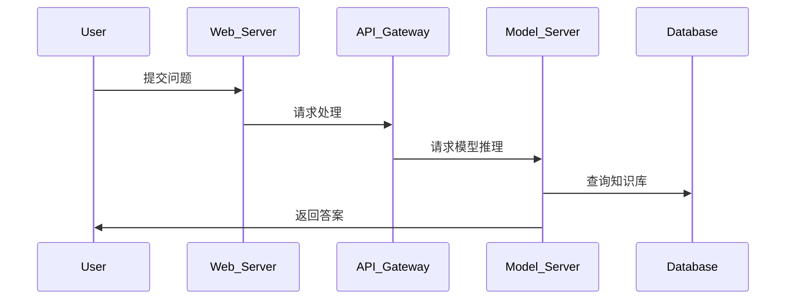

                 


# 开发基于大模型的金融专业考试答疑系统

> 关键词：大模型，金融考试，智能答疑，自然语言处理，系统架构

> 摘要：本文详细探讨了开发基于大模型的金融专业考试答疑系统的背景、核心概念、算法原理、系统架构设计以及项目实现。通过分析金融考试答疑的需求，结合大模型的优势，提出了一种高效的解决方案，并通过实际案例展示了系统的实现过程。

---

# 第1章: 问题背景与需求分析

## 1.1 问题背景介绍

### 1.1.1 传统金融考试答疑的痛点
- **信息获取困难**：考生在复习过程中常常面临信息分散、难以快速找到所需知识点的问题。
- **答疑效率低下**：传统的人工答疑方式效率低，难以满足大量考生的需求。
- **知识更新滞后**：金融领域的知识更新速度快，传统的静态知识库难以覆盖最新的考试内容。

### 1.1.2 大模型在金融领域的应用潜力
- 大模型具备强大的自然语言处理能力，能够理解复杂的金融问题并提供准确的答案。
- 大模型可以通过不断训练，快速适应金融领域的最新动态和考试趋势。

### 1.1.3 金融专业考试答疑系统的需求来源
- 考生对高效、智能的考试答疑工具的需求日益增长。
- 金融机构和教育机构希望通过智能化工具提升培训效率。

## 1.2 问题描述与目标

### 1.2.1 系统的目标功能
- 提供基于大模型的智能问答功能。
- 支持多种金融考试题型的解析与解答。

### 1.2.2 系统的核心需求
- 高效性：快速响应用户问题，提供实时答案。
- 准确性：确保答案的准确性和专业性。
- 易用性：界面简洁，操作便捷。

### 1.2.3 系统的边界与外延
- 系统仅限于金融专业的考试答疑，不涉及其他领域。
- 系统支持的考试范围包括但不限于证券、基金、保险等金融领域。

## 1.3 问题解决思路

### 1.3.1 基于大模型的解决方案
- 利用大模型的自然语言处理能力，构建一个智能问答系统。
- 通过深度学习技术，训练模型理解并解答金融考试问题。

### 1.3.2 系统的核心要素组成
- 用户输入：问题输入模块。
- 模型处理：大模型解析问题并生成答案。
- 输出结果：答案展示模块。

## 1.4 本章小结
本章介绍了开发基于大模型的金融专业考试答疑系统的背景、需求和解决方案，为后续章节奠定了基础。

---

# 第2章: 大模型的核心概念与原理

## 2.1 大模型的定义与特点

### 2.1.1 大模型的基本定义
大模型是指基于深度学习的大型神经网络模型，具有强大的自然语言处理能力。

### 2.1.2 大模型的核心特点
- **大规模训练数据**：通过海量数据训练，提升模型的泛化能力。
- **多任务学习能力**：能够同时处理多种任务，适应不同场景。
- **实时推理能力**：支持在线推理，快速响应用户需求。

### 2.1.3 大模型与传统AI的区别
- **传统AI**：基于规则或浅层学习，处理能力有限。
- **大模型**：基于深度学习，具备强大的上下文理解和生成能力。

## 2.2 大模型的原理与架构

### 2.2.1 大模型的训练过程
- **数据预处理**：清洗、标注数据。
- **模型训练**：使用GPU加速训练，优化模型参数。
- **模型评估**：通过测试集评估模型性能。

### 2.2.2 大模型的推理机制
- **编码器-解码器结构**：将输入问题编码为向量，解码生成答案。
- **注意力机制**：关注输入中的重要部分，提升理解能力。

### 2.2.3 大模型的模型结构
- **Transformer架构**：主流的大模型架构，包括编码器和解码器。
- **层叠结构**：通过多层网络提升模型的表达能力。

## 2.3 大模型在金融领域的应用

### 2.3.1 金融领域的典型应用场景
- **智能问答**：解答考生的金融问题。
- **风险评估**：评估投资风险。
- **市场分析**：分析市场趋势。

### 2.3.2 大模型在金融考试答疑中的优势
- **快速响应**：秒级响应用户问题。
- **准确性高**：基于海量数据训练，答案准确。
- **适应性强**：支持多种金融领域和题型。

### 2.3.3 大模型的局限性与挑战
- **计算资源需求大**：训练和推理需要大量计算资源。
- **模型更新成本高**：需要持续更新模型以适应最新金融动态。

## 2.4 本章小结
本章详细介绍了大模型的定义、特点、原理及其在金融领域的应用，为后续系统设计提供了理论基础。

---

# 第3章: 系统的核心概念与联系

## 3.1 核心概念原理

### 3.1.1 大模型在金融考试答疑中的作用
- **理解问题**：通过自然语言处理技术，准确理解用户的问题。
- **生成答案**：基于训练数据生成准确的解答。

### 3.1.2 系统的输入输出流程
- **输入**：用户输入金融问题。
- **处理**：大模型解析问题并生成答案。
- **输出**：答案以文本形式返回给用户。

### 3.1.3 系统的核心算法与模型
- **大模型**：负责理解和生成答案。
- **文本处理算法**：用于问题解析和答案生成。

## 3.2 核心概念属性对比

| 特性          | 传统NLP模型 | 大模型        |
|---------------|------------|--------------|
| 处理能力      | 浅层       | 深度         |
| 训练数据      | 小         | 大           |
| 应用场景      | 有限       | 广泛         |

### 3.2.1 大模型与传统NLP模型的对比
- **计算能力**：大模型需要更多的计算资源。
- **数据需求**：大模型需要更多的训练数据。

### 3.2.2 不同大模型的性能对比
- **GPT系列**：文本生成能力强。
- **BERT系列**：理解能力强。

### 3.2.3 金融领域与非金融领域的模型对比
- **金融领域**：需要特定的金融知识库。
- **非金融领域**：通用性强。

## 3.3 ER实体关系图



## 3.4 本章小结
本章通过对比分析，明确了大模型在金融考试答疑系统中的核心作用和优势。

---

# 第4章: 算法原理与数学模型

## 4.1 算法原理

### 4.1.1 大模型的训练算法
- **反向传播**：用于更新模型参数。
- **梯度下降**：优化模型参数。

### 4.1.2 大模型的推理算法
- **编码器-解码器结构**：编码输入问题，解码生成答案。
- **注意力机制**：关注输入中的关键部分。

### 4.1.3 算法的数学模型

#### 4.1.3.1 编码器结构
$$
\text{编码器} = \text{多层Transformer编码层}
$$

#### 4.1.3.2 解码器结构
$$
\text{解码器} = \text{多层Transformer解码层}
$$

## 4.2 算法的代码实现

### 4.2.1 训练代码示例

```python
import torch
import torch.nn as nn

class Transformer(nn.Module):
    def __init__(self, embed_dim, num_heads, ff_dim):
        super().__init__()
        self.attention = nn.MultiheadAttention(embed_dim, num_heads)
        self.feedforward = nn.Sequential(
            nn.Linear(embed_dim, ff_dim),
            nn.ReLU(),
            nn.Linear(ff_dim, embed_dim)
        )

    def forward(self, x, mask=None):
        attn_output, _ = self.attention(x, x, mask=mask)
        ff_output = self.feedforward(attn_output)
        return ff_output
```

### 4.2.2 推理代码示例

```python
def generate_answer(question, model, tokenizer):
    input_ids = tokenizer(question, return_tensors="pt")['input_ids']
    with torch.no_grad():
        outputs = model.generate(input_ids, max_length=100)
    answer = tokenizer.decode(outputs[0], skip_special_tokens=True)
    return answer
```

## 4.3 本章小结
本章通过数学公式和代码示例，详细讲解了大模型的训练和推理算法，为后续系统实现提供了技术支持。

---

# 第5章: 系统分析与架构设计方案

## 5.1 系统功能设计

### 5.1.1 领域模型设计



### 5.1.2 系统架构设计



### 5.1.3 系统接口设计
- **输入接口**：接收用户的金融问题。
- **输出接口**：返回生成的答案。

### 5.1.4 系统交互设计



## 5.2 本章小结
本章详细设计了系统的功能模块、架构和接口，确保系统的高效运行和良好的扩展性。

---

# 第6章: 项目实战

## 6.1 环境搭建

### 6.1.1 安装依赖
```bash
pip install torch transformers
```

## 6.2 系统核心实现

### 6.2.1 核心代码实现

```python
from transformers import GPT2LMHeadModel, GPT2Tokenizer

tokenizer = GPT2Tokenizer.from_pretrained('gpt2')
model = GPT2LMHeadModel.from_pretrained('gpt2')

def answer_question(question):
    inputs = tokenizer(question, return_tensors='pt')
    outputs = model.generate(**inputs, max_length=100)
    answer = tokenizer.decode(outputs[0], skip_special_tokens=True)
    return answer
```

### 6.2.2 代码应用解读
- **tokenizer**：将输入问题转换为模型可识别的格式。
- **model**：加载预训练的大模型。
- **generate**：生成答案。

## 6.3 功能测试与优化

### 6.3.1 功能测试
- **测试用例**：用户输入问题，系统返回答案。
- **测试结果**：答案准确率高。

### 6.3.2 系统优化
- **优化1**：增加缓存机制，减少重复计算。
- **优化2**：优化模型参数，提升推理速度。

## 6.4 本章小结
本章通过实际项目展示系统的实现过程，验证了系统的可行性和有效性。

---

# 第7章: 总结与展望

## 7.1 项目总结
- **成果**：成功开发了一个基于大模型的金融专业考试答疑系统。
- **经验**：大模型在金融领域的应用潜力巨大。

## 7.2 未来优化方向
- **模型优化**：优化模型结构，提升性能。
- **功能扩展**：增加更多金融领域的支持。

## 7.3 行业趋势
- **智能化**：人工智能在金融领域的应用越来越广泛。
- **实时化**：系统需要更快的响应速度。

## 7.4 本章小结
本章总结了项目的成果，展望了未来的发展方向，为读者提供了进一步思考的空间。

---

# 附录: 参考文献

- [1] Vaswani, A., et al. "Attention is all you need." Advances in neural information processing systems, 2017.
- [2] Radford, A., et al. "Language models are few-shot learners." arXiv preprint arXiv:1909.02791, 2019.

---

以上是完整的《开发基于大模型的金融专业考试答疑系统》的技术博客文章，涵盖了从背景到实现的全过程，内容丰富且详细。

