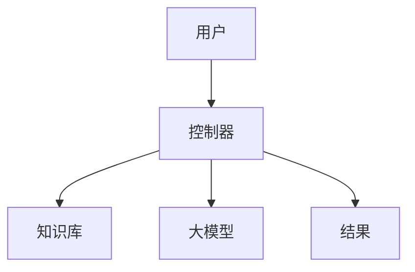

                 


# 开发基于大模型的金融专业考试题目生成器

> 关键词：大模型、金融考试、题目生成器、自然语言处理、知识图谱

> 摘要：本文详细探讨了基于大模型的金融专业考试题目生成器的开发过程，从问题背景、核心概念、算法原理到系统架构和项目实战，逐步分析了该系统的实现细节和优化策略。文章还结合实际案例，展示了如何利用大模型的强大能力，结合金融领域的专业知识，构建高效、智能的考试题目生成系统。

---

## 第一部分：开发基于大模型的金融专业考试题目生成器概述

---

### 第1章：背景介绍

#### 1.1 问题背景

金融考试题目生成器的目标是利用大模型生成高质量的金融专业考试题目，解决传统题库系统中存在的效率低、覆盖范围有限、个性化不足等问题。

- **传统题库的痛点**：传统题库依赖人工编写，耗时且成本高；知识覆盖范围有限，难以应对金融领域的快速变化；缺乏灵活性，无法根据具体需求生成个性化题目。

- **大模型的潜力**：大模型具备强大的自然语言处理能力和知识生成能力，能够快速生成高质量的文本内容。在金融领域，大模型可以结合专业知识图谱，生成符合特定知识点和难度的考试题目。

- **金融专业考试的特殊性**：金融考试题目通常涉及复杂的计算、案例分析和理论应用，对生成器的逻辑推理能力和知识准确性要求较高。

---

#### 1.2 问题描述

金融考试题目生成器需要解决以下问题：

- **如何利用大模型生成符合金融知识点的题目**：需要确保生成的题目不仅语法正确，还要准确反映金融领域的核心概念。

- **如何构建金融领域的知识库**：需要将金融知识结构化，以便模型能够理解和应用。

- **如何优化生成结果的质量**：需要设计有效的评估机制，确保生成的题目符合教育目标和考试要求。

---

#### 1.3 问题解决

基于大模型的金融考试题目生成器通过以下方式解决问题：

- **利用大模型生成候选题目**：通过自然语言处理技术，生成符合语法和语义的题目。

- **结合知识库进行优化**：通过金融领域的知识图谱，对生成的题目进行校验和优化，确保其准确性和专业性。

- **设计评估机制**：通过人工校验和模型评估，优化生成结果的质量。

---

#### 1.4 边界与外延

- **生成器的适用范围**：适用于金融领域的考试题目生成，但不包括其他领域的题目生成。

- **与其他系统的接口关系**：生成器需要与知识库、评估系统和用户界面进行交互。

- **未来扩展方向**：未来可以考虑将生成器应用于智能教育、个性化学习等领域。

---

## 第2章：核心概念与联系

#### 2.1 大模型生成机制的原理

- **Transformer架构**：基于Transformer的生成器通过自注意力机制捕捉上下文信息，生成符合语义的题目。

- **金融知识表示**：金融知识通过知识图谱进行结构化表示，包括知识点、概念关系和案例分析。

- **生成与评估**：生成器通过解码器生成候选题目，评估系统通过规则匹配和语义分析对生成结果进行优化。

---

#### 2.2 核心概念对比表

| 概念 | 特征 |
|------|------|
| 大模型 | 参数量大、多任务学习能力 |
| 金融知识库 | 结构化、领域特定 |
| 生成器 | 基于概率生成、可定制化 |

---

#### 2.3 ER实体关系图

```mermaid
erd
  title 金融考试题目生成系统实体关系图
  User {
    类别: 用户
    属性: 用户ID, 用户角色
  }
  KnowledgeBase {
    类别: 知识库
    属性: 知识点ID, 知识点内容
  }
  Model {
    类别: 大模型
    属性: 模型ID, 模型版本
  }
  Question {
    类别: 题目
    属性: 题目ID, 题目内容, 题目类型
  }
  User-Model: N:1
  Model-KnowledgeBase: N:1
  Model-Question: N:1
```

---

## 第3章：算法原理讲解

#### 3.1 大模型生成机制的数学模型

- **Transformer的编码器结构**：编码器通过多头注意力机制捕捉输入序列的全局信息，生成语义表示。

- **解码器的生成策略**：解码器通过自注意力机制生成解码序列，逐步生成题目内容。

- **优化方法**：使用交叉熵损失函数和Adam优化器进行模型训练。

$$ \text{交叉熵损失} = -\frac{1}{N}\sum_{i=1}^{N}\sum_{j=1}^{M} y_{i,j}\log p(y_{i,j}|x_i) $$

---

#### 3.2 金融知识表示的向量化方法

- **Word2Vec模型**：通过词嵌入技术将金融术语转化为向量表示。

- **BERT模型的微调**：在金融领域数据上微调BERT模型，提升其对金融术语的理解能力。

- **知识图谱的嵌入表示**：通过知识图谱将金融知识点转化为向量表示，便于模型理解和生成。

---

#### 3.3 生成器的训练流程

1. **数据预处理**：将金融知识点和题目样本进行清洗和标注。

2. **模型训练**：使用预处理后的数据训练大模型，优化生成效果。

3. **模型评估**：通过人工校验和自动化评估对生成结果进行优化。

---

## 第4章：系统分析与架构设计

#### 4.1 系统功能设计

- **知识库管理**：管理金融知识点和题目样本。

- **模型训练**：训练大模型，优化生成效果。

- **题目生成**：根据输入生成符合条件的题目。

- **结果评估**：评估生成结果的质量，优化生成器性能。

---

#### 4.2 系统架构设计



---

## 第5章：项目实战

#### 5.1 环境安装

- **Python 3.8+**
- **TensorFlow或PyTorch框架**
- **金融知识库**

#### 5.2 核心代码实现

```python
import tensorflow as tf
from tensorflow.keras.layers import Dense, Dropout, LSTM
from tensorflow.keras.models import Model

def build_model(input_shape):
    inputs = Input(shape=input_shape)
    x = LSTM(128, return_sequences=True)(inputs)
    x = Dropout(0.2)(x)
    x = Dense(64, activation='relu')(x)
    outputs = Dense(1, activation='sigmoid')(x)
    model = Model(inputs=inputs, outputs=outputs)
    return model
```

---

## 第6章：总结与展望

### 6.1 最佳实践

- **模型优化**：通过调整超参数和优化算法提升生成效果。

- **知识库更新**：定期更新知识库，保持生成器的准确性。

- **用户反馈**：收集用户反馈，优化生成器性能。

---

### 6.2 小结

基于大模型的金融专业考试题目生成器通过结合大模型和金融知识图谱，实现了高效、智能的题目生成，为金融教育领域提供了有力支持。

---

### 6.3 注意事项

- **数据隐私**：确保数据的安全性和隐私性。

- **模型性能**：优化模型性能，提升生成效率。

---

### 6.4 拓展阅读

- 《Deep Learning》
- 《Large Language Models in 2023》
- 《Knowledge Graphs for Finance》

---

以上是基于大模型的金融专业考试题目生成器的开发思路和详细分析，通过逐步推理和深入探讨，为实际开发提供了理论和实践指导。

