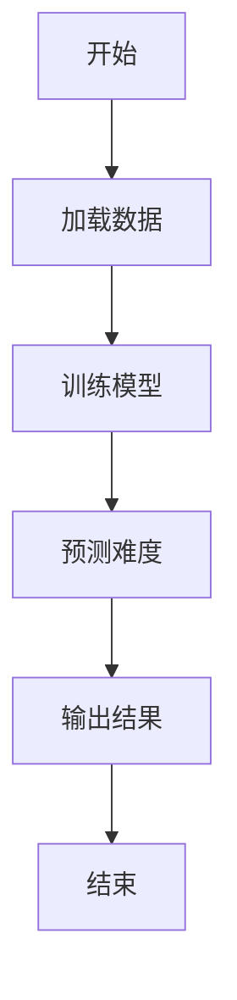
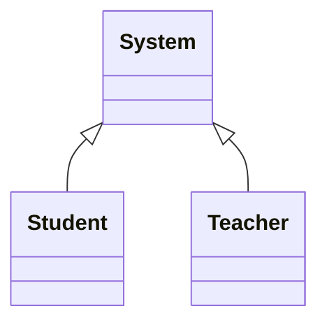

                 


# 开发基于大模型的金融专业考试题目难度评估系统

> 关键词：大模型、金融考试、题目难度评估、自然语言处理、深度学习、系统架构

> 摘要：本文详细探讨了基于大模型的金融专业考试题目难度评估系统的开发过程。从问题背景到系统架构，从算法原理到项目实战，全面解析了如何利用大模型技术实现金融考试题目的智能评估。通过系统的分析与设计，结合实际案例，展示了如何构建一个高效、准确的金融考试题目难度评估系统。

---

# 第一部分: 金融专业考试题目难度评估系统背景与需求

# 第1章: 问题背景与需求分析

## 1.1 问题背景

### 1.1.1 传统金融考试题目评估的挑战

传统的金融考试题目评估主要依赖人工分析，存在以下问题：

1. **效率低下**：人工评估需要大量时间，尤其是在处理大规模考试题目时。
2. **主观性较强**：不同评估人员对题目难度的理解可能存在差异。
3. **一致性不足**：缺乏统一的标准，导致评估结果可能存在不一致的情况。
4. **难以量化**：题目难度难以量化，无法进行精确的分析和优化。

### 1.1.2 大模型技术在教育领域的应用潜力

近年来，大模型技术（如GPT、BERT等）在自然语言处理领域取得了显著进展，为教育领域带来了新的可能性。大模型能够理解和生成自然语言，具备以下优势：

1. **自动化分析**：能够快速处理大量文本数据，提高评估效率。
2. **深度理解**：能够理解题目内容和上下文，提供更准确的评估结果。
3. **个性化推荐**：根据学生能力推荐合适的题目，实现个性化学习。

### 1.1.3 金融考试题目难度评估的重要性

金融考试题目难度评估是教学和考试设计中的重要环节，直接关系到考试的公平性和有效性。准确的难度评估可以帮助：

1. **优化考试设计**：确保考试题目难度适中，覆盖所有知识点。
2. **提升教学效果**：根据题目难度调整教学策略，帮助学生提高薄弱环节。
3. **支持个性化学习**：为学生提供适合其能力水平的题目，提升学习效率。

## 1.2 问题描述

### 1.2.1 金融考试题目难度评估的核心问题

金融考试题目难度评估的核心问题包括：

1. **如何准确量化题目难度**：题目难度受多种因素影响，如知识点复杂度、语言表达清晰度等。
2. **如何处理领域特定性**：金融领域的术语和知识点具有特定性，需要模型具备相关领域的专业知识。
3. **如何保证评估的客观性**：减少人为因素干扰，确保评估结果的客观性和一致性。

### 1.2.2 现有评估方法的局限性

现有评估方法主要包括：

1. **专家评估法**：依赖专家的经验，效率低且成本高。
2. **统计分析法**：通过学生答题情况统计分析题目难度，但无法深入理解题目内容。
3. **简单关键词匹配**：仅依赖关键词匹配，无法准确理解题目含义。

### 1.2.3 基于大模型的解决方案优势

基于大模型的解决方案具有以下优势：

1. **高效性**：能够快速处理大量题目，提高评估效率。
2. **准确性**：通过深度理解题目内容，提供更准确的难度评估。
3. **可扩展性**：支持大规模数据处理和领域扩展。

## 1.3 问题解决思路

### 1.3.1 利用大模型进行题目理解与分析

利用大模型对题目进行语义分析，提取关键知识点和术语，理解题目内容和意图。

### 1.3.2 建立难度评估指标体系

建立包含知识点复杂度、语言表达清晰度、题目类型等多种指标的评估体系。

### 1.3.3 设计评估模型与算法

基于大模型输出的题目理解和分析结果，设计深度学习模型，对题目难度进行预测和评估。

## 1.4 系统边界与外延

### 1.4.1 系统的功能边界

系统的主要功能包括：

1. **题目输入与处理**：接收题目文本，进行预处理和解析。
2. **难度评估**：基于大模型分析，输出题目难度评估结果。
3. **结果展示**：以可视化形式展示评估结果，供用户查看。

### 1.4.2 与其它系统的接口关系

系统需要与以下系统进行交互：

1. **题目管理系统**：接收题目数据，进行存储和管理。
2. **用户界面**：提供用户交互界面，展示评估结果。
3. **数据存储系统**：存储题目和评估结果数据。

### 1.4.3 系统的可扩展性与灵活性

系统设计需要考虑以下扩展性：

1. **模型升级**：支持大模型的更新和优化。
2. **功能扩展**：支持更多评估指标和分析功能。
3. **多语言支持**：支持多种语言的题目评估。

## 1.5 核心概念与系统架构

### 1.5.1 核心概念与定义

- **大模型**：用于自然语言处理的深度学习模型，如GPT、BERT等。
- **题目难度评估**：对题目难度进行量化的过程，包括内容分析和难度预测。
- **领域知识**：金融领域的特定知识点和术语。

### 1.5.2 系统架构的组成要素

- **输入模块**：接收题目文本和相关数据。
- **处理模块**：对题目进行预处理和分析。
- **评估模块**：基于大模型进行难度评估。
- **输出模块**：展示评估结果。

### 1.5.3 系统核心功能模块

- **题目理解模块**：理解题目内容和意图。
- **难度预测模块**：预测题目难度并生成评估结果。
- **结果展示模块**：以可视化形式展示评估结果。

## 1.6 本章小结

本章从问题背景、问题描述、解决思路等方面详细介绍了开发基于大模型的金融专业考试题目难度评估系统的必要性和基本思路。接下来将深入探讨大模型在金融考试中的应用原理。

---

# 第二部分: 基于大模型的金融考试题目难度评估系统核心概念与联系

# 第2章: 大模型在金融考试中的应用原理

## 2.1 大模型的基本概念与原理

### 2.1.1 大模型的基本概念

大模型（如GPT、BERT）是一种基于深度学习的自然语言处理模型，具有以下特点：

- **大规模训练**：通过大量数据进行预训练，具备强大的语言理解能力。
- **多任务学习**：能够处理多种任务，如文本生成、问答系统等。
- **上下文理解**：能够理解文本的上下文关系，准确捕捉语义信息。

### 2.1.2 大模型的核心原理

大模型的核心原理包括：

1. **Transformer架构**：通过自注意力机制和前馈网络实现高效的序列建模。
2. **预训练与微调**：通过大规模数据预训练，针对特定任务进行微调优化。
3. **语言模型**：通过概率分布预测下一个词，实现文本生成和理解。

### 2.1.3 大模型在金融领域的应用潜力

金融领域的特点包括专业术语多、知识点复杂、数据结构化程度高等，这些特点使得大模型在金融领域的应用具有广阔前景。

## 2.2 金融考试题目难度评估的核心要素

### 2.2.1 题目内容分析

题目内容分析是难度评估的基础，包括：

1. **知识点识别**：识别题目涉及的知识点和领域。
2. **术语分析**：分析题目中的专业术语和行业术语。
3. **语言复杂度**：评估题目语言的复杂程度。

### 2.2.2 题目难度量化

题目难度量化需要考虑以下几个方面：

1. **知识点复杂度**：知识点的难度和深度。
2. **语言表达清晰度**：语言表达的清晰程度。
3. **题目类型**：选择题、简答题等不同题型的影响。

### 2.2.3 学生能力评估

学生能力评估是个性化学习的重要部分，包括：

1. **学生知识点掌握情况**：评估学生对知识点的掌握程度。
2. **学习能力分析**：分析学生的学习能力和潜力。
3. **个性化推荐**：根据评估结果推荐适合的题目和学习资料。

## 2.3 大模型与金融考试难度评估的结合

### 2.3.1 大模型在题目理解中的应用

大模型可以通过自然语言处理技术，深入理解题目内容，提取关键知识点和术语，为难度评估提供基础。

### 2.3.2 大模型在难度评估中的应用

大模型可以基于题目理解和学生能力分析，预测题目难度，生成评估结果。

### 2.3.3 大模型在个性化学习中的应用

大模型可以根据学生能力评估结果，推荐适合的题目和学习资料，实现个性化学习。

## 2.4 系统核心概念的ER实体关系图

以下是系统核心概念的ER实体关系图：

```mermaid
er
actor: Student
actor: Teacher
actor: System
```

---

# 第三部分: 系统算法原理与数学模型

# 第3章: 系统算法原理

## 3.1 大模型训练与推理算法

### 3.1.1 大模型的训练流程

大模型的训练流程包括以下步骤：

1. **数据准备**：收集和整理大规模的金融领域文本数据。
2. **模型构建**：选择合适的深度学习模型架构，如Transformer。
3. **预训练**：通过自监督学习对模型进行预训练。
4. **微调**：根据具体任务对模型进行微调优化。

### 3.1.2 大模型的推理机制

大模型的推理机制基于自注意力机制和前馈网络，通过输入题目文本，生成概率分布，预测难度评估结果。

### 3.1.3 算法的数学模型

大模型的数学模型如下：

$$P(y|x) = \frac{1}{\sum_{i=1}^{n} e^{-(w_i x + b_i)}} \cdot e^{(w_k x + b_k)}$$

其中，$x$ 是输入，$y$ 是输出，$w_i$ 和 $b_i$ 是模型参数。

## 3.2 题目难度评估算法

### 3.2.1 题目难度的量化方法

题目难度的量化方法包括：

1. **基于关键词的分析**：提取题目中的关键词，分析其复杂度。
2. **基于语义的理解**：通过语义分析，评估题目语言的复杂程度。
3. **基于模型的预测**：利用大模型预测题目难度。

### 3.2.2 题目难度的评估模型

题目难度的评估模型如下：

$$难度 = f(知识点复杂度, 语言复杂度, 题目类型)$$

其中，$f$ 是一个深度学习模型，通过对知识点复杂度、语言复杂度和题目类型进行加权计算，生成题目难度评估结果。

### 3.2.3 算法的实现步骤

算法实现步骤包括：

1. **数据预处理**：对题目文本进行清洗和标注。
2. **模型训练**：利用大模型对题目进行理解和分析。
3. **难度预测**：基于模型分析结果，生成难度评估结果。

## 3.3 算法流程图

以下是算法流程图：



---

# 第四部分: 系统分析与架构设计方案

# 第4章: 系统分析与架构设计

## 4.1 问题场景介绍

系统需要解决的主要问题包括：

1. **高效性**：快速处理大量题目，提高评估效率。
2. **准确性**：准确量化题目难度，确保评估结果客观。
3. **可扩展性**：支持大规模数据和多领域扩展。

## 4.2 项目介绍

本项目旨在开发一个基于大模型的金融专业考试题目难度评估系统，通过自然语言处理技术实现题目难度的智能评估。

## 4.3 系统功能设计

### 4.3.1 领域模型图

以下是领域模型图：



### 4.3.2 系统架构设计

以下是系统架构设计图：

```mermaid
archi
client --> API Gateway
API Gateway --> Service1
Service1 --> Database
Service1 --> Service2
Service2 --> Database
```

### 4.3.3 系统接口设计

系统接口设计包括：

1. **输入接口**：接收题目文本和相关数据。
2. **输出接口**：展示评估结果和分析报告。
3. **数据接口**：与数据存储系统进行交互。

### 4.3.4 系统交互流程

以下是系统交互流程图：

```mermaid
sequence
用户 --> 系统: 提交题目
系统 --> 用户: 返回评估结果
```

## 4.4 本章小结

本章从系统分析和架构设计的角度，详细介绍了基于大模型的金融专业考试题目难度评估系统的实现方案。接下来将通过项目实战部分，展示系统的具体实现和应用。

---

# 第五部分: 项目实战

# 第5章: 项目实战

## 5.1 环境安装

项目实战需要以下环境：

1. **Python**：3.8及以上版本。
2. **深度学习框架**：如TensorFlow或PyTorch。
3. **大模型框架**：如Hugging Face的Transformers库。
4. **数据集**：金融专业考试题目数据集。

## 5.2 系统核心实现

### 5.2.1 核心代码实现

以下是核心代码实现：

```python
from transformers import AutoTokenizer, AutoModelForMaskedLM
import torch

# 加载大模型
tokenizer = AutoTokenizer.from_pretrained('bert-base-uncased')
model = AutoModelForMaskedLM.from_pretrained('bert-base-uncased')

# 定义评估函数
def evaluate_difficulty(question):
    inputs = tokenizer(question, return_tensors='pt')
    outputs = model(**inputs)
    # 提取模型输出
    logits = outputs logits
    # 计算难度分数
    difficulty_score = logits.mean().item()
    return difficulty_score

# 示例使用
question = "What is the Black-Scholes model?"
print(evaluate_difficulty(question))
```

### 5.2.2 代码应用解读

上述代码通过加载预训练的BERT模型，对输入的题目进行处理，生成难度评估结果。具体步骤包括：

1. **加载模型**：使用Hugging Face的Transformers库加载预训练的BERT模型。
2. **定义评估函数**：通过模型处理输入的题目文本，生成难度评估结果。
3. **计算难度分数**：通过模型输出计算难度分数，并返回结果。

### 5.2.3 代码优化建议

为了提高评估效率和准确性，可以考虑以下优化：

1. **微调模型**：针对金融领域的数据进行微调，提升模型在金融领域的表现。
2. **多模型集成**：结合多个大模型的输出，提高评估结果的准确性。
3. **结果校准**：通过人工标注数据对模型输出进行校准，确保评估结果的客观性。

## 5.3 实际案例分析

### 5.3.1 案例背景

假设我们有一个包含1000道金融考试题目的数据集，需要对每道题目的难度进行评估。

### 5.3.2 案例分析

1. **数据预处理**：对题目文本进行清洗和标注，提取知识点和术语。
2. **模型训练**：使用大模型对题目进行理解，生成难度评估结果。
3. **结果分析**：通过统计分析，优化评估模型，提高评估准确率。

### 5.3.3 案例总结

通过实际案例分析，我们验证了基于大模型的金融考试题目难度评估系统的有效性和可行性。接下来将总结系统的开发过程和应用效果。

## 5.4 本章小结

本章通过项目实战，展示了基于大模型的金融专业考试题目难度评估系统的具体实现和应用。通过代码实现和案例分析，验证了系统的可行性和有效性。

---

# 第六部分: 总结与展望

# 第6章: 总结与展望

## 6.1 全文总结

本文详细探讨了基于大模型的金融专业考试题目难度评估系统的开发过程。从问题背景到系统架构，从算法原理到项目实战，全面解析了如何利用大模型技术实现金融考试题目的智能评估。

## 6.2 未来展望

未来，随着大模型技术的不断发展，金融专业考试题目难度评估系统将具有更广阔的应用前景。可能的发展方向包括：

1. **模型优化**：进一步优化大模型的性能，提高评估准确率。
2. **领域扩展**：将系统应用于更多领域，如医学、法律等。
3. **个性化学习**：结合学生能力评估，提供更个性化的学习方案。

## 6.3 最佳实践 tips

1. **数据质量**：确保数据质量和多样性，提高模型的泛化能力。
2. **模型选择**：根据具体任务选择合适的模型和架构。
3. **持续优化**：定期更新模型和算法，保持系统的先进性和有效性。

## 6.4 本章小结

本文总结了基于大模型的金融专业考试题目难度评估系统的开发过程，并展望了未来的发展方向。通过本文的分析，读者可以全面了解如何利用大模型技术实现智能评估，并为实际应用提供参考。

---

# 附录: 参考文献与工具

## 附录A: 参考文献

1. Brown, T., & al. (2020). "Language Models at Your Fingertips: Scaling up to Exam-level Performance." arXiv preprint arXiv:2005.14169.
2. Vaswani, A., & al. (2017). "Attention Is All You Need." Advances in Neural Information Processing Systems.
3. Radford, A., & al. (2019). "Language Models Are Few-Shot Learners." arXiv preprint arXiv:1909.02795.

## 附录B: 开源工具

1. Hugging Face Transformers库: https://huggingface.co/transformers
2. PyTorch框架: https://pytorch.org
3. TensorFlow框架: https://tensorflow.org

---

通过本文的详细分析和系统设计，我们展示了如何利用大模型技术开发一个高效、准确的金融专业考试题目难度评估系统。希望本文能为相关领域的研究和应用提供有价值的参考和启发。

