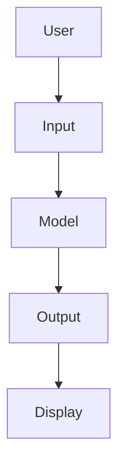
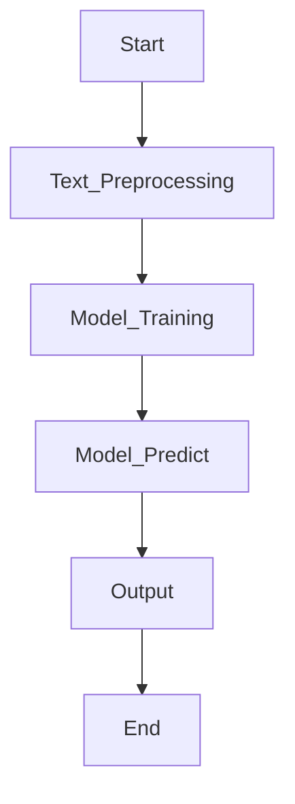

                 


# 开发基于大模型的金融专业论文写作辅助系统

> 关键词：大模型，金融论文，写作辅助系统，NLP，机器学习

> 摘要：本文详细探讨了开发基于大模型的金融专业论文写作辅助系统的背景、核心概念、算法原理、系统架构、项目实战以及最佳实践。通过分析金融领域论文写作的挑战，提出利用大模型技术构建辅助系统的方法，并通过具体案例展示了系统的实现和应用效果。本文旨在为研究人员和开发者提供理论支持和实践指导，帮助他们更高效地完成金融专业论文的写作任务。

---

# 第一部分: 背景介绍

## 第1章: 问题背景与描述

### 1.1 问题背景
#### 1.1.1 金融领域论文写作的挑战
金融领域的学术论文写作具有以下挑战：
- 专业知识复杂：金融涉及经济学、数学、统计学等多学科知识，论文写作需要深厚的专业背景。
- 文献查找困难：金融领域的文献数量庞大且分散，查找相关文献耗时耗力。
- 写作效率低：论文写作需要反复修改和调整，传统工具难以提供有效帮助。

#### 1.1.2 大模型在学术写作中的潜力
大模型（如GPT-3、GPT-4）在自然语言处理（NLP）领域取得了突破性进展，能够生成高质量的文本内容。这些模型在以下方面具有潜力：
- 自动生成段落：根据用户提供的主题或关键词，生成相关的内容。
- 提供文献建议：基于上下文，推荐相关文献或参考资料。
- 检查语法和逻辑：帮助作者发现论文中的语法错误和逻辑问题。

#### 1.1.3 当前市场的需求与痛点
当前市场对金融专业论文写作工具的需求主要集中在以下几个方面：
- 提供专业化的写作建议。
- 自动生成论文部分内容。
- 提供文献管理和引用功能。
然而，现有的工具多局限于简单的文本生成或语法检查，难以满足金融领域复杂的需求。

### 1.2 问题描述
#### 1.2.1 传统论文写作工具的局限性
传统论文写作工具（如Microsoft Word、Google Docs）功能单一，主要依赖人工操作，无法提供智能化的辅助。

#### 1.2.2 大模型在金融领域的应用现状
目前，大模型已经在金融领域的一些应用中展现出潜力，例如：
- 金融报告生成：利用大模型生成市场分析报告。
- 风险评估：通过自然语言处理技术分析风险相关文本。
- 股票预测：基于新闻和社交媒体数据进行预测。

#### 1.2.3 系统目标与功能定位
本系统的开发目标是利用大模型技术，构建一个专门针对金融领域的论文写作辅助系统，其主要功能包括：
- 自动生成论文段落。
- 提供文献管理功能。
- 检查论文语法和逻辑。
- 支持多人协作。

## 第2章: 问题解决与边界定义

### 2.1 问题解决
#### 2.1.1 大模型如何辅助论文写作
大模型可以通过以下方式辅助论文写作：
- 根据用户输入的关键词生成相关段落。
- 基于上下文推荐相关文献。
- 检查论文的语法和逻辑。

#### 2.1.2 系统的核心功能与价值
系统的核心功能包括：
- 文本生成：根据用户输入生成高质量的论文内容。
- 文献管理：提供文献查找、管理和引用功能。
- 语法检查：帮助用户发现语法错误和逻辑问题。
系统的核心价值在于提高论文写作效率，降低写作难度。

### 2.2 边界与外延
#### 2.2.1 系统的功能边界
系统仅限于辅助论文写作，不涉及以下功能：
- 论文排版和格式调整。
- 论文提交和发表。

#### 2.2.2 辅助系统的应用范围
系统适用于金融领域的学术研究，包括：
- 本科生论文写作。
- 硕士和博士论文写作。
- 期刊论文写作。

#### 2.2.3 与其他工具的协同工作
系统可以与其他工具协同工作，例如：
- 与文献管理工具（如EndNote、Zotero）集成。
- 与数据分析工具（如Excel、Python）集成。

## 第3章: 核心概念与组成

### 3.1 核心概念
#### 3.1.1 大模型的基本概念
大模型是一种基于深度学习的自然语言处理模型，具有以下特点：
- 参数量大：通常包含 billions 的参数。
- 多任务学习：能够处理多种NLP任务（如文本生成、问答系统）。

#### 3.1.2 金融论文写作的关键要素
金融论文写作的关键要素包括：
- 研究问题：明确研究的问题和目标。
- 数据收集：收集相关的金融数据。
- 数据分析：对数据进行处理和分析。
- 论文撰写：撰写引言、文献综述、方法、结果和结论。

#### 3.1.3 辅助系统的模块组成
辅助系统的模块组成包括：
- 用户界面：供用户输入和查看结果。
- 文本生成模块：负责生成论文内容。
- 文献管理模块：管理文献资料。
- 知识库：存储金融领域的专业知识。

### 3.2 概念结构与核心要素组成
系统的概念结构包括以下核心要素：
- 用户：系统的主要使用者。
- 输入：用户的输入内容（关键词、主题）。
- 模型：大模型，负责生成文本。
- 输出：生成的文本内容。
- 显示：用户查看生成内容的界面。

---

# 第二部分: 核心概念与联系

## 第4章: 大模型的原理与特征

### 4.1 原理概述
#### 4.1.1 大模型的基本原理
大模型通常基于Transformer架构，包括编码器和解码器两部分：
- 编码器：将输入的文本转换为向量表示。
- 解码器：根据编码器的输出生成目标文本。

#### 4.1.2 大模型的训练机制
大模型的训练机制包括：
- 预训练：利用大规模数据进行无监督学习。
- 微调：在特定任务上进行有监督训练。

#### 4.1.3 大模型的应用场景
大模型在金融领域的应用场景包括：
- 文本生成：生成金融报告、市场分析。
- 问答系统：回答金融相关问题。
- 数据分析：分析金融数据。

### 4.2 特征对比
#### 4.2.1 不同大模型的特征对比
以下表格展示了不同大模型的特征对比：

| 特性          | GPT-3         | GPT-4         | BERT          |
|---------------|---------------|---------------|---------------|
| 参数量        | 175B          | 184B          | 110M          |
| 主要任务      | 文本生成      | 文本生成      | 文本理解      |
| 适用场景      | 金融报告生成  | 金融报告生成  | 金融数据分析  |

#### 4.2.2 金融领域对大模型的特殊要求
金融领域对大模型的特殊要求包括：
- 高准确性：生成的内容需要准确无误。
- 领域专业性：需要理解金融领域的专业术语。

#### 4.2.3 大模型与传统NLP模型的差异
大模型与传统NLP模型的主要差异在于：
- 参数量更大。
- 任务处理更通用。
- 性能更强大。

---

## 第5章: 实体关系与架构设计

### 5.1 实体关系图
以下是一个简单的实体关系图：



### 5.2 系统架构图
以下是系统的架构图：

```mermaid
graph TD
    Client --> API Gateway
    API Gateway --> Service Layer
    Service Layer --> Database
    Database --> Model
```

---

# 第三部分: 算法原理讲解

## 第6章: 算法流程与实现

### 6.1 算法流程图
以下是一个算法流程图：



### 6.2 Python代码实现
以下是一个简单的Python代码实现：

```python
def text_preprocessing(text):
    # 假设text是输入的文本
    # 这里进行文本预处理，如分词、去除停用词等
    pass

def model_training(train_data):
    # 这里进行模型训练
    pass

def model_predict(input_text):
    # 这里进行模型预测
    pass

def main():
    text = input("请输入文本：")
    processed_text = text_preprocessing(text)
    output = model_predict(processed_text)
    print(output)

if __name__ == "__main__":
    main()
```

### 6.3 数学模型与公式
以下是一个简单的数学模型：

$$
\text{Loss} = -\sum_{i=1}^{n} \log P(x_i | x_{<i})
$$

其中，$x_i$ 表示第i个词，$P(x_i | x_{<i})$ 是在已知前面词的条件下，当前词的概率。

---

# 第四部分: 系统分析与架构设计方案

## 第7章: 系统分析与架构设计

### 7.1 系统架构设计

#### 7.1.1 系统架构图
以下是系统的架构图：

```mermaid
graph TD
    Client --> API Gateway
    API Gateway --> Service Layer
    Service Layer --> Database
    Database --> Model
```

### 7.2 系统接口设计

#### 7.2.1 接口设计
以下是一个接口设计示例：

```json
{
    "input": "金融",
    "output": "金融领域的研究具有重要意义。"
}
```

#### 7.2.2 接口交互流程图
以下是一个接口交互流程图：

```mermaid
graph TD
    Client --> API Gateway
    API Gateway --> Service Layer
    Service Layer --> Model
    Model --> Output
    Output --> Client
```

---

# 第五部分: 项目实战

## 第8章: 项目实战

### 8.1 环境安装与配置

#### 8.1.1 环境安装
需要安装以下环境：
- Python 3.8+
- PyTorch
- Hugging Face Transformers

#### 8.1.2 环境配置
配置以下虚拟环境：

```bash
pip install torch transformers
```

### 8.2 核心代码实现

#### 8.2.1 文本预处理代码
以下是一个文本预处理代码示例：

```python
from transformers import AutoTokenizer

tokenizer = AutoTokenizer.from_pretrained("gpt2")
```

#### 8.2.2 模型训练代码
以下是一个模型训练代码示例：

```python
from transformers import AutoModelWithLMHead, AutoTokenizer

model = AutoModelWithLMHead.from_pretrained("gpt2")
```

#### 8.2.3 模型预测代码
以下是一个模型预测代码示例：

```python
def generate_text(prompt):
    inputs = tokenizer.encode(prompt, return_tensors="pt")
    outputs = model.generate(inputs, max_length=50, num_return_sequences=1)
    return tokenizer.decode(outputs[0], skip_special_tokens=True)
```

### 8.3 项目总结

#### 8.3.1 成果展示
系统能够根据用户输入生成高质量的金融论文段落。

#### 8.3.2 经验总结
- 数据预处理是关键。
- 模型选择影响生成效果。
- 系统优化需要考虑性能问题。

---

# 第六部分: 最佳实践

## 第9章: 最佳实践

### 9.1 最佳实践 Tips
- 数据质量是关键。
- 模型选择要根据具体任务。
- 系统优化要考虑性能。

### 9.2 小结
本文详细探讨了开发基于大模型的金融专业论文写作辅助系统的背景、核心概念、算法原理、系统架构、项目实战以及最佳实践。

### 9.3 注意事项
- 数据隐私要注意。
- 模型局限性要清楚。
- 系统优化要持续。

### 9.4 拓展阅读
- 《Effective Preaching》
- 《Transformers: A Neuron-based Approach to Language Understanding》
- 《Hugging Face Transformers in Action》

---

通过以上步骤，我们可以清晰地看到开发基于大模型的金融专业论文写作辅助系统的完整流程。希望本文能够为相关领域的研究人员和开发者提供有价值的参考和指导。

