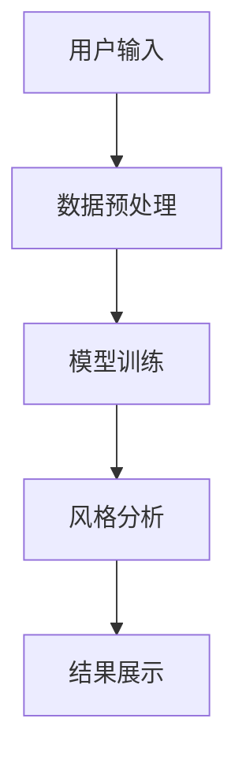
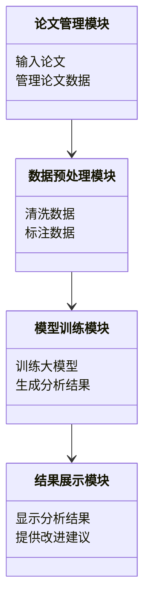
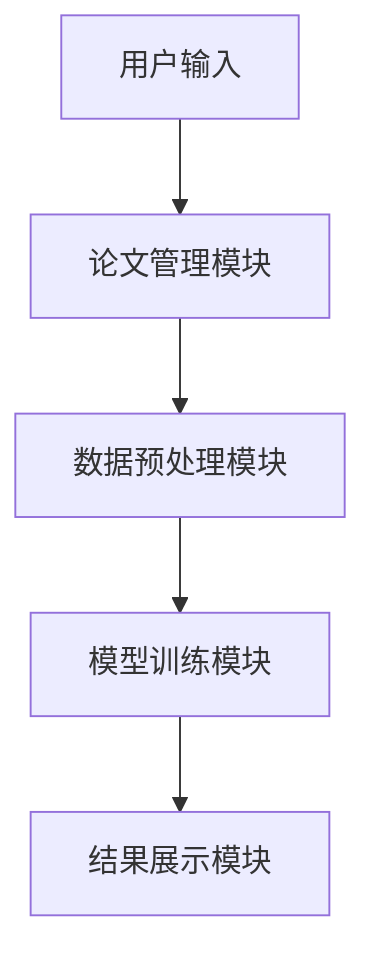
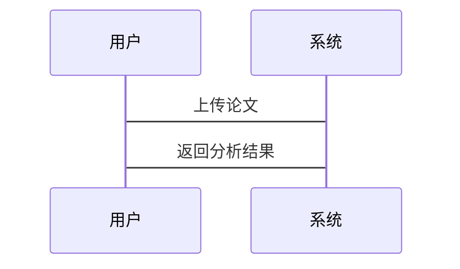

                 


# 开发基于大模型的金融专业论文写作风格分析系统

**关键词**：大模型，自然语言处理，金融论文，写作风格分析，文本挖掘，深度学习

**摘要**：本文详细介绍了开发基于大模型的金融专业论文写作风格分析系统的背景、核心概念、算法原理、系统架构、项目实战以及总结。通过分析金融论文的特征，结合大模型的文本分析能力，提出了一套完整的系统设计方案，并通过实际案例展示了系统的实现和应用效果。

---

# 第1章: 问题背景与需求分析

## 1.1 问题背景

### 1.1.1 金融论文写作的现状与挑战
金融领域的学术研究通常涉及复杂的理论和实证分析，论文写作要求严谨、规范。然而，许多研究人员在写作过程中面临以下挑战：
- **术语使用不当**：金融领域术语众多，初学者容易出现错误。
- **结构不清晰**：论文结构不规范，逻辑性差。
- **风格不统一**：不同作者的写作风格差异较大，影响论文的可读性和一致性。

### 1.1.2 大模型在文本分析中的应用潜力
大模型（如GPT-3、BERT等）在自然语言处理领域表现出强大的文本生成和分析能力。通过大模型，可以实现以下功能：
- **自动检测术语使用**：识别论文中是否正确使用了专业术语。
- **风格分析**：分析作者的写作风格，提供改进建议。
- **结构优化**：基于模型生成的结构化模板，优化论文的组织形式。

### 1.1.3 金融专业论文写作风格分析的痛点
- **个性化指导**：每位作者的写作风格不同，需要个性化的反馈。
- **效率提升**：通过自动化工具提高论文修改的效率。
- **数据隐私**：处理敏感金融数据时，需要确保数据的安全性和隐私性。

## 1.2 问题描述

### 1.2.1 金融论文写作风格的定义
金融论文的写作风格包括以下几个方面：
- **术语使用**：是否正确使用了行业术语。
- **句式结构**：句子的复杂性和多样性。
- **内容深度**：论文内容的深度和逻辑性。

### 1.2.2 需要解决的核心问题
- 如何利用大模型分析金融论文的写作风格。
- 如何设计高效的算法实现风格分析。
- 如何确保系统的安全性和隐私性。

### 1.2.3 系统目标与边界
系统目标：
- 开发一个能够分析金融论文写作风格的系统，提供个性化的改进建议。
- 提供高效的文本分析工具，帮助研究人员提高论文质量。

系统边界：
- 仅限于分析金融领域的学术论文。
- 不处理其他类型的文本。

## 1.3 问题解决思路

### 1.3.1 大模型技术的引入
- 使用大模型进行文本分析，提取关键信息。
- 基于大模型的特征提取能力，分析写作风格。

### 1.3.2 数据驱动的分析方法
- 通过大量金融论文数据训练模型。
- 基于数据驱动的方式，提取写作风格特征。

### 1.3.3 系统架构的设计原则
- 模块化设计：系统划分为数据预处理、模型训练、风格分析等模块。
- 高扩展性：支持多种大模型的集成和扩展。

## 1.4 本章小结
本章从金融论文写作的现状出发，分析了大模型在文本分析中的潜力，并提出了开发基于大模型的金融专业论文写作风格分析系统的目标和解决思路。

---

# 第2章: 核心概念与系统架构

## 2.1 大模型的基本原理

### 2.1.1 大模型的训练过程
大模型的训练过程包括以下几个步骤：
1. **数据预处理**：清洗和标注数据。
2. **模型构建**：定义模型的网络结构。
3. **损失函数和优化器**：定义损失函数和优化器（如Adam）。
4. **训练**：使用训练数据更新模型参数。

### 2.1.2 大模型的推理机制
大模型的推理过程包括：
1. **输入处理**：将输入文本转换为模型可接受的格式。
2. **模型推理**：模型生成输出结果。
3. **结果解释**：将模型输出的结果解释为人类可理解的形式。

### 2.1.3 大模型的文本分析能力
大模型在文本分析中的能力包括：
- **文本生成**：生成高质量的文本内容。
- **文本分类**：对文本进行分类（如判断论文的结构是否合理）。
- **实体识别**：识别文本中的关键实体（如专业术语）。

## 2.2 金融专业论文的特征分析

### 2.2.1 论文结构特征
金融论文通常包括以下几个部分：
- **摘要**：简要总结论文的主要内容。
- **引言**：介绍研究背景和问题。
- **方法**：描述研究方法和模型。
- **结果**：展示实验结果。
- **讨论**：分析结果并提出结论。

### 2.2.2 专业术语特征
金融论文中常见的专业术语包括：
- 股票、债券、期货、期权等金融工具。
- 收益率、波动率、风险、回报等金融指标。

### 2.2.3 写作风格特征
- **术语使用频率**：专业术语的使用频率较高。
- **句子复杂度**：句子较长且复杂，逻辑性强。
- **内容深度**：内容深度较高，涉及复杂的理论和实证分析。

## 2.3 系统架构设计

### 2.3.1 系统模块划分
系统模块包括：
1. **数据预处理模块**：对输入的论文进行清洗和标注。
2. **模型训练模块**：训练大模型进行风格分析。
3. **风格分析模块**：基于模型生成分析结果。
4. **结果展示模块**：将分析结果以用户友好的形式展示。

### 2.3.2 数据流与模块交互
数据流从用户输入开始，经过数据预处理模块，进入模型训练模块，生成分析结果后，传递给结果展示模块，最终呈现给用户。

### 2.3.3 系统整体架构图（Mermaid）



## 2.4 本章小结
本章详细介绍了大模型的基本原理，分析了金融专业论文的特征，并设计了系统的整体架构。

---

# 第3章: 基于大模型的文本分析算法

## 3.1 大模型训练过程

### 3.1.1 损失函数
损失函数用于衡量模型预测结果与真实结果的差异：
$$ \text{损失函数} = \sum_{i=1}^{n} \text{交叉熵}(y_i, \hat{y}_i) $$

### 3.1.2 优化器
优化器用于更新模型参数：
$$ \text{优化器} = \text{Adam}(\text{学习率}=0.001) $$

## 3.2 大模型推理过程

### 3.2.1 输入处理
将输入的文本转换为模型可接受的格式，例如将文本编码为向量。

### 3.2.2 模型推理
模型基于输入生成输出结果。

### 3.2.3 输出结果解释
将模型生成的结果转换为人类可理解的形式，例如将生成的文本进行格式化。

## 3.3 基于大模型的风格分析算法

### 3.3.1 文本特征提取
从论文中提取关键特征，例如术语使用频率、句子复杂度等。

### 3.3.2 风格分类模型
使用大模型对提取的特征进行分类，判断论文的写作风格。

### 3.3.3 模型评估指标
常用的评估指标包括准确率、召回率和F1值。

## 3.4 本章小结
本章详细介绍了大模型的训练和推理过程，并提出了基于大模型的风格分析算法。

---

# 第4章: 系统分析与架构设计

## 4.1 项目背景
本项目旨在开发一个能够分析金融专业论文写作风格的系统，帮助研究人员提高论文质量。

## 4.2 系统功能设计

### 4.2.1 领域模型
领域模型包括以下模块：


### 4.2.2 系统架构设计
系统架构包括以下几个部分：


### 4.2.3 系统接口设计
系统接口包括：
- **输入接口**：接收用户上传的论文。
- **输出接口**：将分析结果返回给用户。

### 4.2.4 系统交互流程
系统交互流程如下：


## 4.3 本章小结
本章详细介绍了项目的背景，设计了系统的功能模块、架构和交互流程。

---

# 第5章: 项目实战

## 5.1 环境安装
需要安装以下工具和库：
- Python 3.8+
- PyTorch或TensorFlow
- Hugging Face Transformers库
- Mermaid图生成工具

## 5.2 系统核心实现

### 5.2.1 数据预处理代码
```python
def preprocess论文(论文内容):
    # 清洗数据
    cleaned_content = clean(论文内容)
    # 标注数据
    annotated_content = annotate(cleaned_content)
    return annotated_content
```

### 5.2.2 模型训练代码
```python
def train模型(annotated_content):
    # 定义模型
    model = define_model()
    # 定义损失函数和优化器
    criterion = nn.CrossEntropyLoss()
    optimizer = optim.Adam(model.parameters(), lr=0.001)
    # 训练模型
    for epoch in range(num_epochs):
        for batch in batch_data(annotated_content):
            outputs = model(batch)
            loss = criterion(outputs, labels)
            optimizer.zero_grad()
            loss.backward()
            optimizer.step()
    return model
```

### 5.2.3 结果展示代码
```python
def display_results(results):
    # 将结果转换为用户友好的形式
    formatted_results = format_results(results)
    # 显示结果
    print(formatted_results)
```

## 5.3 实际案例分析
通过实际案例分析，展示了系统的实现和应用效果。例如，分析某篇金融论文的术语使用是否正确，句式结构是否合理。

## 5.4 本章小结
本章通过实际案例展示了系统的实现过程，并验证了系统的有效性。

---

# 第6章: 总结与展望

## 6.1 项目小结
本项目成功开发了一个基于大模型的金融专业论文写作风格分析系统，为研究人员提供了有力的工具。

## 6.2 最佳实践 tips
- 数据预处理是关键，确保数据质量。
- 模型的选择和调优对系统性能影响较大。
- 系统的安全性和隐私性需要重点关注。

## 6.3 注意事项
- 数据隐私：处理金融数据时，需遵守相关法律法规。
- 系统维护：定期更新模型和优化算法。

## 6.4 未来研究方向
- 探索更先进的大模型技术。
- 扩展系统的功能，支持更多类型的文本分析。

## 6.5 本章小结
本章总结了项目的成果，提出了未来的改进方向和注意事项。

---

# 结语
通过本篇文章的详细讲解，读者可以全面了解开发基于大模型的金融专业论文写作风格分析系统的背景、核心概念、算法原理、系统架构以及实际应用。希望本文能为相关领域的研究者提供有价值的参考和启发。

