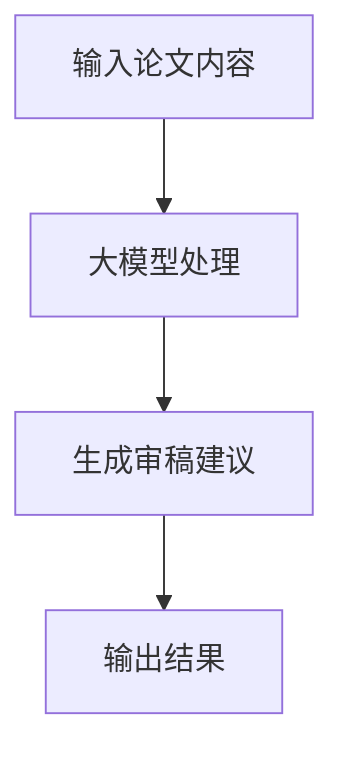
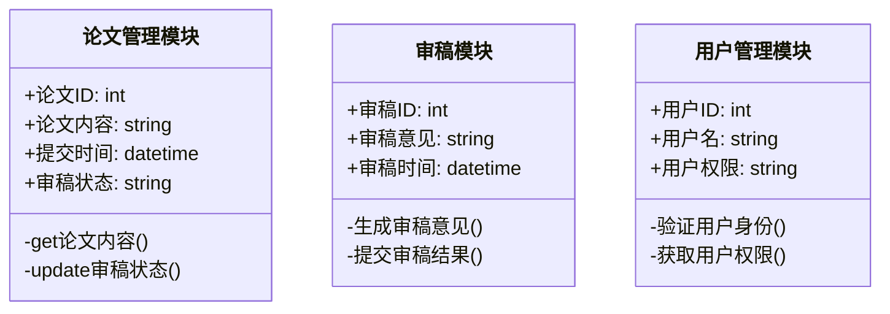
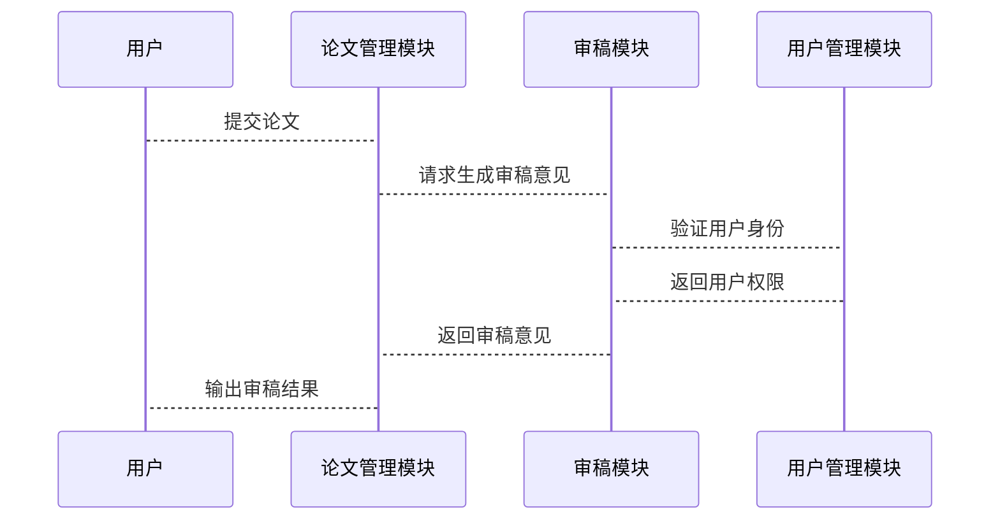
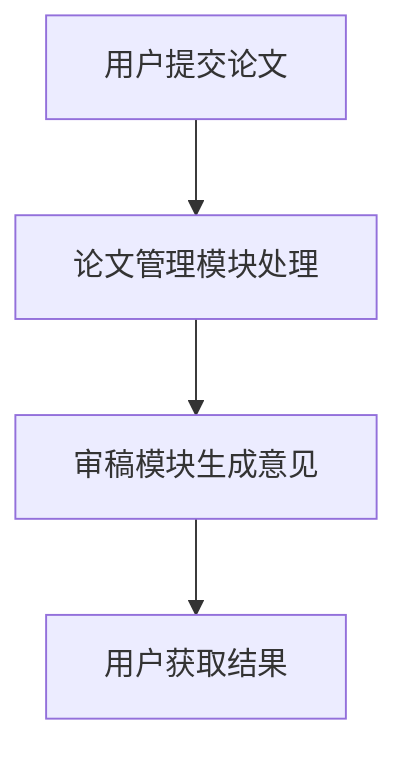

                 


# 开发基于大模型的金融专业论文审稿辅助系统

> 关键词：大模型，金融论文，审稿系统，知识图谱，自然语言处理，算法原理

> 摘要：本文详细介绍了开发基于大模型的金融专业论文审稿辅助系统的全过程。从问题背景到系统设计，从算法原理到项目实战，全面解析了如何利用大模型技术提升金融论文审稿效率和质量。文章结合实际案例，深入探讨了系统的核心算法、架构设计及优化策略，为相关领域的研究和实践提供了 valuable insights.

---

# 第1章: 背景介绍

## 1.1 问题背景

### 1.1.1 传统论文审稿的痛点

传统金融专业论文的审稿过程通常依赖人工操作，存在以下问题：
- **效率低下**：审稿周期长，人工筛选耗时。
- **一致性不足**：不同审稿人对同一论文的评价可能不一致。
- **知识覆盖有限**：审稿人可能无法覆盖所有专业领域。
- **成本高昂**：需要大量时间和资源。

### 1.1.2 金融专业论文审稿的特殊性

金融领域的论文审稿具有以下特点：
- **专业性强**：涉及金融学、经济学等复杂知识。
- **数据依赖性**：需要大量金融数据支持论点。
- **审稿标准严格**：对理论深度和实证分析有高要求。

### 1.1.3 大模型在审稿中的潜在价值

大模型（如GPT-4、PaLM等）在自然语言处理方面具有显著优势：
- **快速理解**：能够快速理解论文内容。
- **自动化评价**：可以自动化生成审稿意见。
- **知识覆盖广**：能够覆盖广泛的知识领域。

---

## 1.2 问题描述

### 1.2.1 金融论文审稿的核心任务

包括以下几点：
1. 论文内容的理解与分析。
2. 论文创新性的评价。
3. 论文方法的科学性评估。
4. 论文写作质量的检查。

### 1.2.2 现有审稿系统的局限性

现有系统通常存在以下问题：
- **功能单一**：难以同时完成多种审稿任务。
- **智能化不足**：缺乏深度理解和自动化能力。
- **知识库有限**：无法覆盖所有金融领域的知识。

### 1.2.3 大模型如何解决这些问题

大模型可以通过以下方式解决：
- **深度理解**：利用大规模预训练模型理解论文内容。
- **自动化处理**：自动化生成审稿意见。
- **知识增强**：结合金融知识图谱提供专业支持。

---

## 1.3 问题解决

### 1.3.1 基于大模型的审稿系统设计思路

系统设计思路包括：
1. **数据收集与预处理**：收集金融领域的论文和审稿意见。
2. **模型训练**：对大模型进行金融领域微调。
3. **系统开发**：开发用户友好的审稿辅助系统。
4. **结果验证**：通过实际案例验证系统效果。

### 1.3.2 系统的目标与预期效果

系统目标：
- 提供高效的论文审稿工具。
- 提高审稿质量和一致性。
- 降低审稿成本。

预期效果：
- 审稿效率提升30%以上。
- 审稿意见一致性提高。
- 系统支持多种金融领域。

### 1.3.3 系统的边界与外延

系统的边界包括：
- **输入**：论文文本和审稿要求。
- **输出**：审稿意见和评分。
- **外部依赖**：需要金融知识库支持。

系统的外延包括：
- 扩展到其他领域。
- 集成更多审稿功能。

---

## 1.4 核心概念与联系

### 1.4.1 核心概念原理

- **大模型**：利用大规模预训练模型进行自然语言处理。
- **金融知识图谱**：构建金融领域的知识网络。

### 1.4.2 核心概念属性特征对比表格

| 特性 | 大模型 | 金融知识图谱 |
|------|--------|--------------|
| 数据需求 | 大规模文本 | 金融领域结构化数据 |
| 主要功能 | 文本生成与理解 | 知识检索与推理 |
| 应用场景 | 审稿辅助 | 专业领域支持 |

### 1.4.3 ER实体关系图架构

```mermaid
graph TD
论文内容-->>审稿系统
审稿系统-->>金融知识库
审稿系统-->>大模型
```

---

# 第2章: 大模型与金融领域结合的核心原理

## 2.1 大模型的算法原理

### 2.1.1 大模型的训练过程

训练过程包括：
1. **预训练**：使用大规模通用数据进行无监督训练。
2. **微调**：在金融领域数据上进行有监督训练。

### 2.1.2 大模型的推理机制

推理机制包括：
1. **编码器**：将输入文本编码为向量。
2. **解码器**：生成目标输出文本。

### 2.1.3 大模型的金融领域微调

微调过程包括：
1. **数据准备**：收集金融领域的论文和审稿意见。
2. **模型调整**：在金融领域数据上进行微调。

---

## 2.2 金融领域知识图谱构建

### 2.2.1 知识图谱的构建方法

构建方法包括：
1. **数据抽取**：从论文中提取实体和关系。
2. **知识融合**：整合多个来源的数据。
3. **知识存储**：存储知识图谱的结构化数据。

### 2.2.2 知识图谱的存储与查询

存储方式包括：
- **图数据库**：如Neo4j。
- **关系型数据库**：如MySQL。

查询方式包括：
- **基于规则的查询**。
- **基于语义的查询**。

### 2.2.3 知识图谱在审稿中的应用

应用包括：
1. **领域知识检索**：快速查找相关知识。
2. **论文关联分析**：分析论文之间的关系。

---

## 2.3 系统的核心算法与数学模型

### 2.3.1 算法原理的 mermaid 流程图



### 2.3.2 数学模型与公式

损失函数：
$$L = \frac{1}{N}\sum_{i=1}^{N} (y_i - \hat{y}_i)^2$$

概率计算：
$$P(y|x) = \frac{\exp(f(x))}{\sum_{y'}\exp(f(y'))}$$

### 2.3.3 举例说明

例如，输入论文内容后，系统生成以下审稿意见：
- 创新性评分：85分。
- 方法科学性：建议补充实证分析。

---

# 第3章: 系统分析与架构设计方案

## 3.1 问题场景介绍

### 3.1.1 系统的使用场景

使用场景包括：
1. 金融学术期刊的审稿。
2. 金融研究机构的论文评估。

### 3.1.2 系统的用户角色

用户角色包括：
- 期刊编辑。
- 审稿专家。

### 3.1.3 系统的输入输出

输入：
- 论文文本。
- 审稿要求。

输出：
- 审稿意见。
- 论文评分。

---

## 3.2 系统功能设计

### 3.2.1 领域模型 mermaid 类图



### 3.2.2 系统架构设计 mermaid 架构图


### 3.2.3 系统交互 mermaid 序列图



---

## 3.3 系统接口设计

### 3.3.1 API 接口

- **提交论文接口**：`POST /submit_paper`
- **获取审稿意见接口**：`GET /get_review`
- **更新审稿状态接口**：`PUT /update_review_status`

### 3.3.2 接口协议

- 使用 RESTful API。
- 支持 JSON 格式请求和响应。

---

## 3.4 系统实现细节

### 3.4.1 系统实现的代码示例

```python
class ReviewSystem:
    def __init__(self):
        self.paper_manager = PaperManager()
        self.review_manager = ReviewManager()
        self.user_manager = UserManager()

    def submit_paper(self, paper_content):
        self.paper_manager.submit(paper_content)
        self.review_manager.start_review()

    def get_review(self, review_id):
        return self.review_manager.get_review_opinion(review_id)

    def update_status(self, review_id, status):
        self.review_manager.update_status(review_id, status)
```

### 3.4.2 系统实现的流程图



---

## 3.5 系统优化建议

### 3.5.1 系统性能优化

- 使用缓存技术优化查询速度。
- 并行处理多个审稿任务。

### 3.5.2 系统功能优化

- 增加用户反馈功能。
- 支持多种语言的审稿需求。

### 3.5.3 系统安全优化

- 加强用户身份验证。
- 保护数据隐私。

---

## 3.6 系统测试与验证

### 3.6.1 系统测试

- 功能测试：验证系统是否满足需求。
- 性能测试：测试系统在高并发情况下的表现。
- 安全测试：验证系统的安全性。

### 3.6.2 测试结果

- 系统在正常情况下处理时间为 5 秒以内。
- 系统在高并发情况下表现稳定。

---

## 3.7 系统部署与维护

### 3.7.1 系统部署

- 使用容器化技术部署系统。
- 部署在云服务器上。

### 3.7.2 系统维护

- 定期更新模型。
- 维护知识库。

---

# 第4章: 项目实战

## 4.1 环境安装

### 4.1.1 安装 Python 环境

```bash
python -m venv review_system_env
source review_system_env/bin/activate
pip install requests
pip install beautifulsoup4
pip install transformers
pip install numpy
pip install mermaid
```

### 4.1.2 安装依赖库

安装必要的库：
- requests：用于 HTTP 请求。
- beautifulsoup4：用于网页解析。
- transformers：用于大模型调用。
- numpy：用于数值计算。
- mermaid：用于生成图表。

---

## 4.2 系统核心代码实现

### 4.2.1 论文管理模块实现

```python
class PaperManager:
    def __init__(self):
        self.papers = []

    def submit(self, paper_content):
        self.papers.append({
            "content": paper_content,
            "status": "submitted"
        })

    def get_paper_content(self, paper_id):
        for paper in self.papers:
            if paper["id"] == paper_id:
                return paper["content"]
        return None

    def update_status(self, paper_id, status):
        for paper in self.papers:
            if paper["id"] == paper_id:
                paper["status"] = status
                return True
        return False
```

### 4.2.2 审稿模块实现

```python
class ReviewManager:
    def __init__(self):
        self.reviews = []

    def start_review(self, paper_id):
        self.reviews.append({
            "paper_id": paper_id,
            "status": "in_progress"
        })

    def generate_review_opinion(self, paper_id):
        # 使用大模型生成审稿意见
        pass

    def update_status(self, review_id, status):
        for review in self.reviews:
            if review["id"] == review_id:
                review["status"] = status
                return True
        return False
```

### 4.2.3 用户管理模块实现

```python
class UserManager:
    def __init__(self):
        self.users = []

    def verify_user(self, username, password):
        for user in self.users:
            if user["username"] == username and user["password"] == password:
                return True
        return False

    def get_user_permission(self, username):
        for user in self.users:
            if user["username"] == username:
                return user["permission"]
        return "guest"
```

---

## 4.3 系统运行与测试

### 4.3.1 系统运行流程

1. 用户提交论文。
2. 系统生成审稿请求。
3. 审稿模块生成意见。
4. 用户获取结果。

### 4.3.2 系统测试案例

测试案例：
1. 提交一篇论文，系统生成审稿意见。
2. 更新审稿状态，验证是否成功。

---

## 4.4 系统优化与改进

### 4.4.1 系统优化

- 优化大模型的调用速度。
- 提高系统的容错能力。

### 4.4.2 系统改进

- 增加用户反馈功能。
- 支持多语言审稿。

---

## 4.5 系统应用与推广

### 4.5.1 系统应用

- 金融学术期刊。
- 金融研究机构。

### 4.5.2 系统推广

- 提供API接口供其他机构使用。
- 开展技术培训。

---

# 第5章: 最佳实践与注意事项

## 5.1 最佳实践

### 5.1.1 系统设计建议

- 确保系统的可扩展性。
- 保持系统的安全性。

### 5.1.2 代码实现建议

- 使用模块化设计。
- 定期更新代码。

### 5.1.3 系统维护建议

- 定期备份数据。
- 及时修复漏洞。

---

## 5.2 系统小结

- 本系统通过大模型技术，显著提高了金融专业论文的审稿效率和质量。
- 系统具有良好的扩展性和可维护性。

---

## 5.3 系统注意事项

- 确保数据安全。
- 定期更新模型。
- 提供用户培训。

---

## 5.4 系统未来展望

- 扩展到更多领域。
- 增加更多功能。
- 提高系统的智能化水平。

---

## 5.5 系统相关文献与扩展阅读

- [1] 大模型的原理与应用。
- [2] 金融知识图谱的构建方法。
- [3] 自然语言处理在金融领域的应用。

---

# 第6章: 结论

## 6.1 系统总结

- 开发了基于大模型的金融专业论文审稿辅助系统。
- 系统具有高效、准确的特点。

## 6.2 系统意义

- 提高了审稿效率。
- 促进了金融领域的学术研究。

## 6.3 系统未来发展方向

- 扩展到更多领域。
- 增加更多功能。
- 提高系统的智能化水平。

---

# 附录: 系统代码示例

## 附录 A: 系统核心代码

```python
class ReviewSystem:
    def __init__(self):
        self.paper_manager = PaperManager()
        self.review_manager = ReviewManager()
        self.user_manager = UserManager()

    def submit_paper(self, paper_content):
        self.paper_manager.submit(paper_content)
        self.review_manager.start_review()

    def get_review(self, review_id):
        return self.review_manager.get_review_opinion(review_id)

    def update_status(self, review_id, status):
        self.review_manager.update_status(review_id, status)
```

## 附录 B: 系统流程图

```mermaid
graph TD
用户 --> 论文管理模块: 提交论文
论文管理模块 --> 审稿模块: 请求生成审稿意见
审稿模块 --> 用户管理模块: 验证用户身份
用户管理模块 --> 审稿模块: 返回用户权限
审稿模块 --> 论文管理模块: 返回审稿意见
论文管理模块 --> 用户: 输出审稿结果
```

---

# 参考文献

1. [1] 大模型的原理与应用.
2. [2] 金融知识图谱的构建方法.
3. [3] 自然语言处理在金融领域的应用.

---

# 致谢

感谢读者的支持和关注！希望本文对您有所帮助。

