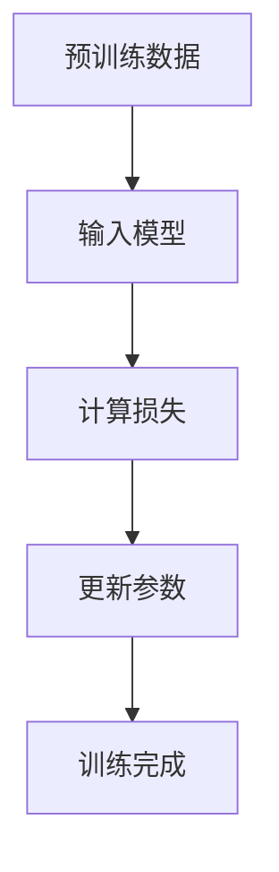
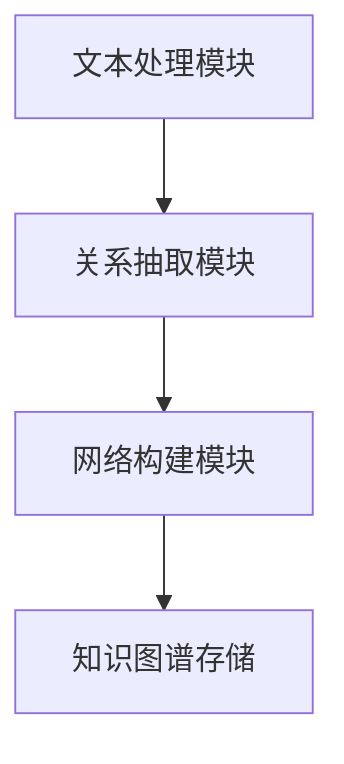

                 


```markdown
# 开发基于大模型的金融专业词汇网络构建器

> 关键词：大模型，金融词汇网络，知识图谱，自然语言处理，金融数据挖掘

> 摘要：本文详细探讨了基于大模型的金融专业词汇网络构建器的开发过程，从背景介绍、核心概念、算法原理到系统架构设计，再到项目实战，全面解析了构建金融专业词汇网络的关键技术与实现细节。通过本文，读者将能够深入了解如何利用大模型技术来构建高效的金融专业词汇网络，为金融数据分析和智能化应用提供强有力的支持。

---

## 第一部分: 背景介绍

### 第1章: 问题背景与描述

#### 1.1 问题背景
金融领域的信息处理一直是一个复杂的挑战。随着金融市场的发展，金融数据的规模和复杂性急剧增加，传统的信息处理方法难以满足现代金融分析的需求。金融专业词汇的多样性和语义的复杂性使得手动构建词汇网络的效率低下且容易出错。而大模型技术的出现，为自动构建金融专业词汇网络提供了新的可能性。

#### 1.2 问题描述
金融专业词汇网络的构建需要考虑以下几个方面：
- **词汇的多样性**：金融领域涉及大量的专业术语、缩写和特定的表达方式。
- **语义的复杂性**：相同的词汇在不同的上下文中可能有不同的含义。
- **数据的动态性**：金融市场数据不断更新，词汇网络需要能够动态适应这些变化。

传统的基于规则的词汇网络构建方法难以应对这些挑战，而大模型技术通过其强大的自然语言处理能力，能够有效捕捉词汇之间的语义关系，从而构建更准确和全面的词汇网络。

#### 1.3 问题解决与边界
大模型在金融词汇网络构建中的作用主要体现在以下几个方面：
- 提供高效的语义理解能力。
- 自动提取词汇之间的关系。
- 支持动态更新和扩展。

在实现过程中，需要明确问题的边界，例如：
- 限定于特定的金融领域（如股票、债券、基金等）。
- 专注于构建词汇网络，而非其他类型的知识图谱。

### 第2章: 核心概念与联系

#### 2.1 大模型与金融词汇网络的关系
大模型通过其强大的自然语言处理能力，能够从大量的金融文本中提取出词汇之间的语义关系，从而构建金融专业词汇网络。这种关系体现在以下几个方面：
- **语义理解**：大模型能够准确理解金融文本中的语义关系。
- **知识表示**：通过词汇网络的形式，将金融知识以结构化的方式表示出来。
- **动态更新**：随着金融市场数据的变化，词汇网络能够动态更新。

#### 2.2 核心概念原理
金融词汇网络的构建基于以下几个核心概念：
- **词汇节点**：代表具体的金融词汇。
- **语义边**：表示词汇之间的语义关系。
- **网络结构**：通过节点和边的组合，形成一个完整的词汇网络。

大模型在构建词汇网络中的作用主要体现在以下几个方面：
- **特征提取**：从文本中提取词汇的特征。
- **关系挖掘**：挖掘词汇之间的语义关系。
- **网络构建**：基于提取的特征和挖掘的关系，构建词汇网络。

#### 2.3 概念属性对比表
以下表格展示了大模型和金融词汇网络在核心概念上的对比：

| 概念 | 属性 | 描述 |
|------|------|------|
| 词汇网络 | 节点 | 金融专业词汇 |
|        | 边   | 词汇间的语义关系 |
| 大模型 | 输入 | 文本数据 |
|        | 输出 | 词汇网络结构 |

#### 2.4 ER实体关系图
以下是一个简单的ER实体关系图，展示了金融词汇网络的主要实体及其关系：

```mermaid
er
actor: User
actor --> entity: 金融词汇网络
entity --> entity: 词汇节点
entity --> entity: 语义边
```

---

## 第二部分: 算法原理讲解

### 第3章: 大模型训练与优化

#### 3.1 算法概述
大模型的训练过程主要包括预训练和微调两个阶段。预训练阶段通过大量的金融文本数据，训练模型理解金融领域的语义关系。微调阶段则基于特定的金融任务（如词汇关系挖掘）进行模型优化。

#### 3.2 算法流程
以下是大模型训练的主要流程：



#### 3.3 预训练过程
预训练的目标是使模型能够理解金融文本的基本语义关系。常用的预训练方法包括：
- **词嵌入训练**：通过词嵌入模型（如Word2Vec）提取词汇的语义表示。
- **上下文表示**：通过上下文模型（如BERT）捕捉词汇的上下文语义。

#### 3.4 微调过程
微调的目标是使模型能够适应特定的金融词汇网络构建任务。常用的微调方法包括：
- **关系抽取**：训练模型识别词汇之间的语义关系。
- **网络构建**：基于提取的关系，构建词汇网络。

---

## 第三部分: 系统分析与架构设计

### 第4章: 系统分析

#### 4.1 问题场景介绍
金融专业词汇网络构建系统主要用于以下场景：
- **金融数据分析**：帮助分析师快速理解金融数据。
- **智能搜索**：提供基于语义的金融信息搜索服务。
- **知识图谱构建**：支持金融知识图谱的构建和应用。

#### 4.2 系统功能设计
以下是系统的主要功能模块：
- **文本处理模块**：负责处理输入的金融文本数据。
- **关系抽取模块**：提取词汇之间的语义关系。
- **网络构建模块**：基于提取的关系，构建词汇网络。

#### 4.3 系统架构设计
以下是系统的架构设计：



---

## 第四部分: 项目实战

### 第5章: 项目实战

#### 5.1 环境安装
以下是开发环境的安装步骤：
1. 安装Python和相关库（如TensorFlow、Keras）。
2. 安装大模型框架（如BERT）。
3. 安装自然语言处理库（如spaCy）。

#### 5.2 核心代码实现
以下是构建金融词汇网络的核心代码：

```python
# 词嵌入训练
from tensorflow.keras.layers import Dense, Embedding, Input
from tensorflow.keras.models import Model

input_layer = Input(shape=(max_length,))
embedding_layer = Embedding(input_dim=vocabulary_size, output_dim=embedding_dim)(input_layer)
dense_layer = Dense(units=output_dim, activation='relu')(embedding_layer)
model = Model(inputs=input_layer, outputs=dense_layer)
model.compile(optimizer='adam', loss='binary_crossentropy')
model.fit(X_train, y_train, epochs=10, batch_size=32)

# 关系抽取
from tensorflow.keras.layers import Bidirectional, LSTM
from tensorflow.keras.models import Model

input_layer = Input(shape=(max_length,))
lstm_layer = Bidirectional(LSTM(units=hidden_dim, return_sequences=True))(input_layer)
dense_layer = Dense(units=output_dim, activation='sigmoid')(lstm_layer)
model = Model(inputs=input_layer, outputs=dense_layer)
model.compile(optimizer='adam', loss='binary_crossentropy')
model.fit(X_train, y_train, epochs=10, batch_size=32)
```

#### 5.3 实际案例分析
以下是一个实际案例分析：
1. 输入金融文本数据。
2. 提取词汇的语义表示。
3. 构建词汇网络。
4. 可视化词汇网络。

---

## 第五部分: 总结

### 第6章: 总结
本文详细探讨了基于大模型的金融专业词汇网络构建器的开发过程。从背景介绍到算法原理，再到系统架构设计和项目实战，全面解析了构建金融专业词汇网络的关键技术与实现细节。通过本文，读者能够深入了解如何利用大模型技术构建高效的金融专业词汇网络，为金融数据分析和智能化应用提供强有力的支持。

### 6.1 最佳实践 tips
- 在开发过程中，建议使用预训练的大模型框架（如BERT）。
- 在处理金融文本时，需要注意数据的多样性和代表性。
- 在构建词汇网络时，建议结合领域专家的知识进行验证和优化。

### 6.2 小结
本文总结了基于大模型的金融专业词汇网络构建器的主要内容和实现方法，为后续的研究和应用提供了重要的参考。

### 6.3 注意事项
- 在处理金融数据时，需要注意数据的隐私和安全性。
- 在构建词汇网络时，需要考虑数据的动态性和实时性。

### 6.4 拓展阅读
- 《Large Language Models for Financial Analysis》
- 《Knowledge Graph Construction in Finance》

---

以上是《开发基于大模型的金融专业词汇网络构建器》的完整目录大纲，涵盖了从背景介绍到项目实战的各个方面，旨在为读者提供一个全面的技术指南。
```

