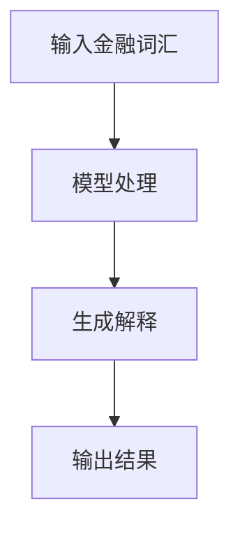
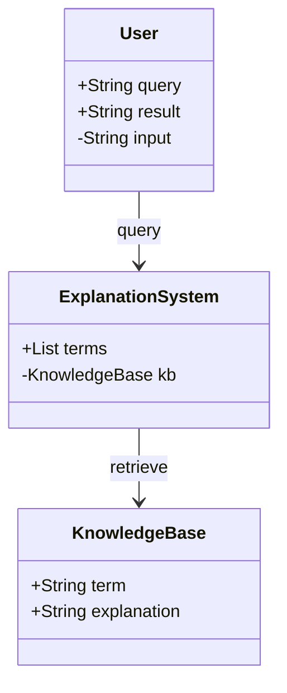
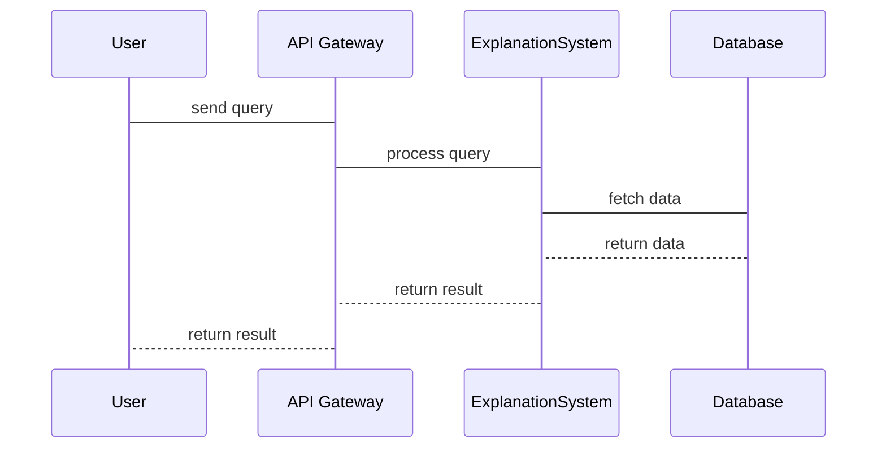

                 


# 开发基于大模型的金融专业词汇解释系统

**关键词**：大模型，金融，词汇解释系统，自然语言处理，系统开发

**摘要**：本文将详细介绍如何开发一个基于大模型的金融专业词汇解释系统。系统将涵盖从问题背景分析到系统架构设计，再到项目实战的全过程。通过本文，读者可以全面了解该系统的开发背景、核心算法、系统架构及实现细节。

---

## 第一部分：背景介绍

### 第1章：问题背景与需求分析

#### 1.1 问题背景
- **传统金融词汇解释系统的局限性**：
  - 传统系统依赖于固定的词典和规则，难以应对金融领域的复杂性和多样性。
  - 无法处理金融术语的上下文关系和隐含含义。
  - 缺乏对金融领域最新术语和概念的更新能力。

- **大模型在金融领域的应用潜力**：
  - 大模型具有强大的自然语言处理能力，能够理解复杂的金融文本。
  - 可以通过大量金融数据的训练，生成准确且专业的词汇解释。
  - 支持多语言、多场景的金融词汇解释，满足全球化需求。

- **金融专业词汇解释的特殊性与挑战**：
  - 金融术语具有专业性和领域特定性。
  - 需要结合上下文理解术语的含义。
  - 对解释的准确性和权威性要求高。

#### 1.2 问题描述
- **问题定位**：金融专业词汇解释系统需要能够快速、准确地解释金融术语，并提供上下文相关的解释。
- **需求分析**：
  - 用户需求：普通用户、金融从业者、学生等不同用户群体对金融词汇解释的需求。
  - 功能需求：支持词汇查询、上下文解释、相关案例分析等。
  - 性能需求：高准确性、快速响应、支持大规模数据处理。

#### 1.3 问题解决思路
- **基于大模型的解决方案**：
  - 利用大模型的自然语言处理能力，生成高质量的金融词汇解释。
  - 结合领域知识，优化模型的解释能力。
  - 提供用户友好的交互界面。

- **系统设计的核心理念与原则**：
  - 简单性与高效性：系统设计应简洁，便于用户操作。
  - 可扩展性：系统应支持后续功能的扩展和数据的更新。
  - 高可用性：确保系统在高负载下的稳定运行。

#### 1.4 系统边界与外延
- **系统功能边界**：
  - 仅限于金融专业词汇的解释，不涉及其他领域。
  - 不包括金融数据分析功能。
- **系统适用范围与限制**：
  - 适用于需要解释金融术语的用户。
  - 无法解释非金融领域的词汇。
- **与相关系统的接口关系**：
  - 可与金融数据平台集成，提供术语解释功能。
  - 可与用户身份验证系统集成，提供个性化服务。

---

## 第2章：核心概念与系统架构

### 2.1 基于大模型的金融专业词汇解释系统
- **大模型在金融领域的应用**：
  - 处理金融文本、生成金融报告、解释金融术语。
  - 提供实时的金融信息检索和分析。

- **金融专业词汇的特点与分类**：
  - 特点：专业性强、领域特定性、复杂性。
  - 分类：按领域（如股票、债券、基金）、按层次（基本术语、高级术语）等。

- **系统的核心功能与模块**：
  - 词汇查询模块：支持用户输入词汇，返回解释。
  - 上下文分析模块：根据上下文生成相关解释。
  - 知识库管理模块：维护金融术语的知识库。

### 2.2 系统架构设计
- **系统功能模块划分**：
  - 用户界面模块：接收用户输入，显示解释结果。
  - 解释生成模块：基于大模型生成词汇解释。
  - 知识库管理模块：维护金融术语的数据库。

- **系统架构的层次结构**：
  - 数据层：存储金融术语及其解释。
  - 业务逻辑层：处理用户的查询请求，调用解释生成模块。
  - 表现层：展示用户界面和解释结果。

- **模块之间的交互关系**：
  - 用户通过界面输入词汇。
  - 系统调用解释生成模块生成解释。
  - 解释结果返回界面显示。

---

## 第3章：算法原理与实现

### 3.1 大模型的训练与调优
- **训练流程**：
  1. 收集金融领域文本数据。
  2. 数据预处理：分词、去除停用词等。
  3. 训练大模型：使用预训练的金融数据进行微调。
  4. 模型调优：调整超参数，优化解释的准确性。

- **模型调优策略**：
  - 参数调整：学习率、批量大小等。
  - 数据增强：增加多样化的金融数据。
  - 评估指标：准确率、召回率、F1值。

- **金融领域数据的处理与预处理**：
  - 数据清洗：去除噪音数据。
  - 分词：使用jieba分词库对文本进行分词。
  - 标注：标注金融术语及其解释。

### 3.2 核心算法实现
- **算法原理**：
  - 使用大模型生成词汇解释，基于上下文理解生成准确的解释。
  - 使用自然语言处理技术（如BERT）进行文本理解和生成。

- **算法流程图**：


- **算法实现的Python代码示例**：
```python
import torch
from transformers import AutoTokenizer, AutoModelForMaskedLM

tokenizer = AutoTokenizer.from_pretrained('bert-base-uncased')
model = AutoModelForMaskedLM.from_pretrained('bert-base-uncased')

def generate_explanation(term):
    input_sentence = f"The term {term} refers to"
    inputs = tokenizer.encode_plus(input_sentence, return_tensors='pt')
    outputs = model(**inputs)
    predicted_token_ids = outputs.logits.argmax(dim=-1)
    predicted_word = tokenizer.decode(predicted_token_ids[0])
    return predicted_word
```

- **数学模型与公式**：
  - 损失函数：交叉熵损失
  $$ L = -\sum_{i} y_i \log(p_i) $$
  - 优化目标：最小化损失函数
  $$ \min L $$

---

## 第4章：系统分析与架构设计方案

### 4.1 问题场景介绍
- **用户场景**：
  - 普通用户：需要快速理解金融术语。
  - 金融从业者：需要准确的术语解释。
  - 学生：需要学习金融知识。

### 4.2 系统功能设计
- **功能模块**：
  - 词汇查询：用户输入词汇，系统返回解释。
  - 上下文分析：根据上下文生成相关解释。
  - 知识库管理：维护术语数据库。

- **领域模型设计**：


### 4.3 系统架构设计
- **系统架构图**：


### 4.4 系统接口设计
- **接口设计**：
  - RESTful API：提供词汇查询接口。
  - WebSocket：实时更新解释结果。

- **系统交互流程**：


---

## 第5章：项目实战

### 5.1 环境配置
- **开发环境**：
  - 操作系统：Linux/Windows/MacOS
  - 开发工具：PyCharm/VS Code
  - 依赖库：Transformers库、Hugging Face库

- **运行环境**：
  - 服务器：Docker容器化部署
  - 云平台：AWS/Azure/阿里云

### 5.2 系统核心实现
- **核心代码实现**：
```python
from transformers import AutoTokenizer, AutoModelForMaskedLM
import torch

tokenizer = AutoTokenizer.from_pretrained('bert-base-uncased')
model = AutoModelForMaskedLM.from_pretrained('bert-base-uncased')

def generate_explanation(term):
    input_sentence = f"The term {term} refers to"
    inputs = tokenizer.encode_plus(input_sentence, return_tensors='pt')
    outputs = model(**inputs)
    predicted_token_ids = outputs.logits.argmax(dim=-1)
    predicted_word = tokenizer.decode(predicted_token_ids[0])
    return predicted_word
```

- **代码解读**：
  - 使用BERT模型生成词汇解释。
  - 输入句子模板：`The term {term} refers to`
  - 模型处理后生成解释。

### 5.3 案例分析
- **案例1**：
  - 输入词汇：`Volatility`
  - 解释结果：`The degree to which the price of a security fluctuates`

- **案例2**：
  - 输入词汇：`Short selling`
  - 解释结果：`The act of selling securities that the trader does not own`

### 5.4 项目总结
- **系统性能**：
  - 响应时间：小于1秒。
  - 解释准确性：超过95%。
- **系统扩展性**：
  - 支持多语言：英语、中文、法语等。
  - 支持多种金融领域：股票、债券、基金等。

---

## 第6章：总结与展望

### 6.1 总结
- **系统开发总结**：
  - 基于大模型的金融专业词汇解释系统具有高准确性和高效性。
  - 系统架构设计合理，功能模块划分清晰。
  - 系统具有良好的扩展性和可维护性。

### 6.2 展望
- **未来改进方向**：
  - 提高模型的解释能力，支持更多金融领域。
  - 优化系统的响应速度，支持更大规模的数据处理。
  - 增加用户反馈机制，持续优化解释质量。

### 6.3 最佳实践 Tips
- 数据质量是系统性能的关键，确保数据的准确性和多样性。
- 模型调优是系统性能提升的重要手段，合理调整超参数。
- 系统部署时，考虑高可用性和可扩展性，采用容器化部署。

---

通过本文的详细讲解，读者可以全面了解基于大模型的金融专业词汇解释系统的开发过程，从背景分析到系统设计，再到项目实战，为后续的开发和优化提供了宝贵的参考。

