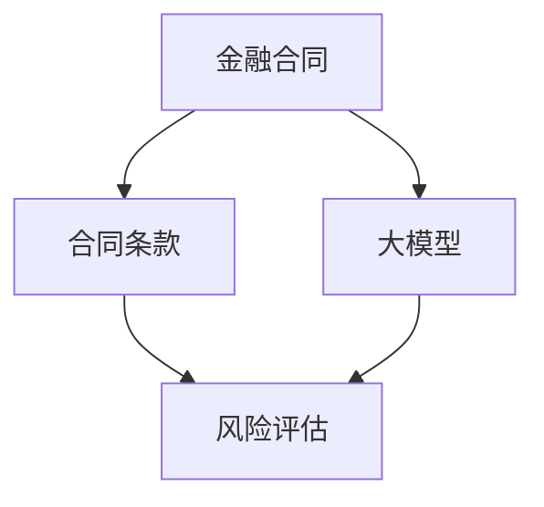
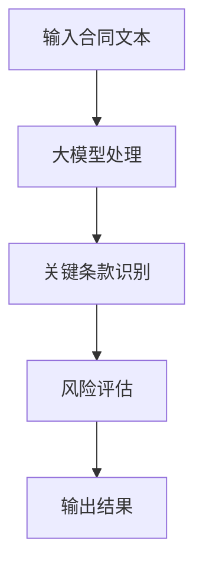

                 


# 开发基于大模型的金融合同审核系统

## 关键词：大模型、金融合同审核、自然语言处理、系统架构、算法原理

## 摘要：  
随着人工智能技术的快速发展，大模型在金融领域的应用越来越广泛。本文详细探讨了基于大模型的金融合同审核系统的开发过程，从问题背景、核心概念到算法原理、系统架构，再到项目实战和最佳实践，全面解析了如何利用大模型技术实现金融合同的智能化审核。本文旨在为相关领域的开发人员和研究人员提供理论支持和实践指导。

---

# 第1章: 金融合同审核的智能化需求

## 1.1 传统金融合同审核的痛点  
传统的金融合同审核过程主要依赖人工操作，存在以下痛点：  
1. **低效性**：人工审核需要逐条检查合同条款，耗时长且效率低下。  
2. **主观性**：审核人员的个人经验和判断可能影响审核结果的客观性。  
3. **复杂性**：金融合同条款复杂，涉及法律、财务等多个领域，人工理解难度大。  

## 1.2 大模型技术的兴起与应用潜力  
大模型技术（如GPT系列）凭借其强大的自然语言处理能力，为金融合同审核的智能化提供了新的可能性。大模型的核心优势包括：  
1. **高效性**：通过自动化处理，大幅缩短审核时间。  
2. **准确性**：基于大量数据训练，能够准确理解合同条款并识别关键信息。  
3. **可扩展性**：适用于多种金融场景，支持大规模数据处理。  

## 1.3 本章小结  
本章分析了传统金融合同审核的痛点，并介绍了大模型技术的核心优势及其在金融领域的应用潜力，为后续章节的展开奠定了基础。

---

# 第2章: 大模型与金融合同审核的结合

## 2.1 大模型的基本原理  
大模型是一种基于深度学习的自然语言处理模型，其基本原理包括：  
1. **大规模数据训练**：通过海量文本数据进行预训练，提取语言特征。  
2. **多层神经网络**：利用多层结构捕捉上下文信息，理解文本含义。  
3. **生成与理解结合**：通过生成式模型，实现文本的理解与生成。  

## 2.2 金融合同审核的核心需求  
金融合同审核的核心需求包括：  
1. **合同内容理解**：准确理解合同条款，包括法律术语和专业术语。  
2. **关键条款识别**：识别合同中的关键条款（如违约责任、支付条款等）。  
3. **合规性审查**：根据相关法律法规，判断合同是否合规。  

## 2.3 大模型在金融合同审核中的应用场景  
大模型在金融合同审核中的应用场景包括：  
1. **合同内容自动分类**：根据合同类型（如贷款合同、保险合同）进行分类。  
2. **关键条款识别**：自动提取合同中的关键条款并生成风险提示。  
3. **合同生成与模板优化**：基于大模型生成标准合同模板，优化合同结构。  

## 2.4 本章小结  
本章详细介绍了大模型的基本原理，并结合金融合同审核的核心需求，探讨了大模型在该领域的应用场景。

---

# 第3章: 金融合同审核系统的核心概念与联系

## 3.1 核心概念原理  
1. **大模型的文本理解机制**：通过上下文理解和生成，实现合同条款的自动解析。  
2. **金融合同的关键要素识别**：利用大模型识别合同中的关键要素（如金额、时间、责任等）。  
3. **智能化审核流程**：从合同输入到结果输出的全流程自动化处理。  

## 3.2 核心概念属性特征对比表格  
| 特征 | 传统审核 | 智能化审核 |
|------|----------|------------|
| 效率 | 低效     | 高效       |
| 准确率 | 易错     | 高         |
| 成本 | 高       | 低         |

## 3.3 ER实体关系图  


## 3.4 本章小结  
本章通过对比分析和实体关系图，详细阐述了金融合同审核系统的核心概念及其内在联系。

---

# 第4章: 基于大模型的金融合同审核算法原理

## 4.1 算法原理概述  
1. **大模型的训练流程**：包括预训练和微调两个阶段，预训练提取通用语言特征，微调针对金融合同任务进行优化。  
2. **文本理解与生成机制**：通过编码器-解码器结构实现合同文本的理解与生成。  
3. **监督学习与微调策略**：利用标注数据对大模型进行微调，提升模型在特定任务上的性能。  

## 4.2 算法流程图  


## 4.3 算法数学模型  
1. **概率论基础**：  
   $$P(\text{事件A}) = \frac{\text{事件A的有利情况数}}{\text{总情况数}}$$  
2. **损失函数**：  
   $$L = -\frac{1}{N}\sum_{i=1}^{N} \log P(y_i|\mathbf{x}_i)$$  

## 4.4 本章小结  
本章详细介绍了基于大模型的金融合同审核算法原理，并通过流程图和数学公式进行了直观展示。

---

# 第5章: 金融合同审核系统的架构设计

## 5.1 系统功能设计  
1. **领域模型设计**：  
   ```mermaid
   classDiag
   class 金融合同 {
       - 合同ID: String
       - 合同内容: String
       - 创建时间: Date
   }
   class 合同条款 {
       - 条款ID: String
       - 条款内容: String
       - 风险等级: Integer
   }
   ```

2. **系统架构设计**：  
   ```mermaid
   graph TD
   A[前端] --> B[API Gateway]
   B --> C[合同审核服务]
   C --> D[大模型服务]
   C --> E[数据库]
   ```

3. **系统接口设计**：  
   - 输入接口：接收合同文本并触发审核流程。  
   - 输出接口：返回审核结果，包括关键条款识别和风险评估。  

4. **系统交互流程图**：  
   ```mermaid
   sequenceDiagram
   participant 前端
   participant API Gateway
   participant 合同审核服务
   participant 大模型服务
   participant 数据库
   前端 -> API Gateway: 提交合同文本
   API Gateway -> 合同审核服务: 调用审核接口
   合同审核服务 -> 大模型服务: 获取模型结果
   合同审核服务 -> 数据库: 存储审核结果
   合同审核服务 -> 前端: 返回审核结果
   ```

## 5.2 本章小结  
本章通过领域模型、架构图和交互流程图，详细描述了金融合同审核系统的架构设计。

---

# 第6章: 项目实战

## 6.1 环境安装与配置  
1. **安装Python环境**：推荐使用Anaconda或虚拟环境。  
2. **安装相关库**：如TensorFlow、Keras、Hugging Face Transformers等。  
3. **配置GPU支持**（可选）：安装NVIDIA显卡驱动和CUDA工具链。  

## 6.2 系统核心实现  
### 6.2.1 数据预处理  
```python
def preprocess合同文本(合同文本):
    # 分词处理
    tokens = tokenizer.tokenize(合同文本)
    # 转换为模型输入格式
    input_ids = tokenizer.encode(合同文本, return_tensors='pt')
    return input_ids
```

### 6.2.2 模型训练与微调  
```python
from transformers import AutoModelForSequenceClassification, AutoTokenizer

model = AutoModelForSequenceClassification.from_pretrained('bert-base-uncased')
tokenizer = AutoTokenizer.from_pretrained('bert-base-uncased')

# 微调模型
model.train()
```

### 6.2.3 API开发与测试  
```python
@app.route('/审核合同', methods=['POST'])
def 审核合同():
    合同文本 = request.json['合同文本']
    input_ids = preprocess合同文本(合同文本)
    outputs = model(input_ids)
    return jsonify({'审核结果': outputs})
```

## 6.3 实际案例分析  
以一份贷款合同为例，系统可以自动识别关键条款（如利率、还款期限）并生成风险评估报告。  

## 6.4 本章小结  
本章通过代码实现和实际案例分析，详细展示了基于大模型的金融合同审核系统的开发过程。

---

# 第7章: 最佳实践与小结

## 7.1 小结  
本文详细探讨了基于大模型的金融合同审核系统的开发过程，从问题背景到系统架构，再到项目实战，全面解析了系统的实现细节。  

## 7.2 注意事项  
1. **数据质量**：确保训练数据的多样性和代表性。  
2. **模型调优**：根据实际需求对模型进行微调和优化。  
3. **系统安全**：保护金融数据的安全性，防止数据泄露。  

## 7.3 拓展阅读  
推荐以下书籍和论文：  
- 《Deep Learning》——Ian Goodfellow  
- 《Transformers: A Tutorial》——Vaswswan et al.  

## 7.4 本章小结  
本章总结了全文内容，并给出了开发过程中的注意事项和拓展阅读建议。

---

# 结语  
随着大模型技术的不断进步，金融合同审核的智能化水平将不断提高。本文为相关领域的开发人员和研究人员提供了理论支持和实践指导，希望未来能够进一步优化系统，推动金融行业的智能化转型。

