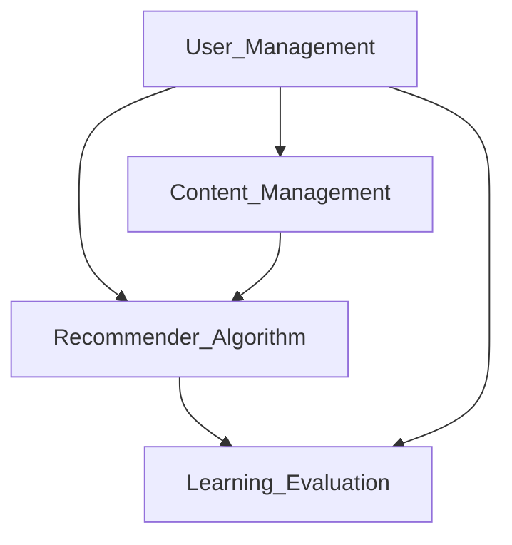
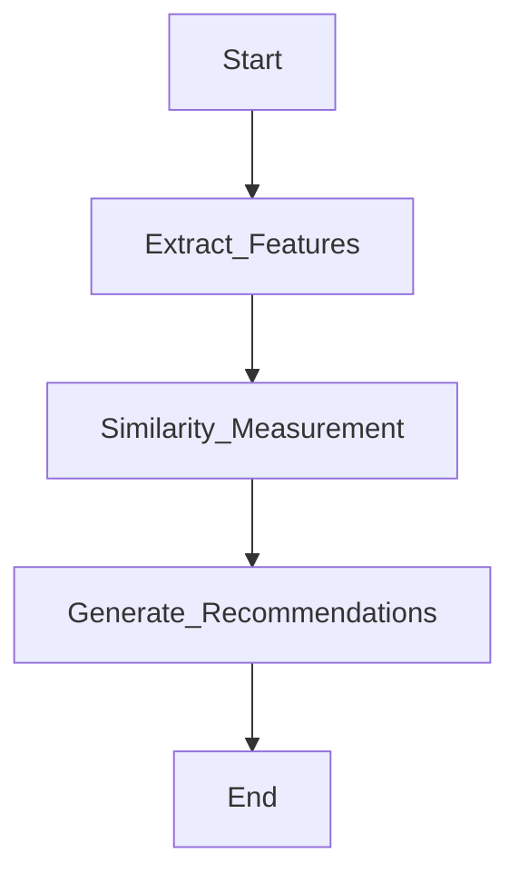
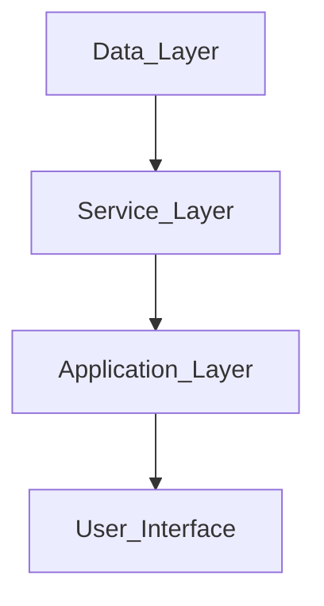
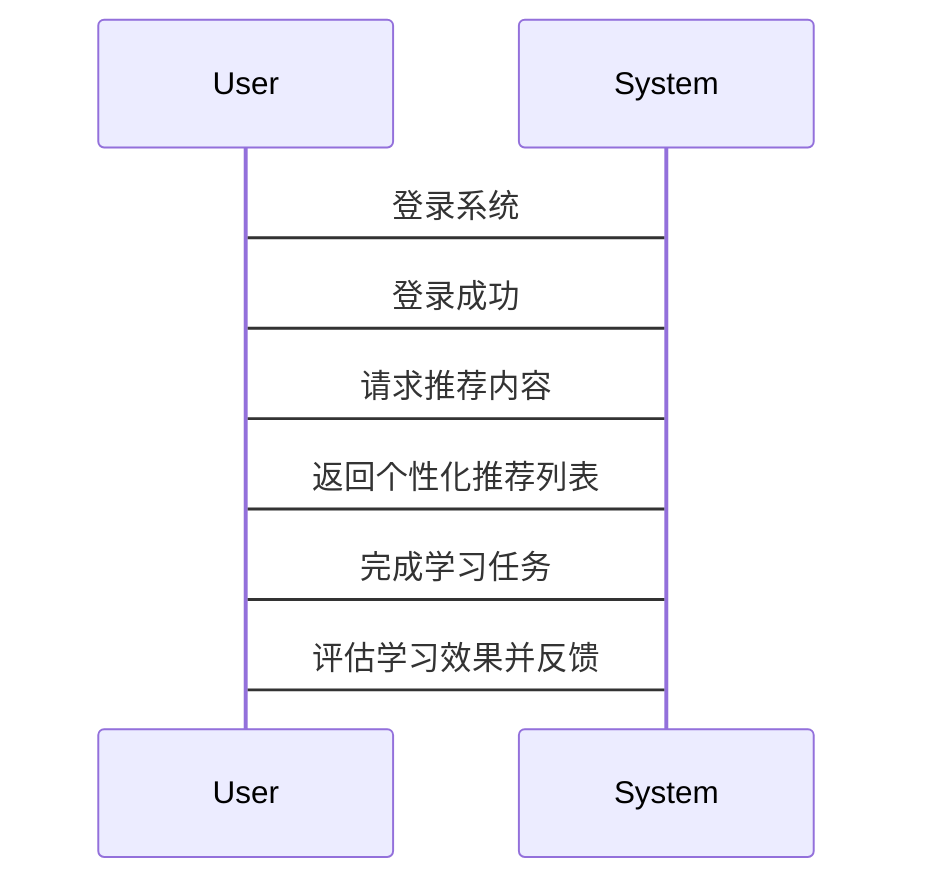
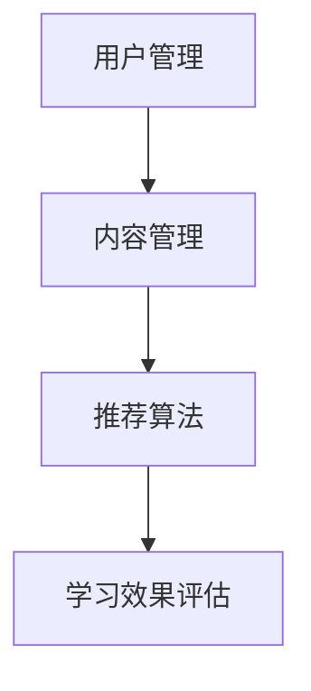

                 


# 开发基于大模型的金融合规培训个性化学习系统

> 关键词：大模型，金融合规，个性化学习，系统架构，算法设计

> 摘要：本文系统地探讨了如何利用大模型技术开发金融合规培训的个性化学习系统。文章首先分析了传统金融合规培训的痛点与挑战，提出了基于大模型的解决方案。随后，详细阐述了大模型在个性化学习中的核心概念与技术实现，包括模型结构、训练方法和推荐算法。接着，从系统架构与算法设计的角度，分析了系统的功能模块、架构图和交互流程。最后，通过项目实战部分，给出了系统的实现方案与代码示例，并总结了项目成果与未来展望。

---

# 第一部分: 金融合规培训个性化学习系统背景与需求

## 第1章: 问题背景与目标

### 1.1 金融合规培训的现状与挑战

金融行业是一个高度监管的领域，合规性是金融机构运营的核心要求。传统的合规培训通常采用统一的课程和教学方式，难以满足不同岗位、不同背景员工的个性化学习需求。此外，传统培训方式还存在以下痛点：

- **学习效率低**：学员被动接受固定内容，缺乏针对性，学习效果不佳。
- **成本高**：传统培训需要大量的人力和时间，且难以规模化。
- **内容更新慢**：金融法规更新频繁，传统模式难以快速响应。

通过引入大模型技术，可以实现个性化学习路径的自动推荐，提升学习效率和效果，同时降低培训成本。

### 1.2 问题描述与目标设定

本系统的目标是开发一个基于大模型的金融合规培训个性化学习系统，能够根据学员的岗位需求、知识水平和学习习惯，动态生成个性化的学习内容和推荐计划。具体目标包括：

- **动态知识图谱构建**：根据金融法规和岗位需求，构建动态更新的知识图谱。
- **个性化推荐算法**：基于大模型的推荐算法，实现个性化学习内容的自动推荐。
- **学习效果评估**：通过实时监测和分析学员的学习行为，评估学习效果并优化推荐策略。

### 1.3 系统设计的核心要素

- **用户画像**：基于学员的岗位、学历、经验等信息，构建用户画像。
- **内容推荐算法**：结合大模型的特征提取能力，实现精准的内容推荐。
- **系统性能指标**：包括响应时间、推荐准确率、学习效果提升率等。

---

# 第二部分: 大模型与个性化学习的核心概念

## 第2章: 大模型技术基础

### 2.1 大模型的基本原理

大模型（如GPT、BERT等）基于Transformer架构，通过自注意力机制和前馈网络实现强大的文本理解和生成能力。其核心原理包括：

- **自注意力机制**：模型能够关注输入文本中不同位置的重要性，生成长距离依赖关系。
- **多层前馈网络**：通过多层非线性变换，增强模型的表达能力。
- **预训练与微调**：通过大规模数据预训练，再针对特定任务进行微调。

### 2.2 大模型在个性化学习中的应用

大模型在金融合规培训中的应用主要体现在以下几个方面：

- **内容生成与推荐**：基于学员的背景和需求，生成个性化的学习内容。
- **用户行为分析**：通过分析学员的学习行为，优化推荐策略。
- **交互式学习体验**：支持自然语言交互，提升学习体验。

### 2.3 大模型与其他技术的结合

- **NLP技术的融合**：利用自然语言处理技术，实现文本的自动理解和生成。
- **知识图谱的构建与应用**：通过知识图谱构建金融领域的知识体系，辅助推荐算法。
- **数据隐私保护**：采用数据脱敏和联邦学习等技术，保护用户隐私。

---

# 第三部分: 系统架构与算法设计

## 第3章: 系统功能设计

### 3.1 系统功能模块划分

系统主要功能模块包括：

- **用户管理模块**：负责用户注册、登录和信息管理。
- **内容管理模块**：管理和维护金融合规相关的学习内容。
- **推荐算法模块**：根据用户画像和学习行为，推荐个性化内容。
- **学习效果评估模块**：监测和评估学员的学习效果。

### 3.2 系统功能设计图

以下是一个简化的系统功能模块图（Mermaid）：



### 3.3 系统功能实现细节

- **用户画像构建**：基于岗位信息、学习记录等数据，构建用户画像。
- **内容标签化处理**：对金融合规内容进行多维度标签化，便于推荐算法处理。
- **推荐策略优化**：采用基于大模型的推荐算法，动态调整推荐策略。

---

## 第4章: 算法原理与实现

### 4.1 推荐算法原理

推荐算法基于大模型的特征提取能力，结合协同过滤和深度学习方法。算法流程如下（Mermaid）：



### 4.2 核心算法代码实现

以下是基于大模型的推荐算法实现代码示例：

```python
import tensorflow as tf
from tensorflow.keras.layers import Dense, InputLayer

# 定义模型
model = tf.keras.Sequential([
    InputLayer(input_shape=(input_dim,)),
    Dense(64, activation='relu'),
    Dense(1, activation='sigmoid')
])

# 编译模型
model.compile(optimizer='adam', loss='binary_crossentropy', metrics=['accuracy'])

# 训练模型
model.fit(X_train, y_train, epochs=10, batch_size=32)
```

---

## 第5章: 系统架构与设计

### 5.1 系统架构设计

系统架构采用分层设计，包括数据层、服务层和应用层。架构图如下（Mermaid）：



### 5.2 系统交互流程

系统交互流程如下（Mermaid）：



---

## 第6章: 项目实战与系统实现

### 6.1 环境搭建与数据准备

- **开发环境**：Python 3.8+，TensorFlow 2.0+
- **数据集**：金融合规相关文本数据、用户行为数据

### 6.2 系统核心代码实现

以下是推荐算法的实现代码：

```python
def generate_recommendations(user_id):
    # 获取用户画像
    user_profile = get_user_profile(user_id)
    # 提取特征
    features = extract_features(user_profile)
    # 生成推荐内容
    recommendations = model.predict(features)
    return recommendations
```

### 6.3 实际案例分析

通过一个实际案例，分析系统在某金融机构的应用效果。例如，针对一名风险管理岗位的学员，系统会推荐与风险管理相关的法规解读和案例分析内容，显著提升学习效果。

---

## 第7章: 最佳实践与总结

### 7.1 项目成果总结

- 成功开发了一个基于大模型的金融合规培训个性化学习系统。
- 系统实现了动态知识图谱构建、个性化推荐和学习效果评估功能。

### 7.2 注意事项与建议

- 数据隐私保护是系统设计中的重要考虑因素。
- 系统上线后需要持续优化推荐算法和知识图谱。

### 7.3 未来展望

未来可以进一步探索大模型在金融合规培训中的更多应用场景，例如智能问答、虚拟教学助手等。

---

## 第8章: 拓展阅读

- 推荐阅读《大模型在金融领域的应用》
- 参考资料：相关学术论文和开源项目

---

# 附录

## 附录A: 算法公式

大模型的损失函数可以表示为：

$$
\text{Loss} = -\sum_{i=1}^{n} y_i \log(p(y_i)) + (1 - y_i) \log(1 - p(y_i))
$$

其中，$y_i$ 是真实标签，$p(y_i)$ 是模型预测的概率。

---

## 附录B: 系统架构图

系统架构图如图所示（Mermaid）：



---

通过以上步骤，我们可以系统地开发一个基于大模型的金融合规培训个性化学习系统，为金融机构提供高效、个性化的培训解决方案。

