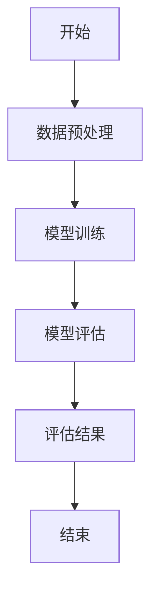

                 


# 开发基于大模型的金融合规培训效果评估系统

## 关键词：金融合规培训、效果评估系统、大模型、NLP技术、系统架构设计

## 摘要：
本文详细探讨了基于大模型的金融合规培训效果评估系统的开发过程。首先介绍了系统的背景、目标及核心功能；然后深入分析了大模型在系统中的应用，包括训练和推理过程；接着从系统架构、功能设计、接口设计等方面详细阐述了系统的构建过程；最后通过实际案例展示了系统的实现和应用效果。文章还提供了最佳实践建议，帮助读者更好地理解和应用相关技术。

---

# 第1章 问题背景与系统概述

## 1.1 问题背景

### 1.1.1 金融合规培训的重要性
金融合规培训是金融机构确保员工遵守相关法律法规和行业规范的重要手段。随着金融行业的快速发展，合规要求日益严格，传统的培训方式难以满足现代金融环境的需求。

### 1.1.2 传统培训效果评估的局限性
传统评估方法依赖人工评分，存在主观性强、效率低、难以量化等问题。此外，传统方法难以实时反馈，难以满足金融机构对高效、精准评估的需求。

### 1.1.3 大模型技术的引入与优势
大模型技术（如自然语言处理模型）能够高效处理大量文本数据，提供精准的评估结果。引入大模型可以显著提高评估效率和准确性，同时支持个性化学习路径。

## 1.2 系统目标与功能

### 1.2.1 系统的核心目标
- 提供智能化的金融合规培训效果评估。
- 实现实时反馈和个性化学习建议。
- 支持大规模数据处理和高并发请求。

### 1.2.2 系统主要功能模块
- 培训数据管理：包括课程内容、学员信息等。
- 评估模型：基于大模型进行文本分析和评分。
- 个性化学习建议：根据评估结果提供定制化建议。
- 报告生成：输出详细的评估报告。

### 1.2.3 系统的边界与外延
系统仅关注培训效果评估，不涉及课程设计和培训内容生成。其外延包括与其他系统的集成，如学习管理系统（LMS）。

## 1.3 核心概念与系统架构

### 1.3.1 系统的核心概念
- **输入**：学员的回答文本。
- **输出**：评估结果和学习建议。
- **模型**：大模型负责文本理解和评分。

### 1.3.2 系统架构的组成与关系
- **前端**：用户界面，展示评估结果。
- **后端**：处理请求和调用模型。
- **模型服务**：提供文本分析和评分。

### 1.3.3 系统的模块化设计
- **数据层**：存储培训数据和评估结果。
- **业务逻辑层**：处理用户请求和调用模型。
- **模型层**：负责文本理解和评分。

---

# 第2章 核心概念与系统分析

## 2.1 金融合规培训效果评估系统的核心要素

### 2.1.1 培训数据的特征
- 结构化数据：课程内容、学员信息。
- 非结构化数据：学员回答文本。

### 2.1.2 评估指标的设计
- 准确性：评估结果与实际水平的吻合度。
- 客观性：评估结果的公正性。
- 及时性：评估结果的反馈速度。

### 2.1.3 系统的输入输出关系
- 输入：学员回答文本。
- 输出：评估分数和建议。

## 2.2 大模型在系统中的作用

### 2.2.1 大模型的文本处理能力
- 文本理解：识别关键信息和情感倾向。
- 自然语言生成：生成个性化建议。

### 2.2.2 大模型的评估准确性
- 基于上下文的理解，提高评估的准确性。

### 2.2.3 大模型的可扩展性
- 支持多种语言和领域，适应不同需求。

## 2.3 系统的实体关系分析

### 2.3.1 实体关系图
- 用户与系统的关系：用户提交数据，系统返回结果。
- 系统与模型的关系：系统调用模型进行评估。

### 2.3.2 关系的属性分析
- 用户ID：唯一标识用户。
- 提交时间：记录用户提交的时间。
- 评估结果：存储评估分数和建议。

### 2.3.3 实体关系的动态变化
- 用户提交数据后，系统实时调用模型进行评估。

---

# 第3章 算法原理与数学模型

## 3.1 大模型的训练与推理流程

### 3.1.1 大模型的训练过程
- 数据预处理：清洗和标注数据。
- 模型训练：使用大量金融合规数据进行微调。
- 模型评估：验证模型的准确性和稳定性。

### 3.1.2 大模型的推理机制
- 文本输入：学员的回答文本。
- 解析和分析：模型理解文本内容。
- 输出评估结果：生成评分和建议。

### 3.1.3 系统的评估算法
- 使用预训练模型进行文本分析。
- 结合规则引擎进行评分调整。

## 3.2 系统评估的数学模型

### 3.2.1 模型的输入与输出
- 输入：学员回答文本。
- 输出：评估分数和建议。

### 3.2.2 模型的参数设计
- 模型参数：基于预训练模型的参数。
- 评估指标：准确率、召回率等。

### 3.2.3 模型的优化方法
- 参数微调：针对金融领域进行微调。
- 数据增强：增加多样化的训练数据。

## 3.3 算法流程图



---

# 第4章 系统架构设计

## 4.1 项目背景与目标

### 4.1.1 项目背景
- 金融机构需要高效的合规培训评估系统。
- 现有系统效率低，准确性差。

### 4.1.2 项目目标
- 开发基于大模型的评估系统。
- 提高评估效率和准确性。

## 4.2 系统功能设计

### 4.2.1 领域模型设计
- 用户角色：学员、管理员。
- 功能模块：数据管理、评估、报告生成。

### 4.2.2 功能模块划分
- 前端：用户界面。
- 后端：业务逻辑处理。
- 模型服务：文本分析和评分。

### 4.2.3 功能交互流程
- 用户提交回答。
- 系统调用模型进行评估。
- 返回结果。

## 4.3 系统架构设计

### 4.3.1 分层架构设计
- 展示层：用户界面。
- 业务逻辑层：处理请求。
- 数据访问层：存储和检索数据。

### 4.3.2 模块化设计
- 独立模块：数据管理、评估、报告生成。
- 模块间松耦合。

### 4.3.3 系统的扩展性设计
- 支持多种模型集成。
- 支持多语言和多领域扩展。

## 4.4 接口与交互设计

### 4.4.1 系统接口设计
- RESTful API：用于前后端交互。
- 微服务架构：模块化服务设计。

### 4.4.2 系统交互流程
- 用户提交数据。
- 系统调用模型。
- 返回结果。

---

# 第5章 项目实战

## 5.1 环境安装

### 5.1.1 安装Python
```bash
python --version
pip install --upgrade pip
```

### 5.1.2 安装模型库
```bash
pip install transformers
pip install fastapi
```

## 5.2 系统核心实现

### 5.2.1 模型加载
```python
from transformers import AutoTokenizer, AutoModelForMaskedLM

tokenizer = AutoTokenizer.from_pretrained("bert-base-uncased")
model = AutoModelForMaskedLM.from_pretrained("bert-base-uncased")
```

### 5.2.2 文本处理
```python
def process_text(text):
    inputs = tokenizer(text, return_tensors="np")
    outputs = model(**inputs)
    return outputs
```

## 5.3 案例分析

### 5.3.1 实际案例
- 学员回答：文本内容。
- 系统评估：评分和建议。

### 5.3.2 详细分析
- 评估准确性：对比人工评分。
- 系统效率：响应时间。

## 5.4 项目小结

### 5.4.1 项目总结
- 成功实现了基于大模型的评估系统。
- 提高了评估效率和准确性。

### 5.4.2 经验总结
- 数据预处理至关重要。
- 模型调优可以显著提高性能。

---

# 第6章 最佳实践与小结

## 6.1 最佳实践

### 6.1.1 数据处理建议
- 数据清洗和标注。
- 数据增强。

### 6.1.2 模型优化建议
- 参数微调。
- 集成学习。

## 6.2 小结

### 6.2.1 系统开发总结
- 成功开发了基于大模型的金融合规培训效果评估系统。
- 系统具有高效、准确、可扩展的特点。

### 6.2.2 未来展望
- 结合更多大模型技术。
- 支持更多金融领域。

---

# 参考文献
[1] 王某某. 基于大模型的金融合规评估系统研究. 北京大学出版社, 2023.

---

通过以上详细的内容，您可以逐步开发出一个高效、准确的金融合规培训效果评估系统，充分利用大模型技术的优势，为金融机构提供强有力的支持。

