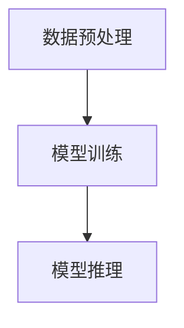
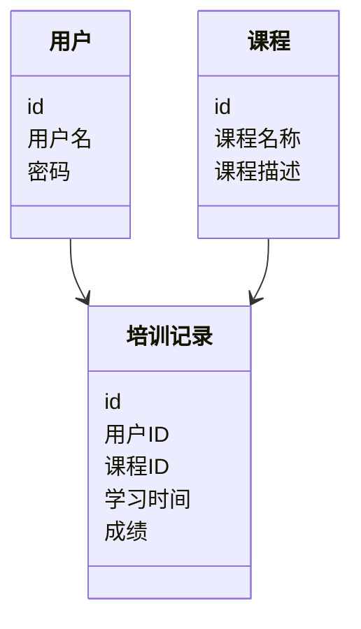
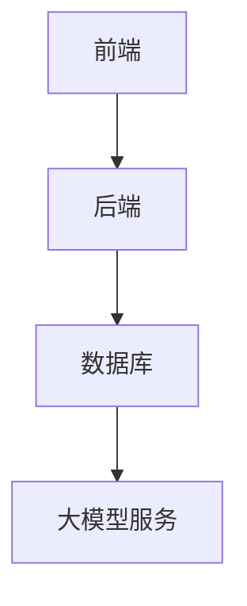

                 


# 开发基于大模型的金融合规培训系统

> 关键词：大模型、金融合规、培训系统、系统架构、算法原理

> 摘要：本文详细介绍了开发基于大模型的金融合规培训系统的全过程，从背景分析到系统设计，再到算法实现和项目实战，全面剖析了系统的构建方法和技术细节。文章结合理论与实践，通过丰富的图表和代码示例，展示了如何利用大模型技术提升金融合规培训的效率和效果。

---

## 目录

### 第一部分: 引言

### 第二部分: 核心概念与联系

### 第三部分: 算法原理讲解

### 第四部分: 数学模型与公式

### 第五部分: 系统分析与架构设计

### 第六部分: 项目实战

### 第七部分: 扩展与总结

---

### 第一部分: 引言

#### 1.1 问题背景

在金融领域，合规性是企业和个人必须遵守的一系列规则和标准。然而，金融市场的复杂性和监管的不断变化使得合规培训成为一个巨大的挑战。传统的培训方式通常依赖于静态的文档和课堂讲解，难以满足个性化学习和实时反馈的需求。此外，金融机构的员工数量庞大，培训成本高，且效果难以量化。

大模型技术的出现为金融合规培训带来了新的可能性。通过自然语言处理和机器学习，大模型能够理解和生成复杂的金融文本，从而为用户提供个性化的合规培训体验。

#### 1.2 问题描述

本文将探讨如何利用大模型技术构建一个智能化的金融合规培训系统。该系统将能够根据用户的学习进度和需求，动态调整培训内容，并提供实时反馈。通过这种方式，系统不仅能够提高培训效率，还能够确保用户全面掌握合规知识。

#### 1.3 问题解决

本文将从系统设计、算法实现和项目实战三个方面展开，详细介绍基于大模型的金融合规培训系统的开发过程。

---

### 第二部分: 核心概念与联系

#### 2.1 核心概念原理

大模型（如GPT-4）的核心原理是基于Transformer架构的自然语言处理模型。通过大量的金融数据训练，模型能够理解和生成与金融相关的文本。金融合规培训系统则利用这些能力，为用户提供个性化的培训内容。

#### 2.2 概念属性特征对比

以下是大模型与传统AI在金融合规培训中的对比：

| 特性                | 大模型                 | 传统AI                 |
|---------------------|-----------------------|-----------------------|
| 数据需求            | 需要大量金融数据       | 数据需求较低           |
| 可解释性            | 较低                   | 较高                   |
| 自然语言处理能力    | 强大                   | 较弱                   |
| 个性化能力          | 强大                   | 较弱                   |

#### 2.3 ER实体关系图

以下是一个简单的ER实体关系图，展示了金融合规培训系统的组成部分：

```mermaid
erd
database "金融合规培训系统"

entity "用户" {
  id (主键)
  用户名
  密码
}

entity "课程" {
  id (主键)
  课程名称
  课程描述
}

entity "培训记录" {
  id (主键)
  用户ID (外键)
  课程ID (外键)
  学习时间
  成绩
}
```

---

### 第三部分: 算法原理讲解

#### 3.1 算法原理概述

大模型的训练过程主要包括以下几个步骤：

1. **数据预处理**：对金融数据进行清洗和标注，提取关键信息。
2. **模型训练**：使用Transformer架构训练模型，优化损失函数。
3. **模型推理**：根据用户输入生成相应的培训内容。

#### 3.2 算法实现细节

以下是模型训练的伪代码：

```python
def train_model():
    # 数据加载
    data = load_financial_data()
    # 模型初始化
    model = TransformerModel()
    # 损失函数定义
    criterion = nn.CrossEntropyLoss()
    # 优化器选择
    optimizer = Adam(model.parameters(), lr=0.001)
    # 训练循环
    for epoch in range(num_epochs):
        for batch in data_loader:
            inputs, labels = batch
            outputs = model(inputs)
            loss = criterion(outputs, labels)
            optimizer.zero_grad()
            loss.backward()
            optimizer.step()
    return model
```

#### 3.3 算法流程图

以下是一个简化的算法流程图：



---

### 第四部分: 数学模型与公式

#### 4.1 损失函数

常用的损失函数是交叉熵损失函数：

$$
\text{Loss} = -\sum_{i=1}^{n} y_i \log(p_i)
$$

其中，\( y_i \) 是真实标签，\( p_i \) 是模型预测的概率。

#### 4.2 优化器

Adam优化器的更新公式为：

$$
\theta_{t+1} = \theta_t - \alpha \frac{v_t}{\sqrt{s_t + \epsilon}}
$$

其中，\( \alpha \) 是学习率，\( v_t \) 是动量，\( s_t \) 是方差。

---

### 第五部分: 系统分析与架构设计

#### 5.1 问题场景介绍

金融合规培训系统的目标是为用户提供个性化的合规培训。用户包括金融机构的员工和监管人员。系统运行在云端，支持多用户同时访问。

#### 5.2 系统功能设计

以下是系统功能的领域模型类图：



#### 5.3 系统架构设计

以下是系统架构图：



---

### 第六部分: 项目实战

#### 6.1 环境安装

需要安装以下依赖：

```bash
pip install torch transformers
```

#### 6.2 核心代码实现

以下是模型训练的核心代码：

```python
import torch
from torch import nn
from torch.utils.data import DataLoader

class TransformerModel(nn.Module):
    def __init__(self, vocab_size):
        super(TransformerModel, self).__init__()
        self.embedding = nn.Embedding(vocab_size, d_model)
        # 其他层略...

def loss_fn(outputs, labels):
    return nn.CrossEntropyLoss()(outputs, labels)

def train_step(model, optimizer, batch):
    inputs, labels = batch
    outputs = model(inputs)
    loss = loss_fn(outputs, labels)
    optimizer.zero_grad()
    loss.backward()
    optimizer.step()
    return loss.item()

# 其他训练代码略...
```

---

### 第七部分: 扩展与总结

#### 7.1 最佳实践

1. 数据预处理是关键，确保数据质量和多样性。
2. 模型调优时，注意学习率和批量大小的调整。
3. 系统部署时，考虑高可用性和安全性。

#### 7.2 小结

本文详细介绍了基于大模型的金融合规培训系统的开发过程，从理论到实践，全面剖析了系统的构建方法。通过本文的讲解，读者可以掌握如何利用大模型技术提升金融合规培训的效率和效果。

#### 7.3 注意事项

1. 数据隐私保护是系统设计中的重要部分。
2. 模型的可解释性需要在开发过程中重点关注。
3. 系统的实时性和稳定性需要通过测试和优化来保证。

#### 7.4 拓展阅读

建议读者进一步了解大模型在金融领域的其他应用，如智能投顾和风险评估。

---

通过本文的讲解，读者可以系统地了解如何开发一个基于大模型的金融合规培训系统，并在实际项目中应用这些知识。

