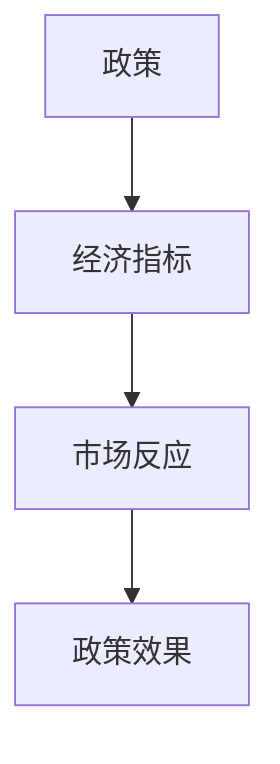
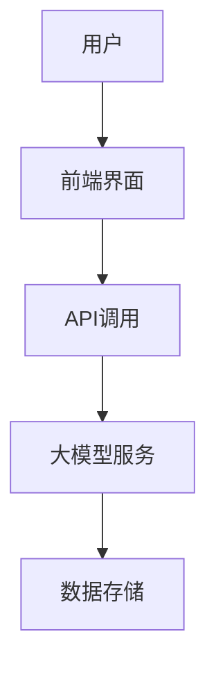
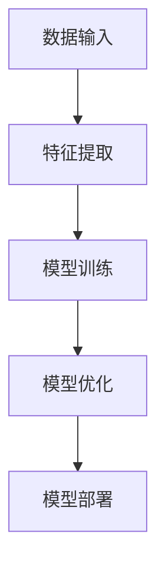
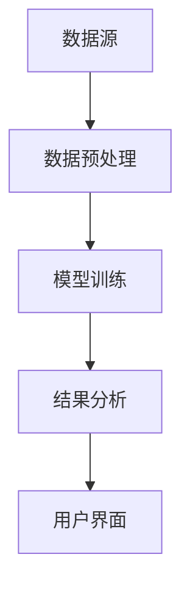
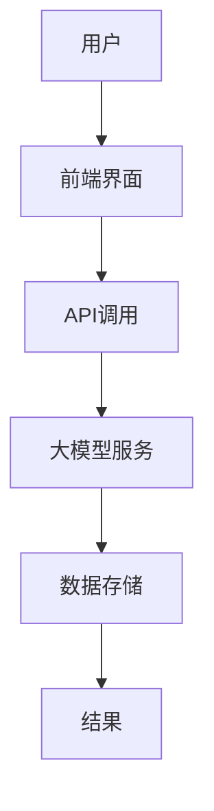

                 


# 开发基于大模型的金融政策影响评估系统

## 关键词：大模型，金融政策，影响评估，系统开发，NLP，机器学习，量化分析

## 摘要：本文详细介绍了开发基于大模型的金融政策影响评估系统的全过程，包括系统背景、核心概念、算法原理、系统架构设计以及项目实战等内容。通过结合大模型技术与金融领域的具体需求，提出了有效的解决方案，并通过实际案例分析展示了系统的应用价值。

---

## 目录大纲结构：

### 第一部分：系统背景与核心概念

#### 第1章：问题背景与目标

- 1.1 问题背景介绍
  - 当前金融政策评估的挑战
  - 大模型技术的引入动机
- 1.2 问题描述与解决思路
  - 金融政策影响的核心问题
  - 基于大模型的解决方案
  - 系统目标与边界

#### 第2章：系统核心概念与联系

- 2.1 核心概念原理
  - 大模型的基本原理
  - 金融政策影响评估的关键要素
- 2.2 实体关系图
  - 使用Mermaid绘制实体关系图
- 2.3 系统架构图
  - 使用Mermaid绘制系统架构图

### 第二部分：算法原理与数学模型

#### 第3章：大模型算法原理

- 3.1 大模型训练流程
  - 使用Mermaid绘制训练流程图
- 3.2 数学模型
  - 概率计算公式
  - 损失函数

#### 第4章：金融政策影响评估模型

- 4.1 模型输入与输出
  - 输入数据格式
  - 输出结果解释
- 4.2 模型评估指标
  - 准确率计算
  - 召回率计算

### 第三部分：系统分析与架构设计

#### 第5章：项目介绍与系统功能设计

- 5.1 项目背景与目标
  - 项目背景
  - 系统目标
- 5.2 系统功能设计
  - 数据采集模块
  - 模型训练模块
  - 结果分析模块

#### 第6章：系统架构设计

- 6.1 系统架构图
  - 使用Mermaid绘制系统架构图
- 6.2 系统接口设计
  - API调用流程
- 6.3 系统交互图
  - 使用Mermaid绘制交互图

### 第四部分：项目实战

#### 第7章：环境安装与核心代码实现

- 7.1 环境安装
  - 安装Python
  - 安装必要的库
- 7.2 核心代码实现
  - 数据预处理代码
  - 模型训练代码
  - 结果分析代码

#### 第8章：案例分析与应用解读

- 8.1 案例分析
  - 具体案例介绍
  - 系统应用过程
- 8.2 代码应用解读与分析
  - 代码功能解读
  - 系统运行结果分析

### 第五部分：总结与展望

#### 第9章：总结与最佳实践

- 9.1 总结
  - 文章主要内容回顾
  - 系统开发经验总结
- 9.2 最佳实践
  - 开发建议
  - 使用建议

#### 第10章：注意事项与拓展阅读

- 10.1 注意事项
  - 系统使用中的注意事项
  - 模型调优建议
- 10.2 拓展阅读
  - 相关领域推荐读物
  - 进一步学习的方向

---

## 第一部分：系统背景与核心概念

### 第1章：问题背景与目标

#### 1.1 问题背景介绍

当前金融政策的制定和评估面临着复杂性和不确定性的双重挑战。传统的评估方法依赖于经验丰富的专家和复杂的经济模型，但这些方法往往耗时长、成本高，并且难以实时适应市场的动态变化。随着大模型技术的快速发展，我们有机会利用其强大的自然语言处理和预测能力，来提升金融政策评估的效率和准确性。

#### 1.2 问题描述与解决思路

金融政策影响评估的核心问题在于如何准确预测政策实施后的市场反应和经济指标变化。基于大模型的解决方案通过整合海量的历史数据和实时信息，利用深度学习技术进行特征提取和模式识别，从而实现对政策效果的量化评估。系统的目标是为政策制定者和市场参与者提供一个高效、准确的评估工具，帮助他们做出更明智的决策。

### 第2章：系统核心概念与联系

#### 2.1 核心概念原理

- **大模型的基本原理**：大模型通过大量数据的训练，掌握了丰富的语义信息和模式识别能力，能够理解和生成人类语言。在金融政策评估中，大模型可以分析政策文本、市场反应和经济指标之间的关系。
- **金融政策影响评估的关键要素**：包括政策内容、市场反应、经济指标变化等。

#### 2.2 实体关系图



#### 2.3 系统架构图



---

## 第二部分：算法原理与数学模型

### 第3章：大模型算法原理

#### 3.1 大模型训练流程



#### 3.2 数学模型

- **概率计算公式**：
  $$ P(y|x) = \frac{P(x|y)P(y)}{P(x)} $$
- **损失函数**：
  $$ L = -\sum_{i=1}^{n} \log P(y_i|x_i) $$

### 第4章：金融政策影响评估模型

#### 4.1 模型输入与输出

- **输入数据格式**：包括政策文本、经济指标数据等。
- **输出结果解释**：模型输出政策效果的量化评估结果，如对GDP增长的影响幅度。

#### 4.2 模型评估指标

- **准确率计算**：
  $$ \text{Accuracy} = \frac{\text{正确预测数}}{\text{总样本数}} $$
- **召回率计算**：
  $$ \text{Recall} = \frac{\text{正确预测的正例数}}{\text{实际正例数}} $$

---

## 第三部分：系统分析与架构设计

### 第5章：项目介绍与系统功能设计

#### 5.1 项目背景与目标

- **项目背景**：随着金融市场的复杂化，传统的评估方法难以满足需求。
- **系统目标**：开发一个高效、准确的金融政策影响评估系统。

#### 5.2 系统功能设计

- **数据采集模块**：收集政策文本和相关数据。
- **模型训练模块**：对大模型进行训练和优化。
- **结果分析模块**：生成评估结果并提供可视化展示。

### 第6章：系统架构设计

#### 6.1 系统架构图



#### 6.2 系统接口设计

- **API调用流程**：
  1. 用户通过前端界面提交请求。
  2. 系统调用API接口进行处理。
  3. 处理结果返回到前端。

#### 6.3 系统交互图



---

## 第四部分：项目实战

### 第7章：环境安装与核心代码实现

#### 7.1 环境安装

- **安装Python**：确保安装了最新版本的Python。
- **安装必要的库**：如TensorFlow、PyTorch、Pandas等。

#### 7.2 核心代码实现

```python
import pandas as pd
import numpy as np
from sklearn.metrics import accuracy_score, recall_score

def preprocess_data(data):
    # 数据预处理代码
    pass

def train_model(data):
    # 模型训练代码
    pass

def evaluate_model(y_true, y_pred):
    accuracy = accuracy_score(y_true, y_pred)
    recall = recall_score(y_true, y_pred)
    return accuracy, recall

# 示例代码
data = pd.read_csv('policy_data.csv')
processed_data = preprocess_data(data)
model = train_model(processed_data)
y_true = data['label'].values
y_pred = model.predict(processed_data)
accuracy, recall = evaluate_model(y_true, y_pred)
print(f'Accuracy: {accuracy}, Recall: {recall}')
```

### 第8章：案例分析与应用解读

#### 8.1 案例分析

- **具体案例介绍**：例如，评估某项货币政策对GDP的影响。
- **系统应用过程**：展示系统如何处理数据、训练模型并输出结果。

#### 8.2 代码应用解读与分析

- **代码功能解读**：解释每个部分的功能和实现细节。
- **系统运行结果分析**：分析评估结果的准确性及其对实际政策制定的启示。

---

## 第五部分：总结与展望

### 第9章：总结与最佳实践

#### 9.1 总结

- 文章回顾了开发基于大模型的金融政策影响评估系统的全过程。
- 总结了系统开发的经验和成果。

#### 9.2 最佳实践

- **开发建议**：建议在开发类似系统时，注重数据质量和模型的可解释性。
- **使用建议**：建议用户在使用系统时，结合实际情况进行调整和优化。

### 第10章：注意事项与拓展阅读

#### 10.1 注意事项

- **系统使用中的注意事项**：确保数据的准确性和模型的及时更新。
- **模型调优建议**：根据实际需求调整模型参数和训练策略。

#### 10.2 拓展阅读

- **相关领域推荐读物**：推荐一些与金融政策评估和大模型技术相关的书籍和论文。
- **进一步学习的方向**：建议读者深入学习大模型技术在金融领域的应用，探索更多创新场景。

---

通过以上结构，文章从背景到技术实现，再到实际应用，全面覆盖了开发基于大模型的金融政策影响评估系统的各个方面。希望这篇文章能够为相关领域的读者提供有价值的参考和启示。

