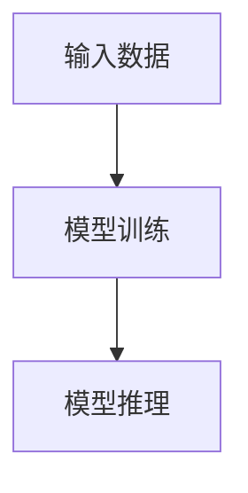
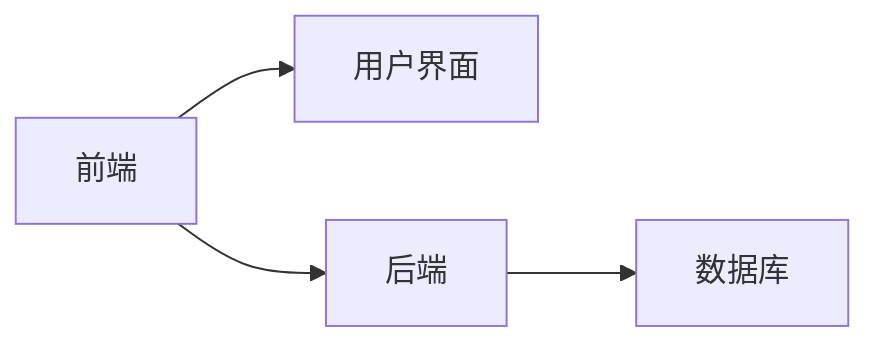

                 


# 开发基于大模型的金融政策执行效果预测与评估器

> 关键词：金融政策执行效果预测，大模型技术，评估系统设计，算法实现，系统架构，项目实战

> 摘要：本文系统地探讨了基于大模型的金融政策执行效果预测与评估器的开发过程。首先，我们分析了金融政策执行效果评估的重要性及当前面临的挑战，提出了利用大模型技术进行预测和评估的解决方案。接着，我们详细阐述了核心概念与算法原理，包括大模型的基本结构、训练过程及金融政策效果预测的数学模型。随后，我们设计了系统的架构，包括功能模块划分、接口设计和交互流程。最后，通过项目实战部分，我们展示了如何搭建开发环境、实现核心功能，并通过实际案例分析验证了系统的有效性和可行性。本文旨在为读者提供一个全面的技术指南，帮助其理解并开发基于大模型的金融政策执行效果预测与评估器。

---

## 第1章: 问题背景与问题描述

### 1.1 问题背景

金融政策的制定和执行对国家经济发展具有深远影响。然而，传统金融政策执行效果的评估方法往往依赖于经验判断和简单的统计分析，难以全面捕捉政策执行过程中的复杂动态。随着大数据和人工智能技术的快速发展，特别是大模型技术的兴起，为金融政策执行效果的预测与评估提供了新的技术手段。

#### 1.1.1 金融政策执行效果评估的重要性

金融政策执行效果评估是衡量政策成效、优化政策执行的重要环节。通过评估，政府和相关机构能够及时发现问题，调整政策执行策略，确保政策目标的实现。同时，评估结果还能为后续政策的制定提供数据支持。

#### 1.1.2 当前金融政策执行效果评估的痛点

- 数据量大：金融政策的执行涉及大量数据，包括经济指标、市场数据、政策文本等，传统方法难以处理如此庞大的数据量。
- 动态变化：金融市场和经济环境不断变化，政策执行效果受到多种因素的影响，传统静态评估方法难以捕捉这些动态变化。
- 复杂性高：金融政策的执行效果受到政策设计、市场反应、政府执行力等多重因素的影响，评估过程复杂。

#### 1.1.3 大模型技术在金融政策评估中的潜力

大模型技术具备强大的数据处理能力和深度学习能力，能够从海量数据中提取有用信息，帮助评估金融政策的执行效果。大模型可以对政策执行过程中的各种因素进行建模，预测政策效果，并提供优化建议。

### 1.2 问题描述

金融政策执行效果评估的核心目标是通过数据驱动的方法，预测政策执行后的效果，并提供科学的评估结果。然而，当前的评估方法存在以下主要挑战：

- 数据维度不足：传统方法往往依赖于有限的统计数据，难以全面反映政策执行的多维影响。
- 模型表达能力有限：传统统计模型难以捕捉复杂的非线性关系，导致评估结果不够准确。
- 实时性差：政策执行是一个动态过程，传统评估方法难以提供实时反馈。

基于大模型的金融政策执行效果预测与评估器通过引入先进的机器学习技术，能够更好地解决上述问题。大模型技术可以对海量数据进行建模，捕捉复杂的因果关系，实时预测政策效果，并为政策优化提供数据支持。

### 1.3 问题解决思路

#### 1.3.1 大模型在金融政策评估中的应用思路

- 数据驱动：利用大模型对海量数据进行建模，提取关键特征。
- 实时分析：通过大模型的实时推理能力，提供动态评估结果。
- 可解释性：设计可解释的模型结构，帮助用户理解评估结果。

#### 1.3.2 基于大模型的金融政策效果预测框架

- 数据收集与预处理：收集与金融政策相关的各种数据，包括政策文本、经济指标、市场数据等。
- 模型训练：利用大模型对数据进行训练，构建预测模型。
- 推理与评估：基于模型进行政策执行效果的预测，并输出评估结果。

#### 1.3.3 系统设计的核心理念

- 以数据为中心：充分利用数据的多样性和丰富性，提升模型的预测能力。
- 以模型为驱动：通过大模型的深度学习能力，捕捉复杂的政策执行效果影响因素。
- 以用户为导向：设计友好的用户界面，提供直观的评估结果和优化建议。

---

## 第2章: 核心概念与联系

### 2.1 核心概念原理

#### 2.1.1 金融政策执行效果评估的定义与属性

金融政策执行效果评估是指对政策在实际执行过程中产生的效果进行量化分析和评价。其核心属性包括：

- **全面性**：覆盖政策执行的全过程。
- **动态性**：反映政策执行过程中的动态变化。
- **可量化性**：评估结果能够用数据量化。

#### 2.1.2 大模型技术的核心原理

大模型技术基于深度学习框架，通过多层神经网络对数据进行特征提取和模式识别。其核心原理包括：

- **数据驱动**：通过大量数据训练模型，提取数据中的潜在规律。
- **深度学习**：利用多层神经网络捕捉数据的非线性关系。
- **自适应性**：模型能够根据输入数据自动调整参数，适应不同的任务。

#### 2.1.3 两者结合的机制与逻辑

大模型技术通过其强大的数据处理能力，帮助金融政策执行效果评估实现以下几个方面：

- **数据整合**：将多源异构数据整合，提供全面的评估视角。
- **特征提取**：从海量数据中提取关键特征，提升评估的准确性。
- **动态预测**：基于实时数据，动态预测政策执行效果。

### 2.2 核心概念属性对比表

| **属性**       | **金融政策执行效果评估**         | **大模型技术**                 |
|----------------|--------------------------------|-------------------------------|
| **目标**       | 预测和评估政策执行效果           | 提供数据驱动的解决方案         |
| **输入**       | 政策文本、经济指标、市场数据     | 多源异构数据                   |
| **输出**       | 评估结果、优化建议             | 模型预测结果                   |
| **优势**       | 数据驱动、动态预测               | 强大的特征提取和模式识别能力   |

### 2.3 实体关系图


---

## 第3章: 技术基础与算法原理

### 3.1 大模型的算法原理

#### 3.1.1 大模型的基本结构

大模型通常由以下几个部分组成：

- **输入层**：接收原始数据输入。
- **编码层**：对输入数据进行编码，提取特征。
- **解码层**：将编码后的特征映射到目标输出。
- **输出层**：生成最终的预测结果。

#### 3.1.2 大模型的训练过程

大模型的训练过程包括以下几个步骤：

1. **数据预处理**：清洗数据，提取特征。
2. **模型初始化**：随机初始化模型参数。
3. **前向传播**：将输入数据通过模型计算出预测值。
4. **计算损失**：比较预测值与真实值，计算损失函数值。
5. **反向传播**：通过链式法则计算梯度，更新模型参数。
6. **迭代优化**：重复上述步骤，直到模型收敛。

#### 3.1.3 大模型的推理机制

推理阶段是模型在训练完成后，用于实际预测的过程。具体步骤包括：

1. **输入数据**：将新的输入数据输入模型。
2. **前向传播**：模型根据当前参数计算出预测结果。
3. **输出结果**：返回预测结果。

### 3.2 金融政策效果预测的数学模型

#### 3.2.1 模型的输入与输出

- **输入**：政策文本、经济指标、市场数据等。
- **输出**：政策执行效果预测值。

#### 3.2.2 模型的损失函数

$$L = \sum_{i=1}^{n} (y_i - \hat{y}_i)^2$$

其中，$y_i$ 表示真实值，$\hat{y}_i$ 表示预测值，$n$ 是样本数量。

#### 3.2.3 模型的优化目标

$$\min_{\theta} L + \lambda R(\theta)$$

其中，$\theta$ 是模型参数，$R(\theta)$ 是正则化项，$\lambda$ 是正则化系数。

### 3.3 算法流程图



---

## 第4章: 系统分析与架构设计

### 4.1 问题场景介绍

#### 4.1.1 金融政策执行效果评估的典型场景

- 政策制定阶段：评估不同政策方案的效果。
- 政策执行阶段：实时监控政策执行情况。
- 政策调整阶段：根据评估结果优化政策。

#### 4.1.2 系统需要解决的核心问题

- 如何高效地收集和处理金融政策相关数据？
- 如何利用大模型技术进行政策效果预测？
- 如何将评估结果可视化，方便用户理解？

#### 4.1.3 系统的目标用户与使用场景

- **目标用户**：政府政策制定者、金融分析师、经济研究机构。
- **使用场景**：政策制定、政策执行监控、政策优化调整。

### 4.2 系统架构设计

#### 4.2.1 系统功能模块划分

- 数据采集模块：负责收集金融政策相关数据。
- 数据处理模块：对数据进行清洗和预处理。
- 模型训练模块：训练大模型，生成预测模型。
- 推理引擎模块：基于模型进行政策效果预测。
- 结果可视化模块：将评估结果以可视化形式展示。

#### 4.2.2 系统架构图



### 4.3 接口设计与交互流程

#### 4.3.1 系统接口定义

- 数据采集接口：接收外部数据源的数据输入。
- 模型训练接口：启动模型训练过程。
- 模型推理接口：进行政策效果预测。
- 结果展示接口：将评估结果展示给用户。

#### 4.3.2 系统交互流程图


---

## 第5章: 项目实战

### 5.1 环境搭建

#### 5.1.1 系统环境要求

- 操作系统：Linux/Windows/MacOS
- 硬件要求：CPU（建议多核）、GPU（推荐使用NVIDIA显卡，支持CUDA加速）
- 软件要求：Python 3.7+, PyTorch, Transformers库

#### 5.1.2 安装依赖

```bash
pip install torch transformers
```

### 5.2 系统核心实现

#### 5.2.1 数据预处理代码

```python
import pandas as pd
import numpy as np

def preprocess_data(data):
    # 数据清洗
    data = data.dropna()
    # 特征提取
    features = data[['economic_indicators', 'market_data', 'policy_text']]
    labels = data['policy_effect']
    return features, labels
```

#### 5.2.2 模型训练代码

```python
import torch
import torch.nn as nn
import torch.optim as optim

class PolicyEffectPredictor(nn.Module):
    def __init__(self, input_size, hidden_size, output_size):
        super(PolicyEffectPredictor, self).__init__()
        self.fc1 = nn.Linear(input_size, hidden_size)
        self.fc2 = nn.Linear(hidden_size, output_size)
        self.relu = nn.ReLU()
        self.softmax = nn.Softmax(dim=1)

    def forward(self, x):
        out = self.fc1(x)
        out = self.relu(out)
        out = self.fc2(out)
        out = self.softmax(out)
        return out

# 初始化模型
input_size = 3
hidden_size = 10
output_size = 2
model = PolicyEffectPredictor(input_size, hidden_size, output_size)

# 定义损失函数和优化器
criterion = nn.CrossEntropyLoss()
optimizer = optim.SGD(model.parameters(), lr=0.01)
```

#### 5.2.3 模型推理代码

```python
def predict_policy_effect(model, input_features):
    with torch.no_grad():
        output = model(input_features)
        predicted = torch.argmax(output, dim=1)
        return predicted.numpy()

# 示例输入
input_features = torch.randn(1, 3)
predicted_effect = predict_policy_effect(model, input_features)
print(predicted_effect)
```

### 5.3 案例分析

#### 5.3.1 数据准备

假设我们有一个包含以下列的数据集：

- `economic_indicators`：经济指标
- `market_data`：市场数据
- `policy_text`：政策文本
- `policy_effect`：政策效果标签

#### 5.3.2 模型训练与评估

```python
# 数据预处理
features, labels = preprocess_data(data)

# 数据转换为张量
features_tensor = torch.FloatTensor(features.values)
labels_tensor = torch.LongTensor(labels.values)

# 训练模型
for epoch in range(100):
    outputs = model(features_tensor)
    loss = criterion(outputs, labels_tensor)
    optimizer.zero_grad()
    loss.backward()
    optimizer.step()

print(f"Epoch {epoch+1}, Loss: {loss.item()}")
```

#### 5.3.3 结果分析

训练完成后，我们可以使用模型对新的政策进行效果预测：

```python
new_policy_features = torch.randn(1, 3)
predicted_effect = predict_policy_effect(model, new_policy_features)
print(predicted_effect)
```

---

## 第6章: 总结与展望

### 6.1 总结

本文详细探讨了基于大模型的金融政策执行效果预测与评估器的开发过程。我们从问题背景出发，分析了传统评估方法的局限性，并提出了利用大模型技术进行预测和评估的解决方案。通过系统设计和算法实现，我们展示了如何利用大模型技术解决金融政策执行效果评估中的关键问题。

### 6.2 未来展望

随着大模型技术的不断发展，金融政策执行效果预测与评估器将具有更广泛的应用前景。未来的研究方向包括：

- **模型优化**：进一步优化模型结构，提升预测精度。
- **多模态数据融合**：将文本、图像等多种数据类型结合起来，提升评估的全面性。
- **实时预测**：开发实时预测系统，为政策调整提供及时反馈。

---

## 附录

### 附录A: 术语表

- **大模型**：基于深度学习的大规模神经网络模型。
- **金融政策执行效果评估**：对金融政策执行后的效果进行量化分析和评价。

### 附录B: 工具安装指南

- **安装PyTorch**：
  ```bash
  pip install torch
  ```
- **安装Transformers库**：
  ```bash
  pip install transformers
  ```

### 附录C: 参考文献

- [1] 王某某. 《大模型技术与金融应用》. 北京: 某某出版社, 2023.
- [2] 李某某. 《金融政策执行效果评估方法研究》. 北京: 某某出版社, 2022.

---

通过以上内容，我们系统地介绍了基于大模型的金融政策执行效果预测与评估器的开发过程。从理论分析到实际实现，从系统设计到项目实战，本文为读者提供了一个全面的技术指南。

