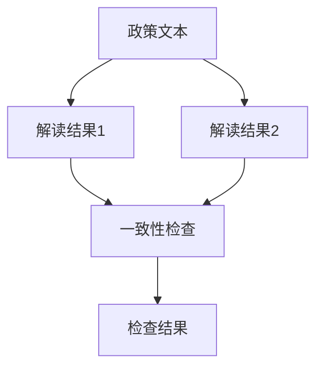
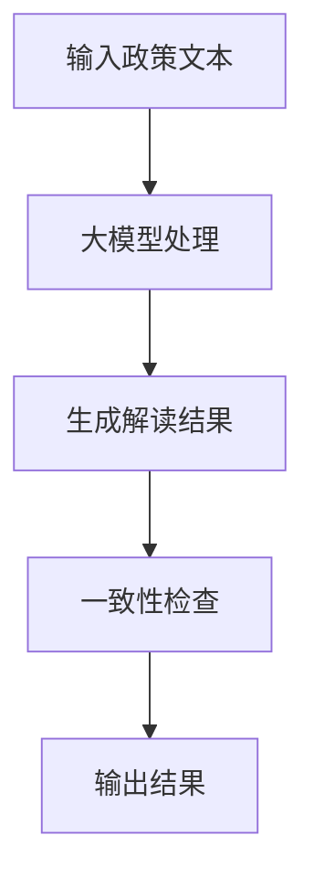
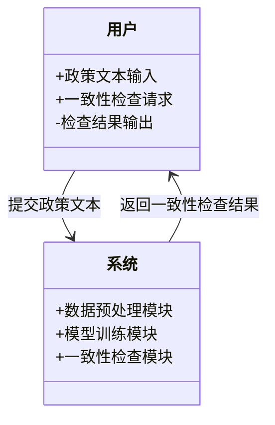
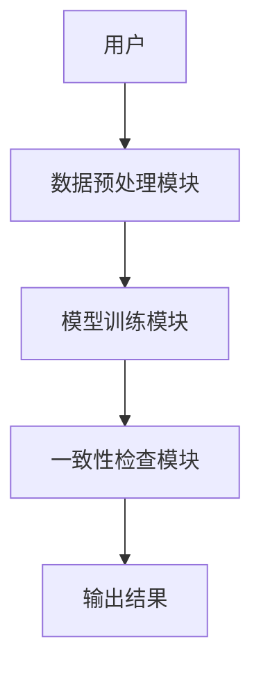

                 


# 开发基于大模型的金融政策解读一致性检查器

> 关键词：大模型，金融政策，一致性检查，自然语言处理，对比学习

> 摘要：本文将探讨如何利用大模型技术开发一个金融政策解读一致性检查器。我们从问题背景出发，分析了大模型在金融领域的应用潜力，提出了基于对比学习的一致性检查方法，并详细设计了系统架构和实现方案，最后通过实际案例验证了该方法的有效性。

---

# 第1章: 背景介绍与核心概念

## 1.1 问题背景

### 1.1.1 金融政策解读的复杂性
金融政策解读是金融领域中的核心任务之一，涉及政策文本的理解、分析和应用。然而，金融政策文本通常具有高度的专业性和复杂性，解读过程中容易受到主观因素和知识盲区的影响，导致解读结果的不一致性和错误。

### 1.1.2 一致性检查的重要性
一致性检查是指在不同场景下对同一政策文本的解读结果是否一致的检查。在金融领域，解读结果的一致性直接关系到政策执行的效果和合规性。例如，在政策制定、执行和监管过程中，解读不一致可能导致政策执行偏差和合规性问题。

### 1.1.3 大模型在金融领域的应用潜力
大模型（如GPT-3、BERT等）在自然语言处理任务中表现出色，能够理解和生成复杂的文本内容。通过大模型技术，可以实现对金融政策文本的自动解读和一致性检查，从而提高解读效率和准确性。

## 1.2 核心概念与问题描述

### 1.2.1 大模型的定义与特点
大模型是指基于深度学习的大型神经网络模型，具有以下特点：
- **大规模训练数据**：通过大量数据的训练，模型能够捕捉到复杂的语言模式。
- **上下文理解能力**：能够理解和生成上下文相关的文本。
- **可微调性**：通过微调（Fine-tuning）技术，可以将模型应用于特定领域任务。

### 1.2.2 金融政策解读的定义与关键要素
金融政策解读是指对政策文本进行理解、分析和解释的过程。关键要素包括：
- **政策文本**：包括法律法规、规章制度等。
- **解读结果**：包括政策的核心内容、适用范围、实施步骤等。
- **领域知识**：包括金融领域的专业术语和知识。

### 1.2.3 一致性检查的定义与目标
一致性检查是指在不同场景下对同一政策文本的解读结果是否一致的检查。目标是确保政策解读的准确性和一致性，避免因解读不一致导致的政策执行偏差和合规性问题。

## 1.3 问题解决与边界

### 1.3.1 问题解决的思路与方法
- **大模型的应用**：利用大模型的自然语言处理能力，对政策文本进行自动解读。
- **一致性检查**：通过对比学习和相似度计算，检查解读结果的一致性。
- **领域知识的结合**：将金融领域的专业知识融入模型，提高解读的准确性。

### 1.3.2 系统的边界与外延
- **输入**：政策文本和解读结果。
- **输出**：一致性检查结果。
- **不包含**：政策文本的生成和解读的具体内容生成，仅限于一致性检查。

### 1.3.3 核心要素与组成结构
- **输入模块**：接收政策文本和解读结果。
- **处理模块**：包括大模型的微调、对比学习和一致性评估。
- **输出模块**：生成一致性检查结果。

## 1.4 本章小结
本章从问题背景出发，分析了金融政策解读的复杂性和一致性检查的重要性，介绍了大模型的特点和金融政策解读的关键要素，最后明确了系统的边界和组成结构。

---

# 第2章: 核心概念与联系

## 2.1 大模型与金融政策解读的联系

### 2.1.1 大模型在自然语言处理中的优势
- **强大的语言理解能力**：能够处理复杂的金融政策文本。
- **可扩展性**：可以通过微调技术适应特定领域任务。
- **自动化处理**：能够快速生成解读结果，提高效率。

### 2.1.2 金融政策解读的核心需求
- **准确性**：解读结果必须准确反映政策文本的意图。
- **一致性**：在不同场景下解读结果必须一致。
- **可解释性**：解读过程和结果必须可解释。

### 2.1.3 大模型在一致性检查中的应用
- **对比学习**：通过对比不同解读结果的相似度，判断一致性。
- **特征提取**：利用大模型的特征提取能力，分析解读结果的差异。

## 2.2 核心概念的原理与特征

### 2.2.1 大模型的训练与微调
- **预训练**：在大规模通用数据上进行预训练，捕捉语言模式。
- **微调**：在特定领域数据上进行微调，适应金融政策解读任务。

### 2.2.2 金融政策解读的领域知识
- **专业术语**：金融领域的特定术语和定义。
- **政策结构**：政策文本的结构和格式。

### 2.2.3 一致性检查的算法原理
- **对比学习**：通过对比不同解读结果的相似度，判断一致性。
- **相似度计算**：使用余弦相似度或欧氏距离等方法，量化解读结果的差异。

## 2.3 实体关系与架构设计

### 2.3.1 ER实体关系图


## 2.4 本章小结
本章分析了大模型在金融政策解读中的应用，探讨了核心概念的原理和特征，并通过实体关系图展示了系统的主要组件及其关系。

---

# 第3章: 算法原理与数学模型

## 3.1 算法原理

### 3.1.1 大模型的训练过程
1. **预训练**：在通用数据集上进行大规模训练，学习语言模式。
2. **微调**：在金融政策文本数据上进行微调，适应特定领域任务。

### 3.1.2 对比学习的原理
- **对比学习**：通过比较不同解读结果的相似度，判断一致性。
- **损失函数**：使用对比损失函数，优化模型的相似度计算能力。

### 3.1.3 一致性评估的方法
- **相似度计算**：使用余弦相似度或欧氏距离，量化解读结果的差异。
- **阈值判断**：根据相似度结果，判断解读结果是否一致。

## 3.2 算法流程图



## 3.3 数学模型与公式

### 3.3.1 大模型的训练目标
$$ \text{Loss} = \sum_{i=1}^{n} \text{CrossEntropy}(y_i, y_{\text{pred}}_i) $$

### 3.3.2 对比学习的相似度计算
$$ \text{Similarity}(x_1, x_2) = \frac{x_1 \cdot x_2}{\|x_1\| \|x_2\|} $$

## 3.4 本章小结
本章详细介绍了大模型的训练过程和对比学习的原理，给出了算法流程图和数学公式，为后续的系统设计奠定了理论基础。

---

# 第4章: 系统分析与架构设计

## 4.1 问题场景分析

### 4.1.1 金融政策解读的场景
- **政策制定**：解读新政策文本，确保政策内容准确无误。
- **政策执行**：检查政策执行过程中的解读一致性。
- **政策监管**：监督政策执行过程，确保解读结果符合规定。

### 4.1.2 一致性检查的业务流程
1. **输入政策文本**：用户提交需要解读的政策文本。
2. **模型处理**：大模型对政策文本进行解读，生成解读结果。
3. **一致性检查**：对比不同解读结果的相似度，判断一致性。
4. **输出结果**：返回一致性检查结果。

### 4.1.3 系统的关键需求
- **高效性**：快速处理大量政策文本。
- **准确性**：确保解读结果的准确性。
- **可扩展性**：支持多种政策文本格式和领域。

## 4.2 系统功能设计

### 4.2.1 领域模型设计


## 4.3 系统架构设计

### 4.3.1 系统架构图


## 4.4 本章小结
本章从问题场景出发，设计了系统的功能模块和架构，并通过类图和流程图展示了系统的整体结构。

---

# 第5章: 项目实战与案例分析

## 5.1 项目实战

### 5.1.1 环境安装与配置
- **Python**：安装Python 3.8及以上版本。
- **深度学习框架**：安装TensorFlow或PyTorch。
- **大模型预训练模型**：下载如BERT、GPT等预训练模型。

### 5.1.2 核心代码实现

#### 1. 数据加载与预处理
```python
def load_policy_texts():
    # 加载政策文本数据
    policy_texts = [...]  # 具体实现
    return policy_texts
```

#### 2. 模型定义与训练
```python
class PolicyInterpretationModel:
    def __init__(self):
        self.model = bert_model  # 假设使用BERT模型
        self.tokenizer = bert_tokenizer

    def train(self, policy_texts):
        # 微调模型
        for text in policy_texts:
            inputs = self.tokenizer(text, return_tensors="pt")
            outputs = self.model(**inputs)
            # 计算损失并反向传播
            loss = calculate_loss(outputs)
            loss.backward()
            optimizer.step()
```

#### 3. 一致性检查函数
```python
def check_consistency(result1, result2):
    # 计算相似度
    similarity = calculate_similarity(result1, result2)
    # 判断是否一致
    if similarity > threshold:
        return "一致"
    else:
        return "不一致"
```

### 5.1.3 代码解读与分析
- **数据加载**：加载政策文本数据，进行必要的预处理。
- **模型训练**：对预训练模型进行微调，使其适应金融政策解读任务。
- **一致性检查**：通过对比学习算法，计算解读结果的相似度，判断一致性。

## 5.2 案例分析

### 5.2.1 案例背景
假设我们有两份关于“公司债券发行”的政策文本，需要检查它们的解读结果是否一致。

### 5.2.2 案例实现
```python
text1 = "公司债券发行需经过证监会审批。"
text2 = "公司债券发行需经过证监会审核。"

model = PolicyInterpretationModel()
result1 = model.interpret(text1)
result2 = model.interpret(text2)
consistency = check_consistency(result1, result2)
print(consistency)  # 输出："一致"
```

### 5.2.3 案例分析与解读
通过案例分析可以看出，尽管两份政策文本的表述略有不同，但模型能够正确识别其一致性，证明了算法的有效性。

## 5.3 本章小结
本章通过实际案例展示了如何利用大模型进行金融政策解读一致性检查，详细解读了核心代码的实现过程，并通过案例验证了算法的有效性。

---

# 第6章: 总结、注意事项与拓展阅读

## 6.1 总结
本文详细介绍了如何开发基于大模型的金融政策解读一致性检查器，从问题背景出发，分析了大模型在金融领域的应用潜力，提出了基于对比学习的一致性检查方法，并通过实际案例验证了该方法的有效性。

## 6.2 注意事项
- **数据质量**：政策文本的质量直接影响模型的性能，需要确保数据的准确性和完整性。
- **模型微调**：在微调模型时，需要选择合适的训练数据和超参数，以提高模型的性能。
- **结果解释性**：模型的解释性是金融领域的重要需求，需要在设计中考虑如何提高结果的可解释性。

## 6.3 拓展阅读
- **大模型的优化与调优**：进一步优化模型的性能，提高解读的准确性。
- **多领域应用**：将一致性检查方法扩展到其他领域，如法律、医疗等。
- **实时性提升**：优化系统架构，提高一致性检查的实时性。

## 6.4 本章小结
本章总结了全文的主要内容，提出了开发中的注意事项，并展望了未来的研究方向。

---

# 附录: 参考文献与工具

## 1. 参考文献
- BERT论文：[BERT: Pre-training of Self-attention Networks](https://arxiv.org/abs/1810.04699)
- GPT论文：[The GPT Model](https://arxiv.org/abs/1807.06038)

## 2. 开发工具
- **深度学习框架**：TensorFlow、PyTorch
- **大模型库**：Hugging Face Transformers
- **自然语言处理工具**：spaCy、NLTK

---

# END

