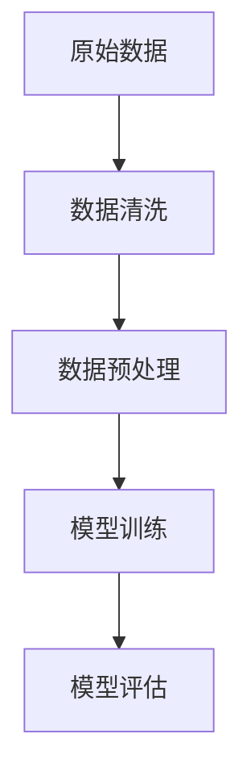
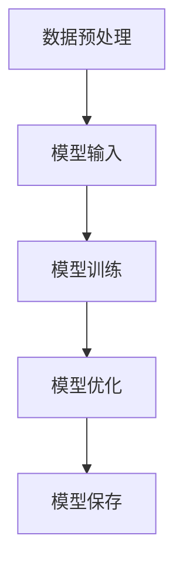
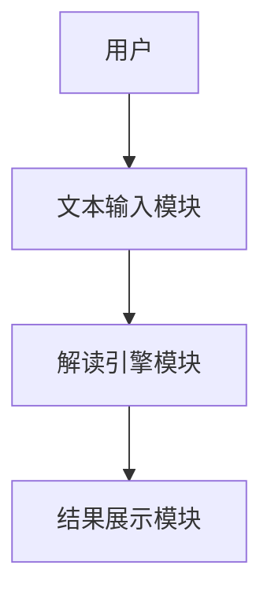
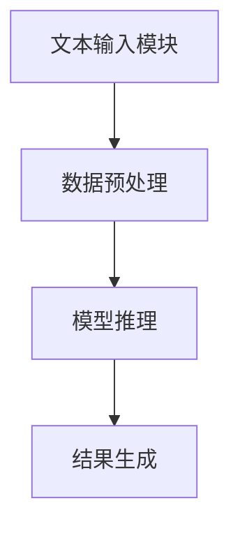

                 


# 开发基于大模型的金融政策解读系统

> 关键词：大模型，金融政策，自然语言处理，系统架构，政策解读

> 摘要：本文将详细介绍开发基于大模型的金融政策解读系统的各个方面。首先，我们将探讨问题背景与需求分析，了解为何开发这样的系统以及其重要性。接着，我们将深入分析大模型与金融政策解读的核心概念，解释其基本原理和应用场景。然后，我们将讨论系统开发的算法原理，包括数据预处理、模型训练与优化等内容。随后，我们将介绍系统的架构设计，包括功能模块划分、系统架构图以及接口设计。最后，我们将通过一个实际项目来展示系统的实现过程，并总结开发中的经验和最佳实践。

---

# 第1章: 问题背景与需求分析

## 1.1 问题背景介绍

### 1.1.1 金融政策解读的重要性
金融政策是国家或企业制定的经济规则和指导方针，其解读对于政策的正确实施至关重要。传统的政策解读方法依赖于人工分析，存在效率低、覆盖面有限的问题。

### 1.1.2 传统金融政策解读的局限性
- 人工解读耗时且容易出错。
- 需要专业知识，难以快速响应。
- 数据量大且复杂，难以全面分析。

### 1.1.3 大模型技术的引入与优势
大模型（如GPT）在自然语言处理领域表现出色，能够快速理解和生成文本，适用于金融政策的自动解读。

## 1.2 问题描述与目标

### 1.2.1 金融政策解读的核心问题
- 如何准确提取政策文本中的关键信息。
- 如何快速理解政策意图并预测其影响。

### 1.2.2 系统开发的目标与边界
- 开发一个基于大模型的金融政策解读系统，能够自动分析政策文本。
- 系统边界包括政策文本输入、解读结果输出以及模型训练。

### 1.2.3 系统的核心需求与功能
- 支持多种金融政策文本格式。
- 提供政策意图识别和影响评估功能。
- 提供友好的用户界面和高效的处理速度。

## 1.3 问题解决思路

### 1.3.1 大模型在金融领域的应用潜力
- 大模型可以处理大量金融文本，提取关键信息。
- 可以通过微调大模型，使其适应金融政策解读任务。

### 1.3.2 金融政策解读的流程与关键环节
1. 文本预处理：清洗和分词。
2. 模型训练：使用金融政策数据进行微调。
3. 政策解读：输入文本，输出解读结果。

### 1.3.3 系统设计的总体思路
- 结合大模型和金融领域知识，构建定制化的政策解读系统。
- 确保系统的可扩展性和易用性。

## 1.4 本章小结

---

# 第2章: 大模型与金融政策解读的核心概念

## 2.1 大模型的基本原理

### 2.1.1 大模型的定义与核心特征
- 大模型是基于深度学习的自然语言处理模型，具有强大的文本理解和生成能力。

### 2.1.2 大模型在自然语言处理中的应用
- 机器翻译、问答系统、文本摘要等。

### 2.1.3 大模型的训练与推理机制
- 预训练：在大规模通用文本上进行无监督学习。
- 微调：在特定任务上进行有监督训练。

## 2.2 金融政策解读的关键要素

### 2.2.1 金融政策的文本特征
- 包括法律术语、专业术语和政策条款。

### 2.2.2 政策意图的识别与分类
- 确定政策的核心目标和实施效果。

### 2.2.3 政策影响的评估与分析
- 分析政策对经济、市场的影响。

## 2.3 大模型与金融政策解读的结合

### 2.3.1 大模型在金融文本分析中的优势
- 高效处理大量文本，提取关键信息。

### 2.3.2 系统设计中的核心概念框架
- 使用大模型作为核心引擎，结合领域知识进行政策解读。

## 2.4 本章小结

---

# 第3章: 系统开发的算法原理

## 3.1 大模型训练流程

### 3.1.1 数据预处理与清洗
- 去除无效数据，进行分词和归一化处理。

### 3.1.2 模型训练与优化
- 使用金融政策数据对大模型进行微调。
- 采用交叉熵损失函数和Adam优化器。

### 3.1.3 模型评估与调优
- 使用准确率、召回率和F1值评估模型性能。
- 调整超参数优化模型表现。

## 3.2 金融政策解读的算法实现

### 3.2.1 文本表示与编码
- 使用词嵌入或句向量表示文本。

### 3.2.2 政策意图识别的分类算法
- 利用大模型进行文本分类，识别政策意图。

### 3.2.3 政策影响评估的回归算法
- 通过回归模型预测政策的经济影响。

## 3.3 算法流程图

### 3.3.1 数据流图


### 3.3.2 模型训练流程图


## 3.4 本章小结

---

# 第4章: 系统架构与设计

## 4.1 项目背景与目标

### 4.1.1 项目背景介绍
- 开发一个高效的金融政策解读系统，满足用户需求。

### 4.1.2 项目目标与范围
- 实现政策文本的自动解读，提供准确的解读结果。

### 4.1.3 项目团队与分工
- 数据工程师、算法工程师、前端开发人员各司其职。

## 4.2 系统功能设计

### 4.2.1 用户需求分析
- 用户希望快速获取政策解读结果。

### 4.2.2 系统功能模块划分
1. 文本输入模块
2. 解读引擎模块
3. 结果展示模块

### 4.2.3 功能模块交互设计
- 用户输入政策文本，系统处理后输出解读结果。

## 4.3 系统架构设计

### 4.3.1 系统架构图


### 4.3.2 模块间关系图


## 4.4 本章小结

---

# 第5章: 项目实战与实现

## 5.1 环境搭建与配置

### 5.1.1 开发环境要求
- Python 3.8及以上版本
- 安装必要的库：TensorFlow、Keras、Python Transformers

### 5.1.2 模型训练环境配置
- 使用云计算平台（如AWS、Google Cloud）进行训练。

### 5.1.3 数据集准备与预处理
- 收集金融政策文本数据，进行清洗和分词处理。

## 5.2 系统核心实现

### 5.2.1 核心代码实现
```python
import tensorflow as tf
from tensorflow import keras
from transformers import BertTokenizer, TFBertModel

# 定义模型结构
class PolicyInterpreter(tf.keras.Model):
    def __init__(self):
        super(PolicyInterpreter, self).__init__()
        self.bert_model = TFBertModel.from_pretrained('bert-base-uncased')
        self.dropout = tf.keras.layers.Dropout(0.1)
        self.classifier = tf.keras.layers.Dense(2, activation='softmax')

    def call(self, inputs):
        input_ids = inputs['input_ids']
        attention_mask = inputs['attention_mask']
        outputs = self.bert_model(input_ids, attention_mask=attention_mask)
        pooled_output = outputs.last_hidden_state[:, 0, :]
        pooled_output = self.dropout(pooled_output)
        result = self.classifier(pooled_output)
        return result

# 编译模型
model = PolicyInterpreter()
model.compile(optimizer=keras.optimizers.Adam(learning_rate=2e-5),
              loss='sparse_categorical_crossentropy',
              metrics=['accuracy'])
```

### 5.2.2 代码应用解读与分析
- 使用BERT模型进行文本编码，自定义分类器进行政策意图识别。

## 5.3 实际案例分析

### 5.3.1 案例背景介绍
- 解读一条具体的金融政策文本。

### 5.3.2 模型推理与结果展示
- 输入政策文本，输出解读结果，包括政策意图和影响分析。

## 5.4 项目小结

---

# 第6章: 最佳实践与总结

## 6.1 小结与总结
- 总结系统的开发过程和取得的成果。
- 强调大模型在金融政策解读中的重要性。

## 6.2 注意事项与建议
- 数据质量对模型性能影响重大。
- 系统上线前需进行充分的测试和验证。

## 6.3 拓展阅读
- 推荐相关领域的书籍和论文，供读者深入学习。

## 6.4 本章小结

---

# 参考文献
- 列出本文参考的所有文献和资料。

---

# 附录
- 附录A: 系统设计图
- 附录B: 核心代码实现

