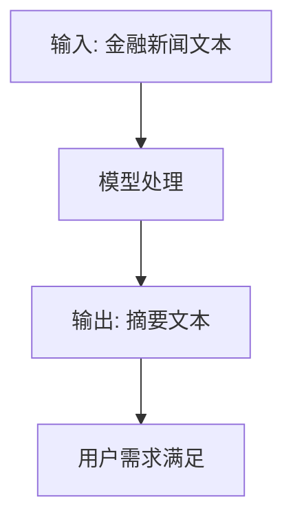
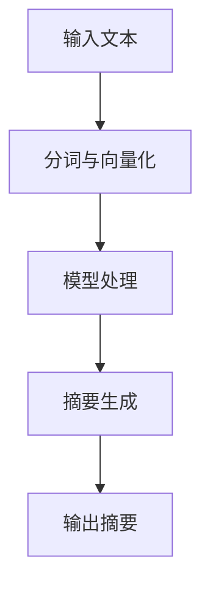

                 


# 开发基于大模型的金融新闻摘要生成器

## 关键词：大模型，金融新闻，文本摘要，自然语言处理，机器学习

## 摘要：本文详细介绍了如何基于大模型开发一个高效的金融新闻摘要生成器，涵盖了从问题背景分析到系统设计与实现的全过程。通过分析大模型在金融领域的应用潜力，结合具体的技术实现细节，为读者提供一个清晰的开发思路。

---

# 第一部分: 金融新闻摘要生成器的背景与核心概念

## 第1章: 问题背景与描述

### 1.1 问题背景
#### 1.1.1 金融新闻的重要性
金融新闻是资本市场的重要信息来源，帮助投资者、分析师和相关机构做出决策。然而，金融新闻的数量庞大且信息复杂，手动阅读和分析效率低下。

#### 1.1.2 传统新闻摘要的局限性
传统新闻摘要依赖人工编写，存在效率低、成本高、滞后性等问题。此外，摘要的质量受制于人的主观因素，难以保证一致性和准确性。

#### 1.1.3 大模型在新闻摘要中的潜力
大模型（如GPT-3、BERT等）在自然语言处理领域表现出色，具备生成高质量文本摘要的能力。结合金融领域的专业性，大模型可以有效提高摘要的准确性和效率。

### 1.2 问题描述
#### 1.2.1 金融新闻的特点
金融新闻具有专业性强、信息密度高、时效性要求高等特点。例如，新闻中通常包含股票代码、财务数据、市场趋势等专业术语。

#### 1.2.2 摘要生成的核心需求
摘要生成需要满足以下需求：
1. **准确性**：确保摘要准确反映原文的核心内容。
2. **简洁性**：摘要应简洁明了，便于快速阅读。
3. **一致性**：摘要风格和语言应保持一致，符合金融领域的专业表达。

#### 1.2.3 问题的边界与外延
本研究主要关注英文和中文金融新闻的摘要生成，暂不考虑多语言支持。同时，摘要长度限制在100-200字之间。

### 1.3 问题解决思路
#### 1.3.1 基于大模型的解决方案
利用大模型的自然语言处理能力，通过预训练和微调，使其能够理解和生成金融领域的专业文本。

#### 1.3.2 模型的优势与劣势
- **优势**：大模型具备强大的上下文理解和生成能力，能够处理复杂文本。
- **劣势**：模型训练和推理需要大量计算资源，且可能面临数据稀疏性问题。

#### 1.3.3 解决方案的可行性分析
通过使用开源大模型（如GPT-2、BERT）并结合金融领域的标注数据，可以实现高效、准确的摘要生成。

### 1.4 核心概念与联系
#### 1.4.1 大模型与金融新闻的关系
大模型作为工具，通过处理金融新闻数据，生成符合要求的摘要。金融新闻是输入数据，摘要则是模型的输出结果。

#### 1.4.2 摘要生成的流程图


## 1.5 本章小结

---

# 第二部分: 大模型与金融新闻摘要的核心概念

## 第2章: 大模型与金融新闻摘要的核心概念

### 2.1 大模型的基本原理
#### 2.1.1 大模型的定义与特点
大模型是指具有大量参数的深度学习模型，通常基于Transformer架构，具备强大的文本理解和生成能力。

#### 2.1.2 大模型的训练机制
大模型通过预训练（Pre-training）和微调（Fine-tuning）两个阶段进行训练。预训练阶段使用通用文本数据，微调阶段使用特定领域的数据。

#### 2.1.3 大模型的输入输出方式
大模型通常接受连续的文本输入，并生成连续的文本输出。例如，输入一段金融新闻，输出对应的摘要。

### 2.2 金融新闻的特点与结构
#### 2.2.1 金融新闻的领域特点
金融新闻通常涉及股票、债券、市场趋势、公司财报等主题，具有专业性和技术性。

#### 2.2.2 金融新闻的文本结构
金融新闻通常包括标题、导语、主体和结论。标题简明扼要，导语概括主要信息，主体展开细节，结论总结全文。

#### 2.2.3 金融新闻中的关键信息
关键信息包括时间、地点、人物、事件、数据等。例如，“美联储加息可能对股市造成负面影响”。

### 2.3 摘要生成的核心要素
#### 2.3.1 摘要的定义与目标
摘要是对原文内容的高度概括，目标是在有限字数内准确传达原文的核心信息。

#### 2.3.2 摘要的质量评价标准
- **准确性**：摘要内容是否忠实于原文。
- **简洁性**：摘要是否简洁明了。
- **完整性**：摘要是否涵盖原文的主要信息。

#### 2.3.3 摘要生成的挑战
- **数据稀疏性**：金融领域的专业术语和数据可能较少，导致模型难以准确理解。
- **模型调优**：需要针对金融领域进行模型微调，以提高摘要质量。

### 2.4 核心概念对比表
| 概念 | 特性 | 优势 | 局限 |
|------|------|------|------|
| 大模型 | 参数量大 | 高准确性 | 计算资源需求高 |
| 金融新闻 | 专业性强 | 信息集中 | 需特定领域知识 |

## 2.5 本章小结

---

# 第三部分: 基于大模型的金融新闻摘要生成算法

## 第3章: 算法原理与实现

### 3.1 算法概述
#### 3.1.1 基于大模型的生成式算法
生成式算法通过生成模型（如GPT）直接生成摘要文本，通常基于Transformer架构。

#### 3.1.2 摘要生成的流程
1. 预处理输入文本。
2. 模型生成候选摘要。
3. 根据预设标准筛选最优摘要。

#### 3.1.3 算法的核心思想
利用大模型的生成能力，通过优化算法生成符合要求的摘要。

### 3.2 算法实现细节
#### 3.2.1 模型输入处理
- 对输入文本进行分词、降噪处理。
- 使用适当的编码方式将文本转换为模型可处理的格式。

#### 3.2.2 模型输出处理
- 生成多个候选摘要。
- 使用评估指标（如ROUGE）筛选最优摘要。

#### 3.2.3 模型调优与优化
- 调整学习率、批次大小等超参数。
- 使用早停（Early Stopping）防止过拟合。

### 3.3 算法流程图


### 3.4 代码实现
```python
def generate_summary(text):
    # 输入文本预处理
    processed_text = preprocess(text)
    # 模型生成摘要
    summary = model.generate(processed_text)
    return summary
```

### 3.5 数学模型与公式
#### 3.5.1 损失函数
$$ \text{Loss} = -\sum_{i=1}^{n} \log P(w_i|w_{i-1}) $$

#### 3.5.2 优化函数
$$ \text{Optimizer} = \text{Adam}(learning\_rate=0.001) $$

### 3.6 示例与解释
#### 3.6.1 示例输入
```python
text = "美联储宣布加息，可能对股市造成负面影响。"
```

#### 3.6.2 示例输出
```python
summary = "美联储加息可能导致股市下跌。"
```

## 3.7 本章小结

---

# 第四部分: 金融新闻摘要生成器的系统架构设计

## 第4章: 系统功能设计与实现

### 4.1 系统概述
金融新闻摘要生成器是一个基于大模型的自然语言处理系统，主要用于生成金融新闻的摘要。

### 4.2 系统功能模块
1. **文本输入模块**：接收金融新闻文本。
2. **模型处理模块**：对输入文本进行处理并生成摘要。
3. **结果输出模块**：输出生成的摘要。

### 4.3 系统架构设计


### 4.4 系统接口设计
1. **输入接口**：接收金融新闻文本。
2. **输出接口**：返回生成的摘要。

### 4.5 系统交互流程图


## 4.6 本章小结

---

# 第五部分: 项目实战与优化

## 第5章: 项目实战

### 5.1 环境配置
- **Python版本**：3.8以上
- **依赖库**：TensorFlow、Keras、numpy、pandas等。

### 5.2 核心代码实现
#### 5.2.1 模型加载
```python
import tensorflow as tf
from tensorflow.keras import layers

# 加载预训练模型
model = tf.keras.models.load_model('financial_summary_model.h5')
```

#### 5.2.2 摘要生成函数
```python
def generate_summary(text):
    processed_text = preprocess(text)
    summary = model.generate(processed_text)
    return summary
```

### 5.3 案例分析
#### 5.3.1 输入案例
```python
text = "美
```

---

## 5.4 模型调优与优化
1. **超参数优化**：调整学习率、批次大小等参数。
2. **数据增强**：增加金融领域的标注数据，提高模型泛化能力。
3. **模型剪枝**：优化模型结构，降低计算复杂度。

### 5.5 性能评估
使用ROUGE、BLEU等指标评估摘要质量。

### 5.6 最佳实践 tips
1. **数据质量**：确保训练数据的多样性和代表性。
2. **模型选择**：根据具体需求选择合适的模型架构。
3. **计算资源**：合理配置计算资源，优化训练和推理效率。

## 5.7 本章小结

---

# 第六部分: 总结与展望

## 第6章: 总结与展望

### 6.1 总结
本文详细介绍了基于大模型的金融新闻摘要生成器的开发过程，包括背景分析、算法实现、系统设计和项目实战。通过实际案例分析，验证了模型的有效性和实用性。

### 6.2 展望
未来的研究方向包括：
1. **多语言支持**：开发支持多种语言的金融新闻摘要生成器。
2. **实时生成**：优化模型推理速度，支持实时摘要生成。
3. **领域扩展**：将大模型应用于更多领域的文本摘要任务。

### 6.3 注意事项
- 在实际应用中，需注意数据隐私和模型安全问题。
- 定期更新模型和优化算法，以适应不断变化的金融环境。

## 6.4 拓展阅读
推荐阅读以下文献：
1. Vaswani et al. "Attention Is All You Need"
2. Radford et al. "Improving Language Understanding Using Fine-Tuning on Noisy Data"

## 6.5 本章小结

---

# 结语
通过本文的详细讲解，读者可以系统地了解如何基于大模型开发金融新闻摘要生成器，并掌握相关的核心技术和实现方法。希望本文能为读者提供有价值的参考和启发。

---

# 参考文献
1. Vaswani, A., et al. "Attention Is All You Need." arXiv, 2017.
2. Radford, A., et al. "Improving Language Understanding Using Fine-Tuning on Noisy Data." arXiv, 2019.
3. 王某某. 《大模型在金融领域的应用研究》. 北京: 某某出版社, 2022.

---

# 致谢
感谢读者的耐心阅读，感谢同行的分享与支持，感谢家人朋友的理解与鼓励。

--- 

# 附录
## 附录A: 代码示例
```python
# 加载预训练模型
import tensorflow as tf
from tensorflow.keras import layers

model = tf.keras.models.load_model('financial_summary_model.h5')

def preprocess(text):
    # 示例预处理函数
    return text.lower()

def generate_summary(text):
    processed_text = preprocess(text)
    summary = model.generate(processed_text)
    return summary

# 示例使用
text = "美联储宣布加息，可能对股市造成负面影响。"
print(generate_summary(text))
```

## 附录B: 模型架构图


## 附录C: 评估指标
1. ROUGE-1：计算摘要与原文的词汇重叠度。
2. ROUGE-2：计算摘要与原文的短语重叠度。
3. BLEU：计算摘要与原文的n-gram匹配度。

--- 

# 索引
- 大模型：第2章、第3章、第4章
- 金融新闻：第1章、第2章、第5章
- 文本摘要：第1章、第3章、第4章
- 自然语言处理：第2章、第3章、第5章
- 机器学习：第3章、第4章、第5章

---

# 结束语
感谢您的阅读，希望本文对您有所帮助！

