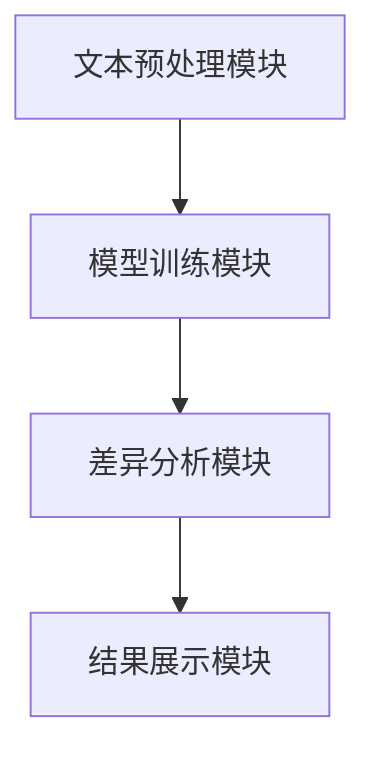
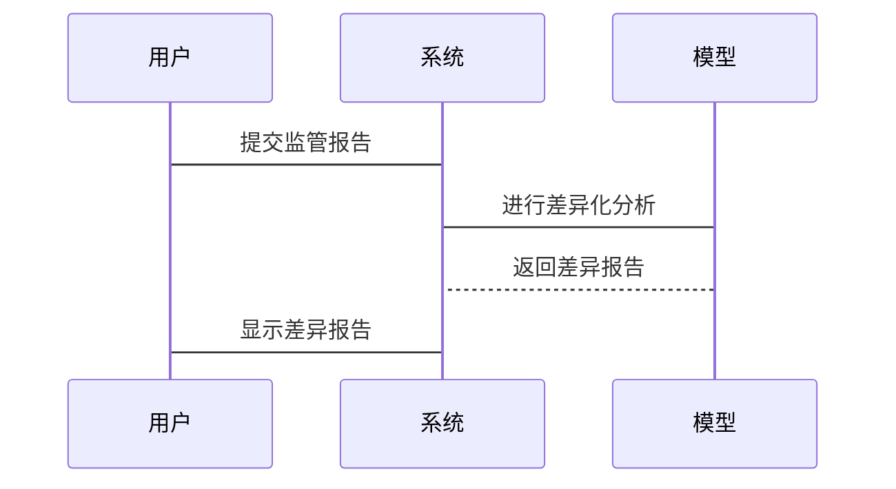

                 


# 开发基于大模型的金融监管报告差异化分析助手

## 关键词：大模型、自然语言处理、金融监管、差异化分析、文本挖掘、机器学习

## 摘要

随着金融市场的快速发展，监管报告的复杂性和数量急剧增加，传统的监管分析方法已难以满足需求。基于大模型的金融监管报告差异化分析助手通过自然语言处理和机器学习技术，能够高效地从大量监管报告中提取关键信息，识别差异，辅助监管机构做出更明智的决策。本文将详细探讨如何开发这样一个系统，包括其背景、核心概念、算法原理、系统架构设计、项目实现及实际应用案例。

---

# 第一部分：背景介绍

## 第1章：问题背景与需求分析

### 1.1 问题背景

#### 1.1.1 金融监管报告的特点与挑战
- 金融监管报告通常包含大量非结构化文本，例如上市公司年报、风险评估报告等。
- 这些报告内容复杂，涉及财务数据、法律条款、行业术语等，需要专业的知识背景才能准确解读。
- 监管机构需要快速识别不同报告之间的差异，例如同一行业不同公司的财务表现差异，或者不同监管政策的执行差异。

#### 1.1.2 监管报告差异化分析的必要性
- 监管机构需要通过分析报告差异，发现潜在的合规问题或市场风险。
- 差异化分析能够帮助监管机构制定更精准的监管政策，优化资源配置。

#### 1.1.3 基于大模型的差异化分析优势
- 大模型（如GPT-3、BERT）具有强大的自然语言处理能力，能够理解复杂的金融文本。
- 大模型可以通过微调（fine-tuning）任务，快速适应金融监管领域的特定需求。

### 1.2 问题描述

#### 1.2.1 监管报告分析的复杂性
- 监管报告中的文本可能包含歧义，需要结合上下文和领域知识进行解读。
- 不同报告的格式和内容可能存在差异，增加了分析的难度。

#### 1.2.2 差异化分析的具体需求
- 需要从多份报告中提取相似信息，进行对比分析。
- 需要识别报告中的潜在风险点，例如财务造假、合规问题等。

#### 1.2.3 大模型在差异化分析中的应用范围
- 从监管报告中提取关键信息，例如财务数据、风险提示等。
- 对比不同报告中的内容，识别差异点。
- 自动生成差异报告，帮助监管机构快速识别问题。

### 1.3 问题解决与边界

#### 1.3.1 大模型如何解决差异化分析问题
- 利用大模型的自然语言处理能力，自动提取监管报告中的关键信息。
- 通过对比不同报告的文本，识别潜在差异。

#### 1.3.2 边界与限制条件
- 监管报告的格式和内容可能存在较大差异，影响模型的准确性和稳定性。
- 模型需要依赖高质量的训练数据，否则可能导致分析结果不准确。

#### 1.3.3 外延与扩展可能性
- 可以将模型扩展到其他领域，例如医疗监管、教育监管等。
- 可以结合其他技术（如区块链）进一步提升监管效率。

## 第2章：核心概念与联系

### 2.1 大模型的基本原理

#### 2.1.1 大模型的定义与核心特征
- 大模型是指基于深度学习的大型神经网络模型，具有强大的自然语言处理能力。
- 核心特征包括：预训练、大规模数据、多任务学习能力。

#### 2.1.2 大模型与传统NLP的对比
| 特性          | 大模型                          | 传统NLP                        |
|---------------|---------------------------------|---------------------------------|
| 数据需求      | 需要大量数据                    | 数据需求较低                   |
| 模型复杂度     | 模型复杂，参数多                | 模型简单，参数少               |
| 任务适应性     | 能够处理多种任务，无需重新训练 | 需要针对每个任务进行训练       |
| 性能          | 在大多数任务上表现优异         | 在特定任务上可能表现较好       |

#### 2.1.3 大模型在金融监管中的应用潜力
- 文本生成：生成符合监管要求的报告模板。
- 文本理解：理解监管报告中的关键信息。
- 跨领域应用：结合金融知识图谱，提升监管效率。

### 2.2 金融监管报告的特征分析

#### 2.2.1 监管报告的结构化与非结构化特征
- 结构化数据：如财务数据、表格信息。
- 非结构化数据：如文本描述、风险提示。

#### 2.2.2 报告内容的领域知识依赖
- 监管报告的内容依赖于金融领域的专业知识，例如会计准则、监管法规等。

#### 2.2.3 报告生成的规则与规范
- 监管报告的生成需要遵循特定的格式和内容要求，例如证监会的年报披露规范。

### 2.3 大模型与金融监管的关联性

#### 2.3.1 大模型在文本生成中的优势
- 能够生成符合特定格式和内容要求的文本。
- 可以自动生成监管报告的摘要或关键点。

#### 2.3.2 大模型在文本理解中的应用
- 理解监管报告中的复杂文本，提取关键信息。
- 识别潜在的合规问题或风险点。

#### 2.3.3 大模型在差异化分析中的具体实现
- 对比分析：将多份监管报告进行对比，识别差异点。
- 自动生成差异报告：基于对比结果，生成易于理解的差异报告。

---

## 第3章：算法原理与实现

### 3.1 大模型的数学基础

#### 3.1.1 语言模型的数学表达
- 语言模型的目标是计算给定文本的概率：
$$ P(w_1, w_2, ..., w_n) = \prod_{i=1}^{n} P(w_i | w_{i-1}, ..., w_{i-k}) $$
其中，$k$ 是上下文的长度。

#### 3.1.2 概率论在大模型中的应用
- 使用马尔可夫链假设，假设当前词的概率仅依赖于前$k$个词。
- 使用交叉熵损失函数评估模型的预测准确性。

#### 3.1.3 神经网络的数学模型
- 神经网络通过多层感知机（MLP）或Transformer架构，对输入文本进行编码和解码。

### 3.2 金融监管报告分析的数学框架

#### 3.2.1 文本表示的向量空间模型
- 将文本表示为向量空间中的点，使用词嵌入（如Word2Vec）或句嵌入（如BERT）进行表示。

#### 3.2.2 监管规则的数学表达
- 监管规则可以用条件概率表示，例如：
$$ P(\text{合规} | \text{报告内容}) $$

#### 3.2.3 差异化分析的数学模型
- 对比分析可以基于余弦相似度或Jaccard相似度，计算两份报告的相似程度。

### 3.3 算法原理的公式推导

#### 3.3.1 概率分布公式
$$ P(w_i | w_{i-1}, ..., w_{i-k}) $$

#### 3.3.2 神经网络的损失函数
$$ L = -\sum_{i=1}^{n} \log P(w_i | w_{i-1}, ..., w_{i-k}) $$

#### 3.3.3 梯度下降优化公式
$$ \theta_{new} = \theta_{old} - \eta \frac{\partial L}{\partial \theta} $$

---

## 第4章：系统分析与架构设计

### 4.1 问题场景介绍

#### 4.1.1 系统目标与功能需求
- 系统目标：开发一个基于大模型的监管报告差异化分析助手。
- 功能需求：包括文本预处理、模型训练、差异分析、结果展示等。

#### 4.1.2 系统输入与输出
- 输入：多份监管报告文本。
- 输出：差异报告，包括差异点的详细说明和分析。

#### 4.1.3 系统性能指标
- 处理速度：每份报告的处理时间不超过5分钟。
- 准确率：差异分析的准确率达到95%以上。

### 4.2 系统架构设计

#### 4.2.1 系统模块划分
- 文本预处理模块：对输入文本进行清洗和结构化。
- 模型训练模块：对大模型进行微调，使其适应监管报告的分析任务。
- 差异分析模块：对多份报告进行对比分析，识别差异点。
- 结果展示模块：生成差异报告，并以可视化形式展示。

#### 4.2.2 模块之间的关系
- 文本预处理模块向模型训练模块提供预处理后的数据。
- 模型训练模块输出微调后的模型，供差异分析模块使用。
- 差异分析模块将分析结果传递给结果展示模块，生成最终报告。

#### 4.2.3 系统架构图（Mermaid）


### 4.3 项目实现

#### 4.3.1 环境安装
- 安装Python、TensorFlow、Keras等开发工具。
- 安装大模型的预训练权重（如BERT）。

#### 4.3.2 系统核心实现代码

```python
import tensorflow as tf
from tensorflow.keras.layers import Input, Dense, Dropout, LSTM
from tensorflow.keras.models import Model

def build_model(max_sequence_length, vocab_size):
    inputs = Input(shape=(max_sequence_length,))
    x = LSTM(128, return_sequences=True)(inputs)
    x = Dropout(0.5)(x)
    x = LSTM(64, return_sequences=False)(x)
    outputs = Dense(vocab_size, activation='softmax')(x)
    model = Model(inputs=inputs, outputs=outputs)
    return model
```

#### 4.3.3 代码应用解读与分析
- 上述代码定义了一个基于LSTM的序列模型，用于处理监管报告文本。
- 模型通过LSTM层提取文本的序列特征，并通过Dropout层防止过拟合。
- 最后通过Dense层输出类别概率分布。

### 4.4 系统交互流程图（Mermaid）



---

## 第5章：项目实战

### 5.1 实际案例分析

#### 5.1.1 案例背景
- 某金融监管机构需要对比分析10家上市公司的年报，识别财务数据的差异。

#### 5.1.2 数据准备
- 收集10家公司的年报文本，提取财务数据、风险提示等关键信息。

#### 5.1.3 模型训练与测试
- 使用收集的数据对大模型进行微调，测试模型的差异分析能力。

#### 5.1.4 结果展示
- 模型成功识别了部分公司的财务数据造假行为，生成差异报告供监管机构参考。

### 5.2 代码实现与解读

#### 5.2.1 数据预处理
```python
import pandas as pd
import numpy as np

def preprocess_reports(reports):
    # 文本清洗
    cleaned_reports = []
    for report in reports:
        cleaned = report.lower()
        cleaned = re.sub(r'\W+', ' ', cleaned)
        cleaned_reports.append(cleaned)
    return cleaned_reports
```

#### 5.2.2 模型训练
```python
from tensorflow.keras.preprocessing.sequence import pad_sequences
from sklearn.model_selection import train_test_split

# 数据分割
X_train, X_test, y_train, y_test = train_test_split(X, y, test_size=0.2)

# 填充序列
X_train = pad_sequences(X_train, maxlen=max_length, padding='post', truncating='post')
X_test = pad_sequences(X_test, maxlen=max_length, padding='post', truncating='post')

# 训练模型
model.fit(X_train, y_train, epochs=10, batch_size=32, validation_data=(X_test, y_test))
```

#### 5.2.3 模型评估
```python
loss, accuracy = model.evaluate(X_test, y_test)
print(f"损失: {loss}, 准确率: {accuracy}")
```

---

## 第6章：总结与展望

### 6.1 总结

#### 6.1.1 核心内容回顾
- 本文介绍了如何利用大模型开发金融监管报告差异化分析助手。
- 提供了系统的架构设计、算法实现和实际案例分析。

#### 6.1.2 技术优势与局限性
- 技术优势：大模型的强大能力使得监管报告分析更加高效和准确。
- 技术局限性：模型的泛化能力和数据质量对分析结果有较大影响。

### 6.2 未来研究方向

#### 6.2.1 模型优化
- 使用更先进的大模型架构（如Transformer）提升分析效果。
- 结合领域知识图谱，进一步优化模型性能。

#### 6.2.2 多模态分析
- 将监管报告的文本、表格、图表等多种数据类型结合起来，提升分析的全面性。

#### 6.2.3 实时监控
- 实现监管报告的实时分析和预警功能，提升监管效率。

### 6.3 最佳实践 tips

#### 6.3.1 数据质量
- 确保输入数据的准确性和完整性，避免因数据问题影响分析结果。

#### 6.3.2 模型调优
- 使用交叉验证和网格搜索优化模型参数，提升模型性能。

#### 6.3.3 结果验证
- 定期验证模型的分析结果，确保其准确性和可靠性。

### 6.4 小结

本文详细探讨了基于大模型的金融监管报告差异化分析助手的开发过程，从背景分析到系统实现，再到实际案例分析，为读者提供了全面的技术指导。希望本文能够为相关领域的研究和实践提供有价值的参考。

---

## 附录

### 附录A：相关工具与库

- Python库：TensorFlow、Keras、NLTK。
- 大模型框架：BERT、GPT。
- 可视化工具：Mermaid、Matplotlib。

### 附录B：参考文献

- 提供相关的学术论文、技术报告和书籍参考。

---

通过以上步骤，我们可以系统地开发一个基于大模型的金融监管报告差异化分析助手，结合理论分析和实际应用，为监管机构提供高效、准确的工具支持。

