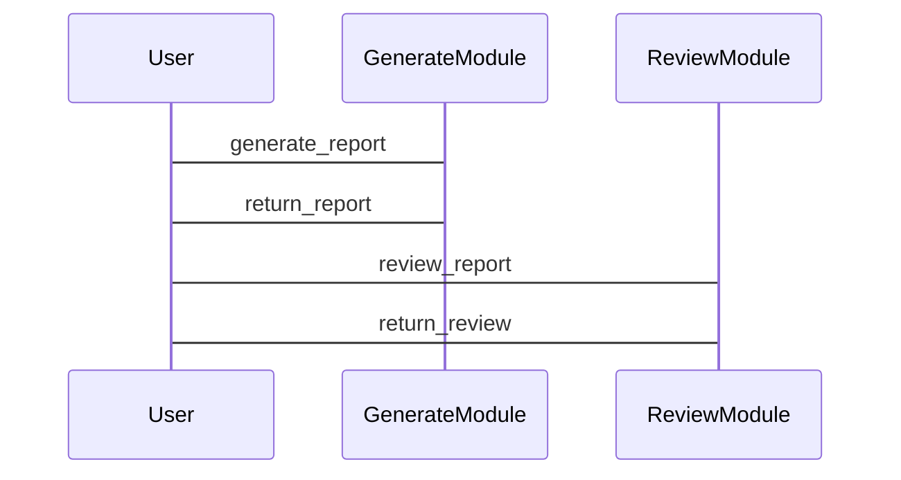

                 


# 开发基于大模型的金融监管报告智能生成与审核助手

## 关键词：大模型，金融监管，智能生成，审核助手，自然语言处理，文本生成，文本审核

## 摘要：  
本文探讨了如何利用大模型技术开发金融监管报告的智能生成与审核助手。文章首先分析了传统金融监管报告生成与审核的痛点，提出了基于大模型的解决方案。接着，详细阐述了大模型的基本原理及其在金融监管中的应用，重点介绍了文本生成与审核的核心算法。随后，从系统架构设计、接口设计和功能实现等多个维度，全面解析了该助手的开发过程。最后，通过实际案例展示了系统的实现与应用效果，并总结了开发经验与未来发展方向。

---

# 第1章: 问题背景与需求分析

## 1.1 问题背景

### 1.1.1 传统金融监管报告的痛点
- **低效性**：传统报告生成依赖人工编写，耗时长且效率低。
- **一致性差**：不同人员的编写能力差异导致报告质量不一。
- **合规性风险**：人工审核易出现疏漏，合规性难以保证。

### 1.1.2 人工审核的低效与误差
- **耗时**：人工审核每份报告需要大量时间。
- **误差**：人为因素可能导致漏审或误判。
- **成本高**：需要大量专业人员，增加了企业成本。

### 1.1.3 大模型技术的引入与潜力
- **高效性**：大模型可以快速生成标准化报告。
- **一致性**：模型生成的内容格式统一，质量可控。
- **准确性**：通过模型训练，可以显著降低合规风险。

## 1.2 问题描述

### 1.2.1 金融监管报告的核心要素
- 包括风险评估、合规性分析、数据支持等关键内容。

### 1.2.2 报告生成与审核的关键环节
- 数据收集、内容生成、格式调整、合规检查等。

### 1.2.3 当前技术的局限性与改进方向
- 传统方法效率低、误差高；大模型技术具备潜力，但需进一步优化。

## 1.3 问题解决与边界

### 1.3.1 基于大模型的解决方案
- 引入大模型生成报告初稿，人工复核关键部分。

### 1.3.2 系统的边界与功能范围
- 仅负责生成与审核，不涉及外部数据源的实时更新。

### 1.3.3 与其他金融系统的交互与集成
- 与企业内部的财务系统、风险管理系统无缝对接。

## 1.4 概念结构与核心要素

### 1.4.1 系统整体架构
- 包括输入模块、生成模块、审核模块和输出模块。

### 1.4.2 核心功能模块
- 文本生成、文本审核、用户交互等。

### 1.4.3 关键技术与实现路径
- 自然语言处理、机器学习、知识图谱等技术的结合。

---

# 第2章: 核心概念与理论基础

## 2.1 大模型的基本原理

### 2.1.1 大模型的定义与特点
- **定义**：基于Transformer架构的大型神经网络模型。
- **特点**：参数多、训练数据量大、效果好。

### 2.1.2 大模型的训练与推理机制
- **训练**：通过大量金融文本数据进行预训练。
- **推理**：根据输入生成相应的报告内容。

### 2.1.3 大模型的可解释性与可信度
- **可解释性**：通过attention机制分析生成内容的依据。
- **可信度**：依赖于训练数据的质量和模型的优化。

## 2.2 金融监管报告生成与审核的关键技术

### 2.2.1 自然语言处理技术
- **分词**：将文本分割成词语。
- **句法分析**：分析句子的语法结构。

### 2.2.2 文本生成与编辑技术
- **生成**：使用大模型生成报告初稿。
- **编辑**：自动调整文本格式，确保合规性。

### 2.2.3 知识图谱与领域知识库
- **知识图谱**：构建金融领域的知识图谱，辅助生成准确的内容。
- **知识库**：存储监管规则、行业术语等，提高生成的准确性。

## 2.3 大模型与金融监管的结合

### 2.3.1 大模型在金融领域的应用场景
- **风险评估**：生成风险分析报告。
- **合规性检查**：自动审核报告是否符合监管要求。

### 2.3.2 金融监管报告的生成逻辑
- **数据输入**：系统接收监管数据。
- **内容生成**：模型根据数据生成报告。
- **格式调整**：自动调整报告的排版和结构。

### 2.3.3 报告审核的智能化流程
- **初稿生成**：模型生成报告初稿。
- **自动审核**：系统检查报告内容的合规性。
- **人工复核**：重点检查关键部分。

---

# 第3章: 算法原理与数学模型

## 3.1 大模型的训练与优化

### 3.1.1 模型训练的数学基础
- **损失函数**：使用交叉熵损失函数。
- **优化器**：Adam优化器。
- **参数更新**：通过梯度下降更新参数。

### 3.1.2 损失函数与优化器
- **交叉熵损失函数**：
  $$ L = -\frac{1}{N}\sum_{i=1}^{N} \sum_{j=1}^{M} y_{ij} \log p(y_{ij}) $$
- **Adam优化器**：结合动量和自适应学习率。

### 3.1.3 参数更新与训练策略
- **批量训练**：每次训练一批数据。
- **学习率衰减**：防止过拟合。

## 3.2 文本生成的算法实现

### 3.2.1 Transformer模型的结构与原理
- **编码器**：处理输入文本。
- **解码器**：生成输出文本。

### 3.2.2 注意力机制的数学表达
- **查询、键、值**：
  $$ Q = W_q x $$
  $$ K = W_k x $$
  $$ V = W_v x $$
- **注意力权重**：
  $$ \text{Attention}(Q,K,V) = \text{softmax}(\frac{QK^T}{\sqrt{d}}) V $$

### 3.2.3 解码过程的详细步骤
- **输入编码**：将输入文本编码为向量。
- **生成词**：逐步生成每个词，更新解码器的状态。

## 3.3 报告审核的算法实现

### 3.3.1 基于大模型的相似度计算
- **余弦相似度**：
  $$ \text{similarity}(a,b) = \frac{a \cdot b}{\|a\|\|b\|} $$

### 3.3.2 多任务学习与联合优化
- **联合训练**：同时优化生成和审核任务。

### 3.3.3 报告质量评估的指标体系
- **准确率**：生成内容与实际需求的匹配程度。
- **召回率**：审核中发现的问题数量。

---

# 第4章: 系统分析与架构设计

## 4.1 系统功能模块划分

### 4.1.1 报告生成模块
- 负责接收数据并生成报告初稿。

### 4.1.2 报告审核模块
- 对生成的报告进行自动审核。

### 4.1.3 用户交互界面
- 提供用户与系统交互的界面。

## 4.2 系统架构设计

### 4.2.1 分层架构设计
- **数据层**：存储金融数据。
- **业务逻辑层**：处理生成和审核逻辑。
- **表现层**：展示结果。

### 4.2.2 微服务架构实现
- 每个功能模块独立部署，便于扩展。

### 4.2.3 高可用性与扩展性设计
- 使用负载均衡和冗余设计。

## 4.3 系统接口设计

### 4.3.1 API接口定义
- **生成报告接口**：`/api/generate_report`
- **审核报告接口**：`/api/review_report`

### 4.3.2 接口调用流程
- 用户调用生成接口，系统返回报告。
- 用户调用审核接口，系统返回审核结果。

### 4.3.3 接口安全与权限控制
- 使用JWT进行身份验证。
- 设置权限，确保只有授权用户可以调用接口。

## 4.4 系统交互设计

### 4.4.1 序列图


---

# 第5章: 项目实战与实现

## 5.1 环境搭建与配置

### 5.1.1 安装Python环境
- 使用Anaconda或虚拟环境。

### 5.1.2 安装依赖库
- `transformers`, `torch`, `mermaid`, `matplotlib`

## 5.2 系统核心实现源代码

### 5.2.1 大模型的加载与使用
```python
from transformers import AutoTokenizer, AutoModelForCausalLM
model_name = "big-model-name"
tokenizer = AutoTokenizer.from_pretrained(model_name)
model = AutoModelForCausalLM.from_pretrained(model_name)
```

### 5.2.2 文本生成函数
```python
def generate_report(prompt):
    inputs = tokenizer(prompt, return_tensors="pt")
    outputs = model.generate(**inputs, max_length=500)
    return tokenizer.decode(outputs[0], skip_special_tokens=True)
```

### 5.2.3 报告审核函数
```python
def review_report(report):
    # 使用大模型评估报告的合规性
    # 返回审核结果和修改建议
    pass
```

## 5.3 案例分析与详细讲解

### 5.3.1 实际案例
- 某公司风险评估报告的生成与审核过程。

### 5.3.2 详细讲解
- 如何通过大模型生成报告初稿。
- 如何通过审核模块检查报告的合规性。
- 如何结合人工复核确保报告的准确性。

## 5.4 项目小结

### 5.4.1 成果展示
- 成功开发出智能生成与审核助手。

### 5.4.2 经验总结
- 大模型技术的应用显著提高了效率和准确性。

### 5.4.3 改进建议
- 进一步优化模型，提高生成内容的质量。

---

# 第6章: 最佳实践与小结

## 6.1 最佳实践

### 6.1.1 模型优化
- 调整超参数，优化模型性能。

### 6.1.2 数据安全
- 确保数据的隐私性和安全性。

### 6.1.3 用户体验
- 提供友好的交互界面，提升用户体验。

## 6.2 小结

### 6.2.1 系统功能总结
- 成功实现了报告生成与审核的智能化。

### 6.2.2 技术总结
- 大模型技术在金融监管中的应用潜力巨大。

### 6.2.3 未来展望
- 结合更多金融场景，进一步优化系统功能。

---

# 第7章: 参考文献与扩展阅读

## 7.1 参考文献
- 列出本文引用的相关文献和资料。

## 7.2 扩展阅读
- 推荐相关领域的书籍和论文。

---

通过以上步骤，我们可以系统地开发出一个基于大模型的金融监管报告智能生成与审核助手，有效提升金融监管的效率和准确性。

