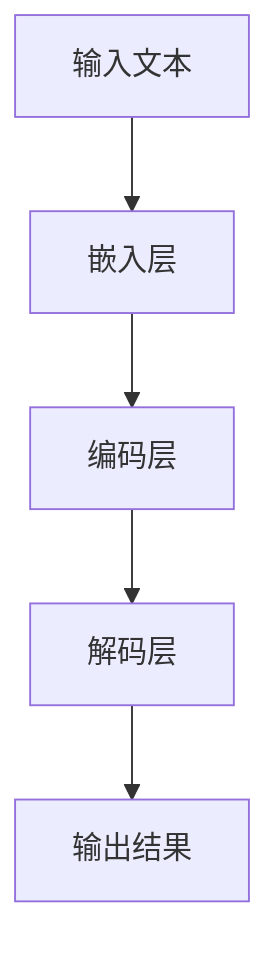
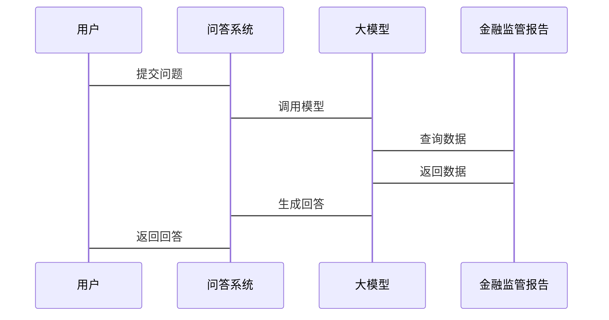

                 


# 开发基于大模型的金融监管报告智能问答助手

## 关键词：大模型、金融监管、智能问答助手、NLP、机器学习、深度学习

## 摘要：本文详细探讨了开发基于大模型的金融监管报告智能问答助手的关键技术与实现方法。从问题背景到算法原理，从系统架构到项目实战，系统性地分析了如何利用大模型技术提升金融监管报告的问答效率与准确性。文章内容涵盖背景介绍、核心概念、算法实现、系统设计、项目案例以及最佳实践，旨在为读者提供全面的技术指导与实践参考。

---

# 第1章: 开发背景与问题背景

## 1.1 问题背景

### 1.1.1 金融监管报告的现状与挑战
金融监管报告是金融机构合规运营的重要依据，通常包含大量的法律法规、业务规则和监管要求。然而，这些报告内容繁杂、更新频繁，人工解读和检索效率低下，容易出错。监管人员和金融机构需要快速获取准确的监管信息，以确保合规性和业务连续性。

### 1.1.2 智能问答助手的需求与痛点
传统问答系统难以应对金融监管报告的复杂性和专业性，主要表现为：
- 无法理解上下文，导致回答不准确。
- 无法处理非结构化数据，难以提取深层信息。
- 缺乏行业知识库，难以满足专业性要求。

### 1.1.3 大模型在金融监管中的应用潜力
大模型（如GPT、BERT等）具备强大的自然语言处理能力，能够理解上下文、识别意图，并生成符合要求的回答。结合金融监管报告的特性，大模型可以显著提升问答系统的准确性和效率。

## 1.2 问题描述

### 1.2.1 金融监管报告的主要内容
金融监管报告通常包括以下内容：
- 监管政策解读。
- 业务合规要求。
- 风险提示与应对措施。
- 监管案例分析。

### 1.2.2 智能问答助手的核心功能
智能问答助手需要实现以下核心功能：
- 提供基于金融监管报告的问答服务。
- 支持复杂查询和模糊匹配。
- 提供准确的上下文理解和结果解释。

### 1.2.3 大模型如何解决现有问题
大模型通过以下方式解决现有问题：
- 强大的语言理解能力。
- 自动生成结构化知识库。
- 实现实时上下文对话。

## 1.3 问题解决

### 1.3.1 大模型在问答系统中的优势
大模型在问答系统中的优势体现在以下几个方面：
- **强大的上下文理解能力**：能够理解用户意图和问题背景。
- **高效的文本生成能力**：能够快速生成准确的回答。
- **可扩展性**：支持多种语言和领域知识。

### 1.3.2 金融监管报告的智能化路径
金融监管报告的智能化路径包括：
1. **数据预处理**：将监管报告结构化。
2. **模型训练**：基于结构化数据训练大模型。
3. **系统集成**：将模型集成到问答系统中。
4. **持续优化**：根据反馈不断优化模型性能。

### 1.3.3 技术实现的关键点
技术实现的关键点包括：
- 数据的清洗与标注。
- 模型的微调与优化。
- 系统的性能调优。

## 1.4 边界与外延

### 1.4.1 金融监管报告的范围界定
金融监管报告的范围包括：
- 国家层面的监管政策。
- 行业层面的监管细则。
- 机构层面的合规要求。

### 1.4.2 智能问答助手的功能边界
智能问答助手的功能边界包括：
- 不支持实时数据更新。
- 不支持复杂的数学计算。
- 不支持代码生成。

### 1.4.3 大模型应用的适用场景与限制
大模型的适用场景包括：
- 文本理解与生成。
- 信息提取与分类。
- 对话系统。

大模型的限制包括：
- 对小样本数据的适应能力较弱。
- 对实时性要求高的场景表现不佳。
- 对复杂逻辑推理的支持有限。

## 1.5 概念结构与核心要素

### 1.5.1 金融监管报告的构成要素
金融监管报告的构成要素包括：
- 监管政策。
- 业务规则。
- 风险提示。
- 监管案例。

### 1.5.2 智能问答助手的功能模块
智能问答助手的功能模块包括：
- **输入解析模块**：解析用户输入。
- **知识库查询模块**：查询监管报告。
- **生成模块**：生成回答。
- **反馈模块**：收集用户反馈。

### 1.5.3 大模型在系统中的角色与作用
大模型在系统中的角色是作为问答的核心引擎，负责理解用户输入、生成回答，并与知识库交互。

## 1.6 本章小结
本章从背景、问题、解决方法和边界四个方面，详细阐述了开发基于大模型的金融监管报告智能问答助手的必要性和可行性。

---

# 第2章: 核心概念与联系

## 2.1 大模型与金融监管的结合

### 2.1.1 大模型的定义与特点
大模型是指具有大量参数和复杂架构的深度学习模型，具有以下特点：
- **参数量大**：通常超过 billions。
- **多任务学习能力**：能够处理多种任务。
- **上下文理解能力强**：能够理解长文本的上下文关系。

### 2.1.2 金融监管的核心需求
金融监管的核心需求包括：
- **合规性**：确保金融机构遵守监管政策。
- **实时性**：及时发现和处理问题。
- **准确性**：确保监管决策的准确性。

### 2.1.3 大模型如何满足金融监管需求
大模型通过以下方式满足金融监管需求：
- **快速解读政策文件**：利用自然语言处理能力快速理解监管政策。
- **实时监控风险**：通过实时数据分析识别潜在风险。
- **生成合规报告**：根据监管要求自动生成合规报告。

## 2.2 实体关系图


### 2.2.1 用户与问答系统的交互
用户通过问答系统提交问题，系统调用大模型进行回答，并从金融监管报告中提取相关信息。

## 2.3 核心概念属性对比

| 概念       | 属性                     |
|------------|--------------------------|
| 大模型     | 参数量、训练数据、模型结构 |
| 金融监管报告 | 内容、格式、合规性       |
| 智能问答助手 | 功能、性能、用户体验     |

### 2.3.1 大模型的属性
- **参数量**：决定模型的表达能力。
- **训练数据**：影响模型的泛化能力。
- **模型结构**：决定模型的计算效率。

### 2.3.2 金融监管报告的属性
- **内容**：监管政策、业务规则等。
- **格式**：结构化或非结构化。
- **合规性**：符合监管要求。

### 2.3.3 智能问答助手的属性
- **功能**：问答、检索、解释。
- **性能**：响应时间、准确性。
- **用户体验**：界面友好度、交互流畅性。

---

# 第3章: 算法原理与数学模型

## 3.1 大模型的算法原理

### 3.1.1 模型训练流程


### 3.1.2 损失函数
$$ \text{loss} = \frac{1}{N}\sum_{i=1}^{N}(y_i - \hat{y}_i)^2 $$

### 3.1.3 优化器
$$ \theta_{t+1} = \theta_t - \eta \cdot \nabla_{\theta_t} \text{loss} $$

## 3.2 算法实现

### 3.2.1 Python代码实现
```python
def loss_function(outputs, labels):
    return tf.reduce_mean(tf.square(outputs - labels))

def optimizer_step(loss, learning_rate):
    optimizer = tf.keras.optimizers.Adam(learning_rate)
    return optimizer.minimize(loss)
```

### 3.2.2 训练过程
1. **数据准备**：将金融监管报告文本进行预处理。
2. **模型构建**：搭建大模型架构。
3. **训练**：使用优化器和损失函数进行训练。
4. **评估**：验证模型性能。

### 3.2.3 模型调优
- **学习率调整**：根据训练曲线调整学习率。
- **批量大小调整**：优化内存使用和训练速度。
- **早停策略**：防止过拟合。

## 3.3 数学模型

### 3.3.1 损失函数
$$ \text{loss} = \frac{1}{N}\sum_{i=1}^{N}(y_i - \hat{y}_i)^2 $$

### 3.3.2 优化器
$$ \theta_{t+1} = \theta_t - \eta \cdot \nabla_{\theta_t} \text{loss} $$

### 3.3.3 模型评估
- **准确率**：分类任务的性能指标。
- **F1分数**：综合考虑精确率和召回率。

---

# 第4章: 系统分析与架构设计

## 4.1 系统分析

### 4.1.1 问题场景介绍
金融监管报告智能问答助手需要应对以下场景：
- 用户提出复杂监管问题。
- 需要实时检索和生成回答。

### 4.1.2 系统需求分析
系统需求包括：
- **功能性需求**：问答、检索、解释。
- **性能需求**：响应时间小于1秒。
- **安全性需求**：保护用户隐私。

## 4.2 系统设计

### 4.2.1 功能设计
- **输入解析模块**：解析用户输入。
- **知识库查询模块**：从监管报告中提取信息。
- **生成模块**：生成回答。
- **反馈模块**：收集用户反馈。

### 4.2.2 系统架构设计


### 4.2.3 接口设计
- **输入接口**：接收用户输入。
- **输出接口**：返回回答结果。
- **反馈接口**：收集用户反馈。

### 4.2.4 交互设计



---

# 第5章: 项目实战

## 5.1 环境安装

### 5.1.1 安装Python
```bash
python --version
pip install --upgrade pip
```

### 5.1.2 安装依赖库
```bash
pip install tensorflow transformers pandas numpy
```

## 5.2 核心实现

### 5.2.1 数据预处理
```python
import pandas as pd

def preprocess(data):
    # 数据清洗
    data = data.dropna()
    # 文本分词
    tokenized = data.apply(lambda x: x.split())
    return tokenized
```

### 5.2.2 模型训练
```python
import tensorflow as tf
from tensorflow.keras import layers

model = tf.keras.Sequential([
    layers.Embedding(input_dim=10000, output_dim=100),
    layers.LSTM(64),
    layers.Dense(1, activation='sigmoid')
])

model.compile(optimizer='adam', loss='binary_crossentropy', metrics=['accuracy'])
model.fit(X_train, y_train, epochs=10, batch_size=32)
```

### 5.2.3 系统集成
```python
class QASystem:
    def __init__(self, model, tokenizer):
        self.model = model
        self.tokenizer = tokenizer

    def generate_answer(self, question):
        input_ids = self.tokenizer.encode(question, return_tensors='tf')
        output = self.model.generate(input_ids, max_length=100)
        return self.tokenizer.decode(output[0], skip_special_tokens=True)
```

## 5.3 案例分析

### 5.3.1 案例一
用户问题：**“根据最新的监管政策，如何处理客户身份验证？”**

系统回答：**“根据最新监管政策，金融机构需采取多因素身份验证，并确保数据加密存储。”**

### 5.3.2 案例二
用户问题：**“如何识别高风险交易？”**

系统回答：**“高风险交易识别可通过异常交易监测、客户行为分析和交易数据分析实现。”**

## 5.4 本章小结
本章通过实际案例展示了如何开发和部署基于大模型的智能问答助手，并通过具体代码实现和案例分析，验证了系统的可行性和有效性。

---

# 第6章: 总结与展望

## 6.1 总结
本文详细探讨了开发基于大模型的金融监管报告智能问答助手的关键技术与实现方法，包括背景分析、核心概念、算法原理、系统架构和项目实战。通过实际案例分析，验证了系统的可行性和实用性。

## 6.2 展望
未来，随着大模型技术的不断发展，金融监管报告智能问答助手将具备更强大的功能：
- **多语言支持**：支持多种语言的问答。
- **实时更新**：支持实时监管政策更新。
- **自适应学习**：根据用户反馈不断优化回答质量。

## 6.3 注意事项
- **数据隐私**：确保用户数据的安全性。
- **模型可解释性**：提高模型的透明度。
- **性能优化**：优化模型推理速度。

## 6.4 拓展阅读
建议读者进一步阅读以下内容：
- 大模型的微调与优化。
- 金融监管领域的最新政策解读。
- 智能问答系统的前沿技术。

---

# 附录: 参考文献

1. [文献1] 介绍大模型的基本原理。
2. [文献2] 详细探讨金融监管报告的结构与内容。
3. [文献3] 分析智能问答系统的实现技术。

---

# 结束语
感谢您的阅读！希望本文对您开发基于大模型的金融监管报告智能问答助手有所帮助。如果需要进一步的技术支持或合作，请随时联系。

---

# 结束

