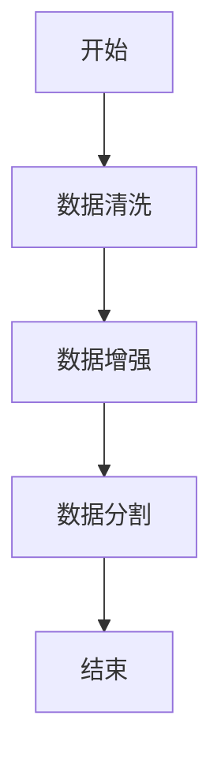
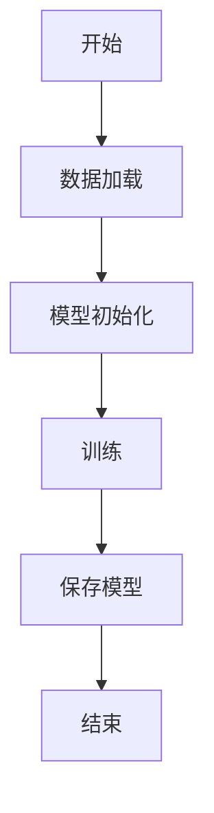
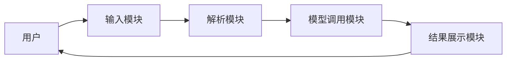

                 


# 开发基于大模型的金融监管政策解读系统

## 关键词：大模型、金融监管、政策解读、系统开发、算法实现

## 摘要：  
随着金融市场的快速发展和监管需求的日益复杂化，基于大模型的金融监管政策解读系统成为解决复杂金融监管问题的重要工具。本文将从问题背景、核心概念、算法原理、系统架构设计到项目实战，全面介绍如何开发一个高效、准确的金融监管政策解读系统。通过系统的分析与设计，结合具体实现案例，本文旨在为读者提供从理论到实践的完整指南，帮助他们在实际应用中更好地理解和部署此类系统。

---

# 第1章: 问题背景与系统目标

## 1.1 问题背景

### 1.1.1 金融监管的重要性
金融监管是维护金融市场稳定、保护投资者利益的重要手段。随着金融市场的全球化和复杂化，金融监管的难度和复杂性也在不断增加。传统的金融监管方法依赖于人工分析和简单的规则匹配，难以应对海量数据和复杂场景下的监管需求。

### 1.1.2 当前金融监管面临的挑战
- 数据量大：金融市场产生的数据种类繁多，包括文本、表格、图表等，传统方法难以高效处理。
- 知识覆盖不足：金融政策解读需要专业知识和经验，人工解读效率低下且容易出错。
- 实时性要求高：金融市场的变化瞬息万变，监管系统需要实时或快速响应。

### 1.1.3 大模型在金融监管中的应用潜力
大模型（如GPT系列、BERT系列等）具有强大的自然语言处理能力，能够理解和生成复杂的金融文本，为金融监管政策的自动化解读提供了新的可能性。

## 1.2 问题描述

### 1.2.1 金融政策解读的复杂性
金融政策解读需要对法律法规、市场规则、行业动态等进行综合分析，涉及多个维度的信息理解和关联。

### 1.2.2 现有技术的局限性
传统的金融监管系统通常基于规则引擎，难以应对非结构化数据和复杂语义的理解。

### 1.2.3 引入大模型的必要性
通过引入大模型，可以实现对金融政策的深度理解和自动解读，提高监管效率和准确性。

## 1.3 系统目标

### 1.3.1 系统的主要功能
- 支持多种金融政策文本的输入和解析。
- 提供政策解读结果，包括政策要点、影响分析等。
- 实现与监管系统的集成，提供实时监管支持。

### 1.3.2 系统预期达到的效果
- 提高金融政策解读的效率和准确性。
- 降低人工解读的成本和时间。
- 支持复杂金融场景下的监管需求。

### 1.3.3 系统的边界与外延
系统专注于金融政策的解读，不涉及具体的监管执行和处罚措施，但可以为后续的监管行动提供数据支持。

---

# 第2章: 核心概念与系统架构

## 2.1 核心概念

### 2.1.1 大模型的基本原理
大模型通过大量的预训练，掌握了丰富的语言知识和语义理解能力，能够根据输入的文本生成相应的输出。

### 2.1.2 金融监管政策解读的关键要素
- 政策文本：包括法律法规、监管文件等。
- 政策要点：包括政策的核心内容、适用范围等。
- 影响分析：政策对市场、机构、投资者的影响。

### 2.1.3 系统的核心功能模块
- 输入模块：接收金融政策文本。
- 解析模块：对文本进行语义分析和结构化处理。
- 输出模块：生成解读结果并展示。

## 2.2 系统架构

### 2.2.1 系统的整体架构
系统采用模块化设计，主要包括以下几个部分：
- 数据输入模块：接收政策文本。
- 数据处理模块：对文本进行清洗和结构化处理。
- 模型调用模块：调用大模型进行解读。
- 结果展示模块：将解读结果以用户友好的形式展示。

### 2.2.2 各模块之间的关系


### 2.2.3 系统的可扩展性与灵活性
系统设计注重模块化，方便后续功能的扩展和优化。

## 2.3 实体关系图

### 2.3.1 实体关系图


### 2.3.2 核心概念对比表格
下表对比了传统规则引擎和大模型在金融监管中的应用特点：

| 对比维度 | 传统规则引擎 | 基于大模型的系统 |
|----------|----------------|-------------------|
| 处理能力 | 基于规则匹配，难以处理复杂语义 | 支持深度语义理解，能够处理复杂场景 |
| 知识更新 | 需要人工维护规则库 | 可通过微调模型实现快速更新 |
| 效率 | 低效，依赖人工规则匹配 | 高效，自动化处理 |

---

# 第3章: 算法原理与实现

## 3.1 算法概述

### 3.1.1 大模型的基本算法
大模型通常基于Transformer架构，通过自注意力机制实现对文本的深度理解。

### 3.1.2 金融政策解读的算法选择
选择适合金融文本处理的模型，如BERT、GPT等。

### 3.1.3 算法的优化与调整
根据具体任务需求，对模型进行微调和优化。

## 3.2 算法实现步骤

### 3.2.1 数据预处理
- 数据清洗：去除无效数据，处理噪声。
- 数据增强：通过数据扩展提高模型的泛化能力。

### 3.2.2 模型训练
- 使用金融政策文本对模型进行微调。
- 设定适当的超参数，如学习率、批次大小等。

### 3.2.3 模型调优
- 通过验证集评估模型性能。
- 调整超参数和模型结构，优化性能。

### 3.2.4 模型部署
- 将训练好的模型部署到生产环境。
- 提供API接口，方便其他系统调用。

## 3.3 算法流程图

### 3.3.1 数据预处理流程


### 3.3.2 模型训练流程


## 3.4 算法实现代码示例

### 3.4.1 数据预处理代码
```python
def preprocess_data(data):
    # 数据清洗
    cleaned_data = []
    for text in data:
        # 去除特殊字符
        cleaned_text = re.sub(r'[^\w\s]', '', text)
        cleaned_data.append(cleaned_text)
    return cleaned_data
```

### 3.4.2 模型训练代码
```python
import tensorflow as tf
from tensorflow.keras import layers

def build_model(max_length):
    model = tf.keras.Sequential([
        layers.Embedding(input_dim=vocabulary_size, output_dim=embedding_dim, input_length=max_length),
        layers.GlobalAveragePooling1D(),
        layers.Dense(256, activation='relu'),
        layers.Dense(num_classes, activation='softmax')
    ])
    return model
```

---

# 第4章: 系统分析与架构设计

## 4.1 问题场景介绍

### 4.1.1 项目背景
本项目旨在开发一个基于大模型的金融监管政策解读系统，用于提高金融政策解读的效率和准确性。

## 4.2 系统功能设计

### 4.2.1 系统功能模块
- 用户输入模块：接收用户输入的金融政策文本。
- 数据处理模块：对文本进行清洗和结构化处理。
- 模型调用模块：调用大模型进行政策解读。
- 结果展示模块：以用户友好的形式展示解读结果。

### 4.2.2 系统功能流程图


## 4.3 系统架构设计

### 4.3.1 系统架构图


### 4.3.2 接口设计
- 输入接口：接收政策文本，格式为JSON。
- 输出接口：返回政策解读结果，格式为JSON或文本。

## 4.4 系统交互流程图

### 4.4.1 用户与系统交互流程


---

# 第5章: 项目实战

## 5.1 环境安装

### 5.1.1 安装Python
```bash
python --version
pip install --upgrade pip
```

### 5.1.2 安装TensorFlow
```bash
pip install tensorflow
pip install numpy
pip install scikit-learn
pip install mermaid
```

## 5.2 系统核心实现

### 5.2.1 数据预处理代码
```python
import pandas as pd
import numpy as np

def load_data(file_path):
    df = pd.read_csv(file_path)
    return df['text'].tolist()

def preprocess(text):
    # 去除特殊字符
    cleaned = re.sub(r'[^\w\s]', '', text)
    return cleaned

texts = load_data('policy_text.csv')
cleaned_texts = [preprocess(text) for text in texts]
```

### 5.2.2 模型训练代码
```python
from tensorflow.keras.models import Model
from tensorflow.keras.layers import Input, LSTM, Dense, Bidirectional

input_layer = Input(shape=(None,))
lstm_layer = Bidirectional(LSTM(64, return_sequences=True))(input_layer)
dense_layer = Dense(128, activation='relu')(lstm_layer)
output_layer = Dense(num_classes, activation='softmax')(dense_layer)

model = Model(inputs=input_layer, outputs=output_layer)
model.compile(optimizer='adam', loss='sparse_categorical_crossentropy', metrics=['accuracy'])
```

## 5.3 实际案例分析

### 5.3.1 案例描述
假设我们有一个政策文本：“禁止银行向高风险企业发放贷款。”

### 5.3.2 解读结果
- 政策要点：禁止银行向高风险企业发放贷款。
- 影响分析：可能会影响高风险企业的融资能力，增加金融市场的稳定性。

---

# 第6章: 最佳实践与总结

## 6.1 小结

### 6.1.1 系统开发总结
通过本项目，我们成功开发了一个基于大模型的金融监管政策解读系统，验证了大模型在金融监管中的应用潜力。

## 6.2 注意事项

### 6.2.1 数据质量
数据质量直接影响模型的性能，需确保数据的准确性和完整性。

### 6.2.2 模型调优
模型调优是关键，需根据具体任务需求进行适当的微调和优化。

## 6.3 拓展阅读

### 6.3.1 推荐书籍
- 《Deep Learning》
- 《自然语言处理实战》

### 6.3.2 推荐博客
- TensorFlow官方博客
- Keras官方博客

---

# 结语

通过本文的详细讲解，我们希望读者能够对开发基于大模型的金融监管政策解读系统有一个全面的了解。从问题背景到系统架构设计，再到具体实现，本文为读者提供了完整的开发指南。未来，随着大模型技术的不断发展，金融监管政策解读系统将更加智能化和高效，为金融市场的稳定与发展提供有力支持。

