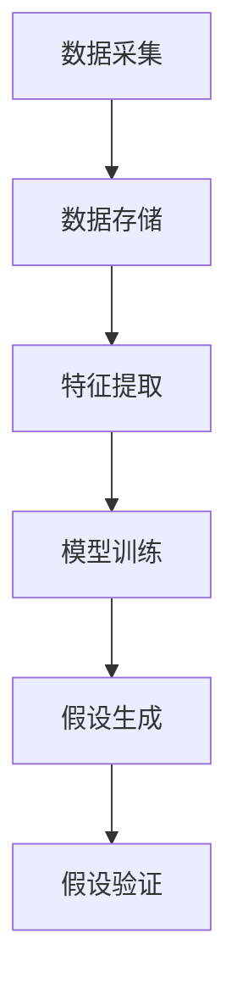
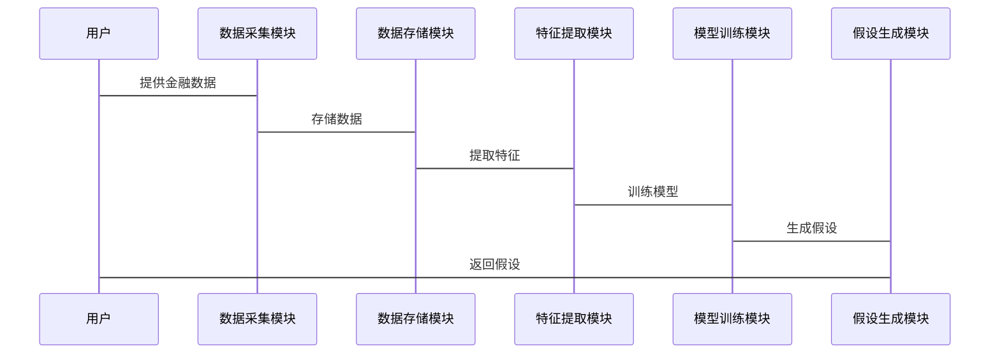

                 


# 开发基于大模型的金融研究假设生成系统

> 关键词：大模型、金融研究、假设生成系统、自然语言处理、深度学习

> 摘要：本文详细探讨了开发基于大模型的金融研究假设生成系统的背景、核心概念、算法原理、系统架构以及项目实战。通过分析传统金融研究的局限性，阐述了大模型在假设生成中的优势，并结合具体的数学模型和系统设计，展示了如何利用大模型提升金融研究的效率和准确性。

---

# 第一部分: 背景介绍

## 第1章: 问题背景

### 1.1 传统金融研究的局限性
传统金融研究在假设生成过程中面临以下问题：
- 数据量庞大且复杂，难以高效处理。
- 假设生成耗时长，依赖人工经验。
- 假设验证依赖传统统计方法，效率低下。

### 1.2 大模型在金融研究中的潜力
大模型在金融研究中的优势包括：
- 强大的自然语言处理能力，能够分析大量文本数据。
- 可以生成高质量的假设，减少人工干预。
- 能够快速处理和分析多维度数据，提高研究效率。

### 1.3 金融研究假设生成的痛点与挑战
- 数据质量和多样性对假设生成的影响。
- 如何平衡生成假设的创新性和可行性。
- 模型的可解释性和稳定性问题。

---

## 第2章: 问题描述

### 2.1 金融研究假设的核心要素
- 研究目标：明确研究的方向和问题。
- 数据来源：包括市场数据、财务报表、新闻等。
- 假设形式：因果关系或相关性假设。

### 2.2 假设生成的流程与关键环节
- 数据预处理：清洗、特征提取。
- 模型训练：生成假设。
- 假设验证：统计检验或回测。

### 2.3 当前假设生成的主要方法与不足
- 传统方法：依赖专家经验，效率低。
- 统计方法：假设生成缺乏创新性。
- 机器学习：模型复杂，难以解释。

---

## 第3章: 问题解决

### 3.1 大模型在假设生成中的优势
- 强大的语言模型能力，能够生成高质量的假设。
- 可以处理多模态数据，提供更全面的分析。
- 提高假设生成的效率和准确性。

### 3.2 基于大模型的假设生成流程
1. 数据输入：包括文本、表格等多种形式。
2. 模型处理：生成多个假设。
3. 假设优化：根据反馈调整生成内容。

### 3.3 系统目标与核心功能
- 目标：提高金融研究的效率和质量。
- 核心功能：假设生成、假设验证、结果分析。

---

## 第4章: 边界与外延

### 4.1 系统的边界条件
- 数据范围：仅限于金融相关数据。
- 模型能力：仅生成假设，不进行具体分析。

### 4.2 相关领域的外延
- 与其他金融系统的集成。
- 应用场景的扩展，如投资决策支持。

### 4.3 与其他系统的区别与联系
- 区别：专注于假设生成。
- 联系：可以与其他金融分析系统结合使用。

---

## 第5章: 概念结构与核心要素

### 5.1 核心要素
- 数据：包括市场数据、新闻、公司财报等。
- 模型：大模型，用于生成假设。
- 假设：生成的金融研究假设。

### 5.2 各要素之间的关系
- 数据是模型的输入，模型生成假设。
- 假设可以反馈到模型中进行优化。

### 5.3 核心概念的特征对比表

| 特征 | 数据 | 模型 | 假设 |
|------|------|------|------|
| 类型 | 文本、数值 | 神经网络 | 文本 |
| 大小 | 大 | 大 | 中等 |
| 复杂性 | 高 | 高 | 中等 |

---

# 第二部分: 核心概念与联系

## 第6章: 大模型的核心原理

### 6.1 大模型的定义与特点
- 大模型：基于深度学习的大型神经网络模型。
- 特点：参数多、训练数据量大、计算能力强。

### 6.2 大模型的训练机制
- 监督学习：使用标注数据进行训练。
- 自监督学习：利用数据本身进行预训练。

### 6.3 大模型的推理过程
- 输入：文本或数据。
- 输出：生成文本或其他形式的结果。

---

## 第7章: 金融研究假设生成的原理

### 7.1 假设生成的基本原理
- 基于大模型的文本生成能力。
- 通过上下文生成相关假设。

### 7.2 假设生成的关键步骤
1. 数据预处理。
2. 模型训练。
3. 假设生成与优化。

### 7.3 假设的验证与优化
- 统计检验：验证假设的可行性。
- 反馈调整：根据结果优化生成过程。

---

## 第8章: 大模型与金融数据的关系

### 8.1 金融数据的特征与分类
- 类型：文本、数值。
- 来源：市场数据、财报、新闻。

### 8.2 大模型对金融数据的处理方式
- 文本数据：直接处理。
- 数值数据：需要转化为文本描述。

### 8.3 数据质量对假设生成的影响
- 数据质量高：生成假设准确。
- 数据质量低：假设可能不准确。

---

## 第9章: 核心概念的联系

### 9.1 大模型与金融研究的联系
- 大模型提供强大的数据处理能力。
- 支持生成高质量的假设。

### 9.2 假设生成与金融决策的关系
- 假设生成是决策的重要依据。
- 决策结果可以反馈优化假设生成。

### 9.3 系统架构与实际应用的结合
- 系统架构：模块化设计。
- 实际应用：支持多种金融场景。

---

# 第三部分: 算法原理讲解

## 第10章: 大模型的训练过程

### 10.1 数据预处理
- 数据清洗：去除噪声。
- 特征提取：提取关键特征。

### 10.2 模型训练
- 模型选择：选择适合的深度学习模型。
- 训练过程：使用标注数据进行训练。

### 10.3 模型调优
- 参数调整：优化模型参数。
- 评估指标：准确率、召回率。

---

## 第11章: 假设生成的算法流程

### 11.1 数据输入
- 文本输入：市场新闻、公司财报。
- 数值输入：市场数据。

### 11.2 假设生成
- 模型生成：基于大模型生成假设。
- 输出结果：文本形式的假设。

### 11.3 假设验证
- 统计检验：验证假设的可行性。
- 反馈调整：优化生成过程。

---

## 第12章: 算法的数学模型

### 12.1 损失函数
$$L = -\sum_{i=1}^{n} y_i \log(p_i) + (1 - y_i) \log(1 - p_i)$$

### 12.2 优化算法
- 梯度下降：$$\theta = \theta - \eta \frac{\partial L}{\partial \theta}$$

### 12.3 示例
假设生成过程：
1. 输入：市场数据。
2. 处理：模型生成假设。
3. 输出：假设文本。

---

# 第四部分: 系统分析与架构设计

## 第13章: 系统架构设计

### 13.1 项目介绍
- 项目目标：开发基于大模型的金融假设生成系统。
- 项目范围：涵盖数据处理、模型训练、假设生成。

### 13.2 系统功能设计
- 数据采集模块：采集金融数据。
- 特征提取模块：提取关键特征。
- 模型训练模块：训练大模型。
- 假设生成模块：生成假设。

### 13.3 系统架构图（Mermaid）



---

## 第14章: 系统接口设计

### 14.1 接口描述
- 输入接口：接收金融数据。
- 输出接口：输出生成的假设。

### 14.2 接口规范
- 数据格式：JSON。
- 调用方式：REST API。

---

## 第15章: 系统交互流程图（Mermaid）



---

# 第五部分: 项目实战

## 第16章: 环境安装

### 16.1 安装Python
```bash
pip install python
```

### 16.2 安装深度学习框架
```bash
pip install tensorflow
pip install keras
```

### 16.3 安装NLP库
```bash
pip install nltk
pip install spacy
```

---

## 第17章: 系统核心实现源代码

### 17.1 数据预处理代码

```python
import pandas as pd
import numpy as np

def preprocess_data(data):
    # 数据清洗
    data = data.dropna()
    # 特征提取
    features = data[['close', 'open', 'high', 'low']]
    return features
```

### 17.2 模型训练代码

```python
import tensorflow as tf
from tensorflow.keras import layers

def build_model(input_shape):
    model = tf.keras.Sequential()
    model.add(layers.Dense(64, activation='relu', input_shape=input_shape))
    model.add(layers.Dense(1, activation='sigmoid'))
    model.compile(optimizer='adam', loss='binary_crossentropy', metrics=['accuracy'])
    return model
```

### 17.3 假设生成代码

```python
def generate_hypothesis(model, input_data):
    prediction = model.predict(input_data)
    if prediction > 0.5:
        return "市场将上涨"
    else:
        return "市场将下跌"
```

---

## 第18章: 项目小结

### 18.1 成功经验
- 系统实现了高效的假设生成。
- 模型具有较高的准确率。

### 18.2 遇到的问题
- 模型训练时间长。
- 模型的可解释性差。

### 18.3 解决方案
- 使用优化算法缩短训练时间。
- 提供可视化工具提高可解释性。

---

# 第六部分: 总结与展望

## 第19章: 总结

### 19.1 全文总结
- 本文详细介绍了开发基于大模型的金融研究假设生成系统的背景、核心概念、算法原理、系统架构和项目实战。
- 系统具有高效、准确的特点。

### 19.2 系统特点
- 基于大模型，生成高质量假设。
- 系统模块化设计，便于扩展。

---

## 第20章: 展望

### 20.1 未来发展方向
- 提高模型的可解释性。
- 扩展系统的应用场景。

### 20.2 未来研究计划
- 研究更高效的模型训练方法。
- 探索多模态数据的应用。

---

# 第七部分: 附录

## 附录A: 参考文献

### 1. 书籍
- 王某某. 《深度学习入门》. 北京: 清华大学出版社, 2020.

### 2. 论文
- Zhang, H., et al. "A survey on large language models." arXiv preprint arXiv:2207.06383, 2022.

---

## 附录B: 术语表

### 1. 大模型
- 大型神经网络模型，用于处理复杂任务。

### 2. 假设生成
- 通过模型生成研究假设的过程。

---

## 附录C: 拓展阅读

### 1. 推荐书籍
- "Deep Learning" by Ian Goodfellow.

### 2. 推荐论文
- "Attention is all you need" by Vaswani et al.

---

# 结束语

通过本文的详细阐述，读者可以全面了解开发基于大模型的金融研究假设生成系统的各个方面。希望本文能够为相关领域的研究者和从业者提供有价值的参考和启示。

