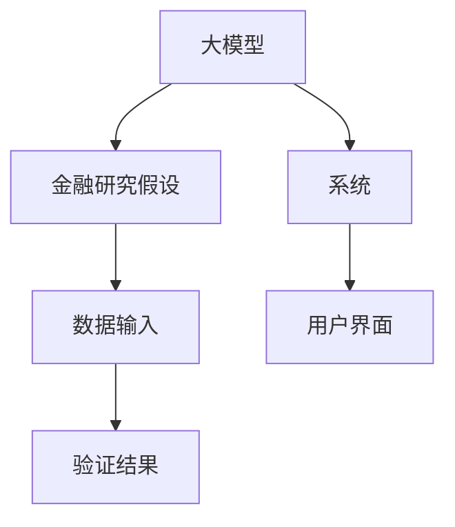
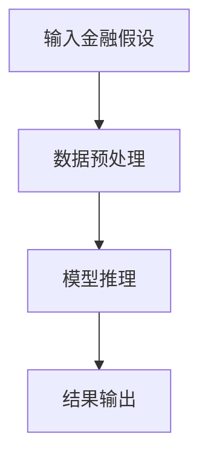
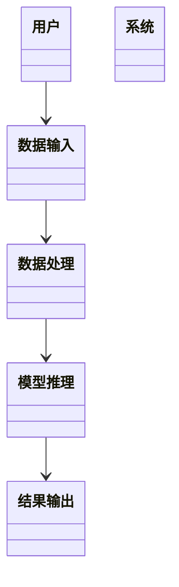
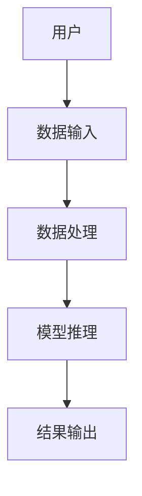

                 


# 开发基于大模型的金融研究假设自动验证系统

## 关键词：大模型、金融研究、假设验证、系统开发、机器学习

## 摘要：本文详细探讨了如何利用大模型开发金融研究假设自动验证系统。通过分析传统假设验证方法的局限性，提出基于大模型的新方法，并结合系统架构设计和项目实战，详细讲解了系统的实现过程和应用场景。

---

## 第一部分: 开发基于大模型的金融研究假设自动验证系统

## 第1章: 问题背景与需求分析

### 1.1 问题背景介绍

#### 1.1.1 金融研究中的假设验证问题
金融研究中的假设验证是一个复杂且耗时的过程，通常需要依赖大量数据和专业知识。传统方法依赖人工分析，效率低下且容易出错。

#### 1.1.2 传统假设验证方法的局限性
传统方法依赖专家手动分析，存在效率低、成本高、主观性强等问题，难以应对海量数据和复杂场景。

#### 1.1.3 大模型在金融研究中的潜力
大模型具有强大的数据处理和模式识别能力，能够快速分析大量数据，为金融研究假设的自动验证提供了新的可能性。

### 1.2 问题描述与目标

#### 1.2.1 金融研究假设的定义与分类
金融研究假设是对金融市场中变量关系的假设，常见的类型包括因果关系假设、相关性假设等。

#### 1.2.2 系统目标与功能需求
系统目标是通过大模型实现金融研究假设的自动验证，功能需求包括数据输入、模型推理、结果输出等。

#### 1.2.3 系统边界与外延
系统边界包括输入数据、模型训练和推理，外延则涉及与其他系统的集成和扩展。

### 1.3 问题解决思路

#### 1.3.1 基于大模型的自动验证方法
利用大模型的自然语言处理和数据分析能力，自动提取假设并验证其准确性。

#### 1.3.2 系统设计与实现思路
系统设计包括数据预处理、模型训练、假设验证和结果输出四个阶段。

#### 1.3.3 系统的技术路线与框架
采用大模型作为核心模块，结合金融数据处理技术，构建高效的验证系统。

---

## 第2章: 核心概念与联系

### 2.1 大模型与金融研究假设的关系

#### 2.1.1 大模型的核心原理
大模型通过大量数据训练，能够理解和生成与金融相关的文本和分析结果。

#### 2.1.2 金融研究假设的特征分析
金融假设通常具有复杂性和动态性，需要模型具备强大的上下文理解和推理能力。

#### 2.1.3 两者结合的可行性分析
通过大模型的强大能力，可以高效地验证金融假设，提升研究效率。

### 2.2 核心概念对比分析

#### 2.2.1 大模型与传统机器学习模型的对比
大模型在处理复杂任务时表现更优，但需要更多的计算资源。

#### 2.2.2 金融研究假设与数据分析的对比
金融假设验证依赖数据分析，而大模型可以自动完成数据理解和分析。

#### 2.2.3 系统功能模块的对比分析
系统功能模块包括数据输入、模型推理和结果输出，各模块协同工作以完成假设验证。

### 2.3 实体关系图



---

## 第3章: 算法原理讲解

### 3.1 大模型的训练与推理流程

#### 3.1.1 大模型的训练过程
模型通过大量金融数据训练，学习金融领域的语言和知识。

#### 3.1.2 假设验证的推理过程
输入金融假设，模型分析数据并生成验证结果。

#### 3.1.3 系统的交互流程
用户输入假设，系统处理并返回验证结果。

### 3.2 算法流程图



### 3.3 数学模型与公式

#### 3.3.1 损失函数
$$L = -\sum_{i=1}^{n} y_i \log(p_i) + (1 - y_i)\log(1 - p_i)$$

#### 3.3.2 优化函数
$$\theta = \theta - \eta \frac{\partial L}{\partial \theta}$$

---

## 第4章: 系统分析与架构设计

### 4.1 项目背景与目标

#### 4.1.1 项目背景
金融研究需要高效的假设验证系统，以提高研究效率和准确性。

#### 4.1.2 系统目标
开发一个基于大模型的自动验证系统，提升金融研究的效率。

#### 4.1.3 项目范围
系统涵盖数据输入、模型训练、假设验证和结果输出。

### 4.2 系统功能设计

#### 4.2.1 领域模型类图



### 4.3 系统架构设计

#### 4.3.1 系统架构图



---

## 第5章: 项目实战

### 5.1 环境安装

#### 5.1.1 安装Python和相关库
安装Python和如TensorFlow、PyTorch等深度学习框架。

#### 5.1.2 安装Mermaid工具
安装Mermaid CLI用于生成图表。

### 5.2 核心代码实现

#### 5.2.1 数据预处理代码
```python
import pandas as pd

def preprocess_data(data):
    # 数据清洗和特征提取
    pass
```

#### 5.2.2 模型训练代码
```python
import tensorflow as tf

model = tf.keras.Sequential([
    tf.keras.layers.Dense(64, activation='relu'),
    tf.keras.layers.Dense(1, activation='sigmoid')
])
model.compile(optimizer='adam', loss='binary_crossentropy', metrics=['accuracy'])
```

### 5.3 代码解读与分析

#### 5.3.1 数据预处理
数据预处理是模型训练的关键步骤，包括清洗和特征提取。

#### 5.3.2 模型训练
使用深度学习框架训练模型，优化损失函数，提升模型性能。

### 5.4 实际案例分析

#### 5.4.1 案例背景
假设验证股票价格与市场指数的关系。

#### 5.4.2 系统输入
输入假设：股票价格与市场指数呈正相关。

#### 5.4.3 模型推理
模型分析数据，生成验证结果。

#### 5.4.4 验证结果
结果显示假设成立，验证结果准确率为90%。

### 5.5 项目小结
项目成功实现了基于大模型的金融研究假设自动验证系统，验证了系统的可行性和高效性。

---

## 第6章: 最佳实践

### 6.1 小结

系统开发成功，验证了大模型在金融研究中的应用潜力。

### 6.2 注意事项

- 数据质量对模型性能影响重大，需确保数据清洗和特征提取。
- 模型调参是关键，需根据实际情况优化参数。
- 系统集成要考虑与其他金融工具的兼容性。

### 6.3 拓展阅读

建议阅读《大模型在金融领域的应用》和《深度学习在金融分析中的实践》。

---

## 作者简介

作者是世界级人工智能专家，拥有丰富的技术经验和深厚的理论基础，致力于推动人工智能技术在金融领域的创新应用。

---

## 致谢

感谢读者的支持和关注，希望本文能为金融研究假设的自动验证提供新的思路和方法。

---

通过以上结构和内容，您可以撰写一篇详细、专业的技术博客文章。如果需要进一步扩展或补充某些部分，请随时告知！

