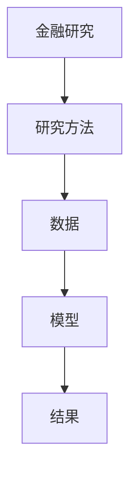
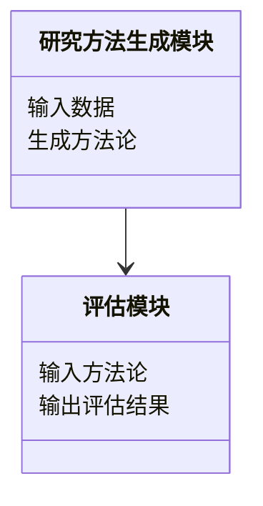
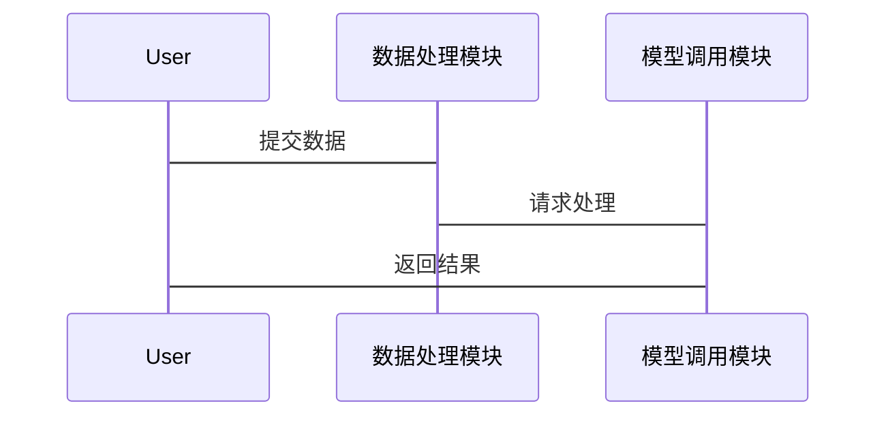

                 


# 开发基于大模型的金融研究方法论创新生成与评估系统

> 关键词：大模型，金融研究，方法论创新，生成系统，评估系统

> 摘要：本文详细介绍了如何开发基于大模型的金融研究方法论创新生成与评估系统。文章从背景介绍入手，分析了传统金融研究方法的局限性，提出了基于大模型的创新方法，并详细阐述了核心概念、算法原理、系统架构设计、项目实战以及最佳实践等内容。通过本文，读者可以全面了解如何利用大模型技术来提升金融研究的效率和准确性。

---

## 第1章: 背景介绍与核心概念

### 1.1 问题背景

#### 1.1.1 传统金融研究方法的局限性
传统金融研究方法主要依赖统计分析、回归分析和时间序列分析等技术。这些方法在处理复杂金融数据时存在以下问题：
- 数据维度高，难以捕捉复杂关系。
- 方法具有局限性，难以应对非线性问题。
- 缺乏灵活性，难以适应快速变化的金融市场。

#### 1.1.2 大模型技术的兴起与应用潜力
大模型（如GPT、BERT等）在自然语言处理领域取得了突破性进展，其强大的特征提取能力和上下文理解能力为金融研究带来了新的可能性。大模型可以处理大量非结构化数据，发现隐藏的模式和关系，从而为金融研究提供新的视角。

#### 1.1.3 金融研究方法论创新的必要性
金融市场日益复杂，传统方法难以应对新的挑战。创新的金融研究方法论可以提高研究的效率和准确性，帮助投资者和机构做出更明智的决策。

### 1.2 问题描述

#### 1.2.1 金融研究中的数据复杂性
金融数据具有高维性、异质性和时序性等特点，传统方法难以有效处理这些数据。

#### 1.2.2 方法论的可扩展性与可解释性问题
传统方法在处理复杂问题时，可扩展性和可解释性不足，难以满足现代金融研究的需求。

#### 1.2.3 创新方法论的评估与验证挑战
创新方法论的评估需要新的指标和验证方法，以确保其有效性和可靠性。

### 1.3 问题解决与边界

#### 1.3.1 基于大模型的金融研究方法论创新
利用大模型的强大能力，创新金融研究方法论，提高研究效率和准确性。

#### 1.3.2 系统的边界与外延
系统专注于金融研究方法论的创新生成与评估，不涉及具体的投资决策或交易策略。

#### 1.3.3 核心要素与组成结构
系统的核心要素包括大模型、金融数据、研究方法论生成模块和评估模块。

---

## 第2章: 核心概念与联系

### 2.1 大模型的基本原理

#### 2.1.1 大模型的定义与核心特征
大模型是一种基于深度学习的自然语言处理模型，具有以下核心特征：
- 大规模参数：通常包含数亿甚至更多的参数。
- 预训练技术：通过大量未标注数据进行预训练，学习语言的分布和语义。
- 微调技术：通过特定任务的标注数据进行微调，适应具体应用场景。

#### 2.1.2 大模型与金融研究的结合点
大模型可以处理非结构化数据（如新闻、报告），提取情感、主题和潜在关系，辅助金融研究。

#### 2.1.3 大模型在金融研究中的优势
- 处理多模态数据能力强。
- 可以发现隐藏的模式和关系。
- 具有良好的可扩展性。

### 2.2 核心概念对比

#### 2.2.1 不同大模型的属性特征对比
| 特性          | GPT-3      | BERT      | RoBERTa    |
|---------------|------------|-----------|------------|
| 参数量        | 175B       | 330M      | 175M       |
| 预训练任务    | Masked LM  | Masked LM | Masked LM   |
| 微调能力      | 强          | 强         | 强          |

#### 2.2.2 金融研究方法的属性特征对比
| 特性          | 传统方法      | 基于大模型的方法 |
|---------------|---------------|------------------|
| 数据处理能力  | 低维数据       | 高维数据         |
| 模型复杂度     | 简单           | 复杂             |
| 可解释性       | 高             | 中               |

#### 2.2.3 两者的关联性与差异性分析
- 关联性：基于大模型的方法可以提升传统方法的效率和准确性。
- 差异性：传统方法依赖统计分析，而基于大模型的方法依赖深度学习和自然语言处理技术。

### 2.3 实体关系架构

#### 2.3.1 ER实体关系图


#### 2.3.2 Mermaid流程图


---

## 第3章: 算法原理与数学模型

### 3.1 算法原理

#### 3.1.1 大模型训练流程
1. 数据预处理：清洗、分词、格式化。
2. 模型训练：使用预训练任务（如Masked LM）训练基础模型。
3. 微调：在特定金融任务上进行微调。
4. 部署：将模型部署到实际应用场景中。

#### 3.1.2 金融研究方法论生成过程
1. 数据输入：金融领域的文本或数据。
2. 模型处理：生成研究方法论的步骤和框架。
3. 输出结果：生成的方法论文档。

#### 3.1.3 方法论评估与优化算法
1. 评估指标：准确率、召回率、F1分数。
2. 优化算法：基于评估结果调整模型参数。

### 3.2 算法流程图


### 3.3 数学模型与公式

#### 3.3.1 概率分布模型
概率分布模型用于描述数据的分布情况：
$$ P(y|x) = \frac{P(x,y)}{P(x)} $$

#### 3.3.2 损失函数与优化目标
交叉熵损失函数：
$$ L = -\sum_{i=1}^{n} y_i \log(p_i) + (1 - y_i)\log(1 - p_i) $$

优化目标是通过梯度下降最小化损失函数。

---

## 第4章: 系统分析与架构设计

### 4.1 项目背景与目标

#### 4.1.1 项目背景
随着金融市场的复杂化，传统研究方法难以应对新的挑战。

#### 4.1.2 项目目标
开发基于大模型的金融研究方法论创新生成与评估系统。

### 4.2 系统功能设计

#### 4.2.1 领域模型


#### 4.2.2 系统架构设计


### 4.3 接口设计与交互流程图

#### 4.3.1 接口设计
- 输入接口：金融数据、文本。
- 输出接口：生成的方法论、评估结果。

#### 4.3.2 交互流程图


---

## 第5章: 项目实战

### 5.1 环境安装

```bash
pip install transformers
pip install torch
pip install mermaid
```

### 5.2 系统核心实现

#### 5.2.1 数据预处理代码
```python
import pandas as pd

def preprocess_data(data):
    # 数据清洗和分词
    pass
```

#### 5.2.2 模型训练代码
```python
from transformers import AutoModelForMaskedLM, AutoTokenizer

model = AutoModelForMaskedLM.from_pretrained('bert-base-cased')
tokenizer = AutoTokenizer.from_pretrained('bert-base-cased')
```

#### 5.2.3 方法论生成代码
```python
def generate_methodology(data):
    # 生成方法论
    pass
```

### 5.3 代码应用解读与分析
通过上述代码，我们可以看到系统的实现过程，包括数据预处理、模型训练和方法论生成。

### 5.4 实际案例分析

#### 5.4.1 案例介绍
分析一个金融市场的案例，生成相关的方法论。

#### 5.4.2 案例分析
详细解读生成的方法论及其应用。

---

## 第6章: 最佳实践、小结、注意事项与拓展阅读

### 6.1 最佳实践 tips
- 定期更新模型，以适应市场变化。
- 重视数据隐私和安全。

### 6.2 小结
本文详细介绍了如何开发基于大模型的金融研究方法论创新生成与评估系统，从背景介绍到系统实现，为读者提供了全面的指导。

### 6.3 注意事项
- 确保数据质量，避免噪声干扰。
- 注意模型的可解释性问题。

### 6.4 拓展阅读
建议读者进一步研究大模型在金融领域的其他应用，如风险管理、投资策略等。

---

通过本文的详细讲解，读者可以全面了解如何利用大模型技术来创新金融研究的方法论，并评估其有效性。希望本文能为金融研究领域带来新的思路和启发。

