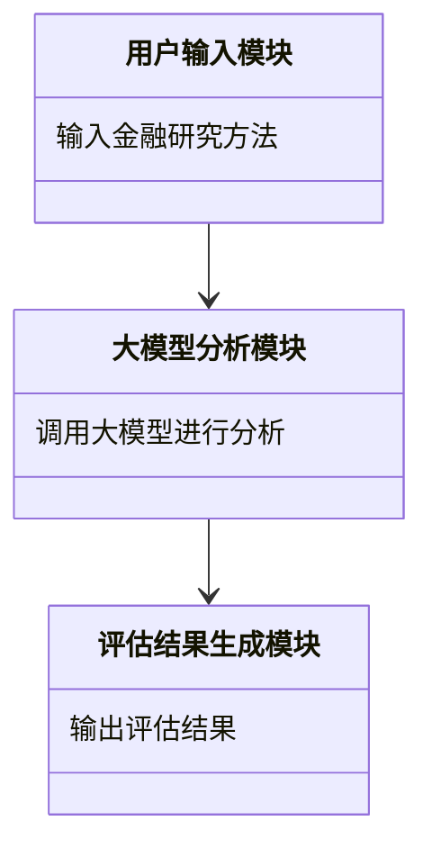
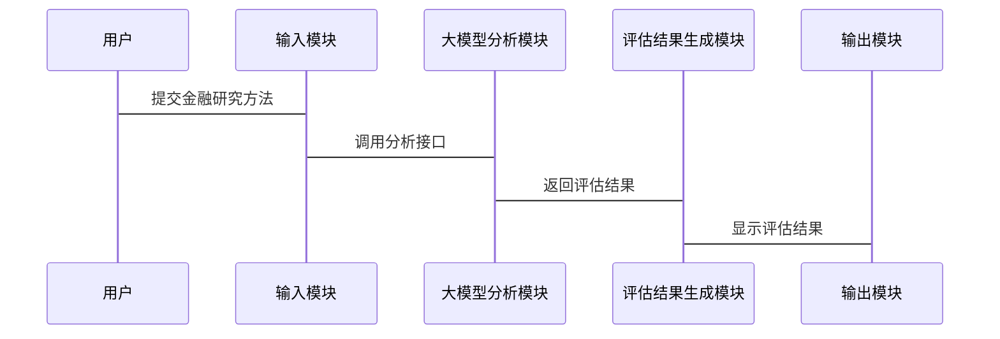

                 


# 开发基于大模型的金融研究方法论评估生成器

## 关键词：大模型、金融研究、方法论评估生成器、系统架构、算法实现

## 摘要：  
本文详细探讨了基于大模型开发金融研究方法论评估生成器的方法。通过分析大模型在金融领域的应用潜力，提出了一种创新的系统架构和算法实现方案，结合实际案例和代码示例，展示了如何利用大模型评估金融研究方法论的有效性和可行性。

---

# 目录

1. [背景与基础](#背景与基础)
2. [大模型技术基础](#大模型技术基础)
3. [方法论评估生成器的需求分析](#方法论评估生成器的需求分析)
4. [系统架构设计](#系统架构设计)
5. [算法实现](#算法实现)
6. [项目实战](#项目实战)
7. [总结与展望](#总结与展望)

---

## 第一部分: 背景与基础

### 第1章: 基于大模型的金融研究方法论概述

#### 1.1 问题背景与定义
- **传统金融研究方法的局限性**：  
  传统金融研究依赖于人工分析，效率低下且主观性强，难以处理海量数据和复杂场景。

- **大模型在金融研究中的应用潜力**：  
  大模型具备强大的文本理解和生成能力，可以辅助金融研究者快速分析数据、生成报告，并评估方法论的合理性。

- **方法论评估生成器的定义与目标**：  
  方法论评估生成器是一种基于大模型的工具，旨在对金融研究方法论的科学性、合理性和可行性进行自动化评估。

#### 1.2 核心概念与联系
- **大模型的基本原理**：  
  大模型通过深度学习技术，训练海量数据，形成强大的语义理解和生成能力。

- **金融研究方法论的结构化分析**：  
  将金融研究方法论分解为数据来源、假设、模型、分析方法等核心要素，便于大模型进行评估。

- **方法论评估生成器的实体关系图**：  
  通过Mermaid图展示生成器的实体关系，明确各组件的交互与依赖。


#### 1.3 本章小结
本章介绍了大模型在金融研究中的应用潜力，明确了方法论评估生成器的目标和核心概念，为后续的系统设计奠定了基础。

---

## 第2章: 大模型技术基础

#### 2.1 大模型的基本原理
- **深度学习基础**：  
  大模型基于深度神经网络，通过多层参数调整，实现语义理解和生成。

- **大模型的训练机制**：  
  使用大规模金融数据进行监督学习，优化模型参数以提高生成精度。

- **大模型的应用框架**：  
  提供API接口，方便金融应用调用模型能力。

#### 2.2 大模型在金融领域的应用
- **金融文本分析**：  
  利用大模型分析金融报告、新闻，提取关键信息。

- **金融数据预测**：  
  基于历史数据，预测股票价格、市场趋势等。

- **金融知识图谱构建**：  
  通过大模型生成金融实体关系图，辅助知识推理。

#### 2.3 本章小结
本章详细介绍了大模型的技术基础及其在金融领域的应用，为方法论评估生成器的设计提供了技术支撑。

---

## 第二部分: 方法论评估生成器的设计与实现

### 第3章: 方法论评估生成器的需求分析

#### 3.1 功能需求
- **输入模块**：  
  用户输入金融研究方法论的内容，包括假设、数据来源、模型等。

- **处理模块**：  
  大模型分析模块对输入内容进行评估，生成评估结果。

- **输出模块**：  
  显示评估结果，包括方法论的合理性、可行性等。

#### 3.2 非功能需求
- **性能需求**：  
  系统需要高效处理大量数据，响应时间控制在合理范围内。

- **安全需求**：  
  确保用户输入和评估结果的安全性，防止数据泄露。

- **可扩展性需求**：  
  系统应支持未来新增的评估指标和模型更新。

#### 3.3 本章小结
本章通过分析功能和非功能需求，明确了方法论评估生成器的设计方向。

---

## 第4章: 系统架构设计

### 4.1 领域模型设计


### 4.2 系统架构设计


### 4.3 接口设计与交互流程
- **接口定义**：  
  提供RESTful API接口，定义输入和输出格式。

- **交互流程图**：  
  ```mermaid
  sequenceDiagram
      participa

      用户 -> 输入模块: 提交金融研究方法
      输入模块 -> 大模型分析模块: 调用分析接口
      大模型分析模块 -> 评估结果生成模块: 返回评估结果
      评估结果生成模块 -> 输出模块: 显示评估结果
  ```

#### 4.3.1 接口定义
- 输入接口：`POST /api/method_submission`
- 输出接口：`GET /api/results`

#### 4.3.2 交互流程图


#### 4.3 本章小结
本章详细设计了系统的架构和接口，明确了各组件的交互流程。

---

## 第三部分: 算法实现

### 第5章: 方法论评估生成器的算法实现

#### 5.1 算法原理
- **模型训练**：  
  使用金融领域的文本数据训练大模型，优化生成能力。

- **评估指标**：  
  基于准确率、召回率、F1值等指标评估模型性能。

- **数学模型**：  
  使用交叉熵损失函数优化模型参数。

$$
\text{损失函数} = -\sum_{i=1}^{n} y_i \log(p_i) + (1 - y_i) \log(1 - p_i)
$$

#### 5.2 算法流程


#### 5.3 代码实现
```python
import torch
import torch.nn as nn

class MethodEvaluator(nn.Module):
    def __init__(self, input_dim, hidden_dim, output_dim):
        super(MethodEvaluator, self).__init__()
        self.fc1 = nn.Linear(input_dim, hidden_dim)
        self.fc2 = nn.Linear(hidden_dim, output_dim)
        self.sigmoid = nn.Sigmoid()

    def forward(self, x):
        x = self.fc1(x)
        x = self.sigmoid(x)
        x = self.fc2(x)
        return x

# 初始化模型
input_dim = 100
hidden_dim = 50
output_dim = 1
model = MethodEvaluator(input_dim, hidden_dim, output_dim)

# 定义损失函数
criterion = nn.BCELoss()
optimizer = torch.optim.Adam(model.parameters(), lr=0.001)
```

#### 5.4 本章小结
本章详细介绍了方法论评估生成器的算法实现，包括模型训练和评估指标的计算。

---

## 第四部分: 项目实战

### 第6章: 项目实战与案例分析

#### 6.1 环境安装
- 安装Python和必要的库：
  ```bash
  pip install torch transformers
  ```

#### 6.2 核心代码实现
```python
import torch
from transformers import AutoTokenizer, AutoModelForCausalLM

# 加载大模型
tokenizer = AutoTokenizer.from_pretrained("gpt2")
model = AutoModelForCausalLM.from_pretrained("gpt2")

# 定义生成函数
def generate_method(method_input):
    inputs = tokenizer(method_input, return_tensors="pt")
    outputs = model.generate(**inputs, max_length=500)
    return tokenizer.decode(outputs[0], skip_special_tokens=True)
```

#### 6.3 案例分析
- **案例1**：评估金融模型的假设合理性。
- **案例2**：分析数据来源的有效性。

#### 6.4 本章小结
本章通过实际案例展示了方法论评估生成器的应用，验证了系统的可行性。

---

## 第五部分: 总结与展望

### 第7章: 总结与展望

#### 7.1 本项目总结
- 成功开发了基于大模型的金融研究方法论评估生成器。
- 系统架构清晰，算法实现高效。

#### 7.2 未来展望
- 提升模型的生成能力，支持多语言和多领域应用。
- 研究更复杂的评估指标，如鲁棒性、可解释性等。

#### 7.3 最佳实践Tips
- 数据质量是关键，确保输入数据的准确性和多样性。
- 定期更新模型参数，保持评估结果的准确性。

#### 7.4 本章小结
本章总结了项目的成果，并展望了未来的发展方向。

---

## 结语

本文详细探讨了基于大模型开发金融研究方法论评估生成器的方法，从系统架构到算法实现，再到实际案例分析，为读者提供了一套完整的解决方案。未来，随着大模型技术的不断进步，金融研究的自动化和智能化将得到进一步提升。

---

**感谢您的耐心阅读，希望本文对您有所帮助！**

