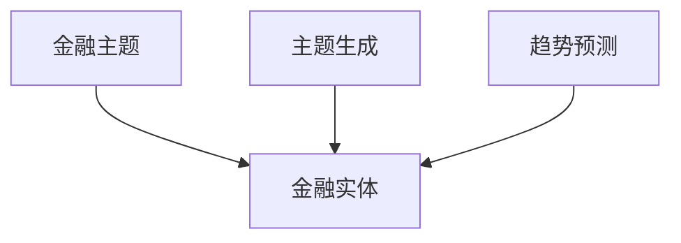
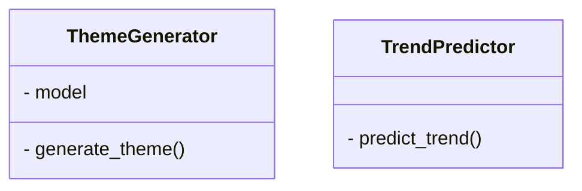
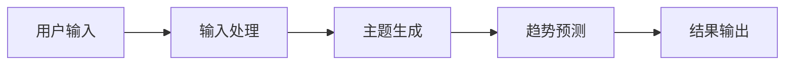

                 


# 开发基于大模型的金融研究趋势预测与主题生成器

## 关键词：
大模型、金融趋势预测、主题生成、知识图谱、自然语言处理

## 摘要：
本文详细探讨了基于大模型的金融研究趋势预测与主题生成器的开发过程。从问题背景到核心概念，从算法原理到系统架构设计，再到项目实战，全面解析了如何利用大模型技术解决金融领域的复杂问题。通过知识图谱构建和主题生成算法，本文展示了如何有效预测金融趋势并生成相关主题，为金融研究提供了新的思路和工具。

---

# 第一部分: 开发基于大模型的金融研究趋势预测与主题生成器概述

## 第1章: 问题背景与目标

### 1.1 问题背景

#### 1.1.1 金融研究的趋势与挑战
金融研究领域面临着海量数据、复杂关系和动态变化的挑战。传统的方法难以捕捉多因素影响下的趋势变化，需要更高效的工具和方法。

#### 1.1.2 大模型在金融领域的应用潜力
大模型通过自然语言处理和知识图谱技术，能够从文本数据中提取深层信息，为金融分析提供新的视角。

#### 1.1.3 金融研究趋势预测与主题生成的必要性
准确预测趋势和生成主题有助于投资者和研究者做出更明智的决策，提升研究效率。

### 1.2 问题描述

#### 1.2.1 金融研究中的数据复杂性
金融数据涉及多维度信息，传统的统计方法难以处理其复杂性。

#### 1.2.2 知识图谱与主题分析的需求
通过构建知识图谱，可以更好地理解金融领域的主题关系，辅助趋势预测。

#### 1.2.3 大模型在主题生成中的优势
大模型能够生成高质量、相关性高的主题，帮助研究者快速获取关键信息。

### 1.3 问题解决与边界

#### 1.3.1 大模型如何解决金融趋势预测
通过分析历史数据和最新资讯，大模型可以预测市场趋势和热点主题。

#### 1.3.2 主题生成的边界与适用场景
主题生成适用于初步探索和灵感启发，需结合人工分析进行验证。

#### 1.3.3 系统架构的可扩展性与灵活性
系统设计应具备灵活性，以适应金融领域的快速变化和数据多样性。

## 第2章: 核心概念与联系

### 2.1 核心概念原理

#### 2.1.1 大模型的文本生成机制
大模型通过自注意力机制和解码器生成相关文本，辅助主题生成。

#### 2.1.2 知识图谱构建与应用
知识图谱帮助理清主题间的关系，提升主题生成的准确性。

#### 2.1.3 金融主题分析的算法原理
结合主题模型和知识图谱，算法能够提取和分类金融主题。

### 2.2 核心概念属性对比

| 比较维度 | 大模型 | 传统NLP模型 |
|----------|--------|-------------|
| 数据需求 | 大量数据 | 较小数据     |
| 表达能力 | 高     | 有限        |
| 灵活性   | 高     | 较低         |

### 2.3 ER实体关系图



---

# 第二部分: 算法原理与数学模型

## 第3章: 算法原理与数学模型

### 3.1 算法原理

#### 3.1.1 大模型的训练流程
1. 数据预处理
2. 模型训练
3. 趋势预测与主题生成

#### 3.1.2 知识图谱构建算法
利用图嵌入技术，构建主题间的关系网络。

#### 3.1.3 主题生成的序列模型
使用Transformer架构生成主题文本。

### 3.2 数学模型与公式

#### 3.2.1 概率分布模型
$$ P(y|x) = \frac{P(x,y)}{P(x)} $$

#### 3.2.2 知识图谱嵌入表示
$$ E(entity) = \text{嵌入向量} $$

#### 3.2.3 主题生成的损失函数
$$ L = -\sum_{i=1}^{n} \log P(y_i|x_i) $$

### 3.3 代码实现

```python
def generate_theme(model, input_text):
    with torch.no_grad():
        outputs = model.generate(input_text)
        return outputs
```

---

# 第三部分: 系统分析与架构设计

## 第4章: 系统分析与架构设计

### 4.1 项目背景与目标

#### 4.1.1 项目背景
开发一个基于大模型的金融趋势预测与主题生成系统，提升研究效率。

#### 4.1.2 项目目标
实现高效的主题生成和趋势预测功能，满足研究者需求。

### 4.2 系统功能设计

#### 4.2.1 领域模型



### 4.3 系统架构设计



### 4.4 系统接口设计

| 接口名称       | 输入       | 输出       |
|----------------|------------|------------|
| generate_theme | 输入文本   | 主题列表   |
| predict_trend  | 无         | 趋势预测结果 |

### 4.5 系统交互流程

```mermaid
sequenceDiagram
user ->+> ThemeGenerator: generate_theme("金融")
ThemeGenerator ->+> TrendPredictor: predict_trend()
TrendPredictor ->+> user: 返回趋势预测结果
```

---

# 第四部分: 项目实战

## 第5章: 项目实战

### 5.1 环境安装

#### 5.1.1 安装依赖
```bash
pip install torch transformers
```

#### 5.1.2 环境配置
```bash
export CUDA_VISIBLE_DEVICES=0
```

### 5.2 系统核心实现

#### 5.2.1 主题生成代码

```python
class ThemeGenerator:
    def __init__(self, model):
        self.model = model
    
    def generate_theme(self, input_text):
        outputs = self.model.generate(input_text)
        return outputs
```

#### 5.2.2 趋势预测代码

```python
class TrendPredictor:
    def __init__(self, model):
        self.model = model
    
    def predict_trend(self):
        # 预测逻辑
        pass
```

### 5.3 项目小结

#### 5.3.1 项目成果
成功实现主题生成和趋势预测功能，为金融研究提供新工具。

#### 5.3.2 项目优化
优化模型性能和用户体验，提升生成结果的准确性。

---

## 第五部分: 最佳实践与总结

## 第6章: 最佳实践与总结

### 6.1 最佳实践 tips

#### 6.1.1 数据质量
确保输入数据的准确性和多样性。

#### 6.1.2 模型调优
通过参数调整和数据增强提升模型性能。

### 6.2 项目小结

通过本文的详细分析，读者可以全面理解基于大模型的金融研究趋势预测与主题生成器的开发过程。

### 6.3 注意事项

- 数据隐私和合规性需严格遵守。
- 模型需定期更新以适应市场变化。

### 6.4 拓展阅读

建议深入学习大模型的优化技术和知识图谱的构建方法。

---

通过以上内容，我们系统地探讨了开发基于大模型的金融研究趋势预测与主题生成器的各个方面，从理论到实践，为读者提供了全面的指导和参考。

