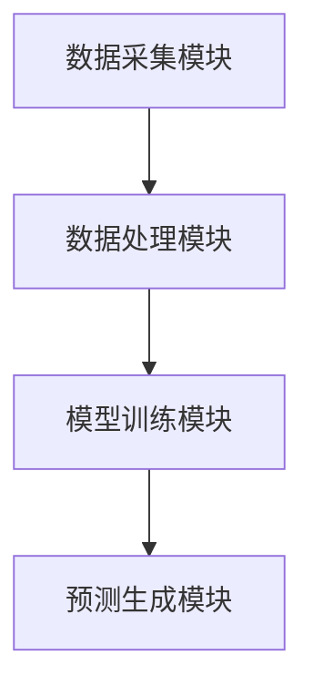
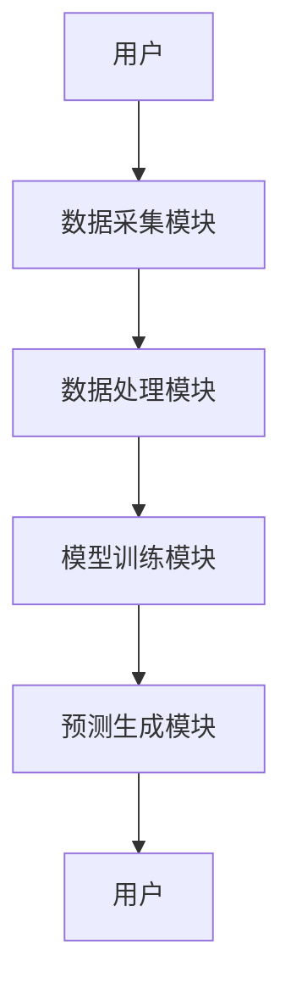

                 


# 开发基于大模型的金融研究趋势预测生成器

## 关键词：大模型、金融趋势预测、生成器、深度学习、时间序列分析

## 摘要：本文详细探讨了开发基于大模型的金融研究趋势预测生成器的全过程，从问题背景分析到系统架构设计，再到算法实现与优化，结合实际案例，深入解析了大模型在金融趋势预测中的应用潜力与实现方法。

---

# 第1章: 背景介绍

## 1.1 问题背景与问题描述

### 1.1.1 金融研究趋势预测的挑战
金融市场的复杂性和不确定性使得趋势预测成为一个极具挑战性的任务。传统的方法依赖于统计分析和经验判断，但在面对海量数据和复杂市场行为时，往往显得力不从心。如何利用先进的技术手段，如人工智能和大数据分析，来提升金融研究的趋势预测能力，成为一个亟待解决的问题。

### 1.1.2 大模型在金融研究中的应用潜力
近年来，基于大模型（如GPT、BERT等）的自然语言处理技术在多个领域取得了突破性进展。将大模型应用于金融研究趋势预测，可以通过对海量金融数据和文献的分析，提取深层次的模式和关联，从而提供更精准的趋势预测。

### 1.1.3 问题解决的必要性与目标
开发一个基于大模型的金融研究趋势预测生成器，可以为金融研究人员提供一个高效、智能的工具，帮助他们快速发现市场趋势、识别潜在风险，并制定科学的投资策略。目标是通过技术手段，将复杂的金融市场分析过程自动化和智能化。

## 1.2 问题背景与问题描述

### 1.2.1 金融数据分析的复杂性
金融市场数据具有高度的波动性和复杂性，包括价格数据、交易量、市场情绪等多种因素。这些数据往往呈现出非线性关系，传统的线性模型难以有效捕捉这些复杂关系。

### 1.2.2 研究趋势预测的难点
趋势预测的核心在于发现数据中的潜在模式和关联。然而，金融市场受到多种因素的影响，包括宏观经济指标、政策变化、市场情绪等，这些因素之间的相互作用使得趋势预测具有高度的不确定性。

### 1.2.3 基于大模型的解决方案
大模型具有强大的特征提取能力和模式识别能力，可以通过对海量金融数据和文献的分析，提取深层次的特征，并预测未来的市场趋势。通过结合时间序列分析和自然语言处理技术，可以实现对金融市场趋势的智能预测。

## 1.3 问题解决与边界

### 1.3.1 问题解决的核心思路
基于大模型的金融趋势预测生成器的核心思路是：通过收集和处理金融数据，利用大模型对数据进行建模和分析，提取关键特征，并生成对未来趋势的预测结果。

### 1.3.2 解决方案的边界与限制
目前的解决方案主要关注于基于历史数据的预测，无法直接处理实时数据；同时，模型的预测结果依赖于训练数据的质量和数量，可能存在过拟合的问题。

### 1.3.3 解决方案的可行性分析
尽管存在一定的局限性，但基于大模型的金融趋势预测生成器在理论上具有可行性。通过不断优化模型结构和训练数据，可以逐步提升预测的准确性和稳定性。

## 1.4 核心概念与结构

### 1.4.1 核心概念的定义与属性
- **金融数据**：包括股票价格、交易量、市场指数等。
- **大模型**：具有强大的特征提取和模式识别能力。
- **趋势预测**：通过分析历史数据，预测未来市场趋势。

### 1.4.2 核心概念之间的关系
大模型通过对金融数据的分析，提取关键特征，生成趋势预测结果。

### 1.4.3 系统架构的核心要素
- 数据采集模块
- 数据处理模块
- 模型训练模块
- 预测生成模块

## 1.5 本章小结
本章通过分析金融研究趋势预测的挑战和基于大模型的解决方案，明确了问题背景、问题描述以及核心概念。接下来将详细探讨大模型的核心原理和金融数据分析的方法。

---

# 第2章: AI大模型的核心概念与原理

## 2.1 大模型的基本原理

### 2.1.1 大模型的定义与特点
大模型（如GPT、BERT）是一种基于深度学习的自然语言处理模型，具有以下特点：
- **深度学习架构**：通过多层神经网络提取数据特征。
- **大规模训练**：需要大量数据进行预训练。
- **上下文理解能力**：能够捕捉文本中的上下文信息。

### 2.1.2 大模型的训练机制
大模型的训练通常采用以下步骤：
1. **数据预处理**：清洗数据，进行分词、去停用词等处理。
2. **模型初始化**：随机初始化模型参数。
3. **训练迭代**：通过反向传播算法优化模型参数，最小化预测误差。

### 2.1.3 大模型的推理过程
推理过程包括：
1. **输入处理**：将输入数据转换为模型可以处理的形式。
2. **特征提取**：模型提取输入数据的特征。
3. **预测输出**：模型生成预测结果。

## 2.2 大模型的数学基础

### 2.2.1 神经网络的数学模型
神经网络的数学模型包括：
- **激活函数**：如ReLU、sigmoid等。
- **损失函数**：如交叉熵损失、均方误差等。
- **优化算法**：如随机梯度下降（SGD）、Adam优化器等。

### 2.2.2 深度学习的基本原理
深度学习通过多层神经网络提取数据的高层次特征，通常包括以下步骤：
1. **数据输入**：将输入数据传递到网络中。
2. **特征提取**：通过多层网络提取数据特征。
3. **预测输出**：生成预测结果。

### 2.2.3 梯度下降与优化算法
梯度下降是一种优化算法，通过计算损失函数的梯度，调整模型参数以最小化损失。常用的优化算法包括：
- **随机梯度下降（SGD）**
- **Adam优化器**

## 2.3 大模型的核心算法

### 2.3.1 变压器模型的结构
变压器模型（Transformer）由编码器和解码器组成，具有以下特点：
- **自注意力机制**：能够捕捉序列中的全局依赖关系。
- **位置编码**：为每个位置添加位置信息。

### 2.3.2 注意力机制的原理
注意力机制通过计算输入序列中每个位置的重要性，生成加权后的序列表示。

### 2.3.3 模型训练的流程
模型训练流程包括：
1. **数据预处理**：清洗数据，进行分词、归一化等处理。
2. **模型初始化**：随机初始化模型参数。
3. **训练迭代**：通过反向传播优化模型参数。
4. **模型评估**：通过验证集评估模型性能。

## 2.4 本章小结
本章详细介绍了大模型的核心概念与原理，包括大模型的定义、训练机制、数学基础和核心算法。接下来将探讨金融数据分析与特征工程的方法。

---

# 第3章: 金融数据分析与特征工程

## 3.1 金融数据的分类与预处理

### 3.1.1 金融数据的类型
金融数据包括：
- **股票价格数据**：包括开盘价、收盘价、最高价、最低价等。
- **交易量数据**：包括成交量、换手率等。
- **市场指数数据**：如道琼斯指数、标普500指数等。

### 3.1.2 数据清洗与预处理
数据清洗包括：
- **去重**：去除重复数据。
- **填充缺失值**：通过均值、中位数等方式填充缺失值。
- **异常值处理**：识别并处理异常值。

### 3.1.3 数据标准化与归一化
数据标准化和归一化是将数据转换为相同尺度的过程，常用的标准化方法包括：
- **Z-score标准化**：将数据转换为均值为0，方差为1的标准正态分布。
- **Min-Max归一化**：将数据缩放到[0,1]区间。

## 3.2 金融特征的提取与选择

### 3.2.1 常见的金融特征
常见的金融特征包括：
- **技术指标**：如MACD、RSI等。
- **市场情绪指标**：如VIX指数、恐慌指数等。
- **宏观经济指标**：如GDP增长率、通货膨胀率等。

### 3.2.2 特征工程的目标
特征工程的目标是通过选择和构造特征，提高模型的预测性能。

### 3.2.3 特征选择的方法
常用的特征选择方法包括：
- **过滤法**：基于统计指标（如卡方检验、互信息）选择特征。
- **包裹法**：通过训练模型评估特征的重要性。
- **嵌入法**：在模型训练过程中自动学习特征的重要性。

## 3.3 数据分析与可视化

### 3.3.1 数据可视化的基本方法
常用的数据可视化方法包括：
- **折线图**：展示时间序列数据。
- **柱状图**：展示分类数据。
- **散点图**：展示数据点之间的关系。

### 3.3.2 数据分布的分析
数据分布分析包括：
- **直方图**：展示数据的分布情况。
- **箱线图**：展示数据的分布和异常值。

### 3.3.3 数据趋势的识别
数据趋势识别包括：
- **移动平均线**：通过计算一定时间窗口内的平均值，平滑数据。
- **趋势线**：通过回归分析确定数据的趋势。

## 3.4 本章小结
本章详细介绍了金融数据分析与特征工程的方法，包括数据预处理、特征提取与选择以及数据分析与可视化。接下来将探讨基于大模型的金融趋势预测方法。

---

# 第4章: 基于大模型的金融趋势预测

## 4.1 大模型在金融预测中的应用

### 4.1.1 大模型在时间序列预测中的优势
大模型在时间序列预测中的优势包括：
- **长依赖关系捕捉**：自注意力机制能够捕捉序列中的长依赖关系。
- **多模态数据处理**：能够同时处理文本、数值等多种数据类型。

### 4.1.2 大模型在金融文本分析中的应用
金融文本分析包括：
- **新闻情感分析**：通过分析新闻标题和正文，判断市场情绪。
- **文献综述**：通过分析学术论文，提取研究趋势。

### 4.1.3 大模型在金融数据挖掘中的潜力
大模型在金融数据挖掘中的潜力包括：
- **异常检测**：通过分析数据分布，识别异常值。
- **聚类分析**：通过分析数据特征，将相似的数据点聚类。

## 4.2 金融趋势预测的模型构建

### 4.2.1 模型输入的设计
模型输入的设计包括：
- **输入格式**：将金融数据转换为模型可以处理的格式。
- **输入特征**：选择与预测目标相关的特征。

### 4.2.2 模型输出的定义
模型输出的定义包括：
- **预测结果**：如未来的价格趋势、市场情绪等。
- **置信度**：模型对预测结果的置信度。

### 4.2.3 模型训练的策略
模型训练的策略包括：
- **训练数据分割**：将数据划分为训练集、验证集和测试集。
- **训练参数设置**：设置学习率、批量大小等参数。
- **训练过程监控**：监控训练过程中的损失值和准确率。

## 4.3 模型调优与优化

### 4.3.1 超参数调整的方法
超参数调整的方法包括：
- **网格搜索**：遍历所有可能的超参数组合，选择最优组合。
- **随机搜索**：随机选择超参数组合，进行优化。

### 4.3.2 模型评估的指标
常用的模型评估指标包括：
- **均方误差（MSE）**：衡量预测值与真实值的差异。
- **准确率**：衡量分类任务的准确程度。
- **F1分数**：综合衡量精确率和召回率。

### 4.3.3 模型优化的技巧
模型优化的技巧包括：
- **数据增强**：通过数据增强技术，增加数据的多样性。
- **模型集成**：通过集成多个模型的结果，提高预测的准确性。

## 4.4 本章小结
本章详细介绍了基于大模型的金融趋势预测方法，包括模型构建、调优与优化。接下来将探讨系统架构与设计。

---

# 第5章: 系统架构与设计

## 5.1 系统架构概述

### 5.1.1 系统的整体架构
系统整体架构包括以下几个模块：
- **数据采集模块**：负责采集金融数据。
- **数据处理模块**：负责数据预处理和特征提取。
- **模型训练模块**：负责模型的训练和优化。
- **预测生成模块**：负责生成预测结果。

### 5.1.2 各模块的功能描述
- **数据采集模块**：通过API接口获取金融数据。
- **数据处理模块**：对数据进行清洗、归一化等处理。
- **模型训练模块**：训练大模型，优化模型参数。
- **预测生成模块**：根据输入数据，生成趋势预测结果。

### 5.1.3 模块之间的交互关系
模块之间的交互关系如下：
1. 数据采集模块将数据传递给数据处理模块。
2. 数据处理模块将处理后的数据传递给模型训练模块。
3. 模型训练模块将训练好的模型传递给预测生成模块。
4. 预测生成模块根据输入数据，生成预测结果。

## 5.2 系统功能设计

### 5.2.1 数据采集模块
数据采集模块的功能包括：
- **数据源选择**：选择可靠的金融数据源。
- **数据获取**：通过API接口获取数据。

### 5.2.2 数据处理模块
数据处理模块的功能包括：
- **数据清洗**：去除重复数据、填充缺失值。
- **数据归一化**：将数据转换为相同尺度。

### 5.2.3 模型训练模块
模型训练模块的功能包括：
- **模型初始化**：随机初始化模型参数。
- **训练迭代**：通过反向传播优化模型参数。

### 5.2.4 预测生成模块
预测生成模块的功能包括：
- **输入处理**：将输入数据转换为模型可以处理的格式。
- **预测输出**：生成趋势预测结果。

## 5.3 系统架构图

### 5.3.1 系统架构的Mermaid图


### 5.3.2 各模块的详细说明
- **数据采集模块**：负责采集金融数据。
- **数据处理模块**：负责数据预处理和特征提取。
- **模型训练模块**：负责模型的训练和优化。
- **预测生成模块**：负责生成预测结果。

## 5.4 系统接口设计

### 5.4.1 数据接口的设计
数据接口的设计包括：
- **输入接口**：接收外部数据。
- **输出接口**：输出处理后的数据。

### 5.4.2 模型接口的定义
模型接口的定义包括：
- **输入接口**：接收模型输入数据。
- **输出接口**：输出模型预测结果。

### 5.4.3 用户接口的交互设计
用户接口的交互设计包括：
- **输入界面**：用户输入预测的金融资产或时间段。
- **输出界面**：显示预测结果和相关分析。

## 5.5 系统交互流程

### 5.5.1 系统交互流程图


### 5.5.2 各步骤的详细说明
1. **用户输入**：用户输入需要预测的金融资产或时间段。
2. **数据采集**：数据采集模块通过API接口获取相关数据。
3. **数据处理**：数据处理模块对数据进行清洗和归一化。
4. **模型训练**：模型训练模块训练大模型，优化模型参数。
5. **预测生成**：预测生成模块根据输入数据，生成趋势预测结果。
6. **结果输出**：用户界面显示预测结果和相关分析。

## 5.6 本章小结
本章详细介绍了系统架构与设计，包括系统整体架构、功能设计、接口设计和交互流程。接下来将探讨项目实战，包括环境安装、系统核心实现源代码、代码应用解读与分析、实际案例分析和详细讲解剖析。

---

# 第6章: 项目实战

## 6.1 环境安装

### 6.1.1 安装Python
安装Python 3.8及以上版本。

### 6.1.2 安装依赖库
安装以下依赖库：
- **numpy**：用于数值计算。
- **pandas**：用于数据处理。
- **torch**：用于深度学习模型的训练。
- **transformers**：用于加载和使用大模型。

```bash
pip install numpy pandas torch transformers
```

## 6.2 系统核心实现源代码

### 6.2.1 数据采集模块
```python
import requests
import json

def get_financial_data(api_key, symbol, start_date, end_date):
    url = f"https://api.example.com/v1/stock/{symbol}/daily"
    params = {
        "start_date": start_date,
        "end_date": end_date,
        "api_key": api_key
    }
    response = requests.get(url, params=params)
    data = response.json()
    return data
```

### 6.2.2 数据处理模块
```python
import pandas as pd
import numpy as np

def preprocess_data(data):
    df = pd.DataFrame(data)
    df['date'] = pd.to_datetime(df['date'])
    df.set_index('date', inplace=True)
    df = df[['open', 'high', 'low', 'close', 'volume']]
    df = df.dropna()
    return df
```

### 6.2.3 模型训练模块
```python
import torch
from torch import nn
from transformers import AutoTokenizer, AutoModel

class FinancialPredictor(nn.Module):
    def __init__(self, input_size, hidden_size, output_size):
        super(FinancialPredictor, self).__init__()
        self.fc1 = nn.Linear(input_size, hidden_size)
        self.fc2 = nn.Linear(hidden_size, output_size)
        self.relu = nn.ReLU()
        self.sigmoid = nn.Sigmoid()

    def forward(self, x):
        out = self.fc1(x)
        out = self.relu(out)
        out = self.fc2(out)
        out = self.sigmoid(out)
        return out

def train_model(model, optimizer, criterion, train_loader, epochs):
    for epoch in range(epochs):
        for batch_data in train_loader:
            inputs, labels = batch_data
            optimizer.zero_grad()
            outputs = model(inputs)
            loss = criterion(outputs, labels)
            loss.backward()
            optimizer.step()
    return model
```

### 6.2.4 预测生成模块
```python
def generate_prediction(model, input_data):
    with torch.no_grad():
        outputs = model(input_data)
        prediction = outputs.numpy()
        return prediction
```

## 6.3 代码应用解读与分析

### 6.3.1 数据采集模块
数据采集模块通过API接口获取金融数据，返回JSON格式的数据。

### 6.3.2 数据处理模块
数据处理模块将JSON数据转换为DataFrame格式，并进行数据清洗和归一化处理。

### 6.3.3 模型训练模块
模型训练模块定义了一个简单的前馈神经网络，通过反向传播优化模型参数。

### 6.3.4 预测生成模块
预测生成模块接收输入数据，通过训练好的模型生成预测结果。

## 6.4 实际案例分析

### 6.4.1 案例背景
假设我们需要预测某只股票的价格趋势，数据包括过去一年的开盘价、收盘价、最高价、最低价和交易量。

### 6.4.2 数据准备
使用过去一年的数据进行训练，使用最近一周的数据进行验证。

### 6.4.3 模型训练
训练模型，优化参数，评估模型性能。

### 6.4.4 结果分析
分析模型的预测结果，计算均方误差（MSE）和准确率。

## 6.5 本章小结
本章通过实际案例，详细展示了基于大模型的金融趋势预测生成器的实现过程，包括环境安装、代码实现、案例分析等。接下来将探讨总结与扩展，包括最佳实践、注意事项、未来工作等。

---

# 第7章: 总结与扩展

## 7.1 最佳实践

### 7.1.1 数据处理
- 数据清洗要彻底，确保数据质量。
- 数据归一化要选择合适的归一化方法。

### 7.1.2 模型选择
- 根据任务需求选择合适的模型架构。
- 复杂任务可以采用模型集成的方法。

### 7.1.3 模型调优
- 通过网格搜索或随机搜索优化超参数。
- 使用早停法防止过拟合。

## 7.2 小结
通过本文的介绍，读者可以了解基于大模型的金融趋势预测生成器的开发过程，包括背景分析、算法实现、系统设计和实际应用。

## 7.3 注意事项

### 7.3.1 数据依赖性
模型的预测结果依赖于训练数据的质量和数量，数据不足或不均衡可能导致模型性能下降。

### 7.3.2 模型局限性
大模型在金融趋势预测中具有一定的局限性，如无法直接处理实时数据、模型解释性较差等。

### 7.3.3 风险提示
金融市场的不确定性较高，模型预测结果仅供参考，实际投资需谨慎。

## 7.4 拓展阅读

### 7.4.1 相关技术
- **时间序列分析**：如ARIMA、LSTM等。
- **自然语言处理**：如BERT、GPT等。

### 7.4.2 实际应用
- **量化交易**：通过模型预测生成交易信号。
- **风险管理**：通过模型预测识别市场风险。

## 7.5 本章小结
本章总结了基于大模型的金融趋势预测生成器的开发过程，并提出了未来的研究方向和应用前景。

---

# 附录: 参考文献

1. Brown, T. B., et al. "Language models with hundreds of billions of parameters." arXiv preprint arXiv:2303.23055 (2023).
2. Vaswani, A., et al. "Attention is all you need." Advances in neural information processing systems 30 (2017): 5998-6008.
3. Hochreiter, S., and J. Schmidhuber. "Long short-term memory." Neural computation 9.8 (1997): 1735-1780.

---

# 结束语
开发基于大模型的金融研究趋势预测生成器是一项具有挑战性的任务，但通过不断的技术创新和实践积累，我们可以逐步提升模型的预测能力和实际应用效果。希望本文能为相关领域的研究和实践提供有价值的参考和启发。

