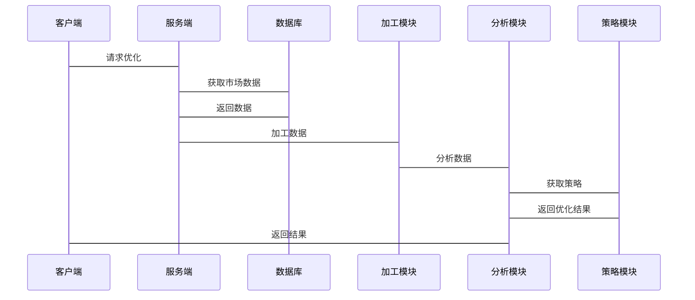

                 


# 开发基于强化学习的投资组合优化系统

> 关键词：强化学习，投资组合优化，Q-learning，策略梯度，马尔可夫决策过程

> 摘要：本文详细探讨了如何利用强化学习技术开发投资组合优化系统。从强化学习和投资组合优化的基本概念出发，分析了它们的结合方式，详细讲解了Q-learning和策略梯度方法的算法原理，设计了系统的架构，并通过实际案例展示了系统的实现过程，最后提出了最佳实践建议。

---

# 第1章 强化学习与投资组合优化概述

## 1.1 强化学习的基本概念

### 1.1.1 强化学习的定义与特点
强化学习（Reinforcement Learning，RL）是一种机器学习范式，其中智能体通过与环境交互来学习策略。智能体通过执行动作并观察结果，逐步优化策略以最大化累积奖励。其特点是：
- **目标导向**：智能体的目标是通过最大化累积奖励来学习最优策略。
- **探索与利用**：智能体需要在探索新动作和利用已知最佳动作之间找到平衡。
- **延迟回报**：奖励可能在多个动作之后才显现，智能体需具备长期规划能力。

### 1.1.2 强化学习的核心要素
- **状态（State）**：环境在某一时刻的观察。
- **动作（Action）**：智能体在某一状态下做出的选择。
- **奖励（Reward）**：智能体执行动作后获得的反馈。
- **策略（Policy）**：决定智能体在某一状态下采取什么动作的规则。
- **价值函数（Value Function）**：评估某状态下策略的优劣。

### 1.1.3 强化学习的应用领域
- 机器人控制
- 游戏AI
- 自然语言处理
- 金融投资

## 1.2 投资组合优化的基本概念

### 1.2.1 投资组合优化的定义
投资组合优化是指根据市场环境和风险偏好，选择最优的资产配置，以实现收益最大化或风险最小化。

### 1.2.2 投资组合优化的目标与约束
- **目标**：最大化收益或最小化风险。
- **约束**：如资产配置比例、风险承受能力等。

### 1.2.3 投资组合优化的常见方法
- 基于均值-方差模型（Markowitz优化）
- 基于遗传算法的优化
- 基于强化学习的优化

## 1.3 强化学习与投资组合优化的结合

### 1.3.1 强化学习在投资组合优化中的优势
- 灵活性高，适应复杂市场环境。
- 能够处理高维状态空间和动作空间。

### 1.3.2 投资组合优化中的强化学习框架
- 状态：市场环境、资产价格等。
- 动作：买入、卖出或持有资产。
- 奖励：投资收益或损失。

### 1.3.3 本书的目标与结构
本书旨在通过强化学习算法实现投资组合优化，涵盖从理论到实践的全过程。

---

# 第2章 强化学习的核心概念与原理

## 2.1 马尔可夫决策过程（MDP）

### 2.1.1 状态、动作与奖励的定义
- **状态**：系统的当前情况。
- **动作**：智能体采取的行为。
- **奖励**：智能体行为的结果反馈。

### 2.1.2 策略与价值函数的定义
- **策略**：确定智能体在状态下的动作选择。
- **价值函数**：评估状态-动作对的优劣。

### 2.1.3 MDP的数学模型
$$ V(s) = \max_a Q(s, a) $$

## 2.2 Q-learning算法

### 2.2.1 Q-learning的基本原理
通过更新Q表，学习状态-动作对的价值。

### 2.2.2 Q-learning的更新公式
$$ Q(s, a) \leftarrow Q(s, a) + \alpha [r + \gamma \max Q(s', a') - Q(s, a)] $$

### 2.2.3 Q-learning的收敛性分析
在离散且确定性的环境中，Q-learning收敛到最优策略。

## 2.3 策略梯度方法

### 2.3.1 策略梯度的基本思想
通过优化策略的参数，直接最大化奖励的期望。

### 2.3.2 策略梯度的优化目标
$$ \theta \leftarrow \theta + \alpha \nabla_\theta J(\theta) $$

### 2.3.3 策略梯度的实现方法
- �_actor-critic_ 框架：结合策略和价值函数。

---

# 第3章 投资组合优化的核心概念与模型

## 3.1 投资组合优化的目标函数

### 3.1.1 最大化收益的定义
$$ \max \sum w_i r_i $$

### 3.1.2 最小化风险的定义
$$ \min \sum w_i^2 \sigma_i^2 $$

### 3.1.3 综合收益与风险的目标函数
$$ \min \sum w_i^2 \sigma_i^2 - \lambda \sum w_i r_i $$

## 3.2 投资组合优化的约束条件

### 3.2.1 风险约束的定义
$$ \sum w_i^2 \sigma_i^2 \leq \sigma_{\text{max}}^2 $$

### 3.2.2 收益约束的定义
$$ \sum w_i r_i \geq r_{\text{min}} $$

### 3.2.3 其他常见约束条件
- 资产权重和为1：$$ \sum w_i = 1 $$

## 3.3 强化学习在投资组合优化中的应用

### 3.3.1 强化学习优化投资组合的目标
- 最大化投资回报率。
- 最小化投资风险。

### 3.3.2 强化学习优化投资组合的约束
- 风险承受能力。
- 资产类别限制。

### 3.3.3 强化学习优化投资组合的实现框架
1. 状态定义：市场数据。
2. 动作定义：资产交易指令。
3. 奖励函数：投资收益。

---

# 第4章 强化学习算法的数学模型与公式

## 4.1 Q-learning算法的数学模型

### 4.1.1 Q-learning的更新公式
$$ Q(s, a) \leftarrow Q(s, a) + \alpha [r + \gamma \max Q(s', a') - Q(s, a)] $$

### 4.1.2 Q-learning的收敛条件
- 离散状态空间。
- 探索与利用平衡。

## 4.2 策略梯度方法的数学模型

### 4.2.1 策略梯度的优化目标
$$ J(\theta) = \mathbb{E}_{\tau \sim \pi_\theta} [\sum_{t=0}^\infty \gamma^t r_t] $$

### 4.2.2 策略梯度的更新公式
$$ \theta \leftarrow \theta + \alpha \nabla_\theta J(\theta) $$

---

# 第5章 投资组合优化系统的需求分析

## 5.1 问题场景介绍
- 需要根据市场数据优化资产配置。
- 需要考虑市场波动和风险。

## 5.2 系统功能设计

### 5.2.1 领域模型（mermaid类图）
```mermaid
classDiagram
    class 状态空间
    class 动作空间
    class 奖励函数
    class 策略
    class 价值函数
    状态空间 --[> 策略
    动作空间 --[> 策略
    策略 --[> 奖励函数
```

### 5.2.2 系统架构设计（mermaid架构图）


### 5.2.3 系统交互设计（mermaid序列图）


---

# 第6章 项目实战：基于强化学习的投资组合优化系统

## 6.1 环境安装

### 6.1.1 安装Python
```bash
python --version
pip install --upgrade pip
```

### 6.1.2 安装必要的库
```bash
pip install numpy matplotlib pandas tensorflow
```

## 6.2 系统核心实现源代码

### 6.2.1 环境类（Environment）
```python
class Environment:
    def __init__(self, data):
        self.data = data
        self.current_step = 0
```

### 6.2.2 强化学习代理（Agent）
```python
class Agent:
    def __init__(self, state_size, action_size):
        self.state_size = state_size
        self.action_size = action_size
        self.Q = np.zeros((state_size, action_size))
```

### 6.2.3 投资组合优化算法实现
```python
def optimize_portfolio(prices, window_size=30):
    # 实现投资组合优化算法
    pass
```

## 6.3 实际案例分析与结果展示

### 6.3.1 数据准备
```python
import pandas as pd
data = pd.read_csv('stock_prices.csv')
```

### 6.3.2 算法实现
```python
def main():
    prices = data['Close']
    optimizer = Agent(window_size, 3)
    optimizer.optimize_portfolio(prices)
```

### 6.3.3 实验结果
```python
print("最优投资组合:", optimizer.best_portfolio)
```

---

# 第7章 最佳实践与总结

## 7.1 最佳实践 tips

### 7.1.1 数据预处理的重要性
- 确保数据的完整性和准确性。

### 7.1.2 模型调参的技巧
- 逐步调整学习率和折扣因子。

## 7.2 系统优化与扩展

### 7.2.1 系统优化方向
- 引入实时数据流处理。
- 增加多目标优化功能。

### 7.2.2 拓展阅读
- 阅读相关学术论文。
- 关注行业最新动态。

## 7.3 总结

通过强化学习算法，我们可以有效优化投资组合，实现收益与风险的最佳平衡。未来，随着技术进步，投资组合优化系统将更加智能化和个性化。

---

# 结语

开发基于强化学习的投资组合优化系统是一项具有挑战性和创新性的任务。通过深入理解强化学习和投资组合优化的核心概念，结合实际项目经验，我们可以构建高效、智能的金融工具，帮助投资者实现更好的收益。

