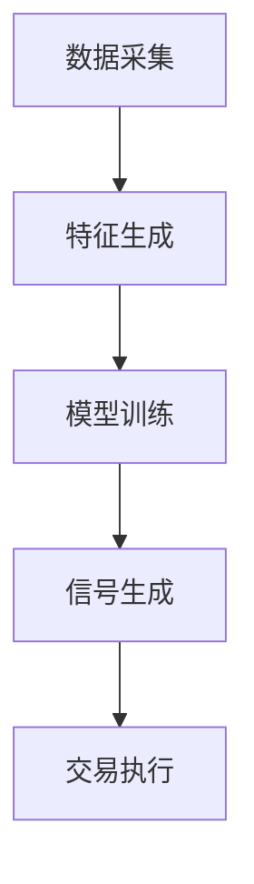
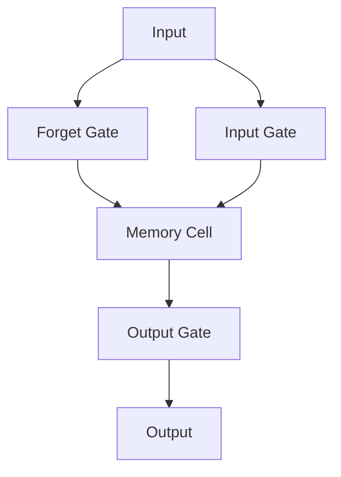
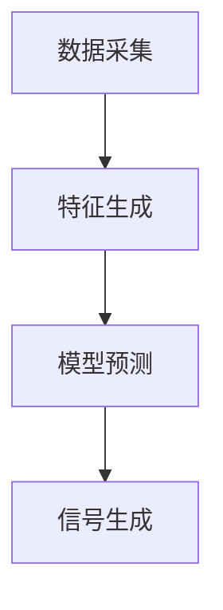

                 


# 开发基于深度学习的量化交易系统

## 关键词：深度学习，量化交易，神经网络，量化交易系统，时间序列预测

## 摘要：
本文详细探讨了如何利用深度学习技术开发量化交易系统。从深度学习的基本原理到其在量化交易中的具体应用，涵盖特征工程、算法选择、系统架构设计等关键环节。通过实际案例分析和代码实现，展示了如何构建高效、稳定的量化交易模型，帮助读者在金融领域中应用深度学习技术。

---

# 第1章: 深度学习与量化交易系统概述

## 1.1 深度学习的背景与应用

### 1.1.1 深度学习的基本概念
深度学习是一种基于人工神经网络的机器学习方法，通过多层非线性变换模拟人脑对数据的处理方式。其核心在于从数据中自动提取特征，并通过大量数据训练模型，使其具备强大的模式识别能力。

**数学公式：**
深度学习模型通常由多个层组成，每一层的输出作为下一层的输入。例如，一个简单的三层神经网络可以表示为：
$$ y = \sigma(w_2 \cdot \sigma(w_1 x + b_1) + b_2) $$

### 1.1.2 深度学习在金融领域的应用
在金融领域，深度学习被广泛应用于股票价格预测、风险管理、信用评估等方面。量化交易作为金融领域的重要组成部分，利用深度学习技术可以实现对市场趋势的预测和交易决策的优化。

### 1.1.3 量化交易的基本概念与流程
量化交易是通过算法和模型进行自动化的买卖决策，其流程包括数据获取、特征提取、模型训练、信号生成和交易执行等步骤。

## 1.2 量化交易的背景与挑战

### 1.2.1 量化交易的定义与特点
量化交易是一种基于数学模型的投资方式，具有高频交易、自动化和数据驱动等特点。它通过分析海量数据，捕捉市场中的短期价格波动，从而实现盈利。

### 1.2.2 传统量化交易方法的局限性
传统量化交易主要依赖统计套利和因子分析，但在面对复杂市场环境和非线性关系时，表现有限。例如，基于均值回归策略在极端市场情况下可能失效。

### 1.2.3 深度学习在量化交易中的优势
深度学习能够自动提取复杂特征，处理非线性关系，适用于高频交易和多市场环境。此外，深度学习模型可以捕捉传统统计方法难以发现的市场模式。

## 1.3 深度学习与量化交易的结合

### 1.3.1 深度学习在金融时间序列分析中的应用
深度学习在时间序列预测中表现优异，尤其适用于股票价格预测和波动率分析。通过LSTM等模型，可以有效捕捉时间序列中的长期依赖关系。

### 1.3.2 量化交易系统的核心模块与流程
量化交易系统通常包括数据采集、特征生成、模型训练、信号生成和交易执行五个模块。每个模块的功能及其相互关系如下：



### 1.3.3 深度学习在量化交易中的潜在价值
深度学习能够提高交易决策的准确性和效率，降低交易成本。通过实时数据分析，深度学习模型可以快速识别市场机会，优化交易策略。

## 1.4 本章小结
本章介绍了深度学习的基本概念、在金融领域的应用以及与量化交易的结合。强调了深度学习在量化交易中的优势和潜在价值，为后续章节奠定了基础。

---

# 第2章: 神经网络基础

## 2.1 神经网络的基本结构

### 2.1.1 神经元模型
神经元模型是深度学习的基本单元，通常包括输入、权重、激活函数和输出四个部分。神经元之间通过连接权重传递信号。

### 2.1.2 网络层与激活函数
神经网络由多个层组成，每一层通过激活函数引入非线性变换。常见的激活函数包括sigmoid、ReLU和tanh等。

### 2.1.3 损失函数与优化器
损失函数衡量模型预测值与真实值之间的差距，优化器通过调整权重最小化损失函数。常用优化器包括随机梯度下降（SGD）和Adam。

## 2.2 常见的神经网络模型

### 2.2.1 RNN与LSTM
RNN适用于时间序列数据，LSTM通过门控机制有效捕捉长期依赖关系。



### 2.2.2 CNN
卷积神经网络适用于图像识别和局部特征提取，通过卷积核提取输入数据的空间特征。

### 2.2.3 Transformer模型
Transformer模型通过自注意力机制捕捉数据中的全局关系，适用于长文本和时间序列数据。

## 2.3 深度学习算法的核心原理

### 2.3.1 前向传播
输入数据通过网络层逐层传递，最终输出模型预测值。

### 2.3.2 反向传播与梯度下降
通过反向传播计算损失函数对各层参数的梯度，并利用梯度下降优化参数。

### 2.3.3 参数优化与模型训练
模型训练包括正向传播计算预测值、反向传播更新参数，重复多次直至损失函数收敛。

## 2.4 本章小结
本章详细介绍了神经网络的基本结构和常见模型，为后续章节的深度学习算法应用奠定了理论基础。

---

# 第3章: 量化交易系统中的特征工程

## 3.1 数据预处理与特征提取

### 3.1.1 数据清洗与标准化
对原始数据进行去噪和平滑处理，消除异常值和缺失值。标准化通常采用Z-score或Min-Max方法。

### 3.1.2 时间序列数据的特征提取
从时间序列中提取均值、标准差、自相关系数等统计特征，捕捉数据的周期性和趋势。

### 3.1.3 数据窗口化处理
将时间序列数据划分为多个窗口，每个窗口包含一定时间范围内的数据。

## 3.2 特征选择与因子分析

### 3.2.1 特征选择的基本方法
通过相关性分析、主成分分析（PCA）等方法筛选重要特征。

### 3.2.2 量化交易中的因子分析
因子分析用于识别影响资产价格的核心因素，如市值、波动率和动量因子。

### 3.2.3 基于深度学习的特征选择
通过神经网络自动提取特征，减少手动特征工程的工作量。

## 3.3 特征工程的实战案例

### 3.3.1 数据集的构建与处理
从金融数据库获取股票价格数据，清洗后构建训练集和测试集。

### 3.3.2 特征工程的代码实现
使用Python和Pandas进行数据预处理和特征提取，代码如下：

```python
import pandas as pd
import numpy as np

# 数据加载
data = pd.read_csv('stock_prices.csv')

# 数据清洗
data.dropna(inplace=True)
data = data.iloc[:100]

# 特征提取
features = data[['open', 'high', 'low', 'volume']]
labels = data['close']
```

### 3.3.3 特征对模型性能的影响分析
通过对比不同特征组合的模型表现，评估特征工程的效果。例如，加入技术指标（如RSI、MACD）可以提高模型预测准确性。

## 3.4 本章小结
本章详细探讨了特征工程在量化交易中的重要性，通过实战案例展示了如何构建有效的特征集。

---

# 第4章: 时间序列预测模型

## 4.1 RNN与LSTM在时间序列预测中的应用

### 4.1.1 RNN的基本原理
RNN通过循环结构处理序列数据，适用于短时间序列预测。

### 4.1.2 LSTM的结构与优势
LSTM通过门控机制有效捕捉长期依赖关系，适用于长序列预测。

### 4.1.3 时间序列预测的案例分析
以股票价格预测为例，构建LSTM模型进行多步预测。

```python
import keras
from keras.layers import LSTM, Dense

model = keras.Sequential()
model.add(LSTM(64, input_shape=(timesteps, features)))
model.add(Dense(1))
model.compile(optimizer='adam', loss='mse')
```

## 4.2 Transformer模型在时间序列预测中的应用

### 4.2.1 Transformer的基本原理
Transformer通过自注意力机制捕捉数据中的全局关系，适用于长序列预测。

### 4.2.2 Transformer在金融时间序列中的优势
相比LSTM，Transformer模型具有并行计算能力，适合处理高频交易数据。

### 4.2.3 Transformer模型的实现

```python
import tensorflow as tf
from tensorflow.keras.layers import Dense, Dropout, MultiHeadAttention

model = tf.keras.Sequential([
    MultiHeadAttention(heads=8, units=64),
    Dense(1)
])
model.compile(optimizer='adam', loss='mse')
```

## 4.3 深度学习模型的调优与评估

### 4.3.1 模型调优策略
通过网格搜索调整模型参数，如学习率、批量大小和网络层数。

### 4.3.2 模型评估方法
采用均方误差（MSE）、准确率和回测收益等指标评估模型性能。

### 4.3.3 回测与风险控制
通过回测分析模型的稳定性和盈利能力，制定风险管理策略，如止损和止盈。

## 4.4 本章小结
本章介绍了RNN、LSTM和Transformer在时间序列预测中的应用，通过案例分析展示了模型的优缺点，并提供了调优与评估的方法。

---

# 第5章: 量化交易系统的实现

## 5.1 系统分析与架构设计

### 5.1.1 系统功能设计
量化交易系统包括数据采集、特征生成、模型预测和信号生成四个核心模块。



### 5.1.2 系统架构设计
采用微服务架构，各个模块独立运行，通过API进行通信。

## 5.2 系统实现

### 5.2.1 环境配置
安装必要的库，如TensorFlow、Pandas和Plotly。

### 5.2.2 数据采集与预处理
从金融数据库获取数据，清洗后构建特征集。

### 5.2.3 模型训练与优化
选择合适的模型架构，训练并优化模型参数。

### 5.2.4 信号生成与交易执行
根据模型预测结果生成交易信号，通过API执行交易。

## 5.3 系统测试与优化

### 5.3.1 回测分析
通过历史数据验证模型性能，计算夏普比率和最大回撤。

### 5.3.2 模型优化
根据回测结果优化模型参数和交易策略。

### 5.3.3 系统部署
将模型部署到生产环境，实时监控系统运行状态。

## 5.4 本章小结
本章详细介绍了量化交易系统的实现过程，从数据采集到模型部署，全面覆盖了系统开发的各个环节。

---

# 第6章: 深度学习量化交易系统的最佳实践

## 6.1 系统优化与部署

### 6.1.1 数据质量控制
确保数据的完整性和准确性，避免因数据问题影响模型性能。

### 6.1.2 模型调优技巧
通过超参数优化和模型集成提高预测准确率。

### 6.1.3 系统性能优化
采用分布式计算和缓存技术提升系统运行效率。

## 6.2 风险管理与回测策略

### 6.2.1 风险管理
制定合理的风险管理策略，如止损和止盈，控制交易风险。

### 6.2.2 回测策略
通过历史数据验证交易策略的有效性，确保模型在不同市场环境下的稳定性。

## 6.3 拓展阅读与未来展望

### 6.3.1 深度学习的前沿技术
如强化学习、图神经网络等技术在量化交易中的应用。

### 6.3.2 量化交易的未来趋势
随着人工智能技术的发展，量化交易将更加智能化和自动化。

## 6.4 本章小结
本章总结了深度学习量化交易系统的最佳实践，为读者提供了系统优化和风险管理的建议，并展望了未来的发展方向。

---

# 附录: 代码示例

## 附录A: 数据预处理代码

```python
import pandas as pd
import numpy as np

# 数据加载
data = pd.read_csv('stock_prices.csv')

# 数据清洗
data.dropna(inplace=True)
data = data.iloc[:100]

# 特征提取
features = data[['open', 'high', 'low', 'volume']]
labels = data['close']
```

## 附录B: LSTM模型实现

```python
import keras
from keras.layers import LSTM, Dense

model = keras.Sequential()
model.add(LSTM(64, input_shape=(timesteps, features)))
model.add(Dense(1))
model.compile(optimizer='adam', loss='mse')
```

## 附录C: Transformer模型实现

```python
import tensorflow as tf
from tensorflow.keras.layers import Dense, Dropout, MultiHeadAttention

model = tf.keras.Sequential([
    MultiHeadAttention(heads=8, units=64),
    Dense(1)
])
model.compile(optimizer='adam', loss='mse')
```

---

# 参考文献
1. LeCun, Y., Bengio, Y., & Hinton, G. (2015). Deep learning. Nature, 521(7555), 436-444.
2. Hochreiter, S., & Schmidhuber, J. (1997). Long short-term memory. Neural computation, 9(8), 1735-1780.
3. Vaswani, A., & al, e. (2017). Attention is all you need. Advances in neural information processing systems, 590-599.

