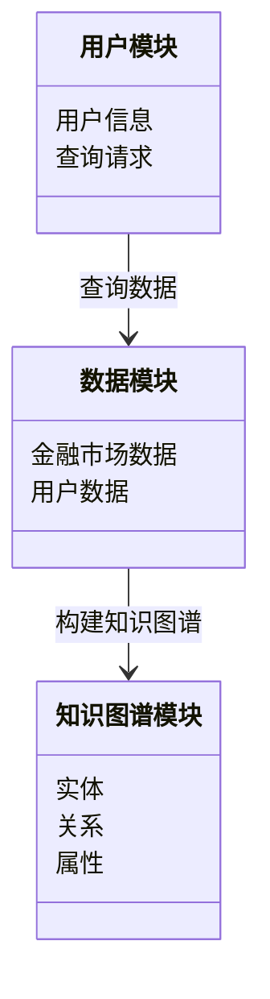
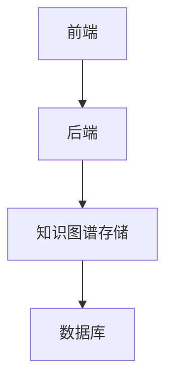
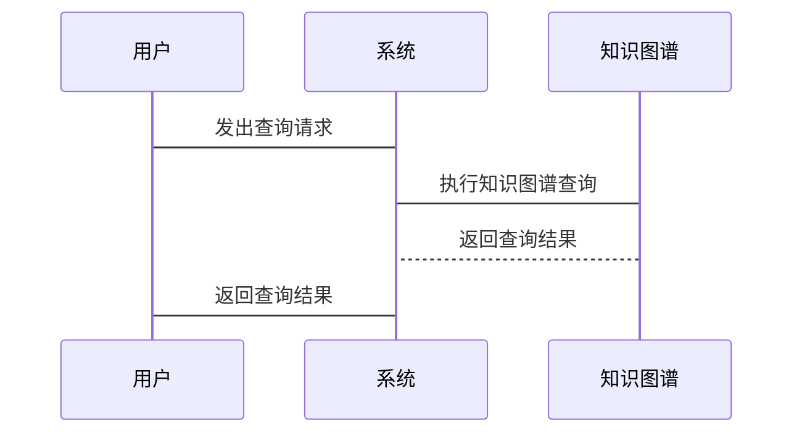
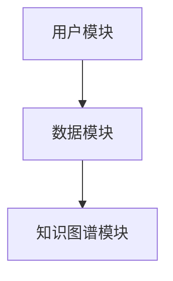

                 


# 开发基于知识图谱的金融咨询系统

## 关键词：知识图谱，金融咨询系统，自然语言处理，知识推理，系统架构

## 摘要：  
本文详细探讨了开发基于知识图谱的金融咨询系统的各个方面，从背景介绍到系统架构设计，再到项目实战，全面解析了该系统的构建过程和应用价值。文章首先介绍了知识图谱和金融咨询系统的概念，分析了它们的结合和应用前景。随后，详细讲解了知识图谱构建的核心技术，包括实体识别、关系抽取和知识融合，并通过具体算法和数学模型进行了深入分析。接着，文章讨论了系统的架构设计，包括功能模块划分、系统交互流程和接口设计。最后，通过一个实际案例展示了系统的实现过程和应用场景，并总结了开发经验和未来发展方向。

---

# 第一部分: 知识图谱与金融咨询系统概述

## 第1章: 知识图谱与金融咨询的背景与概念

### 1.1 知识图谱的定义与特点

#### 1.1.1 知识图谱的定义
知识图谱是一种以图结构形式表示知识的语义网络，由节点（实体）和边（关系）组成，能够描述实体之间的关系及其属性。知识图谱通过将分散的数据进行结构化和语义化，提供了一种统一的知识表示方式。

#### 1.1.2 知识图谱的核心特点
知识图谱具有以下特点：
- **语义性**：通过实体和关系描述，提供语义化的知识表示。
- **可扩展性**：支持大规模数据的整合和扩展。
- **动态性**：能够实时更新和维护，适应数据的变化。
- **关联性**：通过关联实体之间的关系，提供深度的语义理解。

#### 1.1.3 知识图谱与传统数据库的区别
| 特性         | 传统数据库       | 知识图谱       |
|--------------|------------------|---------------|
| 数据结构     | 行列式结构       | 图结构         |
| 关系表示     | 通过外键表示     | 显式表示       |
| 查询方式     | 基于记录的查询   | 基于图的查询   |
| 复杂性       | 低               | 高             |

### 1.2 金融咨询系统的定义与需求

#### 1.2.1 金融咨询系统的定义
金融咨询系统是一种利用计算机技术为用户提供金融相关信息、分析和建议的系统，旨在帮助用户做出更明智的金融决策。

#### 1.2.2 金融咨询系统的功能需求
金融咨询系统需要实现以下功能：
- 提供实时的金融市场数据查询。
- 分析用户的财务状况，提供建议。
- 帮助用户进行投资决策和风险管理。

#### 1.2.3 金融咨询系统的用户需求
用户期望金融咨询系统具备以下特点：
- 精准的信息检索能力。
- 强大的数据分析能力。
- 友好的用户交互界面。

### 1.3 知识图谱在金融咨询中的应用前景

#### 1.3.1 知识图谱在金融咨询中的潜在应用领域
知识图谱在金融咨询中的应用领域包括：
- 金融市场数据的整合与分析。
- 投资组合优化与风险评估。
- 金融新闻的情感分析与事件抽取。

#### 1.3.2 知识图谱在金融咨询中的优势
知识图谱的优势体现在：
- 提供语义化的知识表示，便于理解和推理。
- 支持复杂关联关系的分析，帮助发现潜在的金融风险。
- 实现多源数据的融合，提供全面的金融信息。

#### 1.3.3 知识图谱在金融咨询中的挑战与机遇
知识图谱在金融咨询中的挑战包括：
- 数据来源多样，整合难度大。
- 知识图谱的构建和维护需要大量的人力和计算资源。

知识图谱在金融咨询中的机遇在于：
- 提供了强大的数据整合和分析能力。
- 支持智能化的金融咨询和决策。

## 第2章: 知识图谱与金融咨询的核心概念

### 2.1 知识图谱的核心概念

#### 2.1.1 实体与属性
- **实体**：知识图谱中的基本单位，代表现实世界中的具体事物，如“公司”、“股票”等。
- **属性**：描述实体的特征或状态，如“公司名称”、“成立时间”等。

#### 2.1.2 关系与事实
- **关系**：描述实体之间的关联，如“投资于”、“隶属于”等。
- **事实**：由头实体、关系和尾实体组成的三元组，如（公司A，投资于，项目B）。

#### 2.1.3 知识图谱的构建流程
知识图谱的构建流程包括：
1. 数据收集：从多种数据源获取数据。
2. 数据清洗：去除冗余和噪声数据。
3. 实体识别：识别数据中的实体。
4. 关系抽取：提取实体之间的关系。
5. 知识融合：整合多个数据源的信息。
6. 知识存储：将构建的知识图谱存储起来。

### 2.2 金融咨询系统的核心概念

#### 2.2.1 金融咨询的核心流程
金融咨询的核心流程包括：
1. 用户需求分析：了解用户的投资目标和风险承受能力。
2. 数据收集与分析：收集用户的财务数据和市场数据。
3. 投资策略制定：根据分析结果制定投资策略。
4. 优化与调整：根据市场变化和用户需求调整投资策略。

#### 2.2.2 金融咨询的用户角色
金融咨询的用户角色包括：
- **个人投资者**：需要个性化的投资建议。
- **机构投资者**：需要专业的市场分析和投资策略。
- **财务顾问**：需要高效的工具辅助工作。

#### 2.2.3 金融咨询的系统架构
金融咨询的系统架构包括：
1. 数据层：存储金融市场数据和用户数据。
2. 业务逻辑层：实现数据处理和业务逻辑。
3. 用户界面层：提供用户交互界面。

### 2.3 知识图谱与金融咨询的结合

#### 2.3.1 知识图谱在金融咨询中的应用场景
知识图谱在金融咨询中的应用场景包括：
- 金融市场数据的整合与分析。
- 投资组合优化与风险评估。
- 金融新闻的情感分析与事件抽取。

#### 2.3.2 知识图谱与金融咨询的业务流程结合
知识图谱与金融咨询的业务流程结合体现在：
- 通过知识图谱整合多源数据，提供全面的市场分析。
- 利用知识图谱进行关联分析，发现潜在的金融风险。
- 基于知识图谱进行知识推理，提供个性化的投资建议。

#### 2.3.3 知识图谱在金融咨询中的价值体现
知识图谱在金融咨询中的价值体现在：
- 提供语义化的知识表示，便于理解和推理。
- 支持复杂关联关系的分析，帮助发现潜在的金融风险。
- 实现多源数据的融合，提供全面的金融信息。

---

# 第二部分: 知识图谱构建与算法原理

## 第3章: 知识图谱构建算法

### 3.1 实体识别与抽取算法

#### 3.1.1 基于规则的实体识别
基于规则的实体识别通过预定义的规则来识别文本中的实体，适用于领域知识丰富的场景。

#### 3.1.2 基于统计的实体识别
基于统计的实体识别利用统计学方法，通过分析词语的上下文信息来识别实体。

#### 3.1.3 基于深度学习的实体识别
基于深度学习的实体识别利用神经网络模型，通过训练数据学习实体的特征，识别效果较好。

### 3.2 关系抽取与链接算法

#### 3.2.1 基于规则的关系抽取
基于规则的关系抽取通过预定义的关系模式来识别文本中的关系。

#### 3.2.2 基于统计的关系抽取
基于统计的关系抽取利用统计学方法，通过分析词语的共现情况来识别关系。

#### 3.2.3 基于深度学习的关系抽取
基于深度学习的关系抽取利用神经网络模型，通过训练数据学习关系的特征，识别效果较好。

### 3.3 知识融合与冲突处理

#### 3.3.1 知识融合的原理
知识融合的原理是将多个数据源中的知识进行整合，消除冲突，形成一致的知识表示。

#### 3.3.2 知识冲突的检测与处理
知识冲突的检测与处理包括冲突检测和冲突消解两个步骤，确保知识的准确性和一致性。

#### 3.3.3 知识融合的优化策略
知识融合的优化策略包括：
- 基于相似度的融合策略
- 基于权重的融合策略
- 基于规则的融合策略

## 第4章: 知识图谱构建的数学模型与算法

### 4.1 实体识别的数学模型

#### 4.1.1 基于概率论的实体识别模型
基于概率论的实体识别模型通过计算实体出现的概率，选择概率最大的实体作为识别结果。

### 4.2 关系抽取的数学模型

#### 4.2.1 基于图嵌入的关系抽取模型
基于图嵌入的关系抽取模型通过将实体和关系嵌入到低维空间，利用图结构信息进行关系推理。

#### 4.2.2 基于注意力机制的关系抽取模型
基于注意力机制的关系抽取模型通过关注句子中的重要词语，提高关系抽取的准确性。

---

# 第三部分: 系统分析与架构设计方案

## 第5章: 系统分析与架构设计

### 5.1 系统功能设计

#### 5.1.1 领域模型设计
领域模型设计包括用户模块、数据模块和知识图谱模块，通过Mermaid类图展示各模块之间的关系。



#### 5.1.2 系统架构设计
系统架构设计包括前端、后端和知识图谱存储，通过Mermaid架构图展示各部分的关系。



#### 5.1.3 系统交互流程设计
系统交互流程设计包括用户查询、知识图谱查询和结果返回，通过Mermaid序列图展示交互过程。



### 5.2 系统接口设计

#### 5.2.1 知识图谱查询接口
知识图谱查询接口包括以下内容：
- 输入：查询请求
- 输出：查询结果

#### 5.2.2 用户交互接口
用户交互接口包括以下内容：
- 输入：用户输入
- 输出：系统反馈

### 5.3 系统架构设计

#### 5.3.1 系统功能模块划分
系统功能模块划分包括用户模块、数据模块和知识图谱模块。

#### 5.3.2 系统架构图
系统架构图展示各模块之间的关系。



---

# 第四部分: 项目实战

## 第6章: 项目实战

### 6.1 环境安装与配置

#### 6.1.1 知识图谱构建工具
常用的知识图谱构建工具包括：
- **Neo4j**：图数据库
- **Ubergraph**：知识图谱构建工具
- **DBpedia**：开放知识图谱

#### 6.1.2 系统开发框架
常用的系统开发框架包括：
- **Django**：Python Web框架
- **Flask**：Python微框架
- **Spring Boot**：Java Web框架

### 6.2 系统核心实现

#### 6.2.1 知识图谱构建实现
知识图谱构建实现包括实体识别、关系抽取和知识融合，通过Python代码展示实现过程。

```python
from spacy.lang.zh import Chinese
import spacy

# 加载中文分词模型
nlp = Chinese()

# 定义实体识别函数
def extract_entities(text):
    doc = nlp(text)
    entities = []
    for ent in doc.ents:
        entities.append((ent.text, ent.label_))
    return entities

# 示例文本
text = "苹果投资了1000万美元在人工智能领域。"
entities = extract_entities(text)
print(entities)
```

#### 6.2.2 系统功能实现
系统功能实现包括用户交互、知识图谱查询和结果展示，通过Python代码展示实现过程。

```python
from flask import Flask, request, jsonify

app = Flask(__name__)

@app.route('/query', methods=['POST'])
def query():
    data = request.json
    query = data['query']
    # 执行知识图谱查询
    result = knowledge_graph.query(query)
    return jsonify({'result': result})

if __name__ == '__main__':
    app.run(debug=True)
```

### 6.3 案例分析与应用

#### 6.3.1 案例分析
案例分析包括市场趋势分析、投资组合优化和风险评估，通过具体案例展示系统的应用效果。

#### 6.3.2 系统功能展示
系统功能展示包括用户界面、查询结果和交互流程，通过截图和描述展示系统的实际运行情况。

### 6.4 项目总结

#### 6.4.1 项目成果
项目成果包括知识图谱构建、系统实现和案例分析。

#### 6.4.2 项目经验
项目经验包括技术难点、解决方案和优化策略。

#### 6.4.3 项目展望
项目展望包括未来发展方向、改进空间和应用前景。

---

# 第五部分: 最佳实践与总结

## 第7章: 最佳实践与总结

### 7.1 最佳实践 tips

#### 7.1.1 数据质量管理
数据质量管理包括数据清洗、数据验证和数据增强。

#### 7.1.2 系统性能优化
系统性能优化包括缓存优化、查询优化和并行计算。

#### 7.1.3 系统安全与隐私保护
系统安全与隐私保护包括数据加密、访问控制和日志管理。

### 7.2 小结

#### 7.2.1 知识图谱在金融咨询中的应用价值
知识图谱在金融咨询中的应用价值体现在数据整合、关联分析和智能决策等方面。

#### 7.2.2 金融咨询系统的核心优势
金融咨询系统的核心优势体现在智能化、个性化和高效性等方面。

### 7.3 注意事项

#### 7.3.1 数据隐私与安全
在金融咨询系统中，必须高度重视数据隐私与安全，确保用户数据的安全性和合法性。

#### 7.3.2 系统可扩展性
系统设计时必须考虑可扩展性，以便在未来业务发展时能够方便地进行功能扩展和性能优化。

### 7.4 拓展阅读

#### 7.4.1 知识图谱相关技术
推荐阅读的知识图谱相关技术包括图数据库、图嵌入和知识融合等。

#### 7.4.2 金融咨询系统相关技术
推荐阅读的金融咨询系统相关技术包括自然语言处理、知识推理和机器学习等。

---

# 结语

开发基于知识图谱的金融咨询系统是一项复杂的系统工程，需要结合知识图谱构建技术和金融咨询业务需求，通过系统的分析与设计，实现知识图谱的构建与应用。本文从背景介绍到系统实现，全面解析了该系统的构建过程和应用价值。未来，随着人工智能和大数据技术的不断发展，知识图谱在金融咨询中的应用将更加广泛和深入。

--- 

通过本文的阐述，希望读者能够对基于知识图谱的金融咨询系统有一个全面的了解，并能够在实际项目中灵活运用相关技术，开发出更加智能化和高效的金融咨询系统。

