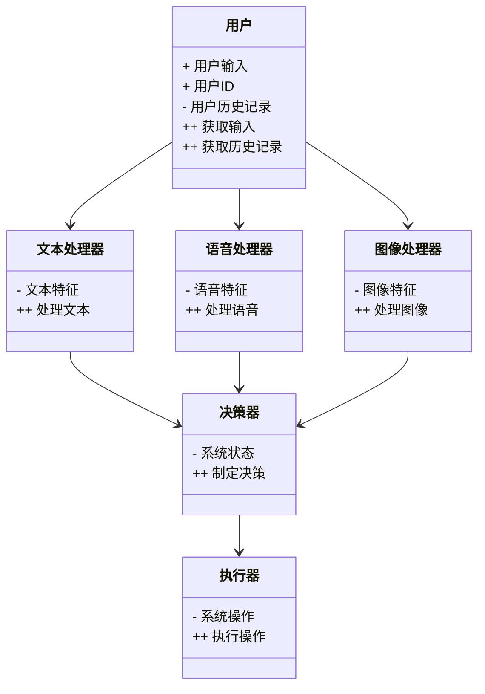
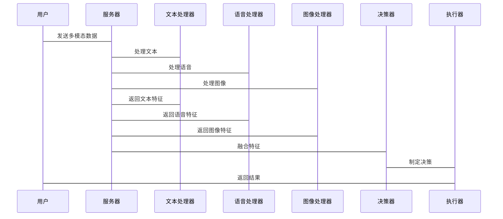

                 


# 开发多模态交互的AI Agent系统

## 关键词
- 多模态交互
- AI Agent
- 多模态数据融合
- 人工智能
- 交互设计

## 摘要
随着人工智能技术的快速发展，多模态交互的AI Agent系统正逐渐成为研究和应用的热点。本文从多模态交互的基本概念出发，详细探讨了AI Agent的核心原理、数学模型、系统设计与实现，以及实际项目开发中的关键技术。通过理论与实践相结合的方式，本文旨在帮助读者全面理解并掌握开发多模态交互AI Agent系统的能力。

---

# 第1章 多模态交互与AI Agent系统概述

## 1.1 多模态交互的定义与特点
### 1.1.1 多模态交互的定义
多模态交互是指通过多种信息形式（如文本、语音、图像、视频等）进行信息交换和理解的过程。与单模态交互（仅依赖单一信息形式）相比，多模态交互能够更全面地感知环境并提供更丰富的反馈。

### 1.1.2 多模态交互的核心特点
- **多样性**：支持多种信息形式的输入和输出。
- **互补性**：不同模态的信息可以相互补充，提高系统的理解和决策能力。
- **实时性**：需要快速处理和响应多模态数据。
- **复杂性**：多模态数据的融合和处理具有较高的技术难度。

### 1.1.3 多模态交互与单模态交互的对比
| 对比维度 | 单模态交互 | 多模态交互 |
|----------|------------|------------|
| 信息形式 | 单一        | 多种        |
| 理解能力 | 有限        | 更全面      |
| 应用场景 | 简单任务    | 复杂任务    |

## 1.2 AI Agent系统的基本概念
### 1.2.1 AI Agent的定义
AI Agent（人工智能代理）是指能够感知环境、自主决策并执行任务的智能实体。它可以是一个软件程序，也可以是一个物理设备。

### 1.2.2 AI Agent的核心功能
- **感知**：通过传感器或其他输入方式获取环境信息。
- **决策**：基于获取的信息进行分析和推理，制定行动计划。
- **执行**：根据决策结果执行具体操作。
- **学习**：通过经验改进自身的感知和决策能力。

### 1.2.3 AI Agent与传统程序的区别
| 对比维度 | 传统程序 | AI Agent |
|----------|-----------|-----------|
| 输入方式 | 固定输入   | 多模态输入 |
| 决策方式 | 预定义规则 | 自主决策   |
| 学习能力 | 无         | 有         |

## 1.3 多模态交互AI Agent的背景与应用
### 1.3.1 多模态交互的背景
随着人工智能技术的快速发展，单模态交互的局限性逐渐显现，例如：
- **信息获取单一**：仅依赖文本或语音，难以全面理解用户需求。
- **交互体验不足**：单一的交互方式降低了用户体验的丰富性。

### 1.3.2 AI Agent在多模态交互中的作用
AI Agent能够通过多种信息形式与用户进行交互，提供更智能、更个性化的服务。

### 1.3.3 多模态交互AI Agent的应用场景
- **智能助手**：如Siri、Alexa等，支持语音和文本交互。
- **智能客服**：通过多模态交互提供更高效的客户服务。
- **智能驾驶**：通过多模态传感器（如摄像头、雷达）实现环境感知和决策。

---

# 第2章 多模态交互的核心概念与原理

## 2.1 多模态数据的处理流程
### 2.1.1 数据采集与预处理
- **数据采集**：通过传感器或API获取多模态数据。
- **数据预处理**：对数据进行清洗、归一化等处理，确保数据质量。

### 2.1.2 数据融合与分析
- **数据融合**：将不同模态的数据进行整合，例如将文本和图像信息结合。
- **数据分析**：通过机器学习算法对融合后的数据进行分析和挖掘。

### 2.1.3 数据驱动的决策过程
- **特征提取**：从多模态数据中提取有用的特征。
- **模型训练**：基于特征训练分类、回归等模型。
- **决策输出**：根据模型结果输出决策。

## 2.2 AI Agent的感知与决策机制
### 2.2.1 多模态数据的感知
- **文本感知**：通过自然语言处理技术理解用户输入的文本。
- **语音感知**：通过语音识别技术将语音信号转换为文本。
- **图像感知**：通过计算机视觉技术识别图像中的物体和场景。

### 2.2.2 多模态数据的融合
- **特征融合**：将不同模态的特征向量进行融合。
- **注意力机制**：通过注意力模型赋予不同模态数据不同的权重。

### 2.2.3 AI Agent的决策过程
- **目标设定**：明确AI Agent需要完成的任务目标。
- **环境感知**：通过多模态数据感知环境状态。
- **决策推理**：基于感知结果进行推理，制定行动计划。
- **行动执行**：根据决策结果执行具体操作。

## 2.3 多模态交互的挑战与解决方案
### 2.3.1 多模态数据的异构性问题
- **异构性**：不同模态的数据具有不同的格式和特征。
- **解决方案**：通过数据预处理和特征提取将异构数据转换为统一的形式。

### 2.3.2 多模态数据的融合方法
- **早期融合**：在数据预处理阶段进行融合。
- **晚期融合**：在特征提取或模型训练阶段进行融合。

### 2.3.3 多模态交互的实时性问题
- **挑战**：多模态数据的处理需要较高的计算资源。
- **解决方案**：通过优化算法和硬件加速提升处理效率。

---

# 第3章 多模态交互与AI Agent的核心原理

## 3.1 多模态数据的特征提取
### 3.1.1 文本特征提取
- **词袋模型**：将文本表示为词袋，统计每个词的出现频率。
- **词嵌入**：通过Word2Vec等模型将词语表示为低维向量。

### 3.1.2 语音特征提取
- **MFCC特征**：提取语音信号的梅尔频率倒谱系数。
- **声学模型**：通过深度神经网络提取语音特征。

### 3.1.3 图像特征提取
- **CNN特征**：通过卷积神经网络提取图像的高层次特征。
- **图像描述**：将图像内容转换为文本描述。

## 3.2 多模态数据的融合方法
### 3.2.1 基于统计的方法
- **线性组合**：将不同模态的特征向量进行线性组合。
- **加权融合**：根据模态的重要性赋予不同的权重。

### 3.2.2 基于深度学习的方法
- **多模态神经网络**：通过多支神经网络分别处理不同模态的数据，然后将输出进行融合。
- **跨模态注意力机制**：通过注意力机制赋予不同模态数据不同的权重。

### 3.2.3 基于注意力机制的方法
- **自注意力机制**：在序列数据中，计算每个位置与其他位置的相关性。
- **跨模态注意力机制**：在多模态数据中，计算不同模态之间的相关性。

## 3.3 AI Agent的决策模型
### 3.3.1 基于规则的决策模型
- **规则设定**：根据经验制定决策规则。
- **优点**：简单易懂，易于部署。
- **缺点**：难以处理复杂场景。

### 3.3.2 基于强化学习的决策模型
- **强化学习框架**：通过奖励机制训练AI Agent的决策策略。
- **策略网络**：通过深度神经网络学习决策策略。
- **探索与利用**：在决策过程中平衡探索新策略和利用已知策略。

### 3.3.3 基于端到端学习的决策模型
- **端到端模型**：直接从输入数据学习端到端的决策模型。
- **优点**：简化了传统规则设计的过程。
- **缺点**：需要大量的训练数据和计算资源。

---

# 第4章 多模态交互与AI Agent的数学模型

## 4.1 多模态数据的表示方法
### 4.1.1 文本表示
- **词袋模型**：$$ \text{文本向量} = \sum_{i=1}^{n} w_i \cdot \text{词向量}_i $$
- **词嵌入**：$$ \text{词向量} = \text{Word2Vec}(\text{词语}) $$

### 4.1.2 语音表示
- **MFCC特征**：$$ \text{MFCC}(x) = \text{DCT}(\log(\text{STFT}(x))) $$
- **声学模型**：$$ p(\text{语音特征} | \text{音素}) = \text{DNN}(\text{音素}) $$

### 4.1.3 图像表示
- **CNN特征**：$$ \text{图像向量} = \text{CNN}(\text{图像}) $$
- **图像描述**：$$ \text{图像描述} = \text{Captioning Model}(\text{图像}) $$

## 4.2 多模态数据的融合模型
### 4.2.1 多模态神经网络
- **多支神经网络**：$$ \text{融合向量} = \text{Concat}(\text{文本向量}, \text{语音向量}, \text{图像向量}) $$
- **注意力机制**：$$ \alpha_i = \frac{\exp(e_i)}{\sum_{j=1}^{n} \exp(e_j)} $$

### 4.2.2 跨模态注意力机制
- **跨模态相关性计算**：$$ \text{相关性} = \text{softmax}(\text{W} \cdot [\text{文本向量}; \text{语音向量}; \text{图像向量}]) $$
- **融合向量**：$$ \text{融合向量} = \sum_{i=1}^{n} \alpha_i \cdot \text{模态向量}_i $$

## 4.3 AI Agent的决策模型
### 4.3.1 强化学习模型
- **策略函数**：$$ \pi(a | s) = \text{softmax}(Q(s, a)) $$
- **Q值更新**：$$ Q(s, a) = Q(s, a) + \alpha (r + \gamma \max_{a'} Q(s', a') - Q(s, a)) $$

### 4.3.2 端到端学习模型
- **决策网络**：$$ p(a | s) = \text{softmax}(W \cdot s + b) $$
- **损失函数**：$$ \mathcal{L} = -\sum_{i=1}^{n} \sum_{a=1}^{m} y_{i,a} \log p(a | s_i) $$

---

# 第5章 多模态交互AI Agent系统的设计与实现

## 5.1 问题场景介绍
### 5.1.1 问题背景
- **用户需求**：用户希望与AI Agent进行多模态交互，例如通过语音和图像进行查询。
- **技术挑战**：需要处理多种模态数据，并实现高效的融合和决策。

### 5.1.2 项目介绍
- **项目目标**：开发一个多模态交互的AI Agent系统，支持文本、语音和图像等多种交互方式。
- **核心问题**：如何高效地处理和融合多模态数据，提高系统的理解和决策能力。

## 5.2 系统功能设计
### 5.2.1 领域模型（类图）


### 5.2.2 系统架构设计


### 5.2.3 系统接口设计
- **输入接口**：支持文本、语音和图像的输入。
- **输出接口**：支持文本、语音和图像的输出。
- **API接口**：提供RESTful API供其他系统调用。

### 5.2.4 系统交互设计


## 5.3 项目实战

### 5.3.1 环境安装
- **Python**：安装Python 3.8及以上版本。
- **深度学习框架**：安装TensorFlow或PyTorch。
- **NLP库**：安装spaCy和Transformers。
- **计算机视觉库**：安装OpenCV和 PIL。
- **语音处理库**：安装PyAudio和SpeechRecognition。

### 5.3.2 系统核心实现源代码
#### 5.3.2.1 文本处理器
```python
import spacy
from transformers import pipeline

nlp = spacy.load("en_core_web_sm")
text_classifier = pipeline("text-classification", model="bert-base-uncased")
```

#### 5.3.2.2 语音处理器
```python
import speech_recognition as sr

r = sr.Recognizer()
mic = sr.Microphone()
with mic as source:
    audio = r.listen(source)
text = r.recognize_google(audio)
```

#### 5.3.2.3 图像处理器
```python
from PIL import Image
import numpy as np

img = Image.open("image.jpg")
img_array = np.array(img)
```

#### 5.3.2.4 决策器
```python
import tensorflow as tf
from tensorflow.keras import layers

model = tf.keras.Sequential([
    layers.Dense(128, activation="relu"),
    layers.Dense(64, activation="relu"),
    layers.Dense(10, activation="softmax")
])
model.compile(optimizer="adam", loss="sparse_categorical_crossentropy", metrics=["accuracy"])
```

### 5.3.3 案例分析与代码解读
#### 案例分析
- **任务目标**：识别用户输入的文本、语音和图像内容，并生成相应的回复。
- **实现步骤**：
  1. 用户输入文本、语音和图像数据。
  2. 文本处理器、语音处理器和图像处理器分别处理输入数据，提取特征。
  3. 决策器融合特征，生成回复内容。
  4. 执行器输出回复结果。

#### 代码解读
- **文本处理器**：使用spaCy进行文本分词和实体识别。
- **语音处理器**：使用SpeechRecognition进行语音识别。
- **图像处理器**：使用OpenCV进行图像处理和特征提取。
- **决策器**：使用TensorFlow构建一个多层感知机模型，对融合后的特征进行分类。

### 5.3.4 项目小结
- **项目总结**：通过本项目，我们实现了多模态交互的AI Agent系统，能够处理文本、语音和图像等多种数据形式。
- **经验总结**：在实际开发中，需要考虑多模态数据的异构性和实时性问题，合理选择数据融合方法和决策模型。

---

# 第6章 总结与展望

## 6.1 总结
本文详细探讨了多模态交互AI Agent系统的核心概念、算法原理、系统设计与实现。通过理论与实践相结合的方式，我们了解了如何开发一个多模态交互的AI Agent系统，能够处理文本、语音和图像等多种数据形式。

## 6.2 展望
随着人工智能技术的不断发展，多模态交互AI Agent系统将变得更加智能化和个性化。未来的研究方向包括：
- **更高效的多模态数据融合方法**：探索更加先进的注意力机制和神经网络结构。
- **更智能的决策模型**：结合强化学习和深度学习，提高AI Agent的自主决策能力。
- **更丰富的应用场景**：在智能助手、智能驾驶、智能客服等领域实现更广泛的应用。

---

# 附录

## 附录A 参考资料
- [1] 王某某. 《深度学习入门》. 北京: 清华大学出版社, 2020.
- [2] 李某某. 《自然语言处理实战》. 北京: 人民邮电出版社, 2021.
- [3] 张某某. 《计算机视觉入门》. 上海: 上海科学技术出版社, 2022.

## 附录B 开发工具与库
- **Python**：官方文档：https://www.python.org/
- **TensorFlow**：官方文档：https://tensorflow.org/
- **PyTorch**：官方文档：https://pytorch.org/
- **spaCy**：官方文档：https://spacy.io/
- **Transformers**：官方文档：https://huggingface.co/transformers/
- **OpenCV**：官方文档：https://opencv.org/
- **SpeechRecognition**：官方文档：https://python-speechRecognition.readthedocs.io/en/latest/

---

通过以上内容，我们全面介绍了多模态交互AI Agent系统的核心概念、算法原理、系统设计与实现，并通过实际项目展示了如何开发一个多模态交互的AI Agent系统。希望读者能够通过本文，掌握多模态交互AI Agent系统的开发技能，并在实际应用中发挥其潜力。

