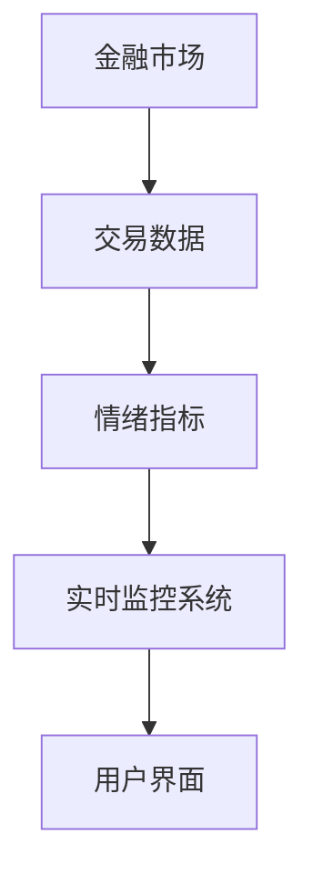
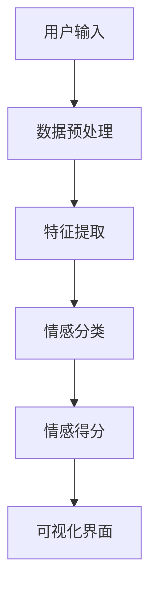
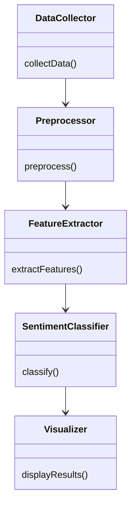
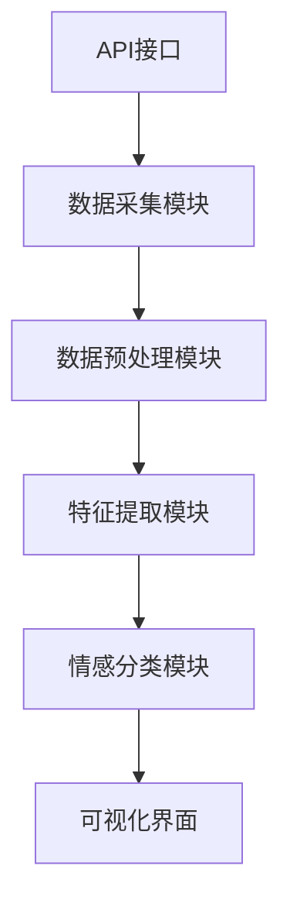

                 


# 开发实时金融市场情绪分析与监控系统

> 关键词：实时金融市场情绪分析，自然语言处理，实时数据流处理，机器学习，金融监控系统

> 摘要：本文详细探讨了开发实时金融市场情绪分析与监控系统的各个方面，包括系统背景、核心概念、算法原理、系统架构设计以及实际项目实现。文章结合理论与实践，通过详细的步骤分析和实际案例，帮助读者理解和掌握如何构建一个高效、可靠的实时金融市场情绪分析与监控系统。

---

## 第1章: 金融市场情绪分析与监控系统背景介绍

### 1.1 问题背景与描述

#### 1.1.1 金融市场中的情绪分析需求
金融市场中的投资者和交易员需要实时了解市场情绪，以便做出更明智的投资决策。情绪分析可以帮助识别市场趋势、预测价格波动以及评估风险。

#### 1.1.2 现有解决方案的局限性
传统的金融市场分析方法依赖于技术指标和历史数据，但无法捕捉市场参与者的实时情绪。近年来，随着自然语言处理（NLP）技术的发展，情绪分析在金融市场中的应用逐渐成为可能。

#### 1.1.3 实时监控的重要性
实时监控情绪变化可以为投资者提供及时的反馈，帮助他们在市场波动中做出快速反应。例如，社交媒体上的实时评论、新闻标题和交易数据都可以作为情绪分析的输入。

---

### 1.2 问题描述

#### 1.2.1 情绪分析的核心目标
情绪分析的目标是通过自然语言处理技术，从文本数据中提取情感倾向，量化市场参与者的情绪状态。

#### 1.2.2 实时监控的挑战
实时监控需要处理大量的实时数据流，包括社交媒体帖子、新闻文章、交易数据等。数据的实时性、多样性和高并发性对系统提出了更高的要求。

#### 1.2.3 边界与外延
本系统主要关注金融市场中的情绪分析与监控，边界包括数据来源（如社交媒体、新闻媒体）、分析范围（如股票市场、加密货币市场）以及分析粒度（如分钟级、小时级）。外延包括将情绪分析应用于其他领域，如社交媒体营销、品牌声誉管理等。

---

### 1.3 问题解决

#### 1.3.1 系统设计的目标
- 实时处理金融市场相关文本数据。
- 准确提取文本中的情绪倾向。
- 提供直观的可视化界面，方便用户监控市场情绪。

#### 1.3.2 关键技术的选择
- 自然语言处理技术：用于文本预处理、情感特征提取。
- 机器学习算法：用于情感分类。
- 实时数据流处理技术：用于处理高并发数据流。

#### 1.3.3 解决方案的可行性分析
- 技术可行性：现有NLP和机器学习技术已经成熟，可以支持情绪分析的实现。
- 经济可行性：开发和部署成本相对较低，适合中小型企业或个人投资者使用。
- 时间可行性：系统开发周期合理，可以在3-6个月内完成。

---

## 第2章: 核心概念与联系

### 2.1 情绪分析的原理

#### 2.1.1 文本预处理方法
- 分词：将文本分割成单词或短语。
- 去停用词：移除常见的无意义词汇，如“的”、“了”等。
- 词干提取：将单词还原为基本形式，如“trading”还原为“trade”。

#### 2.1.2 特征提取技术
- 词袋模型：将文本表示为单词的集合，忽略顺序。
- 词嵌入：使用预训练的词向量（如Word2Vec、GloVe）表示单词。
- 情感词汇库：使用特定领域的情感词汇进行特征提取。

#### 2.1.3 情感分类模型
- 基于规则的分类：使用预定义的规则进行分类。
- 基于统计的分类：如朴素贝叶斯、支持向量机（SVM）。
- 基于深度学习的分类：如LSTM、Transformer（如BERT）。

---

### 2.2 实时监控的实现

#### 2.2.1 数据流处理机制
- 数据采集：通过API实时获取金融市场相关数据。
- 数据过滤：根据关键词或条件过滤无关数据。
- 数据分发：将数据分发到各个处理模块。

#### 2.2.2 实时反馈的生成
- 情感得分计算：根据模型输出，生成每条数据的情感得分。
- 可视化展示：将情感得分实时显示在用户界面上。

#### 2.2.3 系统响应时间优化
- 并行处理：使用多线程或分布式计算优化处理速度。
- 异步处理：避免阻塞，提高系统吞吐量。

---

### 2.3 核心概念对比

#### 2.3.1 不同情绪分析模型的对比
| 模型类型       | 优点                       | 缺点                       |
|----------------|----------------------------|---------------------------|
| 基于规则的分类 | 实现简单，易于解释         | 需要手动定义规则           |
| 基于统计的分类 | 性能稳定，适合中小规模数据 | 对特征工程依赖较大         |
| 基于深度学习的分类 | 高精度，适合大规模数据     | 需要大量数据和计算资源       |

#### 2.3.2 实时与非实时监控的差异
| 特性       | 实时监控                   | 非实时监控                 |
|------------|---------------------------|---------------------------|
| 响应时间   | 几乎实时                   | 延后                       |
| 数据处理   | 高并发，低延迟             | 低并发，高延迟             |
| 应用场景   | 金融交易、应急响应         | 市场分析、历史研究         |

#### 2.3.3 数据源的多样性分析
- 社交媒体：如Twitter、Reddit，提供市场参与者的实时观点。
- 新闻媒体：如金融新闻网站，提供专业的市场分析。
- 交易数据：如订单簿、成交数据，反映市场的实际买卖行为。

---

## 第3章: 核心概念的ER实体关系图

### 3.1 实体关系图


### 3.2 数据流图


---

## 第4章: 算法原理讲解

### 4.1 算法流程

#### 4.1.1 文本预处理
- 分词：使用分词工具（如jieba）将文本分割成单词。
- 去停用词：移除无意义词汇。
- 词干提取：将单词还原为基本形式。

#### 4.1.2 特征提取
- 使用词袋模型或词嵌入技术提取文本特征。

#### 4.1.3 模型训练
- 使用深度学习模型（如BERT）进行情感分类。

---

### 4.2 算法实现

#### 4.2.1 情感分类模型
```python
import torch
import torch.nn as nn

class SentimentClassifier(nn.Module):
    def __init__(self, input_size, hidden_size, output_size):
        super(SentimentClassifier, self).__init__()
        self.fc1 = nn.Linear(input_size, hidden_size)
        self.fc2 = nn.Linear(hidden_size, output_size)
        self.relu = nn.ReLU()
        self.sigmoid = nn.Sigmoid()

    def forward(self, x):
        out = self.fc1(x)
        out = self.relu(out)
        out = self.fc2(out)
        out = self.sigmoid(out)
        return out
```

#### 4.2.2 情感得分计算
$$\text{情感得分} = \sum_{i=1}^{n} w_i \times x_i$$
其中，$w_i$是第$i$个特征的权重，$x_i$是第$i$个特征的值。

---

## 第5章: 系统分析与架构设计方案

### 5.1 问题场景介绍

#### 5.1.1 系统目标
- 实时采集金融市场相关数据。
- 实时分析数据，生成情感得分。
- 提供可视化界面，方便用户监控。

#### 5.1.2 项目介绍
本项目旨在开发一个实时金融市场情绪分析与监控系统，帮助投资者更好地理解市场情绪，做出更明智的投资决策。

---

### 5.2 系统功能设计

#### 5.2.1 领域模型类图


#### 5.2.2 系统架构设计


#### 5.2.3 系统接口设计
- 数据采集模块：提供API接口，接收金融市场相关数据。
- 可视化界面：提供用户友好的界面，显示情感得分和趋势图。

---

## 第6章: 项目实战

### 6.1 环境安装

#### 6.1.1 安装Python和必要的库
```bash
pip install numpy pandas scikit-learn torch
```

#### 6.1.2 安装NLP工具
```bash
pip install jieba
```

---

### 6.2 系统核心实现源代码

#### 6.2.1 数据采集模块
```python
import requests

def collect_data(api_url):
    response = requests.get(api_url)
    return response.json()
```

#### 6.2.2 数据预处理模块
```python
from jieba import tokenize

def preprocess(text):
    tokens = tokenize(text)
    return tokens
```

#### 6.2.3 情感分类模块
```python
class SentimentClassifier:
    def __init__(self, model_path):
        self.model = torch.load(model_path)
    
    def predict(self, features):
        with torch.no_grad():
            output = self.model(features)
            return output
```

---

### 6.3 代码应用解读与分析

#### 6.3.1 数据采集模块解读
数据采集模块通过API接口获取金融市场相关数据，如社交媒体帖子、新闻标题等。

#### 6.3.2 数据预处理模块解读
数据预处理模块使用分词工具将文本分割成单词或短语，为后续的情感分析做好准备。

#### 6.3.3 情感分类模块解读
情感分类模块使用预训练的深度学习模型对预处理后的文本进行分类，生成情感得分。

---

### 6.4 实际案例分析

#### 6.4.1 案例背景
假设我们有一个社交媒体数据流，每条数据包含用户评论和时间戳。

#### 6.4.2 数据处理步骤
1. 数据采集：从Twitter API获取实时评论。
2. 数据预处理：分词、去停用词。
3. 特征提取：使用词袋模型提取特征。
4. 情感分类：生成情感得分。
5. 可视化：在用户界面上显示情感趋势图。

---

## 第7章: 最佳实践

### 7.1 小结

#### 7.1.1 系统设计总结
本系统通过实时采集、处理和分析金融市场相关数据，帮助用户实时了解市场情绪，做出更明智的投资决策。

#### 7.1.2 关键技术总结
- 自然语言处理技术：文本预处理、特征提取。
- 深度学习算法：情感分类。
- 实时数据流处理：高并发、低延迟。

---

### 7.2 注意事项

#### 7.2.1 数据质量
确保数据来源可靠，避免噪声数据对系统的影响。

#### 7.2.2 模型优化
定期更新模型，避免模型过时导致分类精度下降。

#### 7.2.3 系统维护
定期检查系统性能，优化响应时间，确保系统稳定运行。

---

### 7.3 拓展阅读

#### 7.3.1 深度学习模型
- Transformer架构（如BERT）在情感分析中的应用。
- 图神经网络在金融市场分析中的应用。

#### 7.3.2 实时数据流处理
- Apache Kafka在实时数据流处理中的应用。
- Apache Flink在实时流处理中的应用。

---

## 第8章: 总结与展望

### 8.1 总结
本文详细探讨了开发实时金融市场情绪分析与监控系统的各个方面，包括系统背景、核心概念、算法原理、系统架构设计以及实际项目实现。通过理论与实践的结合，帮助读者理解和掌握如何构建一个高效、可靠的实时金融市场情绪分析与监控系统。

### 8.2 展望
未来，随着人工智能技术的不断发展，实时金融市场情绪分析与监控系统将更加智能化和自动化。我们可以期待更多创新性的技术应用，如自适应学习、多模态数据融合等，进一步提升系统性能和用户体验。

---

通过本文的详细讲解，读者可以全面了解实时金融市场情绪分析与监控系统的开发过程，并能够实际操作，开发出一个功能完善的系统。希望本文对读者在相关领域的研究和实践有所帮助。

