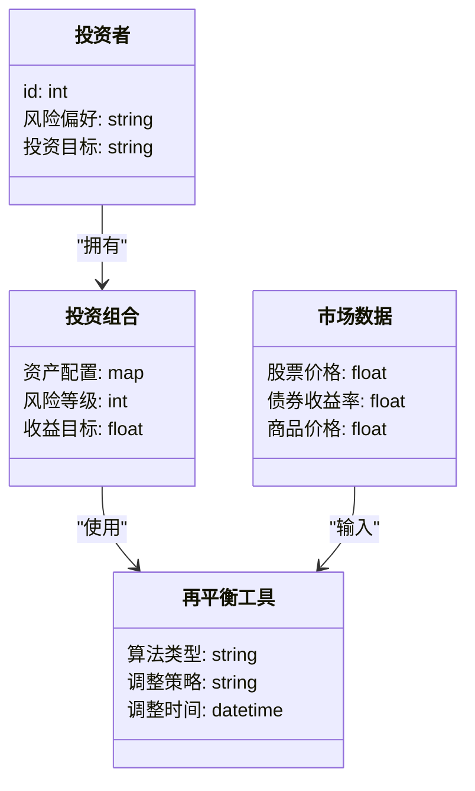
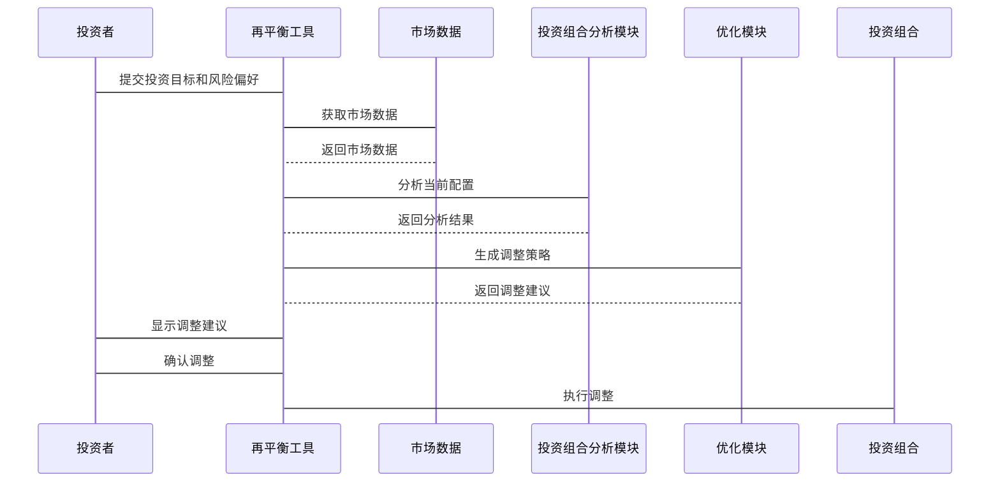

                 


# 开发智能化的个人投资组合再平衡工具

> 关键词：智能化投资组合、再平衡工具、人工智能、强化学习、遗传算法、系统架构

> 摘要：本文详细探讨了开发智能化的个人投资组合再平衡工具的背景、核心概念、算法原理、系统设计与实现。通过结合人工智能技术，提出了一种基于强化学习和遗传算法的再平衡策略，旨在优化投资组合的风险与收益比。文章最后通过实际案例分析，验证了该工具的有效性和实用性。

---

## 第一章: 智能化投资组合再平衡工具的背景与核心概念

### 1.1 个人投资组合的基本概念

#### 1.1.1 投资组合的定义与组成

投资组合是指将一定资金分配到不同资产（如股票、债券、基金等）上的配置方式。一个有效的投资组合能够平衡风险与收益，帮助投资者实现财富增值。

**核心要素：**
1. 资产配置：决定投资组合的整体风险和收益特征。
2. 再平衡：定期调整资产配置以维持目标比例。

#### 1.1.2 投资组合的目标与风险

- **目标：** 实现资产保值增值，满足投资者的财务需求。
- **风险：** 市场波动、流动性风险、通货膨胀风险等。

#### 1.1.3 再平衡的必要性与意义

随着市场环境的变化，投资组合的实际资产比例可能偏离目标比例，导致风险与收益偏离预期。再平衡通过调整各资产的权重，降低风险并提高收益。

---

### 1.2 当前投资组合管理的痛点

#### 1.2.1 传统再平衡方法的局限性

- **手动操作：** 费时费力，且难以及时应对市场变化。
- **固定策略：** 无法根据市场波动动态调整。

#### 1.2.2 市场波动对投资组合的影响

- **波动性：** 市场下跌可能导致投资组合亏损。
- **流动性风险：** 部分资产可能难以快速变现。

#### 1.2.3 个性化投资需求的增加

- **投资者需求多样化：** 不同投资者有不同的风险承受能力和收益目标。
- **定制化服务：** 需要根据个人情况提供个性化建议。

---

### 1.3 智能化再平衡工具的解决方案

#### 1.3.1 AI技术在投资组合管理中的应用

- **算法交易：** 利用AI算法自动执行交易。
- **风险预测：** 通过AI模型预测市场风险。

#### 1.3.2 智能化再平衡工具的核心优势

- **自动化：** 实时监控市场变化，自动调整投资组合。
- **动态优化：** 根据市场环境和投资者需求动态优化资产配置。

#### 1.3.3 工具的目标用户与市场定位

- **目标用户：** 个人投资者、机构投资者。
- **市场定位：** 提供高效、智能的投资组合管理解决方案。

---

## 第二章: 智能化再平衡工具的核心概念与原理

### 2.1 智能化再平衡工具的定义

#### 2.1.1 工具的功能模块

- **数据采集：** 收集市场数据和用户信息。
- **分析模块：** 分析市场趋势和用户需求。
- **优化模块：** 生成再平衡策略。
- **用户交互：** 提供可视化界面和操作反馈。

#### 2.1.2 工具的核心算法

- **强化学习：** 用于动态调整资产配置。
- **遗传算法：** 用于优化投资组合。

#### 2.1.3 工具的输入输出关系

- **输入：** 用户目标、市场数据。
- **输出：** 再平衡策略、调整建议。

---

### 2.2 核心概念的属性与特征对比

#### 2.2.1 属性对比表

| 属性 | 传统再平衡 | 智能化再平衡 |
|------|------------|--------------|
| 操作方式 | 手动或固定策略 | 自动化、动态调整 |
| 调整频率 | 定期（如季度） | 实时监控 |
| 成本 | 高 | 低 |
| 效率 | 低 | 高 |

#### 2.2.2 特征分析

- **自动化：** 智能化工具能够实时调整，而传统方法需要手动操作。
- **动态性：** 智能化工具能够根据市场变化快速调整，而传统方法通常基于固定的时间表。

#### 2.2.3 实体关系图（ER图）

```mermaid
erDiagram
    user "投资者" {
        <属性>
        id : int
        风险偏好 : string
        投资目标 : string
    }
    market "市场数据" {
        <属性>
        股票指数 : float
        债券收益率 : float
        商品价格 : float
    }
    portfolio "投资组合" {
        <属性>
        资产配置 : map<string,float>
        风险等级 : int
        收益目标 : float
    }
    tool "再平衡工具" {
        <属性>
        算法类型 : string
        调整策略 : string
        调整时间 : datetime
    }
    user --> portfolio : "拥有"
    portfolio --> tool : "使用"
    market --> tool : "输入"
```

---

### 2.3 核心概念的数学模型与公式

#### 2.3.1 投资组合再平衡的数学模型

$$ 资产配置 = \argmin_w \{ w^T \Sigma w + \lambda w^T \mathbf{1} \} $$

其中：
- \( w \) 是资产权重向量。
- \( \Sigma \) 是协方差矩阵。
- \( \lambda \) 是风险惩罚系数。

#### 2.3.2 示例分析

假设投资者有3种资产（股票、债券、现金），目标是将资产分配比例调整为40%股票、30%债券、30%现金。当前比例为35%股票、25%债券、40%现金。通过再平衡工具，系统会建议卖出5%的现金，买入5%的股票和5%的债券，以达到目标比例。

---

## 第三章: 智能化再平衡工具的算法原理

### 3.1 强化学习在投资组合优化中的应用

#### 3.1.1 强化学习的基本原理

强化学习是一种机器学习方法，通过智能体在环境中采取行动以最大化累积奖励。在投资组合优化中，智能体可以是投资组合调整策略，环境是金融市场。

#### 3.1.2 在投资组合优化中的应用

- **状态空间：** 当前市场数据和资产配置。
- **动作空间：** 资产调整的具体操作。
- **奖励函数：** 投资组合的收益与风险。

#### 3.1.3 算法实现步骤

1. 收集市场数据和用户需求。
2. 构建强化学习模型。
3. 训练模型，优化投资组合。
4. 生成再平衡策略。

---

### 3.2 基于遗传算法的优化策略

#### 3.2.1 遗传算法的基本原理

遗传算法是一种模拟生物进化的过程，通过选择、交叉和变异生成新的解。

#### 3.2.2 在投资组合再平衡中的应用

- **初始种群：** 随机生成的资产配置方案。
- **适应度函数：** 投资组合的收益与风险。
- **选择、交叉和变异：** 生成新的资产配置方案。

#### 3.2.3 算法实现与优化

1. 初始化种群。
2. 计算适应度。
3. 进行选择、交叉和变异。
4. 重复迭代，直到达到收敛条件。

---

### 3.3 算法的数学模型与公式

#### 3.3.1 强化学习的数学模型

$$ Q(s,a) = Q(s,a) + \alpha [r + \gamma \max Q(s',a) - Q(s,a)] $$

其中：
- \( s \) 是状态。
- \( a \) 是动作。
- \( \alpha \) 是学习率。
- \( \gamma \) 是折扣因子。

#### 3.3.2 遗传算法的数学模型

$$ f(x) = \frac{\sum_{i=1}^n w_i r_i}{\sum_{i=1}^n w_i} $$

其中：
- \( w_i \) 是资产权重。
- \( r_i \) 是资产收益。

---

## 第四章: 智能化再平衡工具的系统分析与架构设计

### 4.1 问题场景介绍

#### 4.1.1 投资者需求分析

- 风险偏好不同，投资目标不同。
- 需要及时了解市场变化，进行动态调整。

#### 4.1.2 市场环境分析

- 市场波动频繁，数据量大。
- 信息更新速度快。

#### 4.1.3 系统目标与范围

- 实现智能化再平衡功能。
- 提供用户友好的交互界面。

---

### 4.2 系统功能设计

#### 4.2.1 数据采集模块

- **功能：** 实时采集市场数据和用户信息。
- **输入：** 股票价格、债券收益率等。
- **输出：** 数据清洗后的结果。

#### 4.2.2 投资组合分析模块

- **功能：** 分析当前投资组合的风险和收益。
- **输入：** 资产配置比例。
- **输出：** 分析报告。

#### 4.2.3 再平衡优化模块

- **功能：** 生成再平衡策略。
- **输入：** 分析报告和用户需求。
- **输出：** 调整建议。

#### 4.2.4 用户交互模块

- **功能：** 提供可视化界面和操作反馈。
- **输入：** 用户输入指令。
- **输出：** 界面显示结果。

---

### 4.3 系统架构设计

#### 4.3.1 领域模型类图



---

### 4.4 系统接口设计

#### 4.4.1 接口定义

- **输入接口：** 收集市场数据和用户需求。
- **输出接口：** 提供调整建议和结果反馈。

#### 4.4.2 交互流程图



---

## 第五章: 智能化再平衡工具的项目实战

### 5.1 环境配置

- **Python版本：** 3.8以上。
- **依赖库：** NumPy、Pandas、Scikit-learn、TensorFlow。

### 5.2 核心代码实现

#### 5.2.1 数据采集模块

```python
import pandas as pd

def get_market_data(start_date, end_date):
    # 示例：从API获取市场数据
    data = pd.DataFrame({
        '股票': [100, 105, 98, 110],
        '债券': [80, 78, 85, 82],
        '现金': [1000, 980, 1020, 1010]
    })
    return data
```

#### 5.2.2 优化模块

```python
import numpy as np
from sklearn.gaussian_process import GaussianProcessRegressor

def optimize_portfolio(weights, market_data):
    # 示例：使用高斯过程回归预测最优权重
    model = GaussianProcessRegressor()
    model.fit(np.array(weights).reshape(-1, 1), np.array(market_data).reshape(-1, 1))
    return model.predict(np.array(weights).reshape(-1, 1))[0][0]
```

---

### 5.3 案例分析与详细讲解

假设投资者当前的投资组合为：股票40%、债券30%、现金30%。市场数据如下：

| 资产 | 当前价值 |
|------|----------|
| 股票 | 100      |
| 债券 | 80       |
| 现金 | 1000     |

目标：将股票调整为50%，债券调整为20%，现金调整为30%。

通过再平衡工具，系统会计算出需要卖出的资产和需要买入的资产，生成调整建议。

---

## 第六章: 总结与展望

### 6.1 最佳实践

- **数据质量：** 确保市场数据的准确性和及时性。
- **算法选择：** 根据具体需求选择合适的算法。
- **用户教育：** 提供足够的用户教育，帮助投资者理解工具的使用。

### 6.2 小结

本文详细探讨了智能化个人投资组合再平衡工具的开发背景、核心概念、算法原理和系统设计。通过结合人工智能技术，提出了一种高效、动态的再平衡策略，能够帮助投资者更好地实现投资目标。

### 6.3 注意事项

- **风险管理：** 再平衡过程中需要注意市场风险。
- **合规性：** 确保工具符合相关法律法规。

### 6.4 拓展阅读

- **相关书籍：** 《算法交易：利用数学与计算机科学的艺术》
- **学术论文：** "Reinforcement Learning for Portfolio Optimization"

---

以上是《开发智能化的个人投资组合再平衡工具》的技术博客文章的完整内容。

