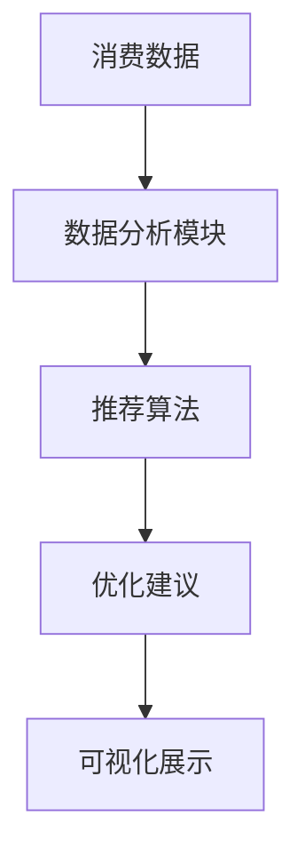
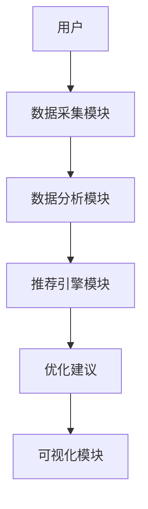

                 


# 开发智能化的个人消费习惯改善建议工具

## 关键词：人工智能、消费习惯、个性化推荐、强化学习、数据挖掘

## 摘要：  
随着人工智能技术的快速发展，个性化消费习惯改善工具正逐渐成为提升个人财务管理效率和优化消费行为的重要手段。本文将从技术角度详细探讨如何利用机器学习和数据挖掘技术，开发一款智能化的个人消费习惯改善工具。通过分析消费数据、设计推荐算法、构建系统架构，本文旨在为用户提供一个高效、个性化的消费习惯优化方案。

---

# 第1章: 个人消费习惯改善工具的背景与目标

## 1.1 问题背景与目标

### 1.1.1 当前个人消费习惯的问题与挑战  
现代生活中，人们的消费行为日益多样化，但同时也面临着过度消费、储蓄不足、支出不合理等问题。这些问题不仅影响个人财务健康，还可能导致长期的经济压力。传统的财务管理工具多以记录消费为主，缺乏智能化的分析与建议能力，难以满足用户的需求。

### 1.1.2 开发智能化改善工具的目标  
本工具旨在通过分析用户的消费数据，识别潜在的消费问题，并提供个性化的优化建议。目标包括：  
- 提供实时的消费数据分析与可视化；  
- 自动生成优化建议，帮助用户改善消费习惯；  
- 通过机器学习算法，实现智能化的消费预测与推荐。

### 1.1.3 工具的核心价值与意义  
该工具的核心价值在于通过智能化技术，帮助用户更好地理解自己的消费行为，并通过数据驱动的方式优化消费决策。这不仅能够提升个人的财务管理能力，还能帮助用户实现长期的财务健康。

---

## 1.2 智能化工具的技术基础

### 1.2.1 人工智能在消费习惯分析中的应用  
人工智能技术（AI）在消费习惯分析中发挥着重要作用，包括数据挖掘、模式识别和自然语言处理等。通过AI技术，可以将复杂的消费数据转化为易于理解的分析结果。

### 1.2.2 数据挖掘与行为分析技术  
数据挖掘技术用于从海量消费数据中提取有价值的信息，行为分析技术则用于识别用户的消费模式和偏好。

### 1.2.3 个性化推荐算法的原理  
个性化推荐算法通过分析用户的消费数据，生成符合用户需求的推荐结果。常用的推荐算法包括协同过滤、基于内容的推荐和深度学习推荐等。

---

## 1.3 工具的功能与边界

### 1.3.1 工具的主要功能模块  
- 数据采集与处理模块：负责收集用户的消费数据并进行清洗。  
- 数据分析与模式识别模块：识别消费模式和问题。  
- 个性化推荐模块：生成优化建议。  
- 可视化展示模块：以图表形式展示分析结果。  

### 1.3.2 边界与外延  
本工具仅专注于消费习惯的分析与优化，不涉及具体的财务规划或投资建议。  

### 1.3.3 核心要素与组成结构  
工具的核心要素包括消费数据、推荐算法和优化建议。其组成结构如下：



---

# 第2章: 个人消费习惯的智能化分析

## 2.1 消费习惯的数据采集与处理

### 2.1.1 数据来源与采集方法  
数据来源包括用户的消费记录、银行流水和信用卡账单等。采集方法可以是API接口或手动上传。

### 2.1.2 数据清洗与预处理  
数据清洗步骤包括去除重复数据、处理缺失值和异常值。预处理步骤包括数据格式转换和特征提取。

### 2.1.3 数据特征提取与分析  
通过特征工程提取关键特征，如消费金额、消费频率和消费类别。

---

## 2.2 消费习惯的模式识别

### 2.2.1 基于机器学习的模式识别  
使用聚类算法识别用户的消费模式。例如，K-means算法可以将消费数据分成不同的类别。

### 2.2.2 常见消费行为的分类与分析  
通过分类算法识别用户的消费偏好，例如经常在哪些类别超支。

### 2.2.3 消费习惯的可视化与解读  
使用柱状图、折线图等可视化工具展示消费数据，帮助用户更好地理解消费行为。

---

## 2.3 数据驱动的消费优化建议

### 2.3.1 基于数据的消费行为诊断  
分析用户的消费数据，识别潜在问题，如超支、低储蓄等。

### 2.3.2 个性化优化建议的生成  
根据分析结果，生成个性化的优化建议，例如调整消费预算或增加储蓄。

### 2.3.3 建议的可执行性与效果评估  
通过模拟执行建议，评估其对用户财务状况的影响。

---

# 第3章: 智能化推荐算法的核心原理

## 3.1 基于协同过滤的推荐算法

### 3.1.1 协同过滤的基本原理  
协同过滤是一种基于用户相似性推荐的算法。通过计算用户之间的相似性，推荐与之相似用户的消费行为。

### 3.1.2 基于用户的协同过滤  
计算用户之间的相似性，推荐相似用户的消费行为。

### 3.1.3 基于物品的协同过滤  
基于物品的相似性推荐，例如推荐用户喜欢的同类商品。

---

## 3.2 基于内容的推荐算法

### 3.2.1 内容特征提取与表示  
通过文本分析提取商品的特征，例如商品描述、类别标签。

### 3.2.2 基于相似度的内容推荐  
通过计算内容相似度，推荐用户可能感兴趣的消费类别。

### 3.2.3 深度学习在内容推荐中的应用  
使用深度学习模型（如Word2Vec）提取商品的语义特征。

---

## 3.3 混合推荐算法

### 3.3.1 协同过滤与内容推荐的结合  
将协同过滤和内容推荐的结果进行融合，提升推荐的准确性和多样性。

### 3.3.2 基于深度学习的混合推荐  
结合深度学习模型和传统推荐算法，提升推荐效果。

### 3.3.3 混合推荐的优势与挑战  
混合推荐能够综合利用不同算法的优势，但需要解决算法融合的问题。

---

# 第4章: 基于强化学习的消费决策优化

## 4.1 强化学习的基本原理

### 4.1.1 强化学习的定义与核心概念  
强化学习是一种基于奖励机制的机器学习方法，通过与环境交互，学习最优策略。

### 4.1.2 状态、动作与奖励的定义  
- 状态：用户当前的消费情况。  
- 动作：用户可以采取的消费决策。  
- 奖励：根据消费结果给予的奖励或惩罚。

### 4.1.3 强化学习的数学模型与公式  
强化学习的核心公式是贝尔曼方程：

$$ V(s) = \max_{a} [ r(s,a) + \gamma V(s') ] $$

其中，$V(s)$ 表示状态 $s$ 的价值，$r(s,a)$ 是动作 $a$ 在状态 $s$ 下的奖励，$\gamma$ 是折扣因子，$s'$ 是下一个状态。

---

## 4.2 基于强化学习的消费决策优化

### 4.2.1 状态空间的构建  
将用户当前的消费数据转化为状态空间，例如：消费余额、可用额度等。

### 4.2.2 动作空间的设计  
定义用户可能采取的消费动作，例如：增加储蓄、减少非必要开支等。

### 4.2.3 奖励函数的定义与优化  
根据消费结果定义奖励函数，例如：节省开支给予奖励，超支给予惩罚。

---

## 4.3 实例分析与算法实现

### 4.3.1 消费决策优化的实例分析  
假设用户在某个月超支，强化学习算法会根据历史数据调整推荐策略，帮助用户减少非必要开支。

### 4.3.2 强化学习算法的实现步骤  
- 初始化策略网络。  
- 训练网络，更新策略。  
- 应用策略到新的消费数据。

---

# 第5章: 系统设计与实现

## 5.1 系统架构设计

### 5.1.1 系统功能模块  
- 数据采集模块：负责收集用户的消费数据。  
- 数据分析模块：分析数据并生成优化建议。  
- 推荐引擎模块：基于算法推荐消费策略。  
- 可视化模块：展示分析结果和优化建议。

### 5.1.2 系统架构图  


---

## 5.2 核心算法实现

### 5.2.1 数据预处理代码  
```python
import pandas as pd

# 读取数据
data = pd.read_csv('consumption.csv')

# 去除缺失值
data = data.dropna()

# 填充异常值
data['amount'].fillna(data['amount'].mean(), inplace=True)
```

### 5.2.2 协同过滤算法实现  
```python
from sklearn.cluster import KMeans

# 提取特征
X = data[['amount', 'category']]

# 聚类分析
kmeans = KMeans(n_clusters=3)
kmeans.fit(X)
```

---

## 5.3 优化建议与效果评估

### 5.3.1 优化建议生成  
根据用户的历史消费数据，生成个性化的消费预算和储蓄计划。

### 5.3.2 效果评估  
通过对比优化前后的消费数据，评估工具的效果。

---

# 第6章: 项目实战与案例分析

## 6.1 环境配置

### 6.1.1 安装必要的库  
```bash
pip install numpy pandas scikit-learn
```

### 6.1.2 数据准备  
准备消费数据，格式为CSV文件。

---

## 6.2 系统实现

### 6.2.1 数据分析与建模  
使用Python进行数据分析和机器学习建模。

### 6.2.2 可视化展示  
使用Matplotlib或Seaborn进行数据可视化。

---

## 6.3 实际案例分析

### 6.3.1 案例背景  
某用户的消费数据，希望通过工具优化消费习惯。

### 6.3.2 分析与建议  
识别超支类别，推荐减少非必要开支。

---

# 第7章: 最佳实践与总结

## 7.1 最佳实践 tips

### 7.1.1 数据采集与处理  
确保数据的准确性和完整性。

### 7.1.2 算法选择  
根据具体需求选择合适的推荐算法。

### 7.1.3 系统优化  
优化系统性能，提升用户体验。

---

## 7.2 总结

通过本文的详细讲解，我们了解了如何利用人工智能技术开发智能化的个人消费习惯改善工具。从数据采集到算法实现，再到系统设计，每一步都需要仔细考虑和优化。

---

## 7.3 注意事项

- 数据隐私保护是开发过程中需要重点关注的问题。  
- 算法的可解释性也是用户信任的重要因素。

---

## 7.4 拓展阅读

- 推荐阅读《机器学习实战》和《深度学习入门》。  
- 关注最新的研究成果，保持技术的前沿性。

---

# 结语

开发智能化的个人消费习惯改善工具是一项复杂的系统工程，需要结合数据挖掘、机器学习和系统设计等多方面的知识。通过本文的分析，相信读者能够掌握开发此类工具的核心技术和实现方法。

